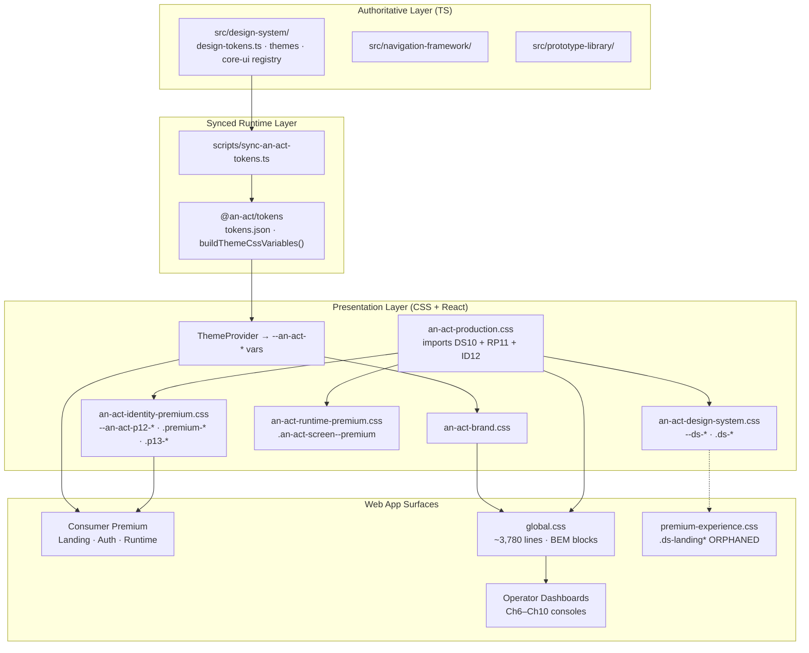

# AN ACT Design System Executive Audit

**Date:** 2026-06-28  
**Scope:** Read-only audit of design system, identity, themes, tokens, and presentation layer  
**Constraint:** No implementation — audit and restoration plan only

---

## Executive Summary

AN ACT has a **complete visual design reference**, but it is **split across five parallel styling layers** rather than one unified presentation system. The authoritative specification exists in TypeScript (`src/design-system/`), syncs to `@an-act/tokens`, and renders through `@an-act/runtime-ui` — but **recent Chapter 6–10 operator pages do not use the premium identity** and instead rely on ~2,400 lines of independent BEM CSS in `global.css`.

**Premium identity (Phase 12/13) is intact** on consumer surfaces (landing, login, register, runtime screens). **Chapter 10 operator consoles intentionally diverge** toward a light, token-minimal dashboard pattern that shares only `.an-act-button` and `.an-act-card` primitives.

**Recommendation:** Do not redesign. Restore unity by (1) declaring a single source of truth, (2) extracting shared operator-dashboard primitives, (3) retiring orphaned CSS, and (4) documenting which surface class uses which design layer.

---

## Architecture Diagram



---

## 1. Design System Inventory

### 1.1 Authoritative TypeScript Design System

| Path | Purpose |
|------|---------|
| `src/design-system/tokens/design-tokens.ts` | Master token aggregation — `AN_ACT_DESIGN_SYSTEM_VERSION = "an-act-design-system-v1"` |
| `src/design-system/foundation/colors.ts` | Semantic color groups, Need/Action palettes |
| `src/design-system/foundation/typography.ts` | Typography scale and styles |
| `src/design-system/foundation/spacing.ts` | Spacing scale |
| `src/design-system/foundation/radius.ts` | Border radius tokens |
| `src/design-system/foundation/elevation.ts` | Elevation levels |
| `src/design-system/foundation/shadows.ts` | Shadow tokens |
| `src/design-system/foundation/motion.ts` | Duration and easing |
| `src/design-system/foundation/icons.ts` | Icon names and sizes |
| `src/design-system/foundation/transitions.ts` | Need↔Action mode transitions |
| `src/design-system/themes/need-mode.ts` | Need mode theme (light, blue accent) |
| `src/design-system/themes/action-mode.ts` | Action mode theme (dark, inverted) |
| `src/design-system/components/*.ts` | Component specs: buttons, cards, badges, inputs, navigation, live-frame, chips, timeline, progress, avatar |
| `src/design-system/core-ui/components/*.ts` | 20 formal Core UI definitions (button, card, modal, sheet, toast, live-frame, etc.) |
| `src/design-system/core-ui/registry/component-registry.ts` | `CORE_UI_COMPONENT_REGISTRY` |
| `src/design-system/core-ui/validation/component-validator.ts` | Component validation |
| `src/design-system/documentation/design-system.ts` | Philosophy, accessibility rules, `validateDesignSystem()` |
| `src/design-system/module.ts` | Top-level barrel export |

### 1.2 Navigation & Prototype Layers

| Path | Purpose |
|------|---------|
| `src/navigation-framework/` | Screen schema, layouts (need/action/transition/modal), nav specs, transition engine |
| `src/prototype-library/` | Visual prototype screens and flows registry |

### 1.3 Token Package (Runtime Sync)

| Path | Purpose |
|------|---------|
| `packages/tokens/src/index.ts` | Public API: resolvers, theme, live-frame, brand constants |
| `packages/tokens/assets/tokens.json` | Synced JSON from design-system |
| `packages/tokens/src/theme-css.ts` | `buildThemeCssVariables()` → `--an-act-*` CSS vars |
| `packages/tokens/src/brand.ts` | Product name, wordmark, transition texts |
| `packages/tokens/src/live-frame-resolver.ts` | Live Frame tier presentation |
| `scripts/sync-an-act-tokens.ts` | Sync pipeline: design-system → tokens.json |

### 1.4 Runtime UI Package (React Presentation)

| Path | Purpose |
|------|---------|
| `packages/runtime-ui/src/react/index.ts` | Main React export surface |
| `packages/runtime-ui/src/react/providers/ThemeProvider.tsx` | Injects `--an-act-*` on `.an-act-theme-root` |
| `packages/runtime-ui/src/react/brand/` | AnActWordmark, AnActLogoKey, AnActSplash, AnActBrandLoading, AnActAppShell |
| `packages/runtime-ui/src/react/components/P0Components.tsx` | AnActButton, AnActCard, AnActLiveFrame, AnActHeader, AnActNavigation |
| `packages/runtime-ui/src/react/components/P1Components.tsx` | AnActSearch, AnActOpportunityCard, extended runtime components |
| `packages/runtime-ui/src/react/components/premium/PremiumComponents.tsx` | PremiumButton, PremiumCard, PremiumHero, PremiumGlassPanel, PremiumStat, PremiumBadge, PremiumSurface |
| `packages/runtime-ui/src/react/components/premium/EnterprisePresentation.tsx` | PremiumLiveIndicator, ProfessionalPassportMiniPreview, PremiumMarketplaceFlow, PremiumEntryBadge |
| `packages/runtime-ui/src/react/RuntimeScreenMount.tsx` | Applies `an-act-screen--premium an-act-screen--p12` |
| `packages/runtime-ui/src/react/styles/an-act-brand.css` | Token-driven base: wordmark, `.an-act-button`, `.an-act-card`, fields |
| `packages/runtime-ui/src/react/styles/an-act-design-system.css` | Phase 10 light `--ds-*` typography and cards |
| `packages/runtime-ui/src/react/styles/an-act-runtime-premium.css` | Phase 11 runtime card elevation, stagger animations |
| `packages/runtime-ui/src/react/styles/an-act-identity-premium.css` | Phase 12/13 dark premium: `--an-act-p12-*`, `.premium-*`, `.p12-*`, `.p13-*` |
| `packages/runtime-ui/src/react/styles/an-act-production.css` | Aggregator importing design-system + runtime-premium + identity-premium |

### 1.5 Web App Styles

| Path | Lines (approx.) | Purpose |
|------|-----------------|---------|
| `apps/web/src/styles/global.css` | ~3,780 | Imports runtime CSS + operator dashboard BEM blocks (Ch6–Ch10) + AI panels |
| `apps/web/src/styles/premium-experience.css` | ~340 | Phase 10 `.ds-landing*` — **orphaned, no page references** |
| `apps/web/src/styles/need-mvp.css` | ~200 | Phase 9.1 need MVP flow (search skeleton, need-mvp screens) |
| `apps/web/src/brand/config.ts` | — | `AN_ACT_BRAND` (productName, wordmark, logoUrl) |
| `apps/web/public/an-act-brand.json` | — | Static brand manifest |

### 1.6 Parallel / Legacy Surfaces

| Path | Purpose | Design system connection |
|------|---------|--------------------------|
| `public/browser/app.css` | Browser hub surface | **None** — hardcoded hex colors |
| `src/ui/pages/*.ts` | Server-side HTML builders | **None** — separate from React |

### 1.7 Documentation

| Path | Purpose |
|------|---------|
| `docs/design-system/CH3-X1-AN-ACT-Design-System.md` | Design system spec |
| `docs/design-system/CH3-X2-Core-UI-Components.md` | Core UI components |
| `docs/design-system/CH3-X3-Navigation-Framework.md` | Navigation framework |
| `docs/design-system/CH3-X4-Visual-Prototype-Library.md` | Prototype library |
| `docs/architecture/AN-ACT-Design-Tokens-Specification.md` | Token spec |
| `docs/architecture/AN-ACT-CH4-Design-Identity-Review.md` | CH4 identity extraction |
| `docs/phase13/PHASE13-COMPLETION-REPORT.md` | Premium identity completion |
| `docs/implementation/Render-Layer-Phase4-Brand-Experience.md` | Brand experience phase |

---

## 2. Source of Truth

### Master Design System

**Single authoritative reference:** `src/design-system/tokens/design-tokens.ts`  
**Version:** `an-act-design-system-v1`  
**Validated by:** `validateDesignSystem()`, `validateAllCoreUiComponents()`, chapter verify scripts

This file aggregates all foundations, themes, component specs, and Core UI registry definitions. It is the **only** layer that is validated, versioned, and synced to runtime.

### Extension Chain (correct)

```
src/design-system/
    ↓ sync-an-act-tokens.ts
packages/tokens/assets/tokens.json
    ↓ buildThemeCssVariables()
ThemeProvider → --an-act-* CSS variables
    ↓
an-act-brand.css (runtime primitives)
    ↓
RuntimeScreenMount, P0/P1 components (runtime experience)
```

### Premium Identity Extension (correct, parallel palette)

```
an-act-identity-premium.css (--an-act-p12-*)
    ↓
PremiumComponents.tsx + EnterprisePresentation.tsx
    ↓
PartnerLandingPage, LoginPage, RegisterPage, RuntimeScreenMount
```

Phase 12/13 premium is an **intentional extension** for stakeholder-facing surfaces. It is documented in `docs/phase13/PHASE13-COMPLETION-REPORT.md` and does not replace the TS design system — it adds a dark premium presentation layer.

### Duplication (problematic)

| Duplicate | Locations | Issue |
|-----------|-----------|-------|
| **Button styling** | `BUTTON_SPECS` (TS), `.an-act-button` (brand.css), `.premium-btn` (identity-premium.css), `.ds-btn` (design-system.css) | Four button implementations |
| **Card styling** | `CARD_SPECS` (TS), `.an-act-card`, `.premium-card`, `.ds-card` | Four card implementations |
| **Color palettes** | `--an-act-*` (synced tokens), `--ds-*` (hardcoded Phase 10 CSS), `--an-act-p12-*` (hardcoded premium CSS) | Three independent palettes |
| **Badge styling** | Core UI badge spec, `.an-act-*-badge` per chapter (15+ variants in global.css) | Operator dashboards re-implement traffic-light badges per domain |
| **Hero/score panels** | `.premium-hero`, `.an-act-{domain}-hero` (×12 domains) | Same layout pattern copied 12 times |
| **Landing styles** | `.ds-landing*` (premium-experience.css) vs `.p12-landing*` (identity-premium.css) | Old landing superseded but file retained |

### Files That Should Be Removed (after migration)

| File / Block | Reason | Prerequisite |
|--------------|--------|--------------|
| `apps/web/src/styles/premium-experience.css` | Orphaned Phase 10 landing; no TSX references | Confirm zero `.ds-landing` usage |
| Duplicate badge blocks in `global.css` | 12 near-identical `--green/amber/red` badge definitions | Extract `OperatorBadge` primitive first |
| Inline styles in `ExecutivePresentationPage.tsx` | Bypasses design system | Map to token classes |

### Files That Should NOT Be Removed

| File | Reason |
|------|--------|
| `src/design-system/` | Authoritative spec |
| `packages/tokens/` | Runtime sync layer |
| `packages/runtime-ui/src/react/styles/an-act-identity-premium.css` | Active premium identity |
| `apps/web/src/styles/global.css` | Required for operator dashboards (needs refactor, not deletion) |
| `apps/web/src/styles/need-mvp.css` | Active need flow presentation |

---

## 3. Visual Consistency Audit

**Comparison:** Chapter 5 MVP presentation (consumer surfaces) vs Chapter 10 operator consoles (current MVP capstone)

> *Chapter 5 = MVP Experience: landing, auth, runtime journey. Chapter 10 = Operating System and operator dashboards.*

| Dimension | Chapter 5 (MVP Consumer) | Chapter 10 (Operator Consoles) | Why They Differ |
|-----------|--------------------------|--------------------------------|-----------------|
| **Landing** | Dark graphite (`--an-act-p12-graphite`), ambient glow, glass panels | N/A — operators enter via landing entry cards | Consumer landing built in Phase 12/13; operators use functional entry grid |
| **Hero** | `PremiumHero` with display typography, green glow CTA, runtime status strip | Plain `<h1>` + subtitle paragraph, score hero card | Premium hero for stakeholders; operator pages prioritize data density |
| **Navigation** | `AnActLogoKey`, live pulse indicator, minimal nav | `AnActWordmark` + dense button toolbar (8–12 actions) | Logo key for brand moments; wordmark + toolbar for cross-console navigation |
| **Logo** | `AnActLogoKey` (mark) on landing/auth | `AnActWordmark` (full wordmark) on all operator pages | Different brand components per surface type |
| **Buttons** | `PremiumButton` (green glow, glass, rounded 22px) | `.an-act-button--primary/secondary/ghost` (flat, token colors) | Premium vs functional operator controls |
| **Cards** | `PremiumCard`, `PremiumGlassPanel` (gradient, inset shadow, 22px radius) | `.an-act-card` (flat white/dark surface, minimal shadow) | Premium elevation vs dashboard density |
| **Typography** | `.ds-eyebrow`, `.p12-landing__display`, `.p13-hero__statement` | System h1/h2/h3, `.an-act-{domain}__subtitle`, `.an-act-{domain}__hint` | Marketing typography vs operational labels |
| **Color palette** | Dark: graphite `#121214`, green `#42d492`, muted ink `#a8a8b0` | Light action-mode: `--an-act-color-*` defaults, traffic-light green/amber/red badges | Premium dark identity vs action-mode operator theme |
| **Shadows** | Deep layered shadows (24px blur, inset highlights) | Minimal or none on cards | Premium depth vs flat dashboards |
| **Motion** | `p12-lift-in`, `p12-float`, stagger animations, live pulse | None — static refresh every 3s | Premium polish vs operator utility |
| **Glass** | `PremiumGlassPanel`, `.premium-glass-panel` (backdrop blur, 58% opacity) | Not used | Glass reserved for consumer/auth surfaces |
| **Layout** | Full-bleed dark ambient, centered max-width 1080px, section storytelling | Max-width 1220px, grid-based metric dashboards, split sections | Marketing layout vs operations layout |
| **Spacing** | Premium scale (`--an-act-p12-*` motion/spacing) | Ad-hoc 12px/16px/24px gaps in BEM blocks | Not token-unified in operator CSS |
| **Icons** | Unicode symbols (◆ ▶ ◐) in entry cards | None — text-only operator UI | Entry cards use decorative icons; dashboards are text-first |
| **Theme mode** | `ThemeProvider mode="need"` on landing/auth | `ThemeProvider mode="action"` on all operator pages | Correct per design system — but visual language diverges beyond mode |
| **Badges** | `PremiumBadge`, `PremiumEntryBadge` (LIVE/DEMO/EXECUTIVE) | Per-domain `{domain}-badge--{green/amber/red}` ×12 copies | Operator readiness signals reimplemented per chapter |
| **Tables** | N/A on consumer | `.an-act-review-table`, certification matrices (Ch9–10) | Added in later chapters without premium styling |

**Root cause:** Chapter 6–10 sprints optimized for **speed of operator console delivery** using a shared but minimal pattern (`ThemeProvider` + `AnActWordmark` + `.an-act-card` + domain BEM). Premium identity was applied to **consumer-facing** surfaces in Phase 12/13 separately. No rule enforced which layer to use where.

---

## 4. Component Coverage

Status key: ✓ Uses Design System · ⚠ Partially Uses Design System · ✗ Independent Styling

| Page | Primary layer | Status | Notes |
|------|---------------|--------|-------|
| `PartnerLandingPage` | Premium p12/p13 | ✓ | Full Premium component stack |
| `LoginPage` | Premium p12 | ✓ | PremiumGlassPanel, PremiumButton, AnActLogoKey |
| `RegisterPage` | Premium p12 | ✓ | Same as login |
| `RuntimePage` | Runtime premium + need-mvp | ✓ | RuntimeScreenMount p12 classes, AnActAppShell |
| `RegisterProviderPage` | Brand shell | ⚠ | `an-act-login-shell` — no premium glass |
| `RegistrationSuccessPage` | Brand shell | ⚠ | Wordmark + login-shell, no premium |
| `ProviderOnboardingPage` | Brand shell | ⚠ | Functional onboarding, no premium |
| `ProviderProfilePage` | Brand shell | ⚠ | Functional profile, no premium |
| `ExecutivePresentationPage` | Mixed | ⚠ | `ds-eyebrow` + `an-act-card` + inline styles |
| `DemoPresenterPage` | global.css BEM | ⚠ | Wordmark + demo-specific classes |
| `PartnerOverviewPage` | global.css BEM | ⚠ | Partner package layout |
| `PilotInstrumentationPage` | Operator BEM | ✗ | `an-act-pilot-dashboard` independent block |
| `PilotManagementPage` | Operator BEM | ✗ | `an-act-pilot-mgmt` |
| `FounderConsolePage` | Operator BEM | ✗ | `an-act-founder-console` |
| `GrowthFoundationPage` | Operator BEM | ✗ | `an-act-growth` |
| `ExecutiveOperationsPage` | Operator BEM | ✗ | `an-act-exec-ops` |
| `EnterpriseReadinessPage` | Operator BEM | ✗ | `an-act-enterprise` |
| `GovernmentReadinessPage` | Operator BEM | ✗ | `an-act-government` |
| `IntegrationReadinessPage` | Operator BEM | ✗ | `an-act-integration` |
| `EnterpriseEvaluationPage` | Operator BEM | ✗ | `an-act-evaluation` |
| `ProductionOperationsPage` | Operator BEM | ✗ | `an-act-production` |
| `ReliabilityRecoveryPage` | Operator BEM | ✗ | `an-act-reliability` |
| `LaunchReadinessPage` | Operator BEM | ✗ | `an-act-launch` |
| `AnActV1CertificationPage` | Operator BEM | ✗ | `an-act-certification` |
| `LiveMarketplaceOperationsPage` | Operator BEM | ✗ | `an-act-marketplace` |
| `OperationalDecisionCenterPage` | Operator BEM | ✗ | `an-act-decision` |
| `ExecutiveIntelligenceCenterPage` | Operator BEM | ✗ | `an-act-intelligence` |
| `AnActOperatingSystemV1Page` | Operator BEM | ✗ | `an-act-os` |
| `AnActV1FinalExecutiveReviewPage` | Operator BEM | ✗ | `an-act-review` |

**Embedded components (not pages):**

| Component | Status | Notes |
|-----------|--------|-------|
| `AiAssistantPanel` | ⚠ | `an-act-ai-panel` in global.css — token vars, no premium |
| `ExecutiveAiPanel` | ⚠ | `an-act-executive-panel` — token vars, no premium |
| `NeedMvpFlow` / `NeedSearchPresentation` | ✓ | need-mvp.css + runtime components |
| `PresentationError` | ✓ | Wraps AnActError from runtime-ui |

**Summary:** 4 pages fully use premium design system · 6 partial · 19 operator pages use independent BEM styling (sharing only `.an-act-button` and `.an-act-card` primitives).

---

## 5. Premium Identity Preservation

### Status: **Partially preserved — consumer surfaces intact, operator surfaces excluded**

### Where premium identity EXISTS (exact locations)

| Asset | File | Used by |
|-------|------|---------|
| `--an-act-p12-*` token palette | `an-act-identity-premium.css` | All premium surfaces |
| `.premium-btn`, `.premium-card`, `.premium-glass-panel`, `.premium-hero` | `an-act-identity-premium.css` + `PremiumComponents.tsx` | Landing, auth |
| `.p12-landing*`, `.p12-auth*`, `.p12-entry*` | `an-act-identity-premium.css` | PartnerLandingPage, LoginPage, RegisterPage |
| `.p13-hero__*`, `.p13-cta-*` | `an-act-identity-premium.css` | PartnerLandingPage hero/CTA hierarchy |
| `.p13-passport-preview*` | `EnterprisePresentation.tsx` + CSS | PartnerLandingPage passport section |
| `.p13-marketplace-flow*` | `EnterprisePresentation.tsx` + CSS | PartnerLandingPage marketplace journey |
| `.p13-entry-badge*` | `EnterprisePresentation.tsx` + CSS | Landing entry cards (LIVE/DEMO/EXECUTIVE/PARTNER) |
| `.p13-live-status*` | `EnterprisePresentation.tsx` + CSS | Nav live indicator |
| `AnActLogoKey` | `AnActLogoKey.tsx` | Landing, auth |
| Runtime premium mount | `RuntimeScreenMount.tsx` | `an-act-screen--premium an-act-screen--p12` |
| Phase 11 runtime elevation | `an-act-runtime-premium.css` | Runtime cards, stagger animations |

### Missing pieces (premium not applied)

| Surface | Gap |
|---------|-----|
| Provider registration/onboarding/profile | Uses plain `an-act-login-shell` instead of p12 auth glass |
| Executive presentation | Mixed ds-eyebrow + inline styles, no premium dark shell |
| Demo presenter | Functional demo UI, no premium |
| Partner overview | Partner package, no premium |
| All Ch6–Ch10 operator consoles (19 pages) | No Premium components, no p12 palette, no glass |
| AI assistant panels | Functional panels, not premium styled |
| Register provider flow | Action mode but no premium treatment |

### Not removed — intentionally scoped

Premium identity was **never removed**. Phase 13 (2026-06-28) extended Phase 12.5. Operator dashboards were built in parallel (Ch6–10) using a separate visual pattern. This is a **scope split**, not a regression.

Evidence: `docs/phase13/PHASE13-COMPLETION-REPORT.md` confirms completion; `PartnerLandingPage.tsx` still imports 10 premium components; `an-act-identity-premium.css` is 1,200+ lines and actively imported via `production.css`.

### Orphaned (superseded but not deleted)

| Asset | Superseded by |
|-------|---------------|
| `.ds-landing*` in `premium-experience.css` | `.p12-landing*` in identity-premium.css |
| Phase 10 light `--ds-*` on landing | Phase 12/13 dark premium palette |

---

## 6. Refactoring Plan

**Objective:** Restore a single unified Premium Design System across the platform without redesigning layouts, changing business logic, Runtime JSON, APIs, or architecture.

### Phase 0 — Governance (1 day)

1. Publish **Design Layer Decision Record** in `docs/design-system/`:
   - Consumer/stakeholder surfaces → Premium p12/p13 components
   - Runtime experience → P0/P1 + runtime-premium
   - Operator dashboards → Shared operator primitives (new)
   - Never add new domain-specific BEM blocks without extracting shared pattern first
2. Add lint/check script: fail if new `.an-act-{new-domain}-*` block added to global.css without registry entry

### Phase 1 — Retire orphans (0.5 day)

1. Remove `apps/web/src/styles/premium-experience.css` import from `global.css`
2. Delete or archive `premium-experience.css` (340 lines)
3. Verify no `.ds-landing` references remain

### Phase 2 — Extract operator primitives (3–4 days)

Create shared operator presentation in `packages/runtime-ui` (presentation only):

| Primitive | Replaces | Shared across |
|-----------|----------|---------------|
| `OperatorConsoleShell` | Repeated header + nav + subtitle pattern | All 19 operator pages |
| `OperatorScoreHero` | 12 `{domain}-hero` blocks | All score/overview sections |
| `OperatorReadinessBadge` | 12 `{domain}-badge--{signal}` variants | All traffic-light badges |
| `OperatorMetricGrid` | Repeated grid layouts | Dashboard sections |
| `OperatorSection` | Repeated split/list patterns | Split sections |

Move extracted CSS from `global.css` to `an-act-operator-console.css` (~400 lines replacing ~2,400).

### Phase 3 — Token bridge (2 days)

1. Map `--an-act-p12-green/amber/red` readiness colors to semantic `--an-act-color-status-*` in tokens sync
2. Map operator badge colors to synced tokens (eliminate hardcoded `#1f7a45`, `#9a6700`, `#b42318` duplicates)
3. Document `--ds-*` as deprecated alias layer; new work uses `--an-act-*` only

### Phase 4 — Surface alignment (3–4 days)

| Surface | Action |
|---------|--------|
| RegisterProvider, RegistrationSuccess, ProviderOnboarding, ProviderProfile | Wrap in `p12-auth` shell + PremiumGlassPanel (match LoginPage) |
| ExecutivePresentationPage | Replace inline styles with token classes; optional premium dark shell |
| DemoPresenterPage, PartnerOverviewPage | Apply operator primitives or premium shell per governance doc |
| Operator pages (19) | Migrate to `OperatorConsoleShell` + shared primitives — **no layout redesign** |

### Phase 5 — AI panel polish (1 day)

Restyle `AiAssistantPanel` and `ExecutiveAiPanel` using premium glass or operator primitives (collapsible panel pattern preserved).

### Phase 6 — Verification (1 day)

1. Extend `test/mvp-phase12.test.ts` and `test/mvp-phase13.test.ts` with operator primitive checks
2. Add `test/design-system-consistency.test.ts` — static analysis for orphaned classes, duplicate badge definitions
3. Visual regression checklist for landing, auth, runtime, one operator page

### Rules (non-negotiable)

- No business logic changes
- No Runtime JSON changes
- No API changes
- No architecture changes
- Presentation layer only
- No redesign — restore consistency by extracting and reusing, not reimagining

---

## 7. Missing Components

Components defined in Core UI registry but **not available as React components** in runtime-ui:

| Core UI Definition | Runtime React Component | Gap |
|--------------------|-------------------------|-----|
| `DIALOG_COMPONENT` | None | No AnActDialog |
| `MODAL_COMPONENT` | None | No AnActModal |
| `SHEET_COMPONENT` | None | No AnActSheet |
| `TOAST_COMPONENT` | None | No AnActToast |
| `LOADING_COMPONENT` | AnActBrandLoading only | Partial |
| `BOTTOM_NAVIGATION_COMPONENT` | AnActNavigation (P0) | Partial |
| `ACHIEVEMENT_CARD_COMPONENT` | None | Not exposed |
| `ANALYTICS_CARD_COMPONENT` | None | Operator pages build ad-hoc |
| `CONTRACT_CARD_COMPONENT` | None | Runtime uses P1 |
| `TIMELINE_CARD_COMPONENT` | None | Not exposed |
| `FLOATING_ACTION_BUTTON_COMPONENT` | None | Not exposed |
| `Operator console shell` | None | Built per-page in global.css |

---

## 8. Duplicate Styles Summary

| Pattern | Copies | Lines (est.) |
|---------|--------|--------------|
| Readiness badge (green/amber/red) | 12 domains | ~360 |
| Score hero card | 12 domains | ~240 |
| Console header + nav toolbar | 19 pages | ~570 (TSX) + ~380 (CSS) |
| Section title + subtitle | 12 domains | ~120 |
| Metric grid | 12 domains | ~180 |
| Recommendation list item | 8 domains | ~160 |
| **Total duplicatable** | — | **~1,400 CSS lines** |

---

## 9. Recommended Source of Truth

| Concern | Source of truth |
|---------|-----------------|
| Token values & themes | `src/design-system/tokens/design-tokens.ts` |
| Runtime CSS variables | `@an-act/tokens` → `ThemeProvider` |
| Consumer premium presentation | `an-act-identity-premium.css` + `PremiumComponents.tsx` |
| Runtime experience rendering | `@an-act/runtime-ui` P0/P1 + `RuntimeScreenMount` |
| Operator dashboard presentation | **To be created:** `an-act-operator-console.css` + operator primitives |
| Documentation | `docs/design-system/CH3-X1-AN-ACT-Design-System.md` |

---

## 10. Estimated Effort

| Phase | Effort | Risk |
|-------|--------|------|
| Phase 0 — Governance | 1 day | Low |
| Phase 1 — Retire orphans | 0.5 day | Low |
| Phase 2 — Operator primitives | 3–4 days | Medium — must not break 19 pages |
| Phase 3 — Token bridge | 2 days | Low |
| Phase 4 — Surface alignment | 3–4 days | Medium |
| Phase 5 — AI panel polish | 1 day | Low |
| Phase 6 — Verification | 1 day | Low |
| **Total** | **11–14 days** | Presentation-only |

Recommended sequencing: Phase 0 → 1 → 2 → 6 (incremental) → 3 → 4 → 5

---

## 11. Conclusion

A **complete visual design reference exists** — it is authoritative, validated, and documented. Recent Chapter 10 pages **do follow** the operator-dashboard pattern consistently **among themselves**, but they **do not follow** the premium identity used on Chapter 5 consumer surfaces.

This is not a missing design system — it is a **missing unification layer** between premium consumer presentation and operator dashboard presentation. The restoration plan extracts shared primitives, retires orphaned CSS, and aligns surfaces to declared design layers — without redesigning anything.

**No implementation was performed in this audit.**
