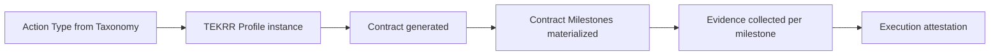

# APP13 Action Taxonomy v1

**Version:** 1.0  
**Status:** Approved foundation — Pre-implementation  
**Last updated:** June 19, 2026  
**Depends on:** [Core Architecture v1](./architecture/README.md) · [PRD v2.0](./PRD.md)

---

## Document purpose

This document defines the **universal action tree** for APP13 — a Professional Operating System that decomposes all professional work into classified, measurable, contractable actions.

Every professional activity on APP13 is an **Action**. Actions are not services, products, or listings. They are **units of professional obligation** that the platform decomposes into Time, Effort, Knowledge, Risk, and Responsibility (TEKRR) before contract generation and execution tracking.

**No application code or UI is included.**

---

## 1. Foundational concepts

### 1.1 What is an Action?

An **Action** is a discrete unit of professional work that:

| Property | Definition |
|----------|------------|
| **Has an actor** | A verified Service Provider who executes |
| **Has a beneficiary** | A Customer (individual or organization) who receives outcome |
| **Has TEKRR dimensions** | Decomposed into Time, Effort, Knowledge, Risk, Responsibility |
| **Has milestones** | Contract Milestones derived from the action type |
| **Has evidence requirements** | Evidence types that prove execution |
| **Has a taxonomy code** | Stable identifier in the action tree (e.g., `B.2.1`) |
| **Is contract-bound** | Cannot execute without an Accepted → Active contract |

APP13 does **not** sell actions. It **classifies, structures, contracts, and measures** them.

### 1.2 TEKRR dimensions (universal decomposition)

Every action — regardless of domain — decomposes into five irreducible dimensions:

| Code | Dimension | Question answered |
|------|-----------|-------------------|
| **T** | Time | When, how long, by what deadline? |
| **E** | Effort | What physical or operational work is performed? |
| **K** | Knowledge | What expertise, credentials, or judgment is required? |
| **R** | Risk | What can go wrong, and who bears liability? |
| **S** | Responsibility | Who is accountable for outcomes and compliance? |

> Internal dimension code for Responsibility is **S** (accountability **S**take), distinct from Risk (**R**).

### 1.3 Action vs. Contract vs. Milestone



| Concept | Scope |
|---------|-------|
| **Action Type** | Taxonomy entry — reusable template |
| **Action Instance** | Specific engagement on the platform |
| **Contract** | Legal binding of one action instance |
| **Contract Milestone** | Trackable checkpoint within execution |
| **Evidence** | Proof artifact tied to a milestone |

### 1.4 Taxonomy design principles

1. **Universal** — Any professional activity maps to exactly one primary action type.
2. **Mutually exclusive at leaf level** — Each leaf action has one unambiguous classification.
3. **TEKRR-native** — Every node declares default TEKRR emphasis and required fields.
4. **Milestone-generative** — Action types define default milestone patterns for the Contract Engine.
5. **Evidence-typed** — Each action declares required evidence categories.
6. **Verification-aware** — Action types declare minimum provider verification tier.
7. **Extensible** — New leaf nodes added without restructuring root domains.
8. **Industry-neutral naming** — Categories describe the *nature of work*, not market verticals.

---

## 2. Taxonomy structure

### 2.1 Hierarchy levels

```
Level 0 — ROOT          Professional Action (universe)
Level 1 — DOMAIN        Nature of professional work (8 domains)
Level 2 — CLASS         Work category within domain
Level 3 — TYPE          Specific action type (contract template anchor)
Level 4 — VARIANT       Optional refinements (jurisdiction, context modifiers)
```

**MVP implements:** Levels 0–3 (Variants deferred to v1.1).

### 2.2 Code notation

```
{Domain}.{Class}.{Type}[.{Variant}]

Examples:
  A.1.1        — Physical Installation (generic)
  B.2.3        — Electrical Systems Work
  C.1.2        — Management Consulting Engagement
  D.3.1        — Personal Care Assistance
```

### 2.3 Domain overview

| Code | Domain | Description | Primary TEKRR emphasis |
|------|--------|-------------|------------------------|
| **A** | Physical Execution | Material, bodily, on-site manipulation of physical environment | E, R, T |
| **B** | Technical Execution | Specialized skill applied to systems, equipment, or structures | K, R, E |
| **C** | Advisory & Decision | Professional judgment, analysis, recommendations | K, S, T |
| **D** | Care & Support | Direct human assistance, wellbeing, personal aid | S, K, T |
| **E** | Creative & Intellectual Production | Original content, design, IP creation | K, E, S |
| **F** | Operational & Coordination | Administration, logistics, process management | T, E, S |
| **G** | Knowledge Transfer | Teaching, training, instruction, capability building | K, T, S |
| **H** | Inspection & Assurance | Verification, audit, assessment, certification of state | K, S, R |

---

## 3. Universal action tree

### 3.1 Level 0 — Root

```
PROFESSIONAL_ACTION (root)
│
├── A  Physical Execution
├── B  Technical Execution
├── C  Advisory & Decision
├── D  Care & Support
├── E  Creative & Intellectual Production
├── F  Operational & Coordination
├── G  Knowledge Transfer
└── H  Inspection & Assurance
```

---

### 3.2 Domain A — Physical Execution

**Definition:** Work that primarily manipulates physical matter, space, or environment through bodily labor and tools.

**Default TEKRR profile:**

| T | E | K | R | S |
|---|---|---|---|---|
| High | Primary | Low–Med | Med–High | Med |

#### A.1 — Installation & Assembly

| Code | Action Type | Description |
|------|-------------|-------------|
| A.1.1 | **Fixture Installation** | Install pre-manufactured items (furniture, fixtures, appliances) |
| A.1.2 | **Structural Assembly** | Assemble modular structures on-site |
| A.1.3 | **Equipment Mounting** | Mount hardware to walls, ceilings, surfaces |

**Default milestones:** Site access confirmed → Installation complete → Functionality verified → Customer acceptance

**Default evidence:** Before/after photos, checklist sign-off, timestamp

**Min verification tier:** T1

---

#### A.2 — Repair & Restoration

| Code | Action Type | Description |
|------|-------------|-------------|
| A.2.1 | **Surface Repair** | Repair walls, floors, finishes, non-structural surfaces |
| A.2.2 | **Component Replacement** | Remove and replace damaged parts or units |
| A.2.3 | **Restoration Work** | Return physical item or space to prior functional state |

**Default milestones:** Assessment → Repair execution → Quality check → Acceptance

**Default evidence:** Damage documentation, repair photos, test results

**Min verification tier:** T1 (T2 if structural impact declared)

---

#### A.3 — Modification & Construction

| Code | Action Type | Description |
|------|-------------|-------------|
| A.3.1 | **Space Modification** | Alter physical layout or structure of a space |
| A.3.2 | **Construction Labor** | New build or major construction work |
| A.3.3 | **Demolition & Removal** | Safe removal of structures or materials |

**Default milestones:** Scope confirmation → Permits confirmed (S) → Work phases → Inspection → Acceptance

**Default evidence:** Permit copies, phase photos, safety checklist, final inspection

**Min verification tier:** T2

**Default risk level:** 3–5

---

#### A.4 — Maintenance & Upkeep

| Code | Action Type | Description |
|------|-------------|-------------|
| A.4.1 | **Routine Maintenance** | Scheduled upkeep to preserve function |
| A.4.2 | **Cleaning & Sanitization** | Physical cleaning of spaces or objects |
| A.4.3 | **Grounds & Exterior Upkeep** | Outdoor, landscape, exterior maintenance |

**Default milestones:** Scheduled start → Work performed → Completion confirmation

**Default evidence:** Checklist, timestamp, optional photos

**Min verification tier:** T1

---

#### A.5 — Movement & Logistics (Physical)

| Code | Action Type | Description |
|------|-------------|-------------|
| A.5.1 | **Object Transport** | Move physical goods from location A to B |
| A.5.2 | **Loading & Unloading** | Physical loading/unloading labor |
| A.5.3 | **On-site Relocation** | Move items within a single location |

**Default milestones:** Pickup confirmed → In transit → Delivery confirmed

**Default evidence:** Timestamp checkpoints, condition photos, delivery confirmation

**Min verification tier:** T1

**Default risk level:** 2–3 (damage liability)

---

### 3.3 Domain B — Technical Execution

**Definition:** Work requiring specialized technical knowledge, tools, or certifications applied to systems, equipment, networks, or structures.

**Default TEKRR profile:**

| T | E | K | R | S |
|---|---|---|---|---|
| Med | High | Primary | Med–High | Med |

#### B.1 — Mechanical & Systems

| Code | Action Type | Description |
|------|-------------|-------------|
| B.1.1 | **HVAC Service** | Heating, ventilation, air conditioning work |
| B.1.2 | **Plumbing Service** | Water, drainage, pipe systems |
| B.1.3 | **Mechanical Repair** | Repair of mechanical devices and machinery |

**Min verification tier:** T2  
**Default risk level:** 3–4  
**Credential examples:** Trade license, journeyman certification

---

#### B.2 — Electrical & Power

| Code | Action Type | Description |
|------|-------------|-------------|
| B.2.1 | **Electrical Installation** | Install wiring, panels, outlets, circuits |
| B.2.2 | **Electrical Repair** | Diagnose and fix electrical faults |
| B.2.3 | **Low-Voltage Systems** | Security, comms, smart systems installation |

**Min verification tier:** T2  
**Default risk level:** 4–5  
**Credential examples:** Electrician license

---

#### B.3 — Digital Systems & Technology

| Code | Action Type | Description |
|------|-------------|-------------|
| B.3.1 | **Software Implementation** | Deploy, configure, integrate software systems |
| B.3.2 | **Hardware & Network Setup** | Install and configure physical IT infrastructure |
| B.3.3 | **Technical Troubleshooting** | Diagnose and resolve technical failures |
| B.3.4 | **Data Migration** | Transfer data between systems with integrity |

**Min verification tier:** T1 (T2 for regulated data contexts)  
**Default risk level:** 2–4  
**Credential examples:** Vendor certification, security clearance (declared)

---

#### B.4 — Specialized Trades

| Code | Action Type | Description |
|------|-------------|-------------|
| B.4.1 | **Welding & Fabrication** | Metal joinery and custom fabrication |
| B.4.2 | **Precision Craft Work** | High-skill artisan trade execution |
| B.4.3 | **Specialized Equipment Service** | Service domain-specific machinery |

**Min verification tier:** T2  
**Default risk level:** 3–5

---

#### B.5 — Environmental & Safety Systems

| Code | Action Type | Description |
|------|-------------|-------------|
| B.5.1 | **Fire Safety Systems** | Install/maintain fire detection and suppression |
| B.5.2 | **Environmental Remediation** | Address contamination or environmental hazards |
| B.5.3 | **Safety Equipment Service** | Install/maintain safety infrastructure |

**Min verification tier:** T2  
**Default risk level:** 4–5

---

### 3.4 Domain C — Advisory & Decision

**Definition:** Work whose primary output is professional judgment, analysis, strategy, or recommendations — not physical deliverables.

**Default TEKRR profile:**

| T | E | K | R | S |
|---|---|---|---|---|
| Med | Low | Primary | Med | High |

#### C.1 — Business & Management Advisory

| Code | Action Type | Description |
|------|-------------|-------------|
| C.1.1 | **Strategy Consulting** | Business strategy analysis and recommendations |
| C.1.2 | **Operations Advisory** | Process improvement and operational guidance |
| C.1.3 | **Financial Advisory** | Financial analysis, planning, guidance (non-licensed) |

**Default milestones:** Scope definition → Analysis phase → Recommendation delivery → Review session

**Default evidence:** Deliverable documents, presentation records, acceptance sign-off

**Min verification tier:** T1 (T2 for regulated financial advice)

---

#### C.2 — Legal & Compliance Advisory

| Code | Action Type | Description |
|------|-------------|-------------|
| C.2.1 | **Legal Consultation** | Legal analysis and guidance |
| C.2.2 | **Compliance Advisory** | Regulatory compliance guidance |
| C.2.3 | **Document Preparation** | Draft legal or compliance documents |

**Min verification tier:** T2  
**Default risk level:** 4–5  
**Credential examples:** Bar admission, compliance certification

---

#### C.3 — Technical Advisory

| Code | Action Type | Description |
|------|-------------|-------------|
| C.3.1 | **Architecture Review** | System or solution architecture assessment |
| C.3.2 | **Technical Due Diligence** | Evaluate technical assets or capabilities |
| C.3.3 | **Feasibility Analysis** | Assess viability of proposed technical approach |

**Min verification tier:** T2

---

#### C.4 — Personal & Life Advisory

| Code | Action Type | Description |
|------|-------------|-------------|
| C.4.1 | **Career Coaching** | Professional development guidance |
| C.4.2 | **Personal Finance Guidance** | Non-licensed personal finance advice |
| C.4.3 | **Life Planning Advisory** | Structured personal decision support |

**Min verification tier:** T1

---

### 3.5 Domain D — Care & Support

**Definition:** Work involving direct human assistance, personal wellbeing, or dependent support.

**Default TEKRR profile:**

| T | E | K | R | S |
|---|---|---|---|---|
| High | Med | Med–High | Med–High | Primary |

#### D.1 — Health-Adjacent Support

| Code | Action Type | Description |
|------|-------------|-------------|
| D.1.1 | **Personal Care Assistance** | Non-medical personal care (bathing, dressing, mobility) |
| D.1.2 | **Companionship & Supervision** | Presence, monitoring, social support |
| D.1.3 | **Recovery Support** | Post-procedure or post-injury non-medical support |

**Min verification tier:** T2  
**Default risk level:** 3–4  
**Credential examples:** Care aide certification, first aid

---

#### D.2 — Child & Dependent Care

| Code | Action Type | Description |
|------|-------------|-------------|
| D.2.1 | **Childcare Supervision** | Direct supervision and care of minors |
| D.2.2 | **Special Needs Support** | Care for dependents with special requirements |
| D.2.3 | **Elder Care Support** | Non-medical elder assistance |

**Min verification tier:** T2  
**Default risk level:** 4–5  
**Credential examples:** Background check (T1+), care certification

---

#### D.3 — Daily Living Assistance

| Code | Action Type | Description |
|------|-------------|-------------|
| D.3.1 | **Household Management Aid** | Assist with daily household operations |
| D.3.2 | **Mobility & Transport Assistance** | Personal mobility support |
| D.3.3 | **Meal Preparation Assistance** | Prepare meals for dependent individuals |

**Min verification tier:** T1 (T2 for vulnerable populations)

---

### 3.6 Domain E — Creative & Intellectual Production

**Definition:** Work producing original creative output, content, designs, or intellectual property.

**Default TEKRR profile:**

| T | E | K | R | S |
|---|---|---|---|---|
| Med | High | Primary | Low–Med | High |

#### E.1 — Visual & Design Production

| Code | Action Type | Description |
|------|-------------|-------------|
| E.1.1 | **Graphic Design** | Visual design deliverables |
| E.1.2 | **UI/UX Design** | Interface and experience design |
| E.1.3 | **Spatial/Interior Design** | Physical or spatial design plans |

**Default milestones:** Brief confirmed → Concept delivery → Revision rounds → Final delivery → Acceptance

**Default evidence:** Deliverable files, version history, acceptance sign-off

**Min verification tier:** T1

---

#### E.2 — Content & Media Production

| Code | Action Type | Description |
|------|-------------|-------------|
| E.2.1 | **Written Content Creation** | Articles, copy, documentation |
| E.2.2 | **Video & Audio Production** | Recorded media creation |
| E.2.3 | **Photography Production** | Photographic deliverables |

**Min verification tier:** T1

---

#### E.3 — Software & Digital Product Creation

| Code | Action Type | Description |
|------|-------------|-------------|
| E.3.1 | **Custom Software Development** | Build bespoke software |
| E.3.2 | **Digital Product Build** | Create digital products (apps, tools) |
| E.3.3 | **Content Platform Development** | Build content-driven digital properties |

**Default milestones:** Requirements locked → Sprint/phase deliveries → QA → Deployment → Acceptance

**Min verification tier:** T1 (T2 for security-sensitive)

---

#### E.4 — Performance & Artistic Production

| Code | Action Type | Description |
|------|-------------|-------------|
| E.4.1 | **Live Performance** | Deliver live artistic performance |
| E.4.2 | **Commissioned Artwork** | Create original artistic works |
| E.4.3 | **Event Creative Direction** | Creative leadership for events |

**Min verification tier:** T1

---

### 3.7 Domain F — Operational & Coordination

**Definition:** Work managing processes, schedules, resources, and coordination — output is operational outcome, not primary physical or advisory deliverable.

**Default TEKRR profile:**

| T | E | K | R | S |
|---|---|---|---|---|
| Primary | Med | Med | Low–Med | High |

#### F.1 — Project & Program Coordination

| Code | Action Type | Description |
|------|-------------|-------------|
| F.1.1 | **Project Coordination** | Coordinate tasks, timelines, stakeholders |
| F.1.2 | **Event Coordination** | Plan and execute event logistics |
| F.1.3 | **Program Management** | Ongoing multi-workstream management |

**Default milestones:** Plan approved → Phase checkpoints → Final report → Acceptance

**Min verification tier:** T1

---

#### F.2 — Administrative Execution

| Code | Action Type | Description |
|------|-------------|-------------|
| F.2.1 | **Document Administration** | Process, organize, manage documents |
| F.2.2 | **Scheduling & Calendar Management** | Manage schedules on behalf of customer |
| F.2.3 | **Data Entry & Record Keeping** | Maintain records and databases |

**Min verification tier:** T1

---

#### F.3 — Representation & Liaison

| Code | Action Type | Description |
|------|-------------|-------------|
| F.3.1 | **Stakeholder Representation** | Act on behalf of customer with third parties |
| F.3.2 | **Vendor Coordination** | Manage third-party vendors for customer |
| F.3.3 | **Application & Filing Assistance** | Prepare and submit applications/forms |

**Min verification tier:** T1 (T2 when representing in regulated contexts)

**Default risk level:** 2–3 (Responsibility emphasis)

---

### 3.8 Domain G — Knowledge Transfer

**Definition:** Work whose primary output is increased capability or knowledge in the beneficiary.

**Default TEKRR profile:**

| T | E | K | R | S |
|---|---|---|---|---|
| High | Med | Primary | Low | Med |

#### G.1 — Formal Instruction

| Code | Action Type | Description |
|------|-------------|-------------|
| G.1.1 | **One-to-One Tutoring** | Individual instruction session(s) |
| G.1.2 | **Group Training Delivery** | Structured training for a group |
| G.1.3 | **Workshop Facilitation** | Facilitate interactive learning workshop |

**Default milestones:** Curriculum agreed → Sessions delivered → Assessment (if applicable) → Completion

**Default evidence:** Session logs, attendance, assessment results, customer confirmation

**Min verification tier:** T1 (T2 for regulated professions)

---

#### G.2 — Professional Development

| Code | Action Type | Description |
|------|-------------|-------------|
| G.2.1 | **Skills Coaching** | Develop specific professional skills |
| G.2.2 | **On-the-Job Training** | Train while performing supervised work |
| G.2.3 | **Certification Preparation** | Prepare customer for certification exam |

**Min verification tier:** T2 (subject matter credential required)

---

#### G.3 — Knowledge Documentation

| Code | Action Type | Description |
|------|-------------|-------------|
| G.3.1 | **Manual & Guide Creation** | Produce instructional documentation |
| G.3.2 | **Standard Operating Procedure Authoring** | Write operational procedures |
| G.3.3 | **Knowledge Base Development** | Build structured knowledge repositories |

**Min verification tier:** T1

---

### 3.9 Domain H — Inspection & Assurance

**Definition:** Work verifying, assessing, auditing, or certifying the state of something — output is an assessment conclusion.

**Default TEKRR profile:**

| T | E | K | R | S |
|---|---|---|---|---|
| Med | Low–Med | Primary | Med | Primary |

#### H.1 — Property & Asset Inspection

| Code | Action Type | Description |
|------|-------------|-------------|
| H.1.1 | **Property Condition Assessment** | Evaluate physical condition of property |
| H.1.2 | **Pre-Purchase Inspection** | Inspection before transaction |
| H.1.3 | **Safety Inspection** | Assess safety compliance of space or equipment |

**Default milestones:** Inspection scheduled → On-site inspection → Report delivered → Acceptance

**Default evidence:** Inspection report, photos, checklist, credential verification

**Min verification tier:** T2

---

#### H.2 — Quality & Compliance Audit

| Code | Action Type | Description |
|------|-------------|-------------|
| H.2.1 | **Quality Audit** | Assess quality against defined standards |
| H.2.2 | **Process Compliance Audit** | Verify process adheres to requirements |
| H.2.3 | **Documentation Review** | Review documents for compliance |

**Min verification tier:** T2

---

#### H.3 — Assessment & Certification

| Code | Action Type | Description |
|------|-------------|-------------|
| H.3.1 | **Skills Assessment** | Evaluate individual capability against standard |
| H.3.2 | **Condition Certification** | Certify state of asset or system |
| H.3.3 | **Independent Verification** | Third-party verification of claims |

**Min verification tier:** T2  
**Default risk level:** 3–4 (Responsibility for certification accuracy)

---

## 4. TEKRR mapping framework

### 4.1 Per-action TEKRR template

Every action type (Level 3) carries a **TEKRR Template** used by the Action Engine:

```yaml
action_code: B.2.1
action_name: Electrical Installation
domain: B — Technical Execution

tekrr_defaults:
  time:
    required_fields: [scheduled_start, estimated_duration, completion_deadline]
    typical_duration_range: [2h, 8h]
    sla_applicable: true
  effort:
    required_fields: [deliverables, location_type, materials_responsibility]
    deliverable_pattern: checklist
  knowledge:
    required_fields: [required_credentials, standard_of_care]
    min_credential_types: [electrician_license]
  risk:
    required_fields: [risk_level, hazard_declarations, liability_allocation]
    default_risk_level: 4
    insurance_declaration: optional_mvp
  responsibility:
    required_fields: [permit_responsibility, acceptance_criteria, warranty_period]
    acceptance_party: customer

milestone_pattern: [access_confirmed, work_in_progress, testing_complete, acceptance]
evidence_types: [photo, checklist, test_result, credential_verification]
min_provider_tier: T2
```

### 4.2 TEKRR emphasis matrix (domain defaults)

| Domain | T | E | K | R | S |
|--------|---|---|---|---|---|
| A Physical | ●●● | ●●●● | ● | ●●● | ●● |
| B Technical | ●● | ●●● | ●●●● | ●●●● | ●● |
| C Advisory | ●● | ● | ●●●● | ●●● | ●●●● |
| D Care | ●●● | ●● | ●●● | ●●●● | ●●●● |
| E Creative | ●● | ●●● | ●●●● | ●● | ●●● |
| F Operational | ●●●● | ●● | ●● | ●● | ●●●● |
| G Knowledge | ●●●● | ●● | ●●●● | ● | ●● |
| H Inspection | ●● | ●● | ●●●● | ●●● | ●●●● |

● = relative emphasis (more = primary dimension for that domain)

### 4.3 Risk level scale (universal)

| Level | Label | Description | Typical domains |
|-------|-------|-------------|-----------------|
| 1 | Negligible | No injury, no property, no data impact | F.2, G.1 (low-stakes) |
| 2 | Low | Minor property or inconvenience possible | A.4, E.1, F.1 |
| 3 | Moderate | Property damage or moderate harm possible | A.2, B.3, C.1 |
| 4 | Significant | Injury, major damage, or regulatory exposure | B.1, B.2, D.1, H.1 |
| 5 | Critical | Life safety, major liability, licensed/regulated | A.3, B.2, B.5, C.2, D.2 |

---

## 5. Contract Milestone patterns

### 5.1 Universal milestone types

All action types map milestones to one of these **universal milestone archetypes**:

| Archetype | Code | Description | TEKRR link |
|-----------|------|-------------|------------|
| Access Confirmed | `M-ACCESS` | Provider has access to begin | T, S |
| Scope Confirmed | `M-SCOPE` | Both parties agree scope is as contracted | S, E |
| Work In Progress | `M-WIP` | Execution has started | T, E |
| Deliverable Submitted | `M-DELIVER` | Primary deliverable provided | E, K |
| Verification Complete | `M-VERIFY` | Quality/safety/compliance check done | K, R, S |
| Customer Acceptance | `M-ACCEPT` | Customer confirms outcome | S |
| Completion | `M-COMPLETE` | All obligations satisfied | All |

### 5.2 Milestone pattern by domain

| Domain | Typical milestone sequence |
|--------|---------------------------|
| A Physical | M-ACCESS → M-WIP → M-VERIFY → M-ACCEPT → M-COMPLETE |
| B Technical | M-ACCESS → M-SCOPE → M-WIP → M-VERIFY → M-ACCEPT → M-COMPLETE |
| C Advisory | M-SCOPE → M-DELIVER → M-ACCEPT → M-COMPLETE |
| D Care | M-ACCESS → M-WIP (recurring) → M-COMPLETE (session/period end) |
| E Creative | M-SCOPE → M-DELIVER (iterative) → M-ACCEPT → M-COMPLETE |
| F Operational | M-SCOPE → M-WIP (checkpoints) → M-DELIVER → M-COMPLETE |
| G Knowledge | M-SCOPE → M-WIP (sessions) → M-VERIFY → M-COMPLETE |
| H Inspection | M-ACCESS → M-WIP → M-DELIVER (report) → M-COMPLETE |

### 5.3 Milestone → Evidence mapping

| Milestone | Required evidence types |
|-----------|------------------------|
| M-ACCESS | Timestamp, optional location note |
| M-SCOPE | Signed scope confirmation or contract reference |
| M-WIP | Timestamp check-in |
| M-DELIVER | File upload, document, or structured checklist |
| M-VERIFY | Test result, inspection record, credential re-check |
| M-ACCEPT | Customer digital acceptance |
| M-COMPLETE | System-generated completion record |

---

## 6. Evidence taxonomy

### 6.1 Universal evidence types

| Code | Type | Description | Applicable milestones |
|------|------|-------------|----------------------|
| `EV-TS` | Timestamp | Point-in-time confirmation | M-ACCESS, M-WIP, M-COMPLETE |
| `EV-PHOTO` | Photograph | Visual proof | M-WIP, M-DELIVER, M-VERIFY |
| `EV-DOC` | Document | PDF, report, file deliverable | M-DELIVER, M-VERIFY |
| `EV-CHECK` | Checklist | Structured completion checklist | M-VERIFY, M-WIP |
| `EV-TEST` | Test Result | Measurable test output | M-VERIFY |
| `EV-SIGN` | Digital Sign-off | Named party acceptance | M-ACCEPT, M-SCOPE |
| `EV-CRED` | Credential Verification | Provider credential reconfirmed | M-VERIFY |
| `EV-NOTE` | Structured Note | Text note with metadata | Any |

### 6.2 Evidence requirements by risk level

| Risk level | Minimum evidence for M-VERIFY |
|------------|------------------------------|
| 1–2 | EV-TS or EV-CHECK |
| 3 | EV-PHOTO + EV-CHECK |
| 4–5 | EV-PHOTO + EV-TEST or EV-DOC + EV-CRED |

---

## 7. Action classification rules

### 7.1 Primary classification algorithm (conceptual)

When a user initiates an action on APP13:

```
1. User describes intended professional work (natural language or selection)
2. System matches to Domain (L1) via keyword + question routing
3. System narrows to Class (L2) via TEKRR pre-questions
4. System selects Type (L3) — user confirms or adjusts
5. Action Engine loads TEKRR template for selected type
6. User completes instance-specific TEKRR fields
7. Contract Engine generates contract from action instance
```

### 7.2 Disambiguation rules

| If work involves... | Primary domain | Even if also involves... |
|--------------------|----------------|--------------------------|
| Physical manipulation of matter | A | Advisory about the work (C is secondary) |
| Licensed trade skill | B | Physical labor component |
| Recommendation without execution | C | Some document delivery |
| Direct personal care | D | Household tasks |
| Original creative output | E | Some coordination |
| Process management as primary output | F | Some advisory |
| Teaching as primary output | G | Some content creation |
| Assessment/certification as output | H | Some on-site presence |

**Rule:** One action instance = one primary type. Secondary aspects are captured in TEKRR effort/exclusions fields, not separate types.

### 7.3 Composite work

When professional work spans multiple types (e.g., "design + build"):

| Approach | MVP |
|----------|-----|
| **Single contract, primary type** | User selects dominant type; secondary scope in Effort exclusions/inclusions |
| **Multi-action contract** | Phase 2 — multiple action types under one engagement |

MVP uses **single primary type** only.

---

## 8. Trust Score alignment (approved weights)

Action taxonomy feeds Trust Score components:

| Trust component | Weight | Taxonomy contribution |
|-----------------|--------|----------------------|
| **Verification** | 30% | `min_provider_tier` on action types drives tier requirements |
| **Execution Success** | 30% | Milestone completion rates per action domain |
| **Time Commitment** | 20% | Time dimension adherence (T) — on-time milestone completion |
| **Complaints** | 10% | Complaint rate normalized by action risk level |
| **Customer Evaluation** | 10% | Post-completion structured evaluation per action type |

Action types with higher default risk levels apply complaint weight multipliers in score normalization.

---

## 9. MVP action type subset

MVP launches with **15 action types** across domains (depth over breadth):

| Code | Action Type | Domain |
|------|-------------|--------|
| A.2.1 | Surface Repair | Physical |
| A.4.1 | Routine Maintenance | Physical |
| A.4.2 | Cleaning & Sanitization | Physical |
| B.1.2 | Plumbing Service | Technical |
| B.2.1 | Electrical Installation | Technical |
| B.3.3 | Technical Troubleshooting | Technical |
| C.1.1 | Strategy Consulting | Advisory |
| C.1.2 | Operations Advisory | Advisory |
| D.1.1 | Personal Care Assistance | Care |
| D.3.1 | Household Management Aid | Care |
| E.1.1 | Graphic Design | Creative |
| E.3.1 | Custom Software Development | Creative |
| F.1.2 | Event Coordination | Operational |
| G.1.1 | One-to-One Tutoring | Knowledge |
| H.1.1 | Property Condition Assessment | Inspection |

All 8 domains represented. Remaining types defined in taxonomy but inactive until v1.1.

---

## 10. Entity mapping (approved MVP core)

| MVP Entity | Taxonomy relationship |
|------------|----------------------|
| **User** | Actor who initiates or executes an action |
| **Organization** | Optional org context for user (MVP: minimal) |
| **Action** | Instance of a taxonomy action type with TEKRR profile |
| **Contract** | Legal binding of one action instance |
| **Contract Milestone** | Instantiated from action type milestone pattern |
| **Evidence** | Artifact linked to milestone; type from evidence taxonomy |
| **Complaint** | Linked to action/contract + TEKRR dimension |
| **Trust Score** | Computed from action execution history |

**Excluded from MVP:** Payments, Escrow, Regulators, Insurance, Institutional integrations.

---

## 11. Contract state alignment (approved)

Action execution maps to approved contract states:

**Primary path:**
```
Draft → Proposed → Accepted → Active → Completed
```

**Issue path:**
```
Active → Issue Raised → Disputed → Resolved → Closed
```

| Contract state | Action Engine behavior |
|----------------|------------------------|
| `Draft` | TEKRR profile editable |
| `Proposed` | TEKRR locked; awaiting acceptance |
| `Accepted` | Parties committed; pre-activation |
| `Active` | Milestones trackable; evidence accepted |
| `Completed` | Final attestation; trust score input |
| `Issue Raised` | Milestone flagged; evidence frozen for issue |
| `Disputed` | Complaint Engine active |
| `Resolved` | Adjudication applied to action record |
| `Closed` | Terminal; scores updated |

---

## 12. Action tree master diagram

```mermaid
flowchart TB
    ROOT[Professional Action]

    ROOT --> A[A Physical Execution]
    ROOT --> B[B Technical Execution]
    ROOT --> C[C Advisory & Decision]
    ROOT --> D[D Care & Support]
    ROOT --> E[E Creative & IP Production]
    ROOT --> F[F Operational & Coordination]
    ROOT --> G[G Knowledge Transfer]
    ROOT --> H[H Inspection & Assurance]

    A --> A1[A.1 Installation]
    A --> A2[A.2 Repair]
    A --> A3[A.3 Modification]
    A --> A4[A.4 Maintenance]
    A --> A5[A.5 Movement]

    B --> B1[B.1 Mechanical]
    B --> B2[B.2 Electrical]
    B --> B3[B.3 Digital Systems]
    B --> B4[B.4 Specialized Trades]
    B --> B5[B.5 Environmental Safety]

    C --> C1[C.1 Business Advisory]
    C --> C2[C.2 Legal Compliance]
    C --> C3[C.3 Technical Advisory]
    C --> C4[C.4 Personal Advisory]

    D --> D1[D.1 Health-Adjacent]
    D --> D2[D.2 Child & Dependent]
    D --> D3[D.3 Daily Living]

    E --> E1[E.1 Visual Design]
    E --> E2[E.2 Content Media]
    E --> E3[E.3 Software Product]
    E --> E4[E.4 Performance Art]

    F --> F1[F.1 Project Coordination]
    F --> F2[F.2 Administration]
    F --> F3[F.3 Representation]

    G --> G1[G.1 Formal Instruction]
    G --> G2[G.2 Professional Dev]
    G --> G3[G.3 Knowledge Docs]

    H --> H1[H.1 Property Inspection]
    H --> H2[H.2 Quality Audit]
    H --> H3[H.3 Assessment Certification]
```



---

## 13. Versioning and extension

| Change type | Version bump | Example |
|-------------|--------------|---------|
| New leaf action type | Minor (1.1) | Add `B.3.5 AI System Integration` |
| New class within domain | Minor | Add `A.6 — Environmental Physical` |
| New domain | Major (2.0) | Add domain `I — Biological & Clinical` |
| TEKRR template change | Template version | `B.2.1@v2` — added EV-TEST requirement |
| Milestone pattern change | Template version | Contract templates re-versioned |

Inactive types remain in taxonomy but marked `status: inactive` until activated.

---

## 14. Open items for v1.1

| # | Item | Notes |
|---|------|-------|
| 1 | Level 4 Variants | Jurisdiction modifiers, context flags |
| 2 | Multi-action contracts | Composite engagements |
| 3 | Action type recommendation NLP | Describe work → suggest type |
| 4 | Industry overlay packs | Same type, industry-specific TEKRR fields |
| 5 | Customer Evaluation schema | Structured post-action evaluation form per type |

---

## 15. Approval record

| Decision | Approved value |
|----------|----------------|
| Platform positioning | Professional Operating System |
| Trust Score weights | Verification 30%, Execution 30%, Time 20%, Complaints 10%, Customer Evaluation 10% |
| Contract states | Draft → Proposed → Accepted → Active → Completed (+ issue path) |
| Complaint SLA MVP | 15 business days |
| Complaint SLA Production | Configurable by industry and regulator |
| MVP core entities | User, Organization, Action, Contract, Contract Milestone, Evidence, Complaint, Trust Score |
| MVP exclusions | Payments, Escrow, Regulators, Insurance, Institutional integrations |

---

*End of document. No code or UI specifications included.*
