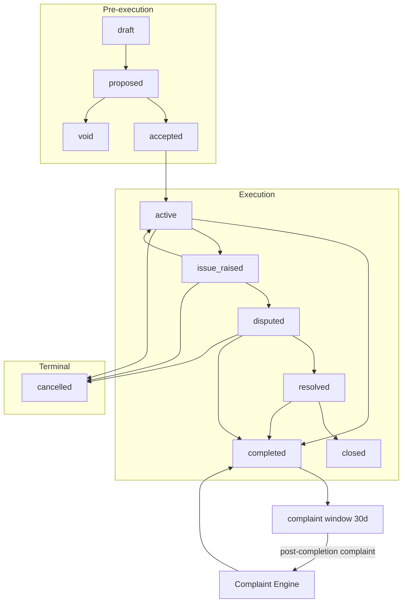
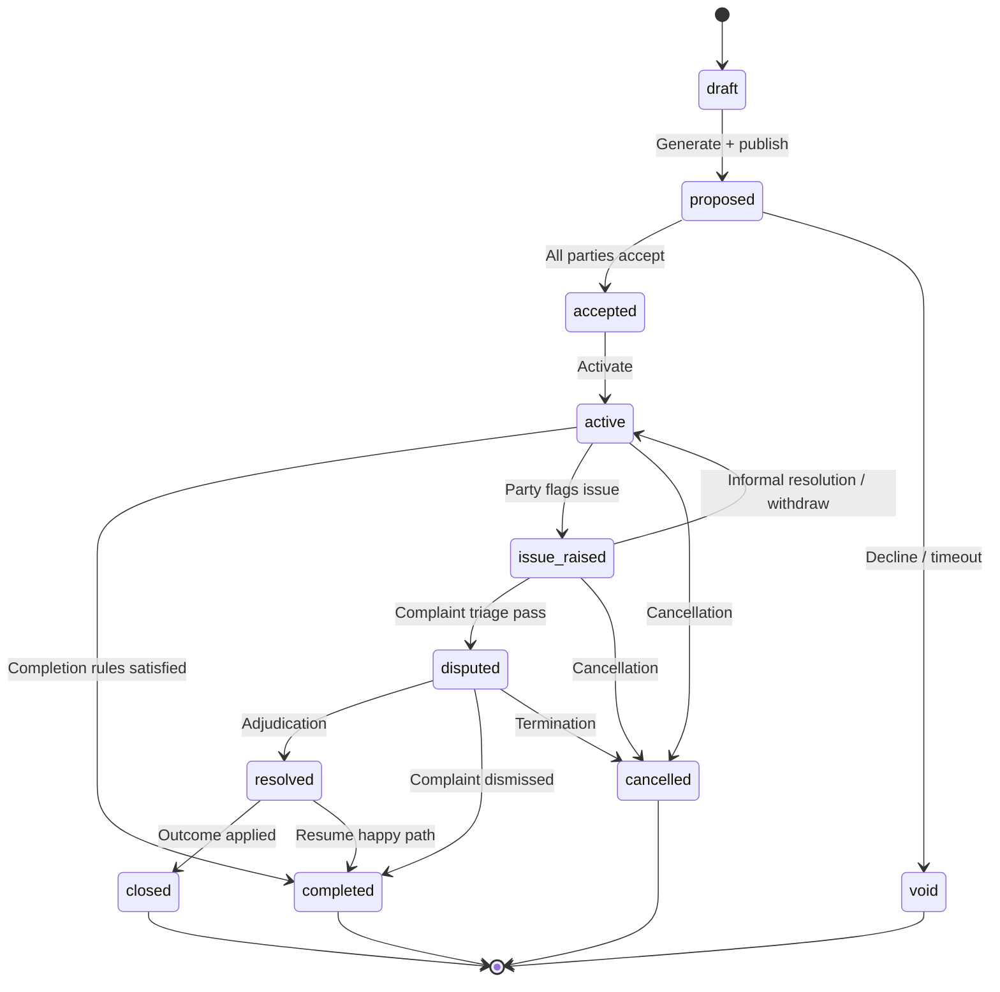
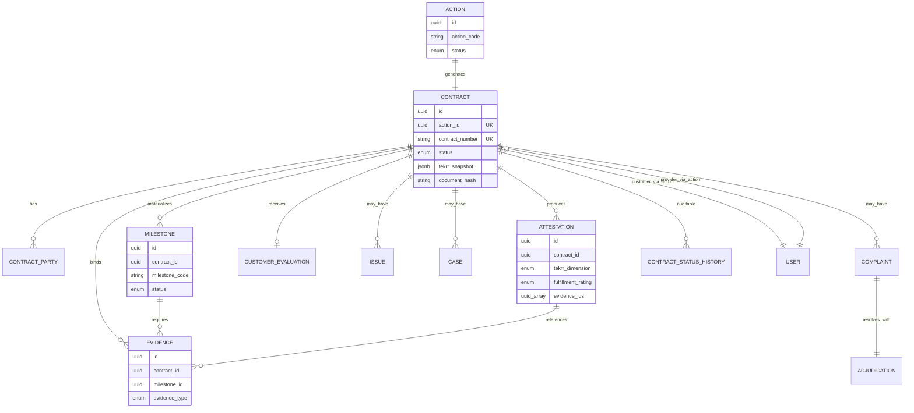

# APP13 Contract Engine v1

**Version:** 1.0  
**Status:** Specification — Pre-implementation  
**Last updated:** June 19, 2026  
**Engine ID:** `contract`  
**Depends on:** [Core Principles v1](./APP13-Core-Principles-v1.md) · [Approval Addendum v1.1](./architecture/APPROVAL-ADDENDUM-v1.1.md) · [State Machine v1](./APP13-State-Machine-v1.md) · [Trust Engine v1.1](./APP13-Trust-Engine-v1.1.md) · [TEKRR Framework v1](./APP13-TEKRR-Framework-v1.md) · [Action Taxonomy v1](./APP13-Action-Taxonomy-v1.md)

**Template pack reference:** [contract-engine/templates/](./contract-engine/templates/) (15 MVP templates)

---

## Document purpose

The **Contract Engine** is APP13's constitutional binding layer — the system that transforms classified Actions into auditable Contracts, governs execution permission, materializes Milestones and Evidence rules, emits Trust events, and connects to the Complaint Engine when disputes arise.

It is **not** a marketplace checkout, payment processor, or freeform document store.

**Core chain:**

```
Action → Contract → Execution (Milestone + Evidence + Attestation) → Trust → Complaint
```

**Audience:** Engineering, architecture, legal, trust operations.  
**Scope:** Constitutional contract system for MVP with Phase 2+ readiness hooks (payments, escrow, amendments).

---

## 1. Contract philosophy

### 1.1 Constitutional role

| Principle | Meaning |
|-----------|---------|
| **Binding, not browsing** | Contracts bind obligations — they do not list services for sale |
| **Generated, not uploaded** | Canonical record comes from versioned templates + TEKRR (Law 8) |
| **Sequential, not skippable** | Draft → Proposed → Accepted → Active — no shortcut (Law 6) |
| **Snapshot immutability** | Active obligations frozen at activation (Law 7) |
| **Evidence-grounded** | No attestation without evidence; no trust without contract events (Laws 10–14) |
| **Dispute-anchored** | Every Complaint originates from a Contract (Law 19) |
| **Platform neutrality** | Parties supply commercial terms; engine supplies framework (Law 4) |

### 1.2 What the Contract Engine is not

| Not this | Why |
|----------|-----|
| Payment processor | MVP — declarative commercial terms only |
| Escrow holder | Phase 4 — readiness hooks only in MVP |
| Complaint adjudicator | Complaint Engine owns disputes |
| Trust calculator | Trust Engine consumes contract events |
| Work performer | Law 3 — platform governs record, not outcomes |

### 1.3 Design objectives

1. **Convert** TEKRR-complete Actions into binding Contracts  
2. **Gate** execution until all parties accept at required tiers  
3. **Materialize** milestones, evidence rules, and attestations at activation  
4. **Emit** domain events that Trust Engine transforms into trust signals  
5. **Route** issues and disputes through defined paths (Law 23)  
6. **Preserve** an immutable, auditable record (Law 24)

---

## 2. Contract authority rules

### 2.1 Engine authority matrix

| Domain | Authoritative engine | Others may |
|--------|---------------------|------------|
| Contract status | **Contract Engine** | Request transitions via events |
| Contract document hash | **Contract Engine** | Read only |
| TEKRR snapshot post-active | **Contract Engine** | Read only |
| Milestone materialization | **Contract Engine** (factory) | Action Engine executes |
| Milestone/evidence operations | **Action Engine** | Blocked unless Contract = `active` (+ issue rules) |
| Attestation records | **Action Engine** | Contract Engine validates gates |
| Complaint filing | **Complaint Engine** | Contract Engine validates eligibility |
| Trust score | **Trust Engine** | Consumes contract events only |
| Issue (pre-formal) | **Contract Engine** | Complaint Engine on escalation |

### 2.2 Constitutional constraints (hard rules)

| ID | Rule | Law |
|----|------|-----|
| **CA-1** | Every Action must have exactly one Contract (MVP 1:1) | Law 5 |
| **CA-2** | No milestone/evidence/attestation unless Contract = `active` (or issue-path freeze rules) | Law 5 |
| **CA-3** | Every Complaint requires valid `contract_id` | Law 19 |
| **CA-4** | Every Evidence requires `contract_id` + `milestone_id` | Law 11 |
| **CA-5** | Trust events originate from contract lifecycle events — never directly from user input | Law 14–16 |
| **CA-6** | Contract Engine never sets trust scores | Law 16 |
| **CA-7** | Template ID + version on every contract | Law 8 |
| **CA-8** | All required parties must accept before Active | Law 9 |

### 2.3 Event emission authority

Contract Engine **emits** domain events; Trust Engine **ingests** mapped `trust.*` events per [Trust Engine v1.1 §6.2](./APP13-Trust-Engine-v1.1.md).

```
Contract Engine event  →  Trust Engine event (examples)
─────────────────────────────────────────────────────────
contract.activated     →  trust.contract.activated
contract.completed     →  trust.contract.completed
contract.cancelled     →  trust.contract.cancelled
milestone.evidence_submitted → trust.evidence.recorded
```

**Rule:** No trust signal without a preceding contract-domain event.

---

## 3. Contract lifecycle

### 3.1 Lifecycle overview



### 3.2 Phase definitions

| Phase | Contract states | Action sync | Execution |
|-------|-----------------|-------------|:---------:|
| **Definition** | `draft` | `ready_for_contract` | No |
| **Proposal** | `proposed` | `contract_pending` | No |
| **Commitment** | `accepted` | `contract_pending` | No |
| **Execution** | `active`, `issue_raised`, `disputed`, `resolved` | `contract_active` | Yes / frozen |
| **Completion** | `completed` | `completed` | No |
| **Issue terminal** | `closed` | `completed` | No |
| **Abandon** | `void`, `cancelled` | `cancelled` | No |

### 3.3 Timeouts (MVP defaults)

| Transition | Timeout | Result |
|------------|---------|--------|
| `proposed` → acceptance | 7 days | → `void` |
| Issue escalation window | 7 business days | Issue → `expired`; Contract → `active` |
| Draft engagement purge | 90 days | Archive / delete policy |
| Customer attestation silence | 7 days after provider submit | Auto-accept with audit flag |
| Complaint filing window post-completion | 30 days (template override) | EL-3 blocks filing |

---

## 4. State machine

*Authoritative alignment: [State Machine v1 §2](./APP13-State-Machine-v1.md#2-contract)*

### 4.1 Contract states

#### Primary path

| State | Code | Execution | Description |
|-------|------|:---------:|-------------|
| Draft | `draft` | No | Record created; TEKRR may still edit on Action |
| Proposed | `proposed` | No | Document generated; parties review |
| Accepted | `accepted` | No | All parties accepted; pending activation |
| Active | `active` | Yes | Snapshots stored; milestones materialized |
| Completed | `completed` | No | All blocking milestones attested; complaint window open |

#### Issue path (during Active only)

| State | Code | Execution | Description |
|-------|------|:---------:|-------------|
| Issue raised | `issue_raised` | Limited | Pre-formal flag; partial freeze |
| Disputed | `disputed` | Frozen | Complaint triage passed |
| Resolved | `resolved` | No | Adjudication applied |
| Closed | `closed` | No | Issue path terminal |

#### Terminal

| State | Code | Type |
|-------|------|------|
| Void | `void` | Never activated |
| Cancelled | `cancelled` | Terminated before/during execution |

### 4.2 State diagram



### 4.3 Allowed transitions

| From | To | Trigger | Actor |
|------|-----|---------|-------|
| — | `draft` | Create from Action | Contract Engine |
| `draft` | `proposed` | Generate document | Contract Engine |
| `proposed` | `accepted` | All acceptances recorded | Parties |
| `proposed` | `void` | Decline / timeout | Party / System |
| `accepted` | `active` | Activate | Contract Engine |
| `active` | `completed` | Completion gate pass | Contract Engine |
| `active` | `issue_raised` | Issue flagged | Party |
| `active` | `cancelled` | Cancel | Party / Admin |
| `issue_raised` | `active` | Issue resolved/withdrawn | Parties |
| `issue_raised` | `disputed` | Complaint triage pass | Complaint Engine |
| `disputed` | `resolved` | Adjudication | Complaint Engine |
| `disputed` | `completed` | Complaint dismissed | Complaint Engine |
| `disputed` | `cancelled` | Termination | Admin |
| `resolved` | `closed` | Engines synced | System |
| `resolved` | `completed` | Milestones satisfied | System |

### 4.4 Forbidden transitions

| From | To | Reason |
|------|-----|--------|
| `draft` | `active` | Skip Proposed/Accepted (Law 6) |
| `proposed` | `active` | Incomplete acceptance (Law 9) |
| `void` / `cancelled` / `closed` | any | Terminal |
| `completed` | `active` | No reactivation (MVP) |
| `completed` | `disputed` | Post-completion: Complaint only; Contract stays `completed` |
| pre-`active` | `completed` | No execution without activation (Law 5) |
| pre-`active` | `issue_raised` | No issues before execution |

---

## 5. Contract formula

The Contract Engine uses **three binding formulas** — not a monetary price formula.

### 5.1 TEKRR completeness gate (pre-Proposed)

```
tekrr_completeness = (required_fields_populated / required_fields_total) × 100

Gate: tekrr_completeness = 100  →  allowed: draft → proposed
```

All five dimensions T, E, K, R, S must have template-required fields populated (Law 2).

### 5.2 Obligation binding formula (at Active)

On activation, Contract Engine computes immutable obligation set:

```
Obligations = TEKRR_snapshot
            × template_clause_modules
            × milestone_pattern(action_code)
            × evidence_requirements(template Section 4)

Invariant: hash(Obligations) referenced in document_hash at activation
```

**Outputs stored:**

- `tekrr_snapshot` (JSONB, immutable)
- `verification_snapshot` (JSONB, immutable)
- `document_hash` (SHA-256)
- `milestones[]` (materialized)
- `commercial_terms` (JSONB, declarative)

### 5.3 Completion readiness formula

```
completion_ready = ∀ m ∈ blocking_milestones :
                     m.status ∈ { accepted, waived }
                   AND ∀ d ∈ tekrr_dimensions :
                     attestation[d].rating ∈ { FUL, SUF, PAR, N/A }
                     OR attestation[d].rating = PEN with no active complaint
                   AND no blocking complaint on contract

When completion_ready = true  →  active → completed
```

### 5.4 Fulfillment score (feeds Trust Engine)

Per contract at completion:

```
fulfillment_score[d] ∈ { 1.00, 0.85, 0.50, 0.00 }  // FUL, SUF, PAR, UNF

execution_input = (
  Σ(fulfillment_score[d] × emphasis[d]) / Σ(applicable emphasis[d])
) × evidence_confidence × 1000
```

See [Trust Engine v1.1 §4.3](./APP13-Trust-Engine-v1.1.md) for trust aggregation.

### 5.5 Commercial terms (declarative — MVP)

```
commercial_terms = {
  price_description: string,      // declarative only
  payment_arrangement_note: string,
  cancellation_policy: enum,      // flexible | moderate | strict
  warranty_period_days: int
}
```

**No payment execution in MVP.** Formula records terms; does not settle funds.

---

## 6. Entity relationships



### 6.1 Cardinality rules (MVP)

| Relationship | Cardinality | Rule |
|--------------|-------------|------|
| Action → Contract | 1 : 1 | MVP only |
| Contract → Milestone | 1 : N | Materialized at Active |
| Milestone → Evidence | 1 : N | Law 11 |
| Contract → Attestation | 1 : N | One per TEKRR dimension minimum |
| Contract → Complaint | 1 : N | EL-6: one active per dimension |
| Contract → Issue | 1 : N | One active per dimension |
| Contract → Case | 1 : N | Operational dispute file |

---

## 7. Deliverables

Every contract generation and activation produces:

| Deliverable | When | Format | Consumer |
|-------------|------|--------|----------|
| Contract record | `draft` | DB entity | All engines |
| Contract JSON | `proposed` | Canonical structured | Engines, Complaint |
| Contract PDF | `proposed` | Human-readable | Parties |
| Document hash | `proposed` | SHA-256 | Integrity verification |
| TEKRR snapshot | `active` | JSONB | Trust, Complaint |
| Verification snapshot | `active` | JSONB | Trust, Complaint |
| Milestone set | `active` | DB entities | Action Engine |
| Attestation placeholders | `active` | Per dimension | Action Engine |
| Status history rows | Every transition | Append-only | Audit |
| Domain events | Per transition | Outbox | Trust, Notification |
| Complaint window end | `completed` | Timestamp | Complaint Engine |

---

## 8. Acceptance rules

### 8.1 Contract acceptance (Proposed → Accepted)

| Rule ID | Rule |
|---------|------|
| **AR-1** | Customer must accept first or concurrently with Provider (template default: either order) |
| **AR-2** | Provider acceptance required |
| **AR-3** | Customer tier ≥ T1 at acceptance moment |
| **AR-4** | Provider tier ≥ template `min_provider_tier` |
| **AR-5** | Accepting party tier re-validated at each acceptance click |
| **AR-6** | Document hash at acceptance must match stored artifact |
| **AR-7** | Acceptance records: `party_id`, `accepted_at`, `ip_address`, `verification_tier_at_accept` |

**Partial acceptance:** Contract remains `proposed` until AR-2 satisfied; may show `accepted` only when **all** required parties accepted (Entity Model: both timestamps populated → activation eligible).

### 8.2 Activation acceptance (Accepted → Active)

| Rule ID | Rule |
|---------|------|
| **AR-8** | All AR-1–AR-7 satisfied |
| **AR-9** | TEKRR snapshot written — immutable after this point |
| **AR-10** | Milestones materialized before status = `active` |
| **AR-11** | Emit `contract.activated` → `trust.contract.activated` |

### 8.3 Milestone acceptance

| Rule ID | Rule |
|---------|------|
| **AR-12** | Required evidence uploaded before milestone `submitted` |
| **AR-13** | Responsible party per template submits; counterparty attests where required |
| **AR-14** | M-ACCEPT requires EV-SIGN from `acceptance_party` unless auto-accept policy |
| **AR-15** | Attestation must reference `evidence_ids[]` (Law 13) |

### 8.4 Auto-accept policy (MVP default)

| Condition | Policy |
|-----------|--------|
| Customer silence 7 days after provider milestone submit | Auto-accept with `audit_flag: auto_accept_silence` |
| Evidence confidence cap | 0.75 when auto-accepted (Trust Engine v1.1) |

---

## 9. Rejection rules

### 9.1 Contract rejection (Proposed → Void)

| Rule ID | Rule | Result |
|---------|------|--------|
| **RR-1** | Either party explicitly declines | → `void` |
| **RR-2** | Acceptance timeout (7 days) | → `void` |
| **RR-3** | Tier gate fails at acceptance attempt | Block acceptance; remain `proposed` |
| **RR-4** | TEKRR validation fails on regenerate | Remain `draft` / `proposed` with errors |

**Void contracts:** Cannot reactivate. New Action or regenerate required.

### 9.2 Milestone rejection

| Rule ID | Rule | Result |
|---------|------|--------|
| **RR-5** | Customer rejects milestone submission | Milestone → `disputed`; Issue path available |
| **RR-6** | Missing required evidence | Block submission — remain `in_progress` |
| **RR-7** | Provider withdraws submission | Milestone → `in_progress` |

### 9.3 Complaint filing rejection

Handled by Complaint Engine using Contract Engine eligibility API (§15). Contract Engine returns pass/fail + reason code.

---

## 10. Evidence requirements

### 10.1 Evidence matrix (by type)

| Code | Name | Typical milestones | Submitted by | Trust weight |
|------|------|-------------------|--------------|:------------:|
| `EV-TS` | Timestamp | M-ACCESS, M-WIP, M-COMPLETE | Provider | 0.70 |
| `EV-PHOTO` | Photograph | M-WIP, M-DELIVER, M-VERIFY | Provider | 0.80 |
| `EV-DOC` | Document | M-DELIVER, M-VERIFY, M-SCOPE | Provider / Both | 0.85 |
| `EV-CHECK` | Checklist | M-WIP, M-VERIFY | Provider | 0.85 |
| `EV-TEST` | Test Result | M-VERIFY | Provider | 0.95 |
| `EV-SIGN` | Digital Sign-off | M-SCOPE, M-ACCEPT | Both | 1.00 |
| `EV-CRED` | Credential Verification | M-VERIFY | Provider | 0.95 |
| `EV-NOTE` | Structured Note | Any | Either | 0.70 |

*Trust weights from [Trust Engine v1.1 §6.3](./APP13-Trust-Engine-v1.1.md).*

### 10.2 Evidence matrix (by risk level)

| Risk level | Minimum evidence rigor |
|:----------:|------------------------|
| 1–2 | EV-TS or EV-CHECK |
| 3 | EV-PHOTO + EV-CHECK |
| 4–5 | EV-PHOTO + EV-TEST or EV-DOC + EV-CRED |

Template Section 4 may exceed these minimums.

### 10.3 Evidence binding rules

| Rule ID | Rule | Law |
|---------|------|-----|
| **EV-1** | Every evidence row requires `contract_id` + `milestone_id` | Law 11 |
| **EV-2** | Orphan uploads rejected | Law 11 |
| **EV-3** | `content_hash` required on file evidence | Integrity |
| **EV-4** | Duplicate hash rejected | Anti-manipulation |
| **EV-5** | Evidence upload emits `milestone.evidence_submitted` → `trust.evidence.recorded` | Law 14 |
| **EV-6** | Contract status must be `active` (or issue-path partial freeze exception) | Law 5 |

### 10.4 Per-milestone template pattern (archetypes)

| Milestone | Typical required evidence |
|-----------|--------------------------|
| M-ACCESS | EV-TS, EV-NOTE |
| M-SCOPE | EV-SIGN |
| M-WIP | EV-TS, EV-PHOTO or EV-CHECK |
| M-DELIVER | EV-DOC, EV-PHOTO |
| M-VERIFY | EV-TEST, EV-CHECK, EV-CRED (if K requires) |
| M-ACCEPT | EV-SIGN |
| M-COMPLETE | EV-TS (system) |

Full per-action requirements: [template pack](./contract-engine/templates/README.md).

---

## 11. Milestones

### 11.1 Milestone factory (at Active)

| Property | Source |
|----------|--------|
| `milestone_code` | Template Section 5 |
| `sequence_order` | Template |
| `tekrr_dimension` | Template mapping |
| `responsible_party` | Template |
| `due_at` | Computed from TEKRR Time |
| `blocking` | Template |
| `required_evidence[]` | Template Section 4 |
| `status` | `pending` |
| `session_index` | Recurring actions (D, G) |

### 11.2 Milestone states

`pending` · `in_progress` · `submitted` · `accepted` · `disputed` · `frozen` · `waived`

| State | Meaning |
|-------|---------|
| `frozen` | Dimension under complaint freeze |
| `waived` | Admin or template policy skip (audit required) |

### 11.3 Milestone progression rules

```
pending → in_progress   : responsible party starts
in_progress → submitted : required evidence complete
submitted → accepted    : counterparty attests OR auto-accept
submitted → disputed    : counterparty rejects → Issue path
frozen    → in_progress : complaint resolved / dimension unfrozen
```

**Law 12:** Execution progress tracked exclusively through milestones — no informal status.

---

## 12. Amendment rules

### 12.1 MVP (cancel + recreate)

| Rule | MVP behavior |
|------|--------------|
| **AM-MVP-1** | No in-flight amendment engine in MVP |
| **AM-MVP-2** | Scope change → cancel (per policy) + new Action/Contract |
| **AM-MVP-3** | Prior contract trust events retained — not deleted |
| **AM-MVP-4** | Cancellation fault attribution recorded |

### 12.2 Phase 2 amendment engine (forward spec)

| Amendment state | Description |
|-----------------|-------------|
| `draft` | Delta proposed on Active contract |
| `pending_acceptance` | Amendment document generated |
| `active` | All parties accepted; obligation graph patched |
| `rejected` | Declined or expired |

| Rule ID | Rule |
|---------|------|
| **AM-1** | Amendments only when Contract ≥ `active` and not `disputed` |
| **AM-2** | TEKRR delta validated by Action Engine before doc generation |
| **AM-3** | Re-acceptance from all affected parties |
| **AM-4** | New `tekrr_snapshot` version; prior version retained |
| **AM-5** | No backward transition from `in_execution` to pre-active |
| **AM-6** | Trust: amendment events reference `amendment_id`; prior signals retained |

---

## 13. Completion rules

### 13.1 Completion gate

| Step | Check |
|------|-------|
| 1 | Contract status = `active` (or `disputed` → dismissed path) |
| 2 | All `blocking` milestones = `accepted` or `waived` |
| 3 | All applicable attestations recorded with evidence |
| 4 | No active complaint blocking completion |
| 5 | Completion readiness formula = true (§5.3) |

### 13.2 On completion

| Action | Engine |
|--------|--------|
| Status → `completed` | Contract |
| Set `complaint_window_ends_at` = now + `filing_window_days` | Contract |
| Set `completed_at` | Contract |
| Emit `contract.completed` | Contract → Trust |
| Action status → `completed` | Action Engine |
| Open eval window for CustomerEvaluation | Action Engine |

### 13.3 Post-completion

| Rule | Behavior |
|------|----------|
| Contract stays `completed` during post-completion complaints | State Machine v1 |
| Attestations may update retroactively on complaint close | Action + Trust |
| Trust emits `trust.contract.completed` then complaint adjustments |

---

## 14. Cancellation rules

### 14.1 Cancellation matrix

| Contract state | Who may cancel | Policy | Fault attribution |
|----------------|--------------|--------|-----------------|
| `draft`, `proposed` | Customer | Abandon | `none` |
| `proposed` | Either party | Decline → `void` | `none` |
| `accepted` | Customer | Pre-active abandon | `none` |
| `active` (before milestones started) | Either (flexible policy) | Template `cancellation_policy` | Usually `none` |
| `active` (work started) | Per policy | moderate / strict | `customer`, `provider`, or `shared` |
| `issue_raised`, `disputed` | Admin / policy | Audit required | Per adjudication or policy |

### 14.2 Cancellation policy types (template)

| Policy | Before work starts | After work started |
|--------|-------------------|-------------------|
| `flexible` | Either party, no fault | Either party, fault optional |
| `moderate` | Free cancel | Fault if provider started WIP |
| `strict` | Free cancel | Fault party recorded; trust impact |

### 14.3 On cancellation

| Action | Detail |
|--------|--------|
| Status → `cancelled` | Terminal |
| Record `cancellation_fault_party` | `customer`, `provider`, `shared`, `none` |
| Emit `contract.cancelled` | Includes fault_party |
| Trust | `trust.contract.cancelled` with offsets per Trust Engine v1.1 §4.7 |
| Action | → `cancelled` |

### 14.4 Forbidden cancellations

| Rule | Reason |
|------|--------|
| Cancel `completed` contract | Terminal — use complaint path |
| Cancel without audit when milestones submitted | Law 24 |
| Cancel to erase complaint history | Law 17 — history persists |

---

## 15. Breach matrix

A **breach** is unfulfilled obligation detectable from evidence, milestones, or time — may trigger Issue or Complaint.

| Breach code | TEKRR dim | Detection source | Typical milestone | Auto-suggest complaint |
|-------------|-----------|------------------|-------------------|:----------------------:|
| `BR-T-LATE-START` | T | Start > tolerance vs `scheduled_start` | M-ACCESS | TIME_BREACH |
| `BR-T-MISSED-DEADLINE` | T | `completion_deadline` passed | M-DELIVER, M-VERIFY | TIME_BREACH |
| `BR-T-NO-SHOW` | T | Session not delivered | M-WIP (recurring) | TIME_BREACH |
| `BR-E-MISSING-DELIVERABLE` | E | Deliverable not in evidence | M-DELIVER | EFFORT_DEFICIENCY |
| `BR-E-CHECKLIST-INCOMPLETE` | E | EV-CHECK incomplete | M-VERIFY | EFFORT_DEFICIENCY |
| `BR-K-CRED-MISMATCH` | K | EV-CRED ≠ declared credentials | M-VERIFY | KNOWLEDGE_MISREP |
| `BR-R-HAZARD-UNDECLARED` | R | Incident vs declared hazards | Any | RISK_INCIDENT |
| `BR-R-SAFETY-FAIL` | R | EV-TEST fail / safety checklist | M-VERIFY | RISK_INCIDENT |
| `BR-S-NO-ACCEPTANCE` | S | M-ACCEPT rejected / expired | M-ACCEPT | RESPONSIBILITY_FAILURE |
| `BR-S-WARRANTY-DENIAL` | S | Post-completion warranty dispute | M-COMPLETE | RESPONSIBILITY_FAILURE |
| `BR-X-INTEGRITY` | All | Document hash mismatch / tamper | Any | CONTRACT_INTEGRITY |

**Breach ≠ automatic complaint.** Breaches **suggest** Issue/Complaint; parties or admin confirm.

---

## 16. Dispute matrix

### 16.1 Dispute escalation path (Law 23)

| Stage | Entity | Contract state | Formal |
|-------|--------|----------------|:------:|
| 1 — Informal flag | Issue | `issue_raised` | No |
| 2 — Formal dispute | Complaint + Case | `disputed` | Yes |
| 3 — Adjudication | Adjudication | `resolved` | Yes |
| 4 — Terminal | Case closed | `closed` or `completed` | Yes |

### 16.2 Dispute matrix (by trigger)

| Trigger | Issue required first? | Contract transition | Complaint types |
|---------|:---------------------:|---------------------|-----------------|
| Milestone rejection | Recommended | → `issue_raised` | EFFORT, RESPONSIBILITY |
| Missed deadline | Optional | → `issue_raised` or post-completion | TIME_BREACH |
| Safety incident (risk ≥ 4) | **No — immediate** | → `disputed` on triage | RISK_INCIDENT |
| Credential fraud | Optional | → `issue_raised` | KNOWLEDGE_MISREP |
| Post-completion dissatisfaction | No | stays `completed` | Per template |
| Contract tamper suspicion | No | Admin freeze | CONTRACT_INTEGRITY |

### 16.3 Freeze rules during dispute

| Scope | Issue raised | Disputed (complaint active) |
|-------|:------------:|:---------------------------:|
| Flagged milestone | Partial freeze | Frozen |
| Flagged TEKRR dimension | Partial | Full dimension freeze |
| Non-flagged dimensions | Execute | Execute unless admin hold |
| Trust aggregate | No penalty until close | `dispute_hold` on evidence_gathering |

---

## 17. Complaint eligibility

Contract Engine exposes `validateComplaintEligibility(contract_id, filing)` — authoritative gate.

### 17.1 Eligibility rules (aligned to approved contract states)

| Rule ID | Rule | MVP contract states |
|---------|------|---------------------|
| **EL-1** | Filer is contract party | Any |
| **EL-2** | Contract status ∈ `active`, `issue_raised`, `disputed`, `completed` | Approved states |
| **EL-3** | If `completed`: now ≤ `complaint_window_ends_at` | Post-completion window |
| **EL-4** | If during execution: incident within active period | `activated_at` … `completed_at` |
| **EL-5** | Dimension exists in TEKRR snapshot | Snapshot FK |
| **EL-6** | No active complaint on `(contract_id, dimension)` | Complaint Engine |
| **EL-7** | Complaint type ∈ template `eligible_complaint_types[]` | Template §8 |
| **EL-8** | Description ≥ 50 characters | Complaint Engine |

**Note:** Legacy states `in_execution`, `pending_completion` from architecture v1.0 are **superseded** by `active` and `completed` per Approval Addendum v1.1.

### 17.2 Post-completion path

```
Contract = completed
  → Complaint filed (EL-3 pass)
  → Contract stays completed
  → Case → formal
  → Trust updates on complaint close (retroactive attestation)
```

---

## 18. Escrow readiness (Phase 4 — hooks only)

MVP records readiness fields; **no escrow execution**.

| Field | Type | Purpose |
|-------|------|---------|
| `escrow_ready` | boolean | Template + jurisdiction support |
| `escrow_policy_ref` | string | Future policy pack ID |
| `escrow_milestone_triggers[]` | JSON | Milestones that would release funds |
| `escrow_amount_declared` | decimal | From commercial_terms — display only |

**MVP rule:** `escrow_ready = false` for all MVP contracts. Clause modules for escrow excluded.

**Phase 4 activation criteria (reference):**

- Payment engine live
- Regulated escrow partner integrated
- Contract amendment engine stable
- Dispute hold maps to fund freeze

---

## 19. Payment readiness (Phase 4 — hooks only)

| Field | Type | Purpose |
|-------|------|---------|
| `payment_ready` | boolean | Template supports payment binding |
| `payment_method_declared` | enum | `external`, `platform` (future) |
| `payment_schedule_ref` | JSON | Declarative schedule from commercial_terms |
| `invoice_milestone_map[]` | JSON | Milestone → payment event mapping |

**MVP rule:** `payment_ready = false`. Commercial terms are **declarative text only** — no processing, no PCI scope in MVP.

**Contract Engine MVP emits:** `commercial_terms.price_description`, `payment_arrangement_note` — no payment events.

---

## 20. Contract invariants

| ID | Invariant | Enforcement |
|----|-----------|-------------|
| **CI-1** | 1 Action → 1 Contract (MVP) | DB unique on `action_id` |
| **CI-2** | Template ID valid for action_code | Generation gate |
| **CI-3** | TEKRR snapshot immutable after `active` | Application + audit |
| **CI-4** | Document hash matches stored artifacts at acceptance | CL-5 |
| **CI-5** | Milestones exist iff contract ≥ `active` | Factory |
| **CI-6** | Evidence always has contract_id + milestone_id | FK + API |
| **CI-7** | Attestation references evidence_ids or active dispute | Law 13 |
| **CI-8** | Complaint requires contract_id | FK |
| **CI-9** | Status transitions append to `contract_status_history` | Law 24 |
| **CI-10** | Trust events trace to contract events | Event chain |
| **CI-11** | Void/cancelled contracts never become Active | State machine |
| **CI-12** | Completed contracts not reactivated (MVP) | State machine |

---

## 21. Forbidden operations

| ID | Operation | Reason |
|----|-----------|--------|
| **FO-1** | Execute milestones without Active contract | Law 5 |
| **FO-2** | Upload orphan evidence | Law 11 |
| **FO-3** | Activate without all party acceptances | Law 9 |
| **FO-4** | Modify TEKRR snapshot after Active | Law 7 |
| **FO-5** | Upload arbitrary PDF as canonical contract | Law 8 |
| **FO-6** | File complaint without contract_id | Law 19 |
| **FO-7** | Manually set contract status without history row | Law 24 |
| **FO-8** | Skip Draft → Proposed → Accepted → Active | Law 6 |
| **FO-9** | Reactivate void/cancelled/completed contract (MVP) | State machine |
| **FO-10** | Emit trust score from Contract Engine | Law 16 |
| **FO-11** | Process payment or hold escrow (MVP) | MVP Scope |
| **FO-12** | Adjudicate complaint inside Contract Engine | Separation of concerns |
| **FO-13** | Attest milestone without required evidence | Law 13 |
| **FO-14** | Delete contract-linked evidence or history | Law 24 |

---

## 22. MVP contract model

### 22.1 Scope summary

| Included | Excluded |
|----------|----------|
| 15 templates `CT-{code}@v1` | Payments processing |
| 2-party Customer + Provider | Escrow execution |
| Full lifecycle + issue path | Amendment engine (cancel+recreate) |
| Milestone factory + evidence gates | Multi-action contracts |
| Declarative commercial terms | Insurance/regulator clauses |
| Trust event emission | Institutional overlays |
| Complaint eligibility API | Third-party e-sign |
| Escrow/payment readiness stubs | |

### 22.2 Template registry (MVP)

| Template ID | Action | Domain |
|-------------|--------|--------|
| `CT-A.2.1@v1` | Surface Repair | A |
| `CT-A.4.1@v1` | Routine Maintenance | A |
| `CT-A.4.2@v1` | Cleaning & Sanitization | A |
| `CT-B.1.2@v1` | Plumbing Service | B |
| `CT-B.2.1@v1` | Electrical Installation | B |
| `CT-B.3.3@v1` | Technical Troubleshooting | B |
| `CT-C.1.1@v1` | Strategy Consulting | C |
| `CT-C.1.2@v1` | Operations Advisory | C |
| `CT-D.1.1@v1` | Personal Care Assistance | D |
| `CT-D.3.1@v1` | Household Management Aid | D |
| `CT-E.1.1@v1` | Graphic Design | E |
| `CT-E.3.1@v1` | Custom Software Development | E |
| `CT-F.1.2@v1` | Event Coordination | F |
| `CT-G.1.1@v1` | One-to-One Tutoring | G |
| `CT-H.1.1@v1` | Property Condition Assessment | H |

### 22.3 Validation rules (cross-template)

| Rule ID | Rule |
|---------|------|
| VR-001 | Customer ≥ T1 before acceptance |
| VR-002 | Provider ≥ template `min_provider_tier` |
| VR-003 | TEKRR 100% complete |
| VR-004 | Risk ≥ 4 → hazard declarations non-empty |
| VR-005 | Declared credentials match provider verified set |
| VR-006 | `scheduled_start` < `completion_deadline` |
| VR-007 | ≥1 deliverable where applicable |
| VR-008 | `acceptance_criteria` non-empty |

---

## 23. Trust event integration

Contract Engine emits; Trust Engine ingests. **No trust without contract event.**

| Contract event | Trust event | When |
|----------------|-------------|------|
| `contract.activated` | `trust.contract.activated` | Active |
| `contract.completed` | `trust.contract.completed` | Completed |
| `contract.cancelled` | `trust.contract.cancelled` | Cancelled |
| `milestone.evidence_submitted` | `trust.evidence.recorded` | Each upload |
| `milestone.accepted` | `trust.execution.milestone_completed` | Rollup at complete |
| `milestone.rejected` | `trust.execution.milestone_failed` | Rollup |
| `milestone.on_time` / `late` | `trust.time.on_time` / `trust.time.late` | Rollup |
| `attestation.recorded` | `trust.attestation.fulfilled` / `.unfulfilled` | Rollup |
| `evaluation.submitted` | `trust.evaluation.received` | Post-complete |
| `complaint.*` | `trust.complaint.*` | Complaint Engine (not Contract) |

---

## 24. Examples

### 24.1 Happy path — B.2.1 Electrical Installation

| Step | State | Event |
|------|-------|-------|
| 1 | Action TEKRR 100% | `action.ready` |
| 2 | `draft` → `proposed` | `contract.proposed` |
| 3 | Both accept | `contract.party_accepted` ×2 |
| 4 | `accepted` → `active` | `contract.activated` → 6 milestones |
| 5 | Provider completes M-VERIFY with EV-TEST + EV-CRED | `milestone.evidence_submitted` |
| 6 | Customer EV-SIGN on M-ACCEPT | Milestone accepted |
| 7 | All blocking milestones done | `contract.completed` → `trust.contract.completed` |
| 8 | Customer submits EVAL | `trust.evaluation.received` |

### 24.2 Issue → Complaint path

| Step | Contract state | Detail |
|------|----------------|--------|
| 1 | `active` | Provider submits M-DELIVER |
| 2 | `issue_raised` | Customer flags incomplete wiring |
| 3 | `disputed` | Complaint triage pass; dimension E frozen |
| 4 | `resolved` | Admin upholds EFFORT_DEFICIENCY |
| 5 | `closed` | Attestation E → UNF; trust updated |

### 24.3 Post-completion complaint

| Step | Contract state | Detail |
|------|----------------|--------|
| 1 | `completed` | Within 30-day window |
| 2 | `completed` (unchanged) | Complaint filed RESPONSIBILITY_FAILURE |
| 3 | `completed` (unchanged) | Adjudication updates attestation retroactively |

### 24.4 Cancel + recreate (MVP amendment workaround)

| Step | Detail |
|------|--------|
| 1 | Active contract; scope change needed |
| 2 | Cancel with fault = `none` (customer-initiated scope change) |
| 3 | New Action + Contract from updated TEKRR |
| 4 | Prior contract trust events preserved |

---

## 25. Constitutional law alignment

| Law | Contract Engine enforcement |
|-----|----------------------------|
| **Law 1** | Action classification drives template |
| **Law 2** | TEKRR completeness gate |
| **Law 4** | Declarative commercial terms; no price-setting |
| **Law 5** | No execution without Active |
| **Law 6** | Sequential lifecycle |
| **Law 7** | TEKRR snapshot at Active |
| **Law 8** | Template-generated contracts |
| **Law 9** | All parties accept |
| **Law 10** | Evidence requirements per template |
| **Law 11** | Evidence milestone-bound |
| **Law 12** | Milestone-driven execution |
| **Law 13** | Attestation evidence binding |
| **Law 14** | Evidence → trust via events |
| **Law 19** | Complaint eligibility requires contract |
| **Law 20** | Complaint dimension from TEKRR snapshot |
| **Law 23** | Issue → Disputed → Resolved → Closed |
| **Law 24** | Status history append-only |
| **Law 25** | Template + TEKRR version on contract |

---

## 26. Related documents

| Document | Relationship |
|----------|--------------|
| [contract-engine/CONTRACT-ENGINE-v1.md](./contract-engine/CONTRACT-ENGINE-v1.md) | Template pack + generation detail |
| [State Machine v1](./APP13-State-Machine-v1.md) | Authoritative transitions |
| [Trust Engine v1.1](./APP13-Trust-Engine-v1.1.md) | Trust event mapping |
| [Complaint Lifecycle v1](./architecture/06-complaint-lifecycle.md) | Adjudication (states updated) |
| [MVP Scope v1](./APP13-MVP-Scope-v1.md) | MVP boundaries |

---

## Quick reference

```
LIFECYCLE:  draft → proposed → accepted → active → completed
ISSUE PATH: active → issue_raised → disputed → resolved → closed
EVERY ACTION: exactly 1 contract (MVP)
EVERY COMPLAINT: requires contract_id + TEKRR dimension
EVERY EVIDENCE: contract_id + milestone_id
TRUST: contract event → trust.* event (never direct)
MVP: no payments · no escrow · cancel+recreate for amendments
```

---

*Contract Engine v1 constitutional specification complete.*
