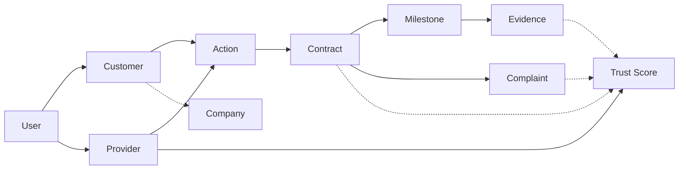

# APP13 Entity Model v1

**Version:** 1.0  
**Status:** Draft — Pre-implementation  
**Last updated:** June 19, 2026  
**Depends on:** [Core Principles v1](./APP13-Core-Principles-v1.md) · [MVP Scope v1](./APP13-MVP-Scope-v1.md) · [TEKRR Framework v1](./APP13-TEKRR-Framework-v1.md)

---

## Document purpose

This document defines the **core entity model** for APP13 — the ten foundational entities and their relationships that implement the constitutional chain:

```
Action → Contract → Execution (Milestone + Evidence) → Trust Score → Complaint
```

**Audience:** Engineering, architecture, and data design.  
**Scope:** MVP-aligned entity definitions with forward-compatible hooks for Phase 2+.

---

## Conventions

| Convention | Rule |
|------------|------|
| Primary keys | UUID v4 (`id`) |
| Timestamps | `created_at`, `updated_at` UTC on all mutable entities |
| Soft delete | `deleted_at` where noted |
| IDs in API | UUID only; no sequential public IDs |
| Enums | String enums in application layer |
| JSON fields | PostgreSQL `JSONB` in schema draft |
| Naming | Snake_case tables; singular conceptual entity names |

---

## 1. Entity definitions

### 1.1 User

**Table:** `users`  
**Description:** Root platform identity — authentication, contact, and account status. Every Customer and Provider is a User.

| Attribute | Type | Required | Description |
|-----------|------|----------|-------------|
| id | UUID | Yes | Primary key |
| email | string | Yes | Unique, normalized lowercase |
| phone | string | No | E.164 format |
| password_hash | string | No | Null if SSO (Phase 2+) |
| role | enum | Yes | `customer`, `provider`, `admin` (MVP primary roles) |
| status | enum | Yes | `active`, `suspended`, `deactivated` |
| email_verified_at | timestamp | No | Contact verification |
| phone_verified_at | timestamp | No | Contact verification |
| verification_tier | enum | Yes | Current highest tier: `T0`–`T4` |
| last_login_at | timestamp | No | |
| created_at | timestamp | Yes | |
| updated_at | timestamp | Yes | |
| deleted_at | timestamp | No | Soft delete |

**Invariants:**
- One User has at most one Customer profile OR one Provider profile (MVP).
- Admin Users have neither Customer nor Provider profile.

---

### 1.2 Customer

**Table:** `customers`  
**Description:** Profile extension for Users who initiate Actions and accept Contracts as beneficiaries.

| Attribute | Type | Required | Description |
|-----------|------|----------|-------------|
| id | UUID | Yes | Primary key |
| user_id | UUID | Yes | FK → users, unique |
| display_name | string | Yes | Public-safe name |
| legal_name | string | No | From T1 identity verification |
| avatar_storage_key | string | No | Object storage reference |
| company_id | UUID | No | FK → companies (optional affiliation, MVP stub) |
| default_location | JSONB | No | Address / geo context |
| created_at | timestamp | Yes | |
| updated_at | timestamp | Yes | |

**Invariants:**
- Customer.user must have `role = customer`.
- Customer must reach verification tier ≥ T1 to accept Contracts.

---

### 1.3 Provider

**Table:** `providers`  
**Description:** Professional profile extension for Users who execute Actions and fulfill Contract obligations.

| Attribute | Type | Required | Description |
|-----------|------|----------|-------------|
| id | UUID | Yes | Primary key |
| user_id | UUID | Yes | FK → users, unique |
| display_name | string | Yes | |
| business_name | string | No | Sole-prop or trade name |
| bio | text | No | |
| primary_trade | string | No | Aligns with action taxonomy domain |
| slug | string | No | Public link identifier (Phase 2) |
| status | enum | Yes | `pending`, `active`, `suspended` |
| avatar_storage_key | string | No | |
| created_at | timestamp | Yes | |
| updated_at | timestamp | Yes | |

**Invariants:**
- Provider.user must have `role = provider`.
- Provider must meet action-type minimum verification tier to accept Contracts.
- Provider has exactly one Trust Score record (1:1).

---

### 1.4 Company

**Table:** `companies`  
**Description:** Organizational entity for institutional relationships. **MVP:** minimal stub — name and optional customer affiliation only; full KYB in Phase 3.

| Attribute | Type | Required | Description |
|-----------|------|----------|-------------|
| id | UUID | Yes | Primary key |
| legal_name | string | Yes | |
| trading_name | string | No | |
| registration_number | string | No | |
| jurisdiction | string | No | ISO region code |
| status | enum | Yes | `pending`, `active`, `suspended` |
| verified_at | timestamp | No | KYB completion (Phase 3) |
| created_at | timestamp | Yes | |
| updated_at | timestamp | Yes | |

**MVP boundary:** Company exists as entity; no company-mediated Contracts, no org members, no policy overlays in MVP.

**Phase 3 additions (reference):** `company_members`, KYB verification, company-initiated Actions.

---

### 1.5 Action

**Table:** `actions`  
**Description:** A classified instance of professional work — decomposed via TEKRR, bound to exactly one Contract in MVP.

| Attribute | Type | Required | Description |
|-----------|------|----------|-------------|
| id | UUID | Yes | Primary key |
| action_code | string | Yes | Taxonomy code, e.g. `B.2.1` |
| action_name | string | Yes | Denormalized display name |
| domain | enum | Yes | `A`–`H` taxonomy domain |
| status | enum | Yes | See status enum below |
| customer_id | UUID | Yes | FK → customers (initiator) |
| provider_id | UUID | No | FK → providers (set on invite accept) |
| invited_provider_email | string | No | Pre-registration invite |
| title | string | Yes | Short description |
| description | text | No | |
| tekrr_profile | JSONB | Yes | Full T/E/K/R/S decomposition |
| tekrr_completeness | int | Yes | 0–100 |
| tekrr_framework_version | string | Yes | e.g. `tekrr_v1` |
| template_id | string | No | e.g. `CT-B.2.1@v1` |
| company_id | UUID | No | FK → companies (Phase 3) |
| created_at | timestamp | Yes | |
| updated_at | timestamp | Yes | |

**Action status enum:**
`draft` · `tekrr_in_progress` · `ready_for_contract` · `contract_pending` · `contract_active` · `completed` · `cancelled`

**Invariants (Law 1, Law 2):**
- Every Action has a valid `action_code` from taxonomy.
- TEKRR profile must be 100% complete before Contract generation.
- MVP: one Action → one Contract (1:1).

---

### 1.6 Contract

**Table:** `contracts`  
**Description:** Legal binding of an Action — generated from template, accepted by parties, governs execution.

| Attribute | Type | Required | Description |
|-----------|------|----------|-------------|
| id | UUID | Yes | Primary key |
| action_id | UUID | Yes | FK → actions, unique (MVP 1:1) |
| contract_number | string | Yes | Human-readable unique reference |
| template_id | string | Yes | e.g. `CT-B.2.1@v1` |
| template_version | string | Yes | |
| jurisdiction_pack | string | Yes | e.g. `US-GENERIC-v1` |
| status | enum | Yes | See status enum below |
| tekrr_snapshot | JSONB | Yes | Immutable TEKRR at activation |
| commercial_terms | JSONB | Yes | Declarative price/schedule note (MVP) |
| verification_snapshot | JSONB | No | Party tiers at activation |
| document_hash | string | No | SHA-256 canonical JSON |
| pdf_storage_key | string | No | Rendered contract PDF |
| customer_accepted_at | timestamp | No | |
| provider_accepted_at | timestamp | No | |
| activated_at | timestamp | No | |
| completed_at | timestamp | No | |
| complaint_window_ends_at | timestamp | No | |
| cancellation_fault_party | enum | No | `customer`, `provider`, `none` |
| created_at | timestamp | Yes | |
| updated_at | timestamp | Yes | |

**Contract status enum (approved):**

*Primary path:* `draft` · `proposed` · `accepted` · `active` · `completed`

*Issue path:* `issue_raised` · `disputed` · `resolved` · `closed`

*Terminal:* `void` · `cancelled`

**Invariants (Law 5–9):**
- No Milestone execution unless status = `active`.
- TEKRR snapshot immutable after activation.
- Both Customer and Provider acceptance required before `active`.

---

### 1.7 Milestone

**Table:** `milestones`  
**Description:** Trackable execution checkpoint on a Contract, materialized from contract template at activation.

| Attribute | Type | Required | Description |
|-----------|------|----------|-------------|
| id | UUID | Yes | Primary key |
| contract_id | UUID | Yes | FK → contracts |
| milestone_code | string | Yes | e.g. `M-ACCESS`, `M-VERIFY`, `M-ACCEPT` |
| name | string | Yes | Human label |
| sequence_order | int | Yes | Execution order |
| tekrr_dimension | enum | No | Primary dimension: `T`,`E`,`K`,`R`,`S` |
| status | enum | Yes | See status enum below |
| responsible_party | enum | Yes | `customer`, `provider`, `system`, `both` |
| due_at | timestamp | No | Computed from TEKRR Time |
| started_at | timestamp | No | |
| submitted_at | timestamp | No | |
| accepted_at | timestamp | No | |
| blocking | boolean | Yes | Must complete before next milestone |
| session_index | int | No | For recurring milestones (care, tutoring) |
| created_at | timestamp | Yes | |
| updated_at | timestamp | Yes | |

**Milestone status enum:**
`pending` · `in_progress` · `submitted` · `accepted` · `disputed` · `frozen` · `waived`

**Invariants (Law 10–12):**
- Every Milestone belongs to exactly one Contract.
- Created only when Contract becomes `active`.

---

### 1.8 Evidence

**Table:** `evidence`  
**Description:** Proof artifact substantiating Milestone execution — photos, documents, timestamps, checklists, sign-offs.

| Attribute | Type | Required | Description |
|-----------|------|----------|-------------|
| id | UUID | Yes | Primary key |
| contract_id | UUID | Yes | FK → contracts |
| milestone_id | UUID | Yes | FK → milestones |
| submitted_by_user_id | UUID | Yes | FK → users |
| evidence_type | enum | Yes | `EV-TS`, `EV-PHOTO`, `EV-DOC`, `EV-CHECK`, `EV-TEST`, `EV-SIGN`, `EV-CRED`, `EV-NOTE` |
| storage_key | string | No | Object storage ref (files) |
| content_hash | string | No | SHA-256 integrity |
| metadata | JSONB | No | Type-specific payload (checklist items, test results) |
| submitted_at | timestamp | Yes | |
| created_at | timestamp | Yes | |
| updated_at | timestamp | Yes | |

**Invariants (Law 10–11, Law 14):**
- Every Evidence must attach to exactly one Milestone on one Contract.
- No orphan Evidence.
- Evidence submission emits Trust signals.

---

### 1.9 Complaint

**Table:** `complaints`  
**Description:** Formal dispute tied to a Contract and TEKRR dimension(s) — the platform accountability mechanism.

| Attribute | Type | Required | Description |
|-----------|------|----------|-------------|
| id | UUID | Yes | Primary key |
| contract_id | UUID | Yes | FK → contracts |
| case_number | string | Yes | Human-readable unique reference |
| filed_by_user_id | UUID | Yes | FK → users |
| complaint_types | JSONB | Yes | Array: `TIME_BREACH`, `EFFORT_DEFICIENCY`, etc. |
| tekrr_dimensions | JSONB | Yes | Array: `T`,`E`,`K`,`R`,`S` |
| description | text | Yes | |
| status | enum | Yes | See status enum below |
| severity | enum | No | Set on resolution: `low`,`medium`,`high`,`critical` |
| outcome | enum | No | Set on resolution |
| fault_party | enum | No | `customer`, `provider`, `shared`, `none` |
| filed_at | timestamp | Yes | |
| triaged_at | timestamp | No | |
| resolved_at | timestamp | No | |
| resolved_by_user_id | UUID | No | FK → users (admin) |
| adjudication_findings | text | No | |
| created_at | timestamp | Yes | |
| updated_at | timestamp | Yes | |

**Complaint status enum:**
`filed` · `triage_pending` · `evidence_gathering` · `mediation` · `adjudication_pending` · `resolved` · `dismissed` · `closed`

**Complaint outcome enum:**
`upheld_provider_fault` · `upheld_customer_fault` · `dismissed` · `shared_fault` · `resolved_mutual` · `external_referral`

**Invariants (Law 19–23):**
- Every Complaint requires `contract_id`.
- At least one TEKRR dimension required.
- Filing window enforced per Contract template.

---

### 1.10 Trust Score

**Table:** `trust_scores`  
**Description:** Computed credibility record for a Provider — evidence-based, not manually editable.

| Attribute | Type | Required | Description |
|-----------|------|----------|-------------|
| id | UUID | Yes | Primary key |
| provider_id | UUID | Yes | FK → providers, unique |
| score | int | Yes | Composite 0–1000 |
| score_version | string | Yes | e.g. `trust_score_v1` |
| verification_component | int | Yes | 0–1000 sub-score (weight 30%) |
| execution_component | int | Yes | 0–1000 (weight 30%) |
| time_component | int | Yes | 0–1000 (weight 20%) |
| complaints_component | int | Yes | 0–1000 (weight 10%) |
| evaluation_component | int | Yes | 0–1000 (weight 10%) |
| dimension_scores | JSONB | Yes | Per TEKRR dimension breakdown |
| contract_count | int | Yes | Denormalized |
| completed_contract_count | int | Yes | |
| complaint_upheld_count | int | Yes | |
| repeat_customer_rate | decimal | No | 0.0–1.0 |
| confidence_band | enum | Yes | `low`, `medium`, `high` |
| public_summary | JSONB | Yes | Privacy-safe aggregate for profile |
| computed_at | timestamp | Yes | Last recomputation |
| created_at | timestamp | Yes | |
| updated_at | timestamp | Yes | |

**Supporting table:** `trust_score_events` (append-only inputs)

| Attribute | Type | Description |
|-----------|------|-------------|
| id | UUID | PK |
| provider_id | UUID | FK → providers |
| event_type | string | Source event name |
| source_entity_type | string | `contract`, `complaint`, `milestone`, etc. |
| source_entity_id | UUID | |
| payload | JSONB | Scoring-relevant data |
| occurred_at | timestamp | |
| score_version | string | |

**Invariants (Law 14–17):**
- One Trust Score per Provider.
- Score computed from events only; never manually set.
- Customers do not have Trust Scores in MVP.

---

## 2. Relationships

### 2.1 Relationship summary

| From | To | Cardinality | Description |
|------|-----|-------------|-------------|
| User | Customer | 1 : 0..1 | User may be a Customer |
| User | Provider | 1 : 0..1 | User may be a Provider |
| Customer | Company | N : 0..1 | Optional company affiliation (MVP stub) |
| Customer | Action | 1 : N | Customer initiates Actions |
| Provider | Action | 1 : N | Provider assigned to Actions |
| Action | Contract | 1 : 1 | MVP: one Contract per Action |
| Contract | Milestone | 1 : N | Milestones materialized at activation |
| Milestone | Evidence | 1 : N | Evidence proves milestone progress |
| Contract | Complaint | 1 : N | Complaints bound to Contract |
| Provider | Trust Score | 1 : 1 | One score record per Provider |
| User | Complaint | 1 : N | User files complaints |
| User | Evidence | 1 : N | User submits evidence |
| Company | Action | 1 : N | Phase 3: company-sponsored Actions |

### 2.2 Cardinality rules

```
User ──1:1──▶ Customer (optional, role=customer)
User ──1:1──▶ Provider (optional, role=provider)
Provider ──1:1──▶ TrustScore

Customer ──1:N──▶ Action ◀──N:1── Provider
Action ──1:1──▶ Contract
Contract ──1:N──▶ Milestone ──1:N──▶ Evidence
Contract ──1:N──▶ Complaint

Customer ──N:1──▶ Company (optional)
```

### 2.3 Referential integrity rules

| Rule | Enforcement |
|------|-------------|
| RI-1 | Deleting User cascades soft-delete to Customer/Provider profile |
| RI-2 | Contract cannot exist without Action |
| RI-3 | Milestone cannot exist without Contract in `active` or post-active state |
| RI-4 | Evidence cannot exist without Milestone |
| RI-5 | Complaint cannot exist without Contract |
| RI-6 | Trust Score cannot exist without Provider |
| RI-7 | Action.provider_id must reference Provider when Contract is `proposed`+ |

---

## 3. ERD diagram

```mermaid
erDiagram
    USER ||--o| CUSTOMER : "is_a"
    USER ||--o| PROVIDER : "is_a"
    USER ||--o{ EVIDENCE : submits
    USER ||--o{ COMPLAINT : files

    CUSTOMER ||--o{ ACTION : initiates
    PROVIDER ||--o{ ACTION : executes
    CUSTOMER }o--o| COMPANY : "affiliated_with"

    ACTION ||--|| CONTRACT : "binds"
    CONTRACT ||--o{ MILESTONE : contains
    CONTRACT ||--o{ COMPLAINT : disputed_via
    MILESTONE ||--o{ EVIDENCE : proven_by

    PROVIDER ||--|| TRUST_SCORE : has
    PROVIDER ||--o{ TRUST_SCORE_EVENT : generates

    CONTRACT ||--o{ TRUST_SCORE_EVENT : influences
    COMPLAINT ||--o{ TRUST_SCORE_EVENT : influences

    USER {
        uuid id PK
        string email UK
        enum role
        enum verification_tier
        enum status
    }

    CUSTOMER {
        uuid id PK
        uuid user_id FK UK
        string display_name
        uuid company_id FK
    }

    PROVIDER {
        uuid id PK
        uuid user_id FK UK
        string display_name
        enum status
    }

    COMPANY {
        uuid id PK
        string legal_name
        enum status
    }

    ACTION {
        uuid id PK
        string action_code
        enum status
        uuid customer_id FK
        uuid provider_id FK
        jsonb tekrr_profile
    }

    CONTRACT {
        uuid id PK
        uuid action_id FK UK
        string contract_number UK
        enum status
        jsonb tekrr_snapshot
    }

    MILESTONE {
        uuid id PK
        uuid contract_id FK
        string milestone_code
        enum status
        int sequence_order
    }

    EVIDENCE {
        uuid id PK
        uuid contract_id FK
        uuid milestone_id FK
        enum evidence_type
    }

    COMPLAINT {
        uuid id PK
        uuid contract_id FK
        string case_number UK
        jsonb tekrr_dimensions
        enum status
    }

    TRUST_SCORE {
        uuid id PK
        uuid provider_id FK UK
        int score
        jsonb dimension_scores
    }

    TRUST_SCORE_EVENT {
        uuid id PK
        uuid provider_id FK
        string event_type
        uuid source_entity_id
    }
```

### 3.1 Chain view (conceptual ERD)



---

## 4. Database schema draft

**Target:** PostgreSQL 16+  
**Status:** Draft — not migrated  
**Note:** Implementation may use ORM migrations (Drizzle/Prisma); this draft defines intended shape.

```sql
-- APP13 Entity Model v1 — Schema Draft
-- PostgreSQL 16+

CREATE EXTENSION IF NOT EXISTS "pgcrypto";

-- ============================================================
-- ENUMS
-- ============================================================

CREATE TYPE user_role AS ENUM ('customer', 'provider', 'admin');
CREATE TYPE account_status AS ENUM ('active', 'suspended', 'deactivated');
CREATE TYPE verification_tier AS ENUM ('T0', 'T1', 'T2', 'T3', 'T4');
CREATE TYPE provider_status AS ENUM ('pending', 'active', 'suspended');
CREATE TYPE company_status AS ENUM ('pending', 'active', 'suspended');
CREATE TYPE action_status AS ENUM (
  'draft', 'tekrr_in_progress', 'ready_for_contract',
  'contract_pending', 'contract_active', 'completed', 'cancelled'
);
CREATE TYPE contract_status AS ENUM (
  'draft', 'proposed', 'accepted', 'active', 'completed',
  'issue_raised', 'disputed', 'resolved', 'closed',
  'void', 'cancelled'
);
CREATE TYPE milestone_status AS ENUM (
  'pending', 'in_progress', 'submitted', 'accepted',
  'disputed', 'frozen', 'waived'
);
CREATE TYPE evidence_type AS ENUM (
  'EV_TS', 'EV_PHOTO', 'EV_DOC', 'EV_CHECK',
  'EV_TEST', 'EV_SIGN', 'EV_CRED', 'EV_NOTE'
);
CREATE TYPE complaint_status AS ENUM (
  'filed', 'triage_pending', 'evidence_gathering', 'mediation',
  'adjudication_pending', 'resolved', 'dismissed', 'closed'
);
CREATE TYPE complaint_outcome AS ENUM (
  'upheld_provider_fault', 'upheld_customer_fault', 'dismissed',
  'shared_fault', 'resolved_mutual', 'external_referral'
);
CREATE TYPE complaint_severity AS ENUM ('low', 'medium', 'high', 'critical');
CREATE TYPE tekrr_dimension AS ENUM ('T', 'E', 'K', 'R', 'S');
CREATE TYPE confidence_band AS ENUM ('low', 'medium', 'high');
CREATE TYPE responsible_party AS ENUM ('customer', 'provider', 'system', 'both');

-- ============================================================
-- CORE ENTITIES
-- ============================================================

CREATE TABLE users (
  id                  UUID PRIMARY KEY DEFAULT gen_random_uuid(),
  email               TEXT NOT NULL,
  phone               TEXT,
  password_hash       TEXT,
  role                user_role NOT NULL,
  status              account_status NOT NULL DEFAULT 'active',
  email_verified_at   TIMESTAMPTZ,
  phone_verified_at   TIMESTAMPTZ,
  verification_tier   verification_tier NOT NULL DEFAULT 'T0',
  last_login_at       TIMESTAMPTZ,
  created_at          TIMESTAMPTZ NOT NULL DEFAULT now(),
  updated_at          TIMESTAMPTZ NOT NULL DEFAULT now(),
  deleted_at          TIMESTAMPTZ,
  CONSTRAINT users_email_unique UNIQUE (email)
);

CREATE TABLE companies (
  id                    UUID PRIMARY KEY DEFAULT gen_random_uuid(),
  legal_name            TEXT NOT NULL,
  trading_name          TEXT,
  registration_number   TEXT,
  jurisdiction          TEXT,
  status                company_status NOT NULL DEFAULT 'pending',
  verified_at           TIMESTAMPTZ,
  created_at            TIMESTAMPTZ NOT NULL DEFAULT now(),
  updated_at            TIMESTAMPTZ NOT NULL DEFAULT now()
);

CREATE TABLE customers (
  id                  UUID PRIMARY KEY DEFAULT gen_random_uuid(),
  user_id             UUID NOT NULL UNIQUE REFERENCES users(id),
  display_name        TEXT NOT NULL,
  legal_name          TEXT,
  avatar_storage_key  TEXT,
  company_id          UUID REFERENCES companies(id),
  default_location    JSONB,
  created_at          TIMESTAMPTZ NOT NULL DEFAULT now(),
  updated_at          TIMESTAMPTZ NOT NULL DEFAULT now()
);

CREATE TABLE providers (
  id                  UUID PRIMARY KEY DEFAULT gen_random_uuid(),
  user_id             UUID NOT NULL UNIQUE REFERENCES users(id),
  display_name        TEXT NOT NULL,
  business_name       TEXT,
  bio                 TEXT,
  primary_trade       TEXT,
  slug                TEXT UNIQUE,
  status              provider_status NOT NULL DEFAULT 'pending',
  avatar_storage_key  TEXT,
  created_at          TIMESTAMPTZ NOT NULL DEFAULT now(),
  updated_at          TIMESTAMPTZ NOT NULL DEFAULT now()
);

CREATE TABLE actions (
  id                      UUID PRIMARY KEY DEFAULT gen_random_uuid(),
  action_code             TEXT NOT NULL,
  action_name             TEXT NOT NULL,
  domain                  CHAR(1) NOT NULL CHECK (domain IN ('A','B','C','D','E','F','G','H')),
  status                  action_status NOT NULL DEFAULT 'draft',
  customer_id             UUID NOT NULL REFERENCES customers(id),
  provider_id             UUID REFERENCES providers(id),
  invited_provider_email  TEXT,
  company_id              UUID REFERENCES companies(id),
  title                   TEXT NOT NULL,
  description             TEXT,
  tekrr_profile           JSONB NOT NULL DEFAULT '{}',
  tekrr_completeness      INT NOT NULL DEFAULT 0 CHECK (tekrr_completeness BETWEEN 0 AND 100),
  tekrr_framework_version TEXT NOT NULL DEFAULT 'tekrr_v1',
  template_id             TEXT,
  created_at              TIMESTAMPTZ NOT NULL DEFAULT now(),
  updated_at              TIMESTAMPTZ NOT NULL DEFAULT now()
);

CREATE TABLE contracts (
  id                        UUID PRIMARY KEY DEFAULT gen_random_uuid(),
  action_id                 UUID NOT NULL UNIQUE REFERENCES actions(id),
  contract_number           TEXT NOT NULL UNIQUE,
  template_id               TEXT NOT NULL,
  template_version          TEXT NOT NULL,
  jurisdiction_pack         TEXT NOT NULL DEFAULT 'US-GENERIC-v1',
  status                    contract_status NOT NULL DEFAULT 'draft',
  tekrr_snapshot            JSONB NOT NULL DEFAULT '{}',
  commercial_terms          JSONB NOT NULL DEFAULT '{}',
  verification_snapshot     JSONB,
  document_hash             TEXT,
  pdf_storage_key           TEXT,
  customer_accepted_at      TIMESTAMPTZ,
  provider_accepted_at      TIMESTAMPTZ,
  activated_at              TIMESTAMPTZ,
  completed_at              TIMESTAMPTZ,
  complaint_window_ends_at  TIMESTAMPTZ,
  cancellation_fault_party  TEXT,
  created_at                TIMESTAMPTZ NOT NULL DEFAULT now(),
  updated_at                TIMESTAMPTZ NOT NULL DEFAULT now()
);

CREATE TABLE milestones (
  id                UUID PRIMARY KEY DEFAULT gen_random_uuid(),
  contract_id       UUID NOT NULL REFERENCES contracts(id) ON DELETE CASCADE,
  milestone_code    TEXT NOT NULL,
  name              TEXT NOT NULL,
  sequence_order    INT NOT NULL,
  tekrr_dimension   tekrr_dimension,
  status            milestone_status NOT NULL DEFAULT 'pending',
  responsible_party responsible_party NOT NULL,
  due_at            TIMESTAMPTZ,
  started_at        TIMESTAMPTZ,
  submitted_at      TIMESTAMPTZ,
  accepted_at       TIMESTAMPTZ,
  blocking          BOOLEAN NOT NULL DEFAULT true,
  session_index     INT,
  created_at        TIMESTAMPTZ NOT NULL DEFAULT now(),
  updated_at        TIMESTAMPTZ NOT NULL DEFAULT now(),
  CONSTRAINT milestones_contract_sequence_unique UNIQUE (contract_id, sequence_order)
);

CREATE TABLE evidence (
  id                  UUID PRIMARY KEY DEFAULT gen_random_uuid(),
  contract_id         UUID NOT NULL REFERENCES contracts(id) ON DELETE CASCADE,
  milestone_id        UUID NOT NULL REFERENCES milestones(id) ON DELETE CASCADE,
  submitted_by_user_id UUID NOT NULL REFERENCES users(id),
  evidence_type       evidence_type NOT NULL,
  storage_key         TEXT,
  content_hash        TEXT,
  metadata            JSONB,
  submitted_at        TIMESTAMPTZ NOT NULL DEFAULT now(),
  created_at          TIMESTAMPTZ NOT NULL DEFAULT now(),
  updated_at          TIMESTAMPTZ NOT NULL DEFAULT now()
);

CREATE TABLE complaints (
  id                    UUID PRIMARY KEY DEFAULT gen_random_uuid(),
  contract_id           UUID NOT NULL REFERENCES contracts(id),
  case_number           TEXT NOT NULL UNIQUE,
  filed_by_user_id      UUID NOT NULL REFERENCES users(id),
  complaint_types       JSONB NOT NULL,
  tekrr_dimensions      JSONB NOT NULL,
  description           TEXT NOT NULL,
  status                complaint_status NOT NULL DEFAULT 'filed',
  severity              complaint_severity,
  outcome               complaint_outcome,
  fault_party           TEXT,
  filed_at              TIMESTAMPTZ NOT NULL DEFAULT now(),
  triaged_at            TIMESTAMPTZ,
  resolved_at           TIMESTAMPTZ,
  resolved_by_user_id   UUID REFERENCES users(id),
  adjudication_findings TEXT,
  created_at            TIMESTAMPTZ NOT NULL DEFAULT now(),
  updated_at            TIMESTAMPTZ NOT NULL DEFAULT now()
);

CREATE TABLE trust_scores (
  id                      UUID PRIMARY KEY DEFAULT gen_random_uuid(),
  provider_id             UUID NOT NULL UNIQUE REFERENCES providers(id),
  score                   INT NOT NULL DEFAULT 0 CHECK (score BETWEEN 0 AND 1000),
  score_version           TEXT NOT NULL DEFAULT 'trust_score_v1',
  verification_component  INT NOT NULL DEFAULT 0 CHECK (verification_component BETWEEN 0 AND 1000),
  execution_component     INT NOT NULL DEFAULT 0 CHECK (execution_component BETWEEN 0 AND 1000),
  time_component          INT NOT NULL DEFAULT 0 CHECK (time_component BETWEEN 0 AND 1000),
  complaints_component    INT NOT NULL DEFAULT 0 CHECK (complaints_component BETWEEN 0 AND 1000),
  evaluation_component    INT NOT NULL DEFAULT 0 CHECK (evaluation_component BETWEEN 0 AND 1000),
  dimension_scores        JSONB NOT NULL DEFAULT '{}',
  contract_count          INT NOT NULL DEFAULT 0,
  completed_contract_count INT NOT NULL DEFAULT 0,
  complaint_upheld_count  INT NOT NULL DEFAULT 0,
  repeat_customer_rate    NUMERIC(5,4),
  confidence_band         confidence_band NOT NULL DEFAULT 'low',
  public_summary          JSONB NOT NULL DEFAULT '{}',
  computed_at             TIMESTAMPTZ NOT NULL DEFAULT now(),
  created_at              TIMESTAMPTZ NOT NULL DEFAULT now(),
  updated_at              TIMESTAMPTZ NOT NULL DEFAULT now()
);

CREATE TABLE trust_score_events (
  id                  UUID PRIMARY KEY DEFAULT gen_random_uuid(),
  provider_id         UUID NOT NULL REFERENCES providers(id),
  event_type          TEXT NOT NULL,
  source_entity_type  TEXT NOT NULL,
  source_entity_id    UUID NOT NULL,
  payload             JSONB NOT NULL DEFAULT '{}',
  occurred_at         TIMESTAMPTZ NOT NULL DEFAULT now(),
  score_version       TEXT NOT NULL DEFAULT 'trust_score_v1'
);

-- ============================================================
-- INDEXES
-- ============================================================

CREATE INDEX idx_users_role ON users(role);
CREATE INDEX idx_users_status ON users(status);
CREATE INDEX idx_customers_company ON customers(company_id);
CREATE INDEX idx_actions_customer ON actions(customer_id);
CREATE INDEX idx_actions_provider ON actions(provider_id);
CREATE INDEX idx_actions_status ON actions(status);
CREATE INDEX idx_actions_code ON actions(action_code);
CREATE INDEX idx_contracts_status ON contracts(status);
CREATE INDEX idx_contracts_action ON contracts(action_id);
CREATE INDEX idx_milestones_contract ON milestones(contract_id);
CREATE INDEX idx_milestones_status ON milestones(status);
CREATE INDEX idx_evidence_contract ON evidence(contract_id);
CREATE INDEX idx_evidence_milestone ON evidence(milestone_id);
CREATE INDEX idx_complaints_contract ON complaints(contract_id);
CREATE INDEX idx_complaints_status ON complaints(status);
CREATE INDEX idx_trust_score_events_provider ON trust_score_events(provider_id, occurred_at DESC);

-- ============================================================
-- TRIGGERS (updated_at — implementation detail)
-- ============================================================

CREATE OR REPLACE FUNCTION set_updated_at()
RETURNS TRIGGER AS $$
BEGIN
  NEW.updated_at = now();
  RETURN NEW;
END;
$$ LANGUAGE plpgsql;

CREATE TRIGGER trg_users_updated BEFORE UPDATE ON users
  FOR EACH ROW EXECUTE FUNCTION set_updated_at();
CREATE TRIGGER trg_customers_updated BEFORE UPDATE ON customers
  FOR EACH ROW EXECUTE FUNCTION set_updated_at();
CREATE TRIGGER trg_providers_updated BEFORE UPDATE ON providers
  FOR EACH ROW EXECUTE FUNCTION set_updated_at();
CREATE TRIGGER trg_actions_updated BEFORE UPDATE ON actions
  FOR EACH ROW EXECUTE FUNCTION set_updated_at();
CREATE TRIGGER trg_contracts_updated BEFORE UPDATE ON contracts
  FOR EACH ROW EXECUTE FUNCTION set_updated_at();
CREATE TRIGGER trg_milestones_updated BEFORE UPDATE ON milestones
  FOR EACH ROW EXECUTE FUNCTION set_updated_at();
CREATE TRIGGER trg_evidence_updated BEFORE UPDATE ON evidence
  FOR EACH ROW EXECUTE FUNCTION set_updated_at();
CREATE TRIGGER trg_complaints_updated BEFORE UPDATE ON complaints
  FOR EACH ROW EXECUTE FUNCTION set_updated_at();
CREATE TRIGGER trg_trust_scores_updated BEFORE UPDATE ON trust_scores
  FOR EACH ROW EXECUTE FUNCTION set_updated_at();
```

---

## 5. MVP entity activation matrix

| Entity | MVP status | Notes |
|--------|------------|-------|
| User | **Active** | Full |
| Customer | **Active** | Full |
| Provider | **Active** | Full |
| Company | **Stub** | Table exists; optional FK on Customer only |
| Action | **Active** | 15 action types |
| Contract | **Active** | Full lifecycle |
| Milestone | **Active** | Template-driven |
| Evidence | **Active** | 8 evidence types |
| Complaint | **Active** | Admin adjudication |
| Trust Score | **Active** | Provider only; trust_score_v1 |

---

## 6. Constitutional alignment

| Law | Entity enforcement |
|-----|-------------------|
| Law 1 — Everything Is an Action | `actions` is central entity |
| Law 5 — No Contract, No Execution | `milestones`/`evidence` require `contracts.status = active` |
| Law 10 — Every Contract Has Evidence | `evidence` FK to `milestones` + `contracts` |
| Law 14 — Every Evidence Affects Trust | `trust_score_events` sourced from evidence/contract |
| Law 16 — Trust Scores Computed | `trust_scores` read-only; `trust_score_events` append-only |
| Law 19 — Complaints From Contracts | `complaints.contract_id` NOT NULL |

---

## 7. Related documents

| Document | Relationship |
|----------|--------------|
| [Architecture Database Entities v1](./architecture/03-database-entities.md) | Extended engine-level entities |
| [MVP Scope v1](./APP13-MVP-Scope-v1.md) | MVP boundaries |
| [Contract Engine v1](./contract-engine/CONTRACT-ENGINE-v1.md) | Contract/Milestone/Evidence rules |
| [TEKRR Framework v1](./APP13-TEKRR-Framework-v1.md) | `actions.tekrr_profile` structure |

---

*End of document.*
