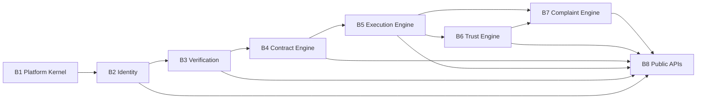

# APP13 Implementation Roadmap

**Version:** 1.0  
**Status:** Approved for implementation planning  
**Last updated:** June 20, 2026  
**Authority:** Subordinate to [Core Principles v1](./APP13-Core-Principles-v1.md) · [MVP Scope v1](./APP13-MVP-Scope-v1.md) · [Roadmap v1](./APP13-Roadmap-v1.md)  
**Depends on:** All PASS-reviewed architecture artifacts (see §Approved baseline)

---

## Document purpose

This roadmap defines the **MVP backend implementation sequence** in eight build phases (B1–B8). Each phase has a goal, deliverables, dependencies, effort estimate, and exit criteria.

**Audience:** Engineering, product, QA, DevOps.  
**Scope:** Phase 1 MVP backend only — responsive web client and infrastructure are parallel tracks; this document owns **server-side engine implementation**.

**Constitutional chain (every phase must preserve):**

```
Action → Contract → Execution (Milestone + Evidence + Attestation) → Trust → Complaint
```

**Effort convention:** Engineer-weeks (EW) = one full-time backend engineer for one week. Estimates assume a senior engineer familiar with the approved docs, PostgreSQL, and modular monolith patterns. Parallel work (e.g. DevOps, QA) is noted but not included in EW totals.

---

## Approved baseline

All phases implement specifications that have passed architecture review:

| Artifact | Review | Role |
|----------|:------:|------|
| [PostgreSQL Schema v1.1](../database/migrations/) | [PASS](./architecture/APP13-PostgreSQL-v1.1-Review.md) | Persistence |
| [Database Architecture v1.1](./architecture/APP13-Database-Architecture-v1.1.md) | PASS | Schema ownership |
| [API Architecture v1.1](./architecture/APP13-API-Architecture-v1.1.md) | [PASS](./architecture/APP13-API-v1.1-Review.md) | HTTP + auth model |
| [OpenAPI v1.1](../api/public-v1.yaml) | [PASS](./architecture/APP13-OpenAPI-Review-v1.md) | Public + internal contracts |
| [Backend Architecture v1](./architecture/APP13-Backend-Architecture-v1.md) | [PASS](./architecture/APP13-Backend-Architecture-v1-Review.md) | Runtime model |
| [Contract Engine v1](./APP13-Contract-Engine-v1.md) | Spec | CA-1–CA-8 |
| [Trust Engine v1.1](./APP13-Trust-Engine-v1.1.md) | Spec | Scoring + events |
| [State Machine v1](./APP13-State-Machine-v1.md) | Spec | Transition authority |
| [Permissions Matrix v1](./architecture/04-permissions-matrix.md) | Spec | RBAC |
| [Complaint Lifecycle v1](./architecture/06-complaint-lifecycle.md) | Spec | EL-1–EL-8 |
| [Action Taxonomy v1](./APP13-Action-Taxonomy-v1.md) | Spec | 15 MVP action types |
| [TEKRR Framework v1](./APP13-TEKRR-Framework-v1.md) | Spec | Dimension rules |
| [User Flows v1](./architecture/02-user-flows.md) | Spec | UF-01–UF-12 |
| ADR-001/002/003 | Ratified | Constitutional constraints |

**Pre-implementation P1 items (from Backend Review):** resolve before the noted phase — `008_operations.sql` (before B4), P0-C2 lock order (before B7), outbox `published_at` ownership (before B6).

---

## Phase dependency graph



**Critical path:** B1 → B2 → B3 → B4 → B5 → B6 → B7 → B8  
**Parallel opportunity:** B6 and B7 share B5; B8 integration can begin incrementally as phases complete.

---

## Summary table

| Phase | Goal (one line) | EW | Cumulative EW |
|-------|-----------------|---:|--------------:|
| **B1** | Runnable platform kernel on PostgreSQL v1.1 | 3 | 3 |
| **B2** | Registration, auth, profiles (T0) | 3 | 6 |
| **B3** | T1/T2 verification + credential review | 3 | 9 |
| **B4** | Action, TEKRR, contract lifecycle | 5 | 14 |
| **B5** | Milestones, evidence, attestations | 5 | 19 |
| **B6** | Trust ingest, recompute, read surfaces | 4 | 23 |
| **B7** | Complaint file → adjudication → outcome | 5 | 28 |
| **B8** | Full OpenAPI surface + E2E + staging | 4 | **32** |

**Calendar estimate (team of 2 backend engineers):** ~16–18 weeks sequential critical path; ~12–14 weeks with B6/B7 overlap after B5.

---

## B1 — Platform Kernel

### Goal

Establish the shared runtime foundation — database connectivity, migrations, authorization framework, transactional outbox, idempotency, async operations, and RFC 7807 errors — so all engines build on a consistent platform layer.

### Deliverables

| # | Deliverable | Reference |
|---|-------------|-----------|
| B1.1 | Repository bootstrap; run migrations `001`–`007` on local/staging | [PostgreSQL v1.1](../database/migrations/) |
| B1.2 | `shared/db` — connection pool, Unit of Work, GUC helpers (`app13.*`) | [Backend Architecture §7.3](./architecture/APP13-Backend-Architecture-v1.md) |
| B1.3 | `platform/errors` — Problem types, engine error codes (P0-S1 codes) | [API Architecture §1.6](./architecture/APP13-API-Architecture-v1.1.md) |
| B1.4 | `platform/idempotency` — 24h TTL store; header enforcement (P0-S5) | OpenAPI `IdempotencyKey` |
| B1.5 | `platform/outbox` — write + poll unpublished `domain_outbox` | [Backend §4](./architecture/APP13-Backend-Architecture-v1.md) |
| B1.6 | `platform/audit` — append `platform.audit_events` | Database Architecture §platform |
| B1.7 | `platform/authz` — RBAC skeleton, resource scope hooks, IDOR-safe 404 | [Permissions Matrix](./architecture/04-permissions-matrix.md) |
| B1.8 | `platform/operations` + migration `008_operations.sql` | [Backend Review P1-B1](./architecture/APP13-Backend-Architecture-v1-Review.md) |
| B1.9 | `GET /health` liveness route | Backend §8.3 |
| B1.10 | Module import lint rules (dependency-cruiser / ArchUnit) | Backend §2.2 |
| B1.11 | Docker Compose: Postgres 16, Redis, MinIO | Backend §8.2 |

### Dependencies

| Dependency | Type |
|------------|------|
| PostgreSQL Schema v1.1 migrations | Document + SQL |
| Backend Architecture v1 (PASS) | Document |
| None (first phase) | — |

### Estimated effort

**3 EW**

### Exit criteria

| # | Criterion | Verification |
|---|-----------|--------------|
| EC-B1.1 | All migrations apply cleanly on empty database | CI migration job green |
| EC-B1.2 | Idempotency: same key + body replays; different body → `409` | Unit + integration test |
| EC-B1.3 | Outbox row written in same TX as test entity insert | Integration test |
| EC-B1.4 | Problem response matches RFC 7807 shape | Contract test |
| EC-B1.5 | Authz rejects unauthenticated request with `401` | Integration test |
| EC-B1.6 | Import lint blocks `domain/` → `api/` upward import | CI gate |
| EC-B1.7 | `GET /health` returns 200 | Smoke test |

---

## B2 — Identity

### Goal

Implement actor registration, authentication, session management, and profile surfaces at **T0** (email/phone verified) — enabling login and profile reads without yet completing KYC tiers.

### Deliverables

| # | Deliverable | Reference |
|---|-------------|-----------|
| B2.1 | `identity/` module — domain, application, infrastructure layers | Backend §2.1 |
| B2.2 | `IdentityRepository` — users, customers, providers, companies | Database Architecture §5.1 |
| B2.3 | Registration — customer + provider (`POST /auth/register/*`) | OpenAPI Auth |
| B2.4 | Login, logout, session, token refresh (P0-E4 rotation) | API Architecture §3 |
| B2.5 | Password reset + email/phone OTP flows | UF-01 |
| B2.6 | `GET/PATCH /me`, customers, providers profiles | P0-E2 |
| B2.7 | Session store (Redis) + JWT issuance (15 min access) | Backend §7.1 |
| B2.8 | Public auth handlers wired (12 auth paths) | OpenAPI Auth tag |
| B2.9 | Tier = T0 gate for action create (email verified) | MVP Scope §1.1 |

### Dependencies

| Dependency | Type |
|------------|------|
| B1 complete (EC-B1.x) | Phase |
| Email/SMS provider credentials (staging) | External |
| Redis (sessions) | Infrastructure |

### Estimated effort

**3 EW**

### Exit criteria

| # | Criterion | Verification |
|---|-----------|--------------|
| EC-B2.1 | **UF-01** completable: register → verify email → login → logout | Manual / E2E stub |
| EC-B2.2 | Token refresh rotates refresh token; reuse revokes sessions | Integration test |
| EC-B2.3 | `GET /me` returns user, tier T0, roles, profile IDs | API test |
| EC-B2.4 | Unverified email blocked from action create (when B4 exists, retro test) | Gate unit test |
| EC-B2.5 | All 12 auth OpenAPI operations return spec-shaped responses | Contract test |

---

## B3 — Verification

### Goal

Implement identity verification tiers **T1** (customer + provider KYC) and **T2** (provider credentials), including KYC webhook, document upload, and admin review queue — unlocking contract acceptance tier gates.

### Deliverables

| # | Deliverable | Reference |
|---|-------------|-----------|
| B3.1 | `VerificationRepository` — verifications, documents, credentials | Database Architecture §5.1 |
| B3.2 | T1 flow — start, complete, webhook (HMAC) | P0-E1, UF-02/UF-03 |
| B3.3 | T2 credential submit + document upload-intent/confirm | API Architecture §5.2 |
| B3.4 | `GET /verifications/me`, `GET /credentials/me` | OpenAPI Verification |
| B3.5 | Tier promotion T0 → T1 → T2 on approval | State Machine / Identity tiers |
| B3.6 | Admin verification queue — list, detail, decision | OpenAPI Admin §verifications |
| B3.7 | KYC provider adapter (sandbox) | MVP Scope §1.2 |
| B3.8 | Emit `verification.approved` → domain outbox | Trust event mapping |
| B3.9 | DB revalidation hook for tier on gated mutations (P0-S1) | API Architecture §4.6 |

### Dependencies

| Dependency | Type |
|------------|------|
| B2 complete (EC-B2.x) | Phase |
| B1 outbox + authz | Phase |
| KYC provider sandbox account | External |
| S3/MinIO for credential documents | Infrastructure |

### Estimated effort

**3 EW**

### Exit criteria

| # | Criterion | Verification |
|---|-----------|--------------|
| EC-B3.1 | **UF-02** customer T1 completable end-to-end (sandbox KYC) | E2E test |
| EC-B3.2 | **UF-03** provider T1 → credential submit → admin approve → T2 | E2E test |
| EC-B3.3 | Unverified provider blocked at T2-required accept (gate unit test with mock) | Unit test |
| EC-B3.4 | KYC webhook rejects invalid HMAC with `401` | Integration test |
| EC-B3.5 | `403 TIER_STALE` when JWT tier ≠ DB tier on gated mutation | Integration test |
| EC-B3.6 | Admin approve/reject writes audit event | Integration test |

---

## B4 — Contract Engine

### Goal

Implement the **Action** entry point (ADR-001), TEKRR decomposition, and full **Contract Engine** lifecycle — generate, party acceptance, async activation, materialization, and completion orchestration — per Contract Engine v1 and State Machine v1.

> Action + TEKRR are delivered in this phase because contract generation requires TEKRR-complete actions (CA-1, P0-CE1).

### Deliverables

| # | Deliverable | Reference |
|---|-------------|-----------|
| B4.1 | `action/` module — create, list, update, transitions | UF-04, UF-05 |
| B4.2 | Action taxonomy loader (15 MVP types deployment artifact) | Action Taxonomy v1, P0-M2 |
| B4.3 | Dimension-scoped TEKRR routes (P0-A1) — no monolithic PATCH | OpenAPI `/tekrr/dimensions/{dim}` |
| B4.4 | Provider invite + accept | UF-05 |
| B4.5 | `contract/` module — generate gates (P0-CE1), CA-8 accept, transitions | Contract Engine §3 |
| B4.6 | `POST /actions/{id}/contract/generate` — CA-1 idempotent return | OpenAPI |
| B4.7 | Contract PDF render job (`contract.pdf.render`) | Backend §6.1 |
| B4.8 | Internal routes: materialize, activate, complete (P0-E3) | Internal OpenAPI |
| B4.9 | `contract-worker` process — materialization | Backend §1.1 |
| B4.10 | Issue-path internal transition (P0-CE2) | API Architecture §6.6 |
| B4.11 | `contract-engine` in-process handlers for activate/complete | Backend §1.1 |
| B4.12 | Contract template pack v1 (15 templates) deployed | Contract Engine templates |
| B4.13 | Public contract handlers (generate, list, detail, transitions, parties, document) | OpenAPI Contracts |
| B4.14 | Async `202` + `operation_id` for activation/completion | API Architecture §6.5 |

### Dependencies

| Dependency | Type |
|------------|------|
| B3 complete (EC-B3.x) — tier gates for accept | Phase |
| B1 operations table (008 migration) | Phase |
| Contract template pack (15 YAML/JSON) | Document artifact |
| Jurisdiction pack US-GENERIC-v1 | Legal artifact |

### Estimated effort

**5 EW**

### Exit criteria

| # | Criterion | Verification |
|---|-----------|--------------|
| EC-B4.1 | **UF-04–07** happy path: action → TEKRR 100% → generate → both parties accept | Integration test |
| EC-B4.2 | Generate rejects when `tekrr_completeness < 100` → `422 TEKRR_INCOMPLETE` | Unit test |
| EC-B4.3 | CA-8: per-party accept in `proposed`; status → `accepted` when all accept | State machine test |
| EC-B4.4 | Activation materializes milestones + attestation shells | DB assertion + internal route test |
| EC-B4.5 | `document_hash_ack` required on accept (CL-5) | API test |
| EC-B4.6 | Second generate for same action returns existing contract (CA-1) | Integration test |
| EC-B4.7 | `contract.activated` event in outbox after activation | Integration test |

---

## B5 — Execution Engine

### Goal

Implement milestone progression, tenancy-bound evidence upload, dimension attestations, and post-completion customer evaluation — governed by CA-2 executable contract states and PostgreSQL execution gates.

### Deliverables

| # | Deliverable | Reference |
|---|-------------|-----------|
| B5.1 | `execution/` module — milestones, evidence, attestations, evaluations | Backend §2.1 |
| B5.2 | `ExecutionRepository` — all execution schema tables | Database Architecture §5.4 |
| B5.3 | Milestone transitions (start, submit, accept, dispute, waive) | State Machine v1 |
| B5.4 | Evidence upload-intent + confirm (P0-S4) — server `storage_key` | OpenAPI Evidence |
| B5.5 | S3 adapter — presigned PUT/GET, hash verification | Backend §8.4 |
| B5.6 | Attestation rating + evidence/milestone linking (Law 13, CK-3) | Contract Engine |
| B5.7 | CA-2 gate — six executable contract states | PostgreSQL v1.1 + API §4.2 |
| B5.8 | Issue create (`POST /issues`) → contract `issue_raised` side effect | P0-CE2, UF-08 |
| B5.9 | Post-completion evaluation (`POST …/evaluation`) | MVP Scope |
| B5.10 | Emit execution domain events to outbox | Backend §4.3 |
| B5.11 | Public execution + evidence OpenAPI handlers | OpenAPI Execution, Evidence |

### Dependencies

| Dependency | Type |
|------------|------|
| B4 complete (EC-B4.x) — active contract with materialized milestones | Phase |
| B1 outbox, authz, idempotency | Phase |
| S3/MinIO bucket configured | Infrastructure |

### Estimated effort

**5 EW**

### Exit criteria

| # | Criterion | Verification |
|---|-----------|--------------|
| EC-B5.1 | **UF-08** milestone submit → accept with required evidence | Integration test |
| EC-B5.2 | Upload-intent rejects client-specified `storage_key` | Security test |
| EC-B5.3 | Evidence confirm rejects hash mismatch | Integration test |
| EC-B5.4 | Non-`PEN` attestation without evidence fails at DB (CK-3) | Integration test |
| EC-B5.5 | Execution blocked when contract `draft` → `409` | Gate test |
| EC-B5.6 | Execution allowed in `issue_raised` / `disputed` per CA-2 | Gate test matrix |
| EC-B5.7 | `execution.evidence.recorded` in outbox on confirm | Integration test |
| EC-B5.8 | Internal complete preconditions satisfied → `contract.completed` event | Integration test (with B4) |

---

## B6 — Trust Engine

### Goal

Implement event-sourced trust — outbox ingest, `trust_score_events` append, projection recompute, snapshots, and public read surfaces — with **no direct score writes** (ADR-003).

### Deliverables

| # | Deliverable | Reference |
|---|-------------|-----------|
| B6.1 | `trust/` module — ingest, projection, infrastructure | Trust Engine v1.1 |
| B6.2 | `TrustRepository` — scores, events, snapshots, corrections | Database Architecture §5.6 |
| B6.3 | `trust-outbox-consumer` worker — `POST …/ingest-from-outbox` only path | P0-T2, ADR-003 |
| B6.4 | JSON Schema validation per event type (Appendix A) | Trust v1.1 P0-6 |
| B6.5 | `trust-worker` — recompute with `app13.trust_recompute=on` | PostgreSQL triggers |
| B6.6 | `trust_score_v1` projection formula | Trust Engine §5 |
| B6.7 | Snapshot append on every recompute (P1-3) | Trust v1.1 §2.3 |
| B6.8 | Public trust handlers — summary, full, events (P0-T1 allowlist), snapshots | OpenAPI Trust |
| B6.9 | Provider appeals — submit + admin resolve | Trust v1.1 §10 |
| B6.10 | `dispute_hold` on `complaint.evidence_gathering` | Trust P0-3 |
| B6.11 | Document outbox `published_at` single-writer rule | Backend Review P1-B3 |
| B6.12 | Internal trust routes + service JWT allowlists | Internal OpenAPI |

### Dependencies

| Dependency | Type |
|------------|------|
| B5 complete (EC-B5.x) — execution events in outbox | Phase |
| B3 verification events (optional for full formula) | Phase |
| Trust event JSON Schemas (`schemas/trust-events/v1/`) | Document artifact |

### Estimated effort

**4 EW**

### Exit criteria

| # | Criterion | Verification |
|---|-----------|--------------|
| EC-B6.1 | No code path outside consumer INSERTs `trust_score_events` | Static analysis + ADR-003 DB trigger test |
| EC-B6.2 | Ingest idempotent on duplicate `idempotency_key` | Integration test |
| EC-B6.3 | Recompute updates `trust_scores` + appends snapshot | Integration test |
| EC-B6.4 | Provider self-view of `/events` excludes `customer_id` (P0-T1) | API test |
| EC-B6.5 | **UF-12** trust summary readable after contract complete | Integration test |
| EC-B6.6 | Malformed event payload rejected at ingest → no trust row | Unit test |
| EC-B6.7 | Score unchanged on `dispute_hold`; flag visible in public summary | Trust P1-4 test |

---

## B7 — Complaint Engine

### Goal

Implement contract-bound dispute resolution — cases, issues, complaints, admin triage/adjudication, EL-1–EL-8 validation, outcome application, and cross-engine effects on contract path and trust.

### Deliverables

| # | Deliverable | Reference |
|---|-------------|-----------|
| B7.1 | `complaint/` module — cases, issues, complaints, adjudication | Complaint Lifecycle v1 |
| B7.2 | `ComplaintRepository` — all complaint schema tables + junctions | Database Architecture §5.5 |
| B7.3 | File complaint — ADR-002 `contract_id`, CK-7 dimensions, EL-6 lock | P0-CM2, EL-6 |
| B7.4 | EL-2 contract status map enforcement | API Architecture §8.3 |
| B7.5 | `complaint-worker` — validate (EL-1–EL-8) | Internal OpenAPI |
| B7.6 | Admin queue — assign, triage, adjudicate (P0-CM1 admin-only) | OpenAPI Admin |
| B7.7 | `complaint-engine` — apply-outcome with GUC + P0-C2 lock order | Backend Review P1-B2 |
| B7.8 | Party transitions — withdraw, accept_mediation; mediation proposals | OpenAPI Complaints |
| B7.9 | Complaint evidence + auto-attached package | UF-10 |
| B7.10 | Cross-engine: contract disputed, attestations, trust recompute trigger | Contract + Trust chain |
| B7.11 | Public complaint/case/issue handlers | OpenAPI tags |
| B7.12 | Adjudicator assignment scope (P0-A2) — 404 on unassigned | API Architecture §4.4 |

### Dependencies

| Dependency | Type |
|------------|------|
| B5 complete (EC-B5.x) — active/completed contracts, evidence | Phase |
| B6 complete (EC-B6.x) — trust recompute on outcome | Phase |
| B4 issue-path transitions | Phase |

### Estimated effort

**5 EW**

### Exit criteria

| # | Criterion | Verification |
|---|-----------|--------------|
| EC-B7.1 | **UF-10** file complaint on active contract with ≥1 dimension | Integration test |
| EC-B7.2 | EL-6: second active complaint same dimension → `422 DUPLICATE_ACTIVE` | Integration test |
| EC-B7.3 | Complaint on `draft` contract → `422 CONTRACT_NOT_ACTIVE` | EL-2 test |
| EC-B7.4 | No public `POST …/adjudication` — admin only (P0-CM1) | OpenAPI + security test |
| EC-B7.5 | **UF-11** admin adjudicate → outcome apply → trust recompute | E2E test |
| EC-B7.6 | P0-C2 lock order — no deadlock under concurrent outcome apply | Stress test |
| EC-B7.7 | Post-completion complaint: contract stays `completed` | State Machine §2.4 |
| EC-B7.8 | `complaint.closed` → outbox → trust ingest | Integration test |

---

## B8 — Public APIs

### Goal

Complete the full OpenAPI v1.1 surface — public, admin, and internal routes — with contract tests, service hardening, staging deployment, and end-to-end validation of **UF-01 through UF-12**.

> Engine logic is built in B2–B7; B8 is the **integration and release gate** — wiring remaining handlers, hardening cross-cutting concerns, and proving the accountable chain in staging.

### Deliverables

| # | Deliverable | Reference |
|---|-------------|-----------|
| B8.1 | All 118 public OpenAPI operations implemented and routed | [OpenAPI Review PASS](./architecture/APP13-OpenAPI-Review-v1.md) |
| B8.2 | All 12 internal OpenAPI operations + service JWT + mTLS | Internal OpenAPI |
| B8.3 | Admin routes complete (21 paths) — users, contracts, metrics, audit | OpenAPI Admin |
| B8.4 | `GET /operations/{id}` polling for all async `202` chains | API Architecture §14 |
| B8.5 | OpenAPI contract tests (Schemathesis / Dredd / equivalent) | OpenAPI v1.1 |
| B8.6 | Signed `X-Actor-Context-Token` on internal worker chains (P0-S3) | API Architecture §2.2 |
| B8.7 | Rate limiting, CORS, CSRF, HSTS per API Architecture §15 | Security |
| B8.8 | Worker containers deployed — contract, complaint, trust-outbox, trust | Backend §8.3 |
| B8.9 | Staging environment — RDS, Redis, S3, ALB | Backend §8.1 |
| B8.10 | E2E test suite — UF-01 through UF-12 | User Flows v1 |
| B8.11 | Observability — structured logs, metrics, `request_id` trace | Backend §8.4 |
| B8.12 | MVP exit criteria EC-1.1–EC-1.8 from Roadmap Phase 1 | [Roadmap v1 §Phase 1](./APP13-Roadmap-v1.md) |

### Dependencies

| Dependency | Type |
|------------|------|
| B2–B7 complete (all EC-Bx.x) | Phases |
| Staging AWS/cloud account | Infrastructure |
| QA E2E test plan | Process |
| Web client (parallel track) for full UF E2E | External team |

### Estimated effort

**4 EW**

### Exit criteria

| # | Criterion | Verification |
|---|-----------|--------------|
| EC-B8.1 | OpenAPI contract test suite ≥95% operation coverage green | CI |
| EC-B8.2 | **UF-01–UF-12** pass in staging without manual DB edits | E2E suite |
| EC-B8.3 | Internal routes reject wrong `service_id` with `403` | Security test |
| EC-B8.4 | Zero `trust_score_events` INSERT outside consumer (ADR-003 audit) | Migration trigger + test |
| EC-B8.5 | Roadmap **EC-1.1** — end-to-end happy path without admin intervention | Staging demo |
| EC-B8.6 | Roadmap **EC-1.2** — zero execution without active contract; zero complaint without `contract_id` | Invariant test suite |
| EC-B8.7 | Roadmap **EC-1.6** — unverified users blocked at accept 100% | Gate test |
| EC-B8.8 | Load smoke: 100 req/min authenticated sustained 10 min without error spike | Load test |
| EC-B8.9 | **Phase 1 gate:** EC-1.1–EC-1.8 from Roadmap v1 documented pass/fail | Release checklist |

---

## Cross-phase user flow mapping

| User flow | Primary phase | Verified in |
|-----------|---------------|-------------|
| UF-01 Registration | B2 | EC-B2.1 |
| UF-02 Customer T1 | B3 | EC-B3.1 |
| UF-03 Provider T1→T2 | B3 | EC-B3.2 |
| UF-04 Initiate action | B4 | EC-B4.1 |
| UF-05 Provider invite | B4 | EC-B4.1 |
| UF-06 TEKRR | B4 | EC-B4.1 |
| UF-07 Contract accept | B4 | EC-B4.1 |
| UF-08 Execution | B5 | EC-B5.1 |
| UF-09 Completion | B4 + B5 | EC-B5.8 |
| UF-10 File complaint | B7 | EC-B7.1 |
| UF-11 Resolve complaint | B7 | EC-B7.5 |
| UF-12 Trust profile | B6 | EC-B6.5 |

---

## Parallel workstreams (non-backend)

These run alongside B1–B8 but are not scoped in EW estimates above:

| Workstream | Overlap | Notes |
|------------|---------|-------|
| **Web client** | B2 onward | Consumes OpenAPI; UF E2E requires both |
| **Contract template pack** | Before B4 | 15 templates from Contract Engine |
| **Action taxonomy deployment** | Before B4 | JSON artifact for B4.2 |
| **Trust event JSON Schemas** | Before B6 | Trust v1.1 Appendix A |
| **KYC provider integration** | B3 | Sandbox → production cutover in B8 |
| **DevOps / IaC** | B1 onward | Staging in B8; local in B1 |

---

## Risk register

| Risk | Phase | Mitigation |
|------|-------|------------|
| KYC provider latency / sandbox limits | B3 | Mock adapter for CI; sandbox SLA agreement |
| Contract PDF render complexity | B4 | Async job + MVP simple template first |
| Trust formula edge cases | B6 | Golden-file tests from Trust Engine v1.1 examples §14 |
| Complaint deadlock (P0-C2) | B7 | Lock order integration test in EC-B7.6 |
| Scope creep (notifications, payments) | B8 | MVP Scope exclusion list; defer P1 |
| Operations table missing | B4 | `008_operations.sql` in B1 deliverables |

---

## Related documents

| Document | Relationship |
|----------|--------------|
| [APP13-Roadmap-v1.md](./APP13-Roadmap-v1.md) | Strategic Phase 1–6; EC-1.x gate |
| [APP13-MVP-Scope-v1.md](./APP13-MVP-Scope-v1.md) | Capability boundary |
| [APP13-Backend-Architecture-v1.md](./architecture/APP13-Backend-Architecture-v1.md) | Runtime model (B1–B9 mapping) |
| [APP13-Backend-Architecture-v1-Review.md](./architecture/APP13-Backend-Architecture-v1-Review.md) | PASS review + P1 items |
| [APP13-OpenAPI-Review-v1.md](./architecture/APP13-OpenAPI-Review-v1.md) | API contract PASS |
| [02-user-flows.md](./architecture/02-user-flows.md) | UF acceptance targets |

---

*Implementation Roadmap v1 — eight phases, 32 engineer-weeks estimated, constitutional chain preserved. Begin B1.*
