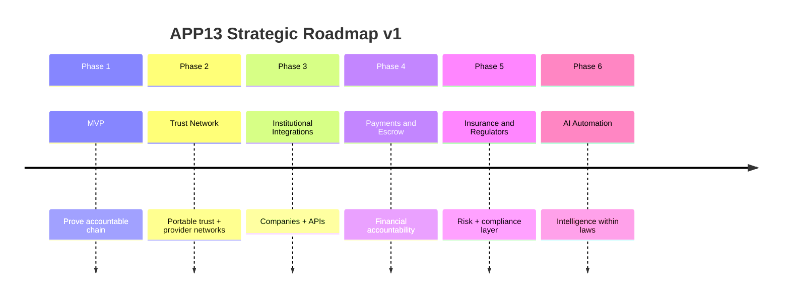
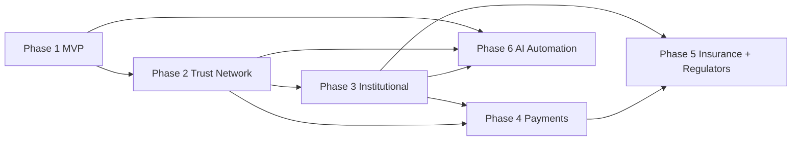

# APP13 Roadmap v1

**Version:** 1.0  
**Status:** Strategic roadmap — Pre-implementation  
**Last updated:** June 19, 2026  
**Authority:** Subordinate to [Core Principles v1](./APP13-Core-Principles-v1.md); Phase 1 bounded by [MVP Scope v1](./APP13-MVP-Scope-v1.md)

---

## Document purpose

This roadmap defines APP13's **six-phase strategic evolution** from MVP through institutional scale, financial infrastructure, regulatory integration, and intelligent automation.

**Explicitly excluded:** code, UI specifications, database design, sprint plans, and resource estimates.

**Governing constraint:** Every phase must preserve the constitutional chain:

```
Action → Contract → Execution → Trust → Complaint
```

No phase may reintroduce marketplace commerce, anonymous reviews, or execution without contracts.

---

## Roadmap overview



| Phase | Name | Primary question answered |
|-------|------|---------------------------|
| **1** | MVP | Does the accountable chain work? |
| **2** | Trust Network | Does trust travel and compound across engagements? |
| **3** | Institutional Integrations | Can organizations rely on APP13 at scale? |
| **4** | Payments and Escrow | Can money follow the contract record? |
| **5** | Insurance and Regulators | Can risk and compliance be externally attested? |
| **6** | AI Automation | Can the platform scale intelligence without breaking neutrality? |

---

## Phase dependency graph



**Critical path:** Phase 1 → 2 → 3 → 4 → 5  
**Parallel track:** Phase 6 begins after Phase 2 foundation; full AI maturity requires Phases 3–5 data.

---

# Phase 1 — MVP

**Timeline intent:** Foundation release  
**Scope reference:** [MVP Scope v1](./APP13-MVP-Scope-v1.md)

## Goals

1. **Prove the accountable chain** end-to-end for Customers and Service Providers.
2. **Validate TEKRR decomposition** across 15 action types in one jurisdiction.
3. **Establish trust scoring** as evidence-based and contract-linked.
4. **Operationalize complaint resolution** with admin adjudication and trust consequences.
5. **Confirm platform positioning** as Professional OS — not marketplace — with early users.

## Features

| Domain | Features |
|--------|----------|
| **Identity** | Registration, login, password reset; T1 customer KYC; T1+T2 provider verification; admin credential review |
| **Profile** | Customer profile; provider professional profile; public trust summary |
| **Action** | 15 action types; TEKRR wizard; provider email invite |
| **Contract** | 15 contract templates; lifecycle (Draft→Proposed→Accepted→Active→Completed); PDF + snapshot; declarative commercial terms |
| **Execution** | Milestone materialization; evidence upload (8 types); customer attestation; issue flagging |
| **Trust** | Trust score v1 (5 components); structured customer evaluation; provider breakdown view |
| **Complaint** | Contract-bound filing; admin triage/adjudication; 15-day SLA; trust impact |
| **Admin** | Verification queue, complaint queue, user suspend, contract lookup, basic metrics |
| **Notifications** | Transactional email + minimal in-app |
| **Access** | Responsive web (English, single jurisdiction) |

## Dependencies

| Dependency | Type | Notes |
|------------|------|-------|
| Core Principles v1 | Document | Constitutional laws ratified |
| TEKRR Framework v1 | Document | Decomposition rules locked |
| Action Taxonomy v1 (15 types) | Document | MVP action subset |
| Contract Engine v1 (15 templates) | Document | Template pack complete |
| Third-party KYC provider | External | T1 automated identity |
| Object storage | External | Evidence and PDF storage |
| Email provider | External | Transactional notifications |
| Legal review (jurisdiction pack) | External | Single template jurisdiction |

**No dependency on:** payments, insurance, government APIs, mobile stores, AI services.

## Exit criteria

| # | Criterion | Measure |
|---|-----------|---------|
| EC-1.1 | End-to-end happy path | Customer + Provider complete Action without admin intervention |
| EC-1.2 | Constitutional invariants | Zero execution without Active contract; zero complaints without contract_id |
| EC-1.3 | Action type coverage | All 15 action types completed ≥1 time in staging/production |
| EC-1.4 | Trust score integrity | Score updates within 24h of completion/complaint; no manual overrides |
| EC-1.5 | Complaint operability | Median resolution ≤15 business days over 30-day window |
| EC-1.6 | Verification gates | Unverified users blocked at contract acceptance 100% of attempts |
| EC-1.7 | Early user validation | ≥50 completed contracts with ≥2 action domains represented |
| EC-1.8 | Platform positioning | No marketplace/discovery features shipped |

**Phase 1 gate:** All EC-1.x pass → Phase 2 authorized.

---

# Phase 2 — Trust Network

**Timeline intent:** Network effects through portable trust — still not a marketplace

## Goals

1. **Make trust portable and actionable** — providers carry verified reputation across engagements.
2. **Enable trust-based discovery boundaries** — invite and referral networks, not open marketplace.
3. **Expand action and contract coverage** without breaking MVP invariants.
4. **Introduce provider–provider and customer repeat engagement** patterns.
5. **Prepare institutional read access** for Phase 3.

## Features

| Domain | Features |
|--------|----------|
| **Trust** | Trust score API (read-only, authenticated); trust history export for provider; confidence bands mature; score appeal workflow (event-level) |
| **Network** | Provider referral links (invite-only); customer repeat engagement shortcut; preferred provider list (customer-private); blocked provider list |
| **Verification** | T3 KYB stub for sole-prop businesses; credential expiry renewal flows; verification certificate export |
| **Action** | Expand to full taxonomy Level 3 (~60 action types); action type variants (L4) for jurisdiction; composite scope notes (still single primary type) |
| **Contract** | Contract amendments with re-acceptance; contract history search for parties; contract certified export (PDF + audit hash) |
| **Execution** | In-app async messaging (contract-scoped); milestone reminders; revision round tracking (creative actions) |
| **Complaint** | Mediation proposal workflow; complaint SLA configurable by action domain; frivolous complaint detection |
| **Profile** | Provider public profile page (by ID/link, not browse index); trust dimension breakdown public |
| **Platform** | Contract lifecycle billing (Stripe Billing); verification fees; second jurisdiction pack |
| **Evaluation** | Full EVAL-{domain}-v1 forms for all domains |

## Dependencies

| Dependency | Type | Notes |
|------------|------|-------|
| Phase 1 complete | Phase gate | All EC-1.x pass |
| ≥50 production contracts | Operational | Trust score confidence |
| Trust score v1 stable | Platform | Before API exposure |
| Stripe Billing | External | Contract + verification fees |
| Expanded template pack | Document | Action taxonomy v1.1 |
| Legal review (amendments) | External | Amendment enforceability |

**Still excluded:** marketplace search, payments/escrow, insurance, government API, native mobile, AI adjudication.

## Exit criteria

| # | Criterion | Measure |
|---|-----------|---------|
| EC-2.1 | Trust portability | Provider trust score consistent across ≥3 contracts; repeat customer rate measurable |
| EC-2.2 | Network engagement | ≥30% of contracts from repeat or referred provider relationships |
| EC-2.3 | Action expansion | ≥30 active action types with ≥1 completed contract each |
| EC-2.4 | Amendment operability | Amendment flow completed without new engagement in ≥10 contracts |
| EC-2.5 | Trust API | Read API live with ≥1 pilot consumer (internal or partner) |
| EC-2.6 | Revenue validation | Contract lifecycle fees collected on ≥80% of activations |
| EC-2.7 | Complaint maturity | Median resolution ≤12 business days; frivolous flag operational |
| EC-2.8 | Constitution compliance | Zero marketplace features; Law 1 and Law 4 audit pass |

**Phase 2 gate:** EC-2.1, EC-2.4, EC-2.6 pass → Phase 3 authorized.

---

# Phase 3 — Institutional Integrations

**Timeline intent:** B2B layer — companies rely on APP13 for contractor accountability

## Goals

1. **Onboard Organization as a first-class actor** with KYB and role-based access.
2. **Enable company-mediated Actions and Contracts** without becoming a staffing marketplace.
3. **Provide institutional trust queries** for due diligence on providers.
4. **Support policy overlays** on company contracts.
5. **Establish webhook/API ecosystem** for enterprise integration.

## Features

| Domain | Features |
|--------|----------|
| **Organization** | Company registration (KYB T3); org admin, contract manager, viewer roles; org member management |
| **Contract** | Company-initiated Actions; company co-signer on contracts; mandatory company policy clause overlays; bulk contract dashboard |
| **Provider network** | Company preferred/blocked provider lists; company endorsement attestation (feeds trust score 3rd-party component) |
| **Trust** | Institutional trust dashboard; bulk provider lookup; trust threshold rules (auto-flag below score) |
| **API** | Trust & execution read API; contract status webhooks; provider verification status API |
| **Action** | Company as beneficiary or sponsor on Actions; asset-linked Actions (property, facility ID) |
| **Execution** | Org viewer read-only on company contract milestones and evidence |
| **Complaint** | Company-filed complaints on behalf of beneficiaries; org notification on disputes |
| **Admin** | Institutional onboarding queue; API key management; usage metering |
| **Compliance** | Audit log export for org subscribers; SOC 2 preparation track |

## Dependencies

| Dependency | Type | Notes |
|------------|------|-------|
| Phase 2 complete | Phase gate | Trust API and amendment stable |
| T3 KYB operational | Platform | From Phase 2 stub → full |
| Trust third-party attestation weight | Framework | TEKRR/trust v1.1 — company endorsement component active |
| ≥3 pilot companies | Commercial | Design partner agreements |
| Enterprise API infrastructure | Platform | Auth, rate limits, versioning |
| Legal review (company contracts) | External | Co-signer liability |

**Still excluded:** payment escrow, insurance API, government portal, AI automation (beyond basic API).

## Exit criteria

| # | Criterion | Measure |
|---|-----------|---------|
| EC-3.1 | Company onboarding | ≥3 companies KYB-verified and active |
| EC-3.2 | Company contracts | ≥25 company-mediated contracts completed |
| EC-3.3 | Policy overlays | ≥1 company policy pack applied on live contracts |
| EC-3.4 | API adoption | ≥2 institutional API consumers in production |
| EC-3.5 | Endorsement signal | Company endorsement feeding trust score on ≥10 providers |
| EC-3.6 | Dashboard operability | Company viewer accesses contract status without support ticket |
| EC-3.7 | Constitution compliance | No staffing marketplace; companies hire through Actions not listings |

**Phase 3 gate:** EC-3.1, EC-3.2, EC-3.4 pass → Phase 4 authorized.

---

# Phase 4 — Payments and Escrow

**Timeline intent:** Financial layer follows the contract — money accountable to evidence

## Goals

1. **Bind payment obligations to contract milestones** without APP13 becoming a payment marketplace.
2. **Introduce escrow hold/release** tied to milestone attestation.
3. **Enable declarative commercial terms to become executable** payment schedules.
4. **Support provider payouts** with platform fee deduction (contract lifecycle + payment rail).
5. **Maintain neutrality** — platform does not set prices.

## Features

| Domain | Features |
|--------|----------|
| **Payments** | Stripe Connect (or equivalent) provider onboarding; customer payment method capture |
| **Escrow** | Milestone-triggered hold; release on M-ACCEPT attestation; dispute freeze |
| **Contract** | Payment schedule binding to milestones; commercial terms enforcement (not just declarative) |
| **Execution** | Payment gate optional per template (hold before Active or before milestone) |
| **Complaint** | Dispute-triggered escrow freeze; partial release on shared-fault adjudication |
| **Trust** | Payment fulfillment as Execution Success signal; dispute rate normalization |
| **Organization** | Company billing accounts; invoicing for org-mediated contracts |
| **Admin** | Payment reconciliation dashboard; refund initiation (linked to complaint outcome) |
| **Reporting** | Transaction ledger; export for accounting; platform fee reporting |
| **Provider** | Payout history; earnings view; tax document prep (1099 track US) |

## Dependencies

| Dependency | Type | Notes |
|------------|------|-------|
| Phase 3 complete | Phase gate | Institutional contracts stable (many payment use cases B2B) |
| Phase 2 revenue | Operational | Billing infrastructure proven |
| Payment processor partnership | External | Stripe Connect marketplace compliance |
| Legal review (escrow, money transmission) | External | Jurisdiction-specific |
| Banking/KYC for payouts | External | Provider Connect onboarding |
| Core Principles review | Document | Confirm Law 4 neutrality preserved with payment rail |

**Still excluded:** insurance, government API, AI adjudication of payments.

## Exit criteria

| # | Criterion | Measure |
|---|-----------|---------|
| EC-4.1 | Payment binding | ≥100 contracts with payment schedule executed |
| EC-4.2 | Escrow integrity | Hold/release matches milestone attestation 100% in audit sample |
| EC-4.3 | Dispute freeze | Escrow frozen on Disputed state; released only on Resolved/Closed |
| EC-4.4 | Provider payouts | ≥90% of eligible payouts within SLA (e.g., 7 days post-acceptance) |
| EC-4.5 | Reconciliation | Platform ledger reconciles to processor dashboard monthly |
| EC-4.6 | Neutrality audit | No commission on service price beyond disclosed platform fees |
| EC-4.7 | Complaint-payment link | ≥5 disputes with correct escrow outcome applied |

**Phase 4 gate:** EC-4.1, EC-4.2, EC-4.5 pass → Phase 5 authorized.

---

# Phase 5 — Insurance and Regulators

**Timeline intent:** External attestation of Risk and Knowledge — regulatory readiness

## Goals

1. **Integrate Insurance Entity** for coverage attestation on high-risk Actions.
2. **Integrate Government Entity** for license sync and authorized record query.
3. **Activate T4 regulated verification tier** for licensed professions.
4. **Enable industry/regulator-configurable complaint SLAs** (per Approval Addendum production target).
5. **Position APP13 as auditable infrastructure** for regulated industries.

## Features

| Domain | Features |
|--------|----------|
| **Insurance** | Insurance Entity actor; coverage attestation API; risk-dimension insurance gate (risk ≥4); insurance rider templates; claim event flag (existence only) |
| **Government** | Government Entity actor; license registry sync (API where available); sanctions/exclusion flags; authorized contract record query; regulatory clause injection for regulated categories |
| **Verification** | T4 regulated tier operational; automated license lookup; insurance standing check |
| **Contract** | Multi-party contracts (Customer + Provider + Insurance/Gov witness); regulated category templates |
| **Risk (TEKRR)** | Coverage confirmation token at M-VERIFY; insurance declaration verified not self-reported |
| **Complaint** | External escalation automation (insurance/gov notification); SLA configurable by industry and regulator |
| **Trust** | Third-party attestation component fully weighted (15%); insurance/gov signals in trust profile |
| **Compliance** | Certified record export for legal/regulatory use; jurisdiction multi-pack |
| **Admin** | Institutional admin for gov/insurance onboarding; query audit log |

## Dependencies

| Dependency | Type | Notes |
|------------|------|-------|
| Phase 4 complete | Phase gate | Financial layer stable for insurable engagements |
| Phase 3 institutional | Platform | Gov/insurance actors extend institutional model |
| Insurance partner agreement | Commercial | ≥1 insurer pilot |
| Government MOU or legal basis | Legal | Query authority defined per jurisdiction |
| License registry APIs | External | Trade-specific availability varies |
| TEKRR/trust v2 | Framework | T4 and third-party weights active |
| Core Principles review | Document | Laws 19–23 compatible with external escalation |

## Exit criteria

| # | Criterion | Measure |
|---|-----------|---------|
| EC-5.1 | Insurance attestation | ≥1 insurer live; ≥25 contracts with verified coverage token |
| EC-5.2 | License sync | ≥1 registry integrated; T4 verification automated for ≥1 trade |
| EC-5.3 | Government query | ≥1 authorized gov query completed with full audit trail |
| EC-5.4 | Regulated contracts | ≥10 T4-regulated category contracts completed |
| EC-5.5 | External escalation | ≥3 complaints escalated to insurance/gov with logged outcome |
| EC-5.6 | Configurable SLA | ≥2 industry SLA profiles in production |
| EC-5.7 | Compliance export | Certified export accepted by legal review for ≥1 use case |

**Phase 5 gate:** EC-5.1 OR EC-5.3 plus EC-5.4 pass → Phase 6 full authorization.

---

# Phase 6 — AI Automation

**Timeline intent:** Scale intelligence within constitutional bounds — assist, never override

## Goals

1. **Reduce friction in Action classification and TEKRR input** without removing human confirmation.
2. **Assist admin operations** (triage, evidence review) without automating adjudication or trust scores.
3. **Improve institutional analytics** through pattern detection on contract and trust data.
4. **Enable proactive risk and compliance signals** from TEKRR and evidence patterns.
5. **Preserve Law 15 and Law 16** — AI assists evidence gathering; trust remains computed from verified events.

## Features

| Domain | Features |
|--------|----------|
| **Action** | AI-suggested action type from natural language description (human confirms); TEKRR field pre-fill from description |
| **Contract** | AI-assisted scope completeness check (flags gaps, does not generate clauses); template recommendation |
| **Evidence** | AI-assisted evidence quality check (blur detection, checklist OCR); anomaly flags for admin |
| **Complaint** | AI triage prioritization; similar-case retrieval for admin; **no** automated adjudication |
| **Trust** | Anomaly detection on trust gaming patterns; Sybil/collusion flags; **no** ML trust score replacement |
| **Institutional** | Portfolio risk dashboard; provider pool analytics; predictive shortage signals (informational) |
| **Support** | Contract-scoped AI help (explains obligations, not legal advice); admin copilot for evidence packages |
| **Automation** | Smart milestone reminders; deadline risk alerts; credential expiry prediction |
| **Mobile** | Native iOS/Android (optional within Phase 6 — access expansion, not AI dependency) |
| **Governance** | AI model versioning; human-in-the-loop requirements documented; bias audit process |

## Dependencies

| Dependency | Type | Notes |
|------------|------|-------|
| Phase 2 complete | Phase gate | Minimum data volume for useful models |
| Phase 3 recommended | Data | Institutional scale improves analytics |
| Phases 4–5 recommended | Data | Financial and regulatory signals enrich risk models |
| ≥500 completed contracts | Operational | Training/evaluation baseline |
| AI provider / model governance | External | Privacy, PII boundaries |
| Core Principles amendment review | Document | Confirm AI features comply with Laws 15, 16, 21 |
| Privacy impact assessment | Legal | Evidence and contract data in AI pipelines |

**Constitutional prohibitions (permanent):**
- AI cannot adjudicate complaints
- AI cannot set or override trust scores
- AI cannot activate contracts without human acceptance
- AI cannot replace TEKRR human confirmation

## Exit criteria

| # | Criterion | Measure |
|---|-----------|---------|
| EC-6.1 | Action suggestion accuracy | ≥85% top-1 action type suggestion accepted on user test cohort |
| EC-6.2 | TEKRR assist adoption | ≥40% of new Actions use AI pre-fill with human edit |
| EC-6.3 | Admin assist efficiency | Complaint triage time reduced ≥20% with AI prioritization |
| EC-6.4 | Trust integrity | Zero trust score computed by ML model; all scores remain formula v1+ |
| EC-6.5 | Evidence assist | AI flags operational on ≥2 evidence types; false positive rate <15% |
| EC-6.6 | Governance | AI model cards published; human override on 100% of adjudications |
| EC-6.7 | Constitution audit | Independent review confirms Laws 5, 14, 15, 16, 21, 22 preserved |

**Phase 6 gate:** EC-6.4 and EC-6.7 pass (non-negotiable); other EC-6.x are maturity targets.

---

## Cross-phase capability matrix

| Capability | P1 | P2 | P3 | P4 | P5 | P6 |
|------------|:--:|:--:|:--:|:--:|:--:|:--:|
| Registration & T1/T2 verify | ● | ● | ● | ● | ● | ● |
| 15 → 60+ action types | 15 | 60+ | 60+ | 60+ | 60+ | 60+ |
| Two-party contracts | ● | ● | ● | ● | | |
| Multi-party contracts | | | ○ | ○ | ● | ● |
| Trust score (formula) | ● | ● | ● | ● | ● | ● |
| Trust API | | ● | ● | ● | ● | ● |
| Company actor | | ○ | ● | ● | ● | ● |
| Payments | | | | ● | ● | ● |
| Escrow | | | | ● | ● | ● |
| Insurance attestation | | | | | ● | ● |
| Government query | | | | | ● | ● |
| T4 regulated tier | | | | | ● | ● |
| AI assist | | | | | | ● |
| Native mobile | | | | | | ○ |
| Marketplace discovery | ✗ | ✗ | ✗ | ✗ | ✗ | ✗ |

● = in phase · ○ = optional/partial · ✗ = permanently excluded (Core Principles)

---

## Revenue evolution by phase

| Phase | Primary revenue |
|-------|-----------------|
| 1 | None or deferred (validation) |
| 2 | Contract lifecycle fees + verification fees |
| 3 | Institutional subscriptions + API access |
| 4 | Payment rail fees (on disclosed platform fee model) |
| 5 | Insurance integration fees + compliance export |
| 6 | AI-assisted tier pricing (institutional analytics) |

Revenue never from: service commissions, lead sales, pay-for-ranking, data brokering (Law 4).

---

## Risk register (strategic)

| Risk | Phase | Mitigation |
|------|-------|------------|
| Scope creep into marketplace | All | MVP Scope + Core Principles; Phase gate reviews |
| Trust score gaming | 2+ | Collusion detection (Phase 6); event-level appeals |
| Money transmission compliance | 4 | Legal review; licensed payment partner |
| Regulator access overreach | 5 | MOU-scoped queries; audit log |
| AI replaces human accountability | 6 | Constitutional prohibitions; EC-6.7 audit |
| Premature Phase 4 before trust proven | 4 | Phase 2 gate requires trust portability |

---

## Phase gate summary

| Gate | Required exit criteria (minimum) |
|------|----------------------------------|
| **P1 → P2** | EC-1.1, EC-1.2, EC-1.7, EC-1.8 |
| **P2 → P3** | EC-2.1, EC-2.4, EC-2.6 |
| **P3 → P4** | EC-3.1, EC-3.2, EC-3.4 |
| **P4 → P5** | EC-4.1, EC-4.2, EC-4.5 |
| **P5 → P6** | EC-5.4 + (EC-5.1 or EC-5.3) |
| **P6 complete** | EC-6.4, EC-6.7 |

---

## Related documents

| Document | Relationship |
|----------|--------------|
| [Core Principles v1](./APP13-Core-Principles-v1.md) | Non-negotiable across all phases |
| [MVP Scope v1](./APP13-MVP-Scope-v1.md) | Phase 1 strict boundary |
| [TEKRR Framework v1](./APP13-TEKRR-Framework-v1.md) | Evolves v1.1+ in Phases 2–5 |
| [Action Taxonomy v1](./APP13-Action-Taxonomy-v1.md) | Expands Phase 2 |
| [Contract Engine v1](./contract-engine/CONTRACT-ENGINE-v1.md) | Expands each phase |
| [Approval Addendum v1.1](./architecture/APPROVAL-ADDENDUM-v1.1.md) | Operational parameters |

---

**Status:** Strategic roadmap v1 — awaiting stakeholder sign-off

*No code. No UI. No database. Strategic phases only.*

---

*End of document.*
