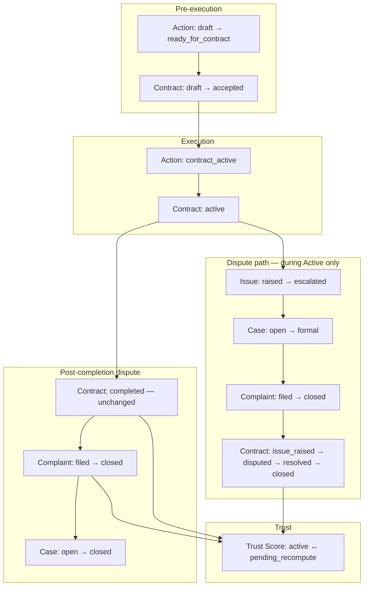
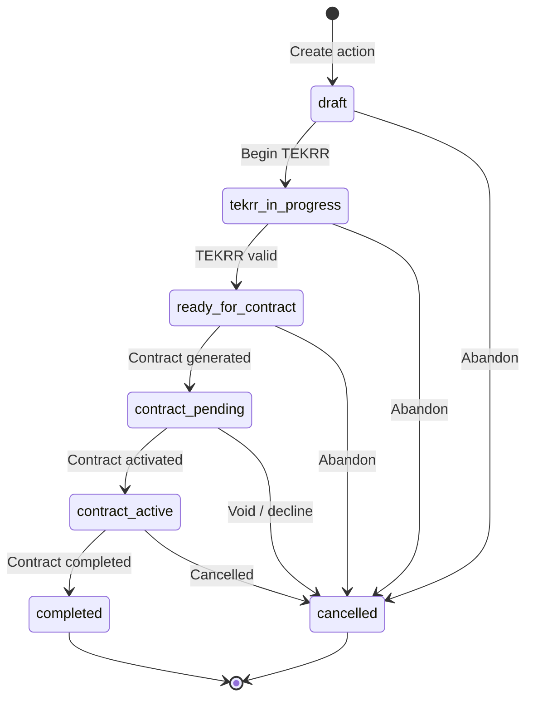
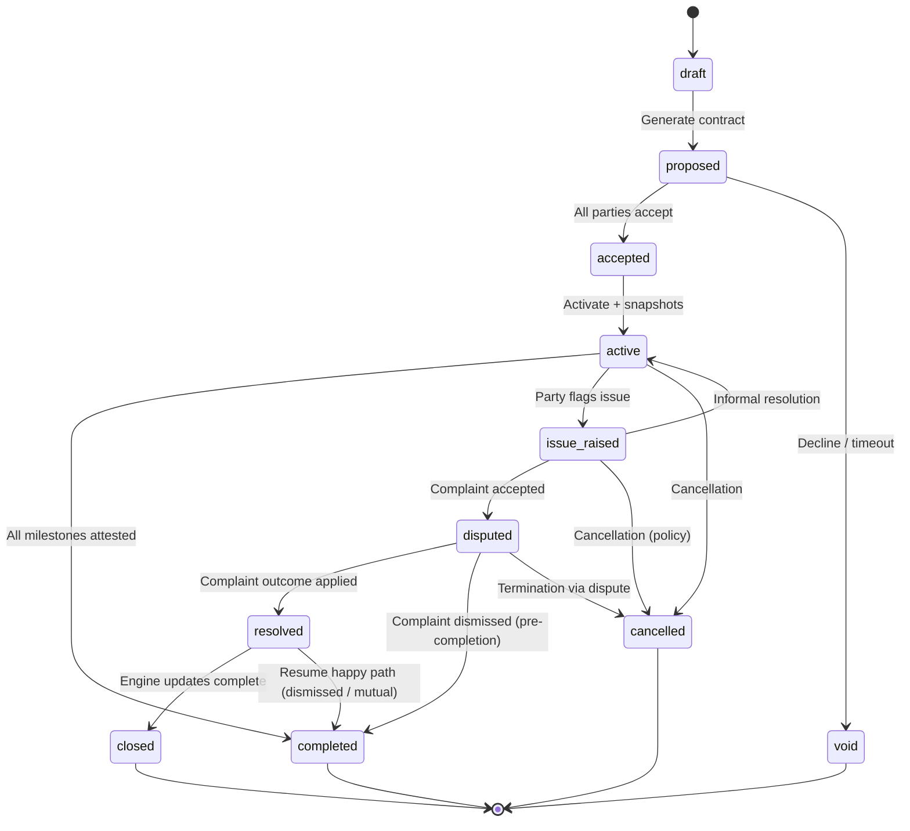
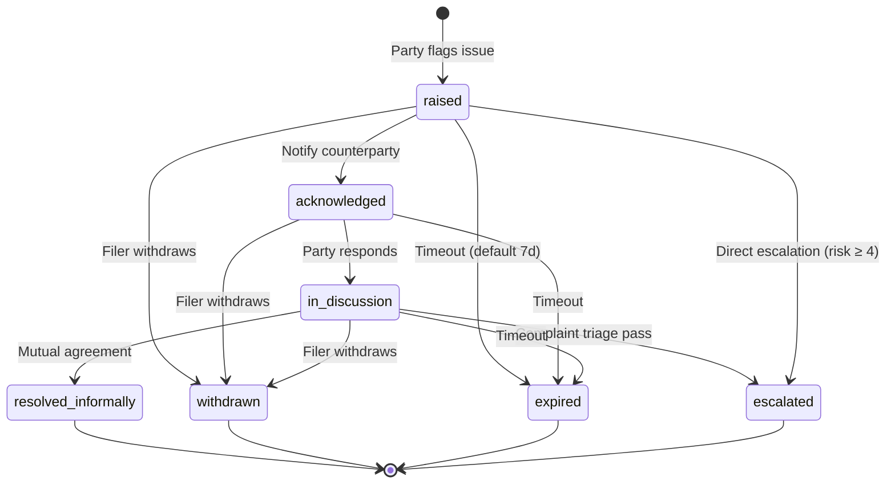
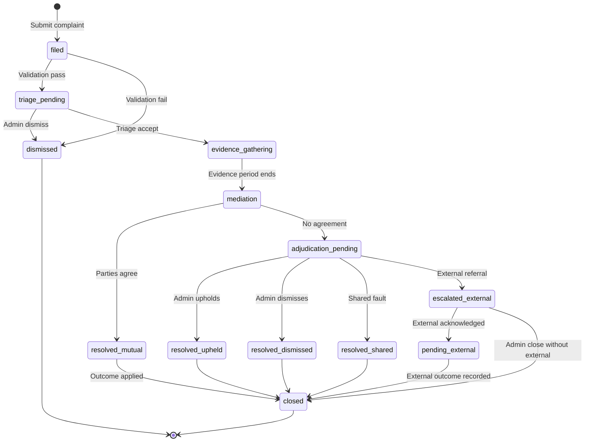
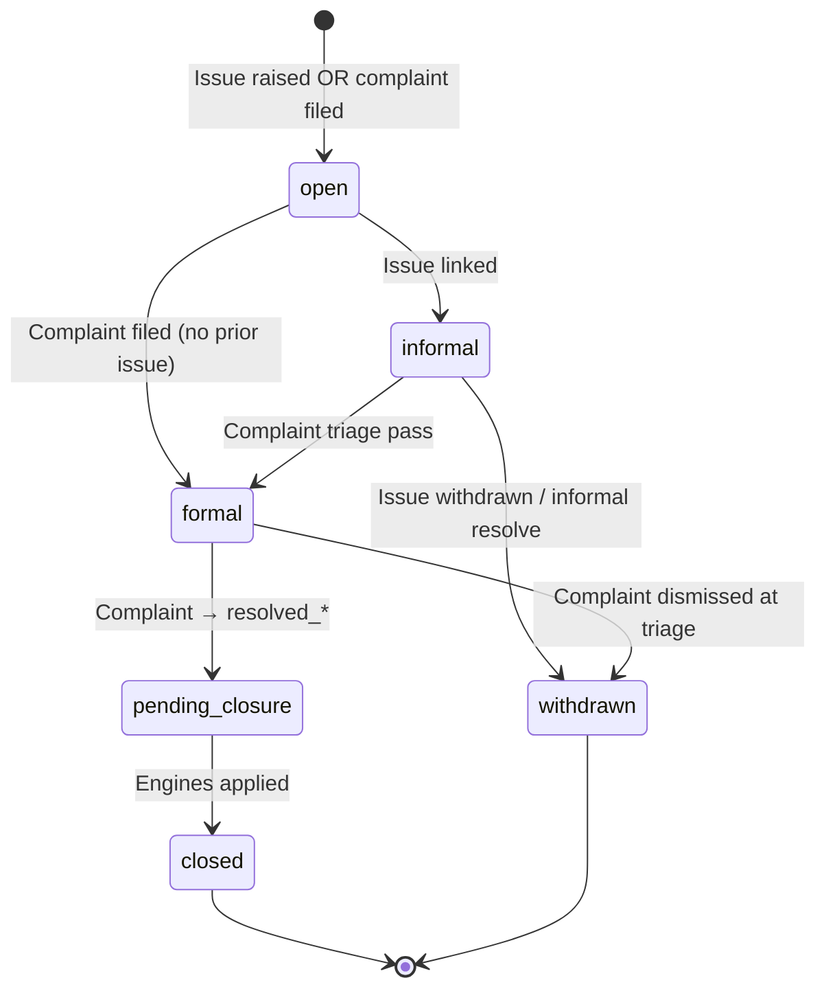
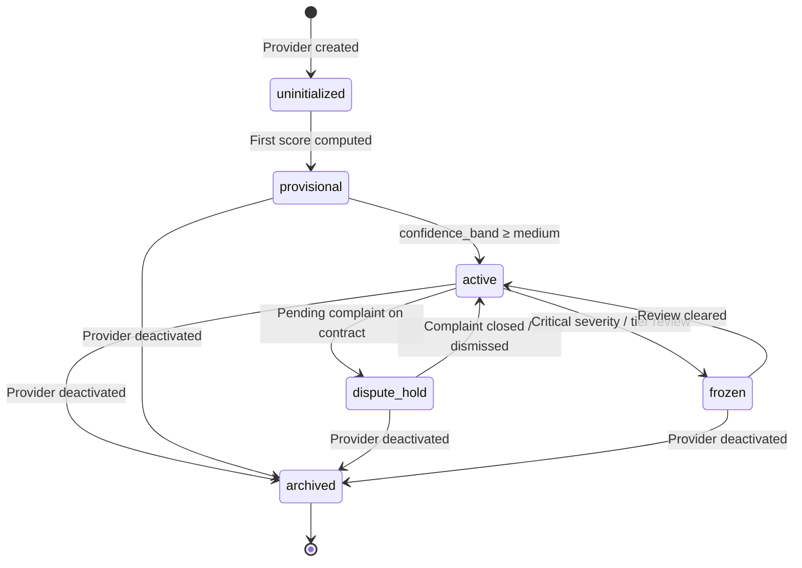

# APP13 State Machine v1

**Version:** 1.0  
**Status:** Draft — Pre-implementation  
**Last updated:** June 19, 2026  
**Depends on:** [Core Principles v1](./APP13-Core-Principles-v1.md) · [Approval Addendum v1.1](./architecture/APPROVAL-ADDENDUM-v1.1.md) · [Entity Model v1](./APP13-Entity-Model-v1.md) · [Contract Lifecycle v1](./architecture/05-contract-lifecycle.md) · [Complaint Lifecycle v1](./architecture/06-complaint-lifecycle.md)

---

## Document purpose

This document defines the **authoritative lifecycle state machines** for six platform entities:

| Entity | Owner engine | Role |
|--------|--------------|------|
| **Action** | Action Engine | Classified professional work instance |
| **Contract** | Contract Engine | Legal binding of an Action |
| **Issue** | Contract Engine (with Action freeze) | Pre-formal execution flag |
| **Complaint** | Complaint Engine | Formal dispute record |
| **Case** | Complaint Engine (operational) | Dispute file and SLA container |
| **Trust Score** | Identity Engine | Provider credibility record |

**Audience:** Engineering, architecture, QA, trust operations.  
**Scope:** MVP-aligned with forward-compatible hooks for Phase 2+.

---

## Conventions

| Convention | Rule |
|------------|------|
| State codes | Snake_case strings in application layer |
| Transition | Atomic; one authoritative engine per entity |
| History | Every transition append-only to `*_status_history` (Law 24) |
| Terminal | No outbound transitions except admin correction audit |
| Forbidden | Explicitly listed; attempts return `409 Conflict` |
| Sync | Cross-entity effects via domain events — never direct cross-table writes |

### Document hierarchy

Where this document conflicts with older architecture lifecycle docs, **[Approval Addendum v1.1](./architecture/APPROVAL-ADDENDUM-v1.1.md) contract states take precedence** for Contract. Complaint states follow [Complaint Lifecycle v1](./architecture/06-complaint-lifecycle.md).

---

## Cross-entity relationship



**Key rule:** Contract **Issue path** applies only while Contract is `active` (or equivalent pre-completion execution). Post-completion complaints run through Complaint + Case without moving Contract off `completed`.

---

## 1. Action

**Owner:** Action Engine  
**Table:** `actions`  
**Purpose:** Track the lifecycle of a classified professional work instance from creation through completion or cancellation.

### 1.1 States

| State | Code | Description | Execution permitted |
|-------|------|-------------|:-------------------:|
| Draft | `draft` | Action created; TEKRR not started | No |
| TEKRR in progress | `tekrr_in_progress` | TEKRR decomposition underway | No |
| Ready for contract | `ready_for_contract` | TEKRR 100% complete; contract may generate | No |
| Contract pending | `contract_pending` | Contract generated; awaiting acceptance | No |
| Contract active | `contract_active` | Bound Contract is `active`; milestones trackable | Yes |
| Completed | `completed` | Contract `completed`; action closed | No |
| Cancelled | `cancelled` | Abandoned or terminated before completion | No |

### 1.2 State diagram



### 1.3 Allowed transitions

| From | To | Trigger | Actor | Preconditions |
|------|-----|---------|-------|---------------|
| — | `draft` | Create action | Customer | Customer ≥ T1; valid `action_code` |
| `draft` | `tekrr_in_progress` | Start TEKRR input | Customer / Provider | Provider linked or invite sent |
| `tekrr_in_progress` | `ready_for_contract` | TEKRR validation pass | System | `tekrr_completeness = 100` |
| `ready_for_contract` | `contract_pending` | Contract generated | Contract Engine | Tier gates pass |
| `contract_pending` | `contract_active` | Contract activated | Contract Engine | Contract → `active` |
| `contract_active` | `completed` | Contract completed | Contract Engine | Contract → `completed` |
| `contract_active` | `cancelled` | Cancellation | Party / Admin | Per cancellation policy |
| `draft` | `cancelled` | Abandon | Customer | No active contract |
| `tekrr_in_progress` | `cancelled` | Abandon | Customer | No active contract |
| `ready_for_contract` | `cancelled` | Abandon | Customer | No active contract |
| `contract_pending` | `cancelled` | Decline / void | Party / System | Contract → `void` or `cancelled` |

### 1.4 Forbidden transitions

| From | To | Reason |
|------|-----|--------|
| `draft` | `contract_active` | Must complete TEKRR and contract acceptance |
| `draft` | `completed` | No execution without contract |
| `tekrr_in_progress` | `contract_pending` | TEKRR incomplete |
| `ready_for_contract` | `contract_active` | Contract not yet accepted |
| `contract_pending` | `completed` | Contract never activated |
| `contract_active` | `draft` | No backward to pre-contract |
| `contract_active` | `tekrr_in_progress` | TEKRR locked after contract generation |
| `completed` | any | Terminal — new action required |
| `cancelled` | any | Terminal — new action required |
| any | `contract_active` | Unless Contract Engine confirms `active` (Law 2) |

### 1.5 Terminal states

| State | Terminal type | Notes |
|-------|---------------|-------|
| `completed` | Success | Trust events emitted; complaint window may be open on Contract |
| `cancelled` | Failure / abandon | May emit cancellation trust signal |

### 1.6 Cross-entity sync

| Contract state | Action state |
|----------------|--------------|
| — (none) | `draft`, `tekrr_in_progress`, `ready_for_contract` |
| `draft`, `proposed`, `accepted` | `contract_pending` |
| `active`, `issue_raised`, `disputed`, `resolved` | `contract_active` |
| `completed`, `closed` | `completed` |
| `void`, `cancelled` | `cancelled` |

**Invariant A-1:** Action Engine does not permit milestone or evidence operations unless Action = `contract_active` AND Contract = `active` (or issue-path execution freeze rules apply).

---

## 2. Contract

**Owner:** Contract Engine  
**Table:** `contracts`  
**Purpose:** Govern legal binding, acceptance, execution permission, and dispute overlay for an Action.

### 2.1 States

#### Primary path

| State | Code | Description | Execution permitted |
|-------|------|-------------|:-------------------:|
| Draft | `draft` | Contract record created; document not yet proposed | No |
| Proposed | `proposed` | Contract generated; awaiting party review / acceptance | No |
| Accepted | `accepted` | All parties accepted; pending activation | No |
| Active | `active` | Execution permitted; milestones materialized | Yes |
| Completed | `completed` | All milestones attested; complaint window may be open | No |

#### Issue path (during Active execution only)

| State | Code | Description | Execution permitted |
|-------|------|-------------|:-------------------:|
| Issue raised | `issue_raised` | Party flagged milestone/dimension; partial freeze | Limited |
| Disputed | `disputed` | Formal Complaint accepted; Complaint Engine active | Frozen per dimension |
| Resolved | `resolved` | Adjudication or mutual resolution applied | No |
| Closed | `closed` | Issue path terminal; trust updated | No |

#### Terminal (non-issue)

| State | Code | Description |
|-------|------|-------------|
| Void | `void` | Never activated — declined or acceptance expired |
| Cancelled | `cancelled` | Terminated before completion |

### 2.2 State diagram



### 2.3 Allowed transitions

| From | To | Trigger | Actor | Preconditions |
|------|-----|---------|-------|---------------|
| — | `draft` | Create contract record | Contract Engine | Action `ready_for_contract` |
| `draft` | `proposed` | Publish contract | Contract Engine | Document hash stored |
| `proposed` | `accepted` | All required acceptances | Parties | Tier gates at acceptance |
| `proposed` | `void` | Decline or timeout | Party / System | Default timeout: 7 days |
| `accepted` | `active` | Activate | Contract Engine | Snapshots stored; milestones created |
| `active` | `completed` | Completion attested | Contract Engine | No blocking complaints; all blocking milestones done |
| `active` | `issue_raised` | Issue flagged | Party | Contract `active`; valid milestone/dimension |
| `active` | `cancelled` | Cancellation | Party / Admin | Per policy |
| `issue_raised` | `active` | Informal resolution | Parties | Issue withdrawn or resolved; freeze released |
| `issue_raised` | `disputed` | Complaint triage pass | Complaint Engine | Linked Case + Complaint accepted |
| `issue_raised` | `cancelled` | Cancellation | Party / Admin | Per policy |
| `disputed` | `resolved` | Complaint adjudicated | Complaint Engine | Outcome recorded |
| `disputed` | `completed` | Complaint dismissed | Complaint Engine | Pre-completion; no blocking issues |
| `disputed` | `cancelled` | Termination | Admin | Adjudication terminates contract |
| `resolved` | `closed` | Outcome applied | System | Trust + attestation updates complete |
| `resolved` | `completed` | Resume completion | System | Dismissed / mutual; milestones satisfied |

### 2.4 Forbidden transitions

| From | To | Reason |
|------|-----|--------|
| `draft` | `active` | Must pass through `proposed` → `accepted` |
| `proposed` | `active` | Acceptance incomplete |
| `void` | any | Terminal — new contract required |
| `cancelled` | any | Terminal |
| `closed` | any | Terminal |
| `completed` | `active` | No reactivation of completed contract (MVP) |
| `completed` | `issue_raised` | Post-completion uses Complaint-only path |
| `completed` | `disputed` | Post-completion: Contract stays `completed` |
| `issue_raised` | `completed` | Must resolve issue path or return to `active` first |
| `active` | `disputed` | Must pass through `issue_raised` OR direct Complaint filing creates Case first (see §4) |
| `draft` / `proposed` | `issue_raised` | No execution — no issues |
| any pre-`active` | `completed` | No completion without activation |
| `accepted` | `issue_raised` | Not yet executing |

**Note:** Post-completion complaints do **not** transition Contract to `disputed`. Complaint and Case lifecycles run independently while Contract remains `completed`.

### 2.5 Terminal states

| State | Terminal type | Notes |
|-------|---------------|-------|
| `completed` | Success (primary path) | `complaint_window_ends_at` set |
| `closed` | Success (issue path) | After `resolved`; trust updated |
| `void` | Abandon | Never executed |
| `cancelled` | Termination | Fault party may be recorded |

### 2.6 Cross-entity sync

| Event | Contract transition | Action transition | Case / Complaint |
|-------|--------------------|--------------------|------------------|
| Issue flagged | `active` → `issue_raised` | stays `contract_active` | Case → `open`; Issue → `raised` |
| Complaint triage pass (during Active) | `issue_raised` → `disputed` | stays `contract_active` | Case → `formal`; Complaint → `evidence_gathering` |
| Complaint filed (post-completion) | stays `completed` | stays `completed` | Case → `formal`; Complaint → `evidence_gathering` |
| Complaint closed | `disputed` → `resolved` → `closed` OR → `completed` | → `completed` if applicable | Case → `closed` |

**Invariant C-1:** No milestone execution unless Contract = `active` (Law 5).  
**Invariant C-2:** TEKRR snapshot immutable after `active` (Law 8).  
**Invariant C-3:** Contract Engine is authoritative for Contract status (Law 23).

---

## 3. Issue

**Owner:** Contract Engine (Action Engine applies freeze)  
**Table:** `issues` *(introduced in State Machine v1; not yet in Entity Model v1)*  
**Purpose:** Record a **pre-formal** execution flag on an active Contract — the first step of Law 23 before Complaint Engine activation.

### 3.1 States

| State | Code | Description | Dimension freeze |
|-------|------|-------------|:----------------:|
| Raised | `raised` | Party flagged milestone and/or TEKRR dimension | Partial — flagged scope |
| Acknowledged | `acknowledged` | Counterparty notified; response window open | Partial |
| In discussion | `in_discussion` | Parties attempting informal resolution | Partial |
| Escalated | `escalated` | Formal Complaint filed and accepted | Full per dimension |
| Resolved informally | `resolved_informally` | Resolved without Complaint | Released |
| Withdrawn | `withdrawn` | Filer withdrew the flag | Released |
| Expired | `expired` | No escalation within policy window | Released |

### 3.2 State diagram



### 3.3 Allowed transitions

| From | To | Trigger | Actor | Preconditions |
|------|-----|---------|-------|---------------|
| — | `raised` | Flag milestone/dimension | Contract party | Contract = `active`; valid scope |
| `raised` | `acknowledged` | Notification delivered | System | Counterparty exists |
| `acknowledged` | `in_discussion` | Counterparty responds | Party | — |
| `raised` | `in_discussion` | Both parties engage | Party | — |
| `in_discussion` | `resolved_informally` | Mutual resolution recorded | Parties | Agreement logged |
| `in_discussion` | `escalated` | Complaint triage pass | Complaint Engine | Complaint linked to Issue |
| `raised` | `escalated` | Immediate escalation | Party / System | `risk_level ≥ 4` OR template requires |
| `raised` | `withdrawn` | Withdraw flag | Filer | Before escalation |
| `acknowledged` | `withdrawn` | Withdraw flag | Filer | Before escalation |
| `in_discussion` | `withdrawn` | Withdraw flag | Filer | Before escalation |
| `raised` | `expired` | Escalation window elapsed | System | Default: 7 business days |
| `acknowledged` | `expired` | Escalation window elapsed | System | — |
| `in_discussion` | `expired` | Escalation window elapsed | System | — |

### 3.4 Forbidden transitions

| From | To | Reason |
|------|-----|--------|
| — | `raised` | Contract not `active` |
| — | `raised` | Post-completion (use Complaint directly) |
| `escalated` | any | Terminal — Issue absorbed into Complaint |
| `resolved_informally` | any | Terminal |
| `withdrawn` | any | Terminal |
| `expired` | any | Terminal |
| any | `raised` | One active Issue per `(contract_id, dimension)` (EL-6 analog) |
| `escalated` | `in_discussion` | No de-escalation to informal after Complaint filed |

### 3.5 Terminal states

| State | Terminal type | Contract effect |
|-------|---------------|-----------------|
| `resolved_informally` | Success | Contract → `active` from `issue_raised` |
| `withdrawn` | Abandon | Contract → `active` from `issue_raised` |
| `expired` | Timeout | Contract → `active`; audit flag |
| `escalated` | Handoff | Issue frozen; Complaint owns further lifecycle |

### 3.6 Cross-entity sync

| Issue transition | Contract | Case |
|------------------|----------|------|
| → `raised` | `active` → `issue_raised` | Case → `open` |
| → `escalated` | stays / → `disputed` | Case → `formal` |
| → `resolved_informally` / `withdrawn` / `expired` | `issue_raised` → `active` | Case → `closed` (no complaint) |

**Invariant I-1:** Every Issue requires `contract_id`, `filed_by_user_id`, and ≥1 TEKRR dimension or milestone reference.  
**Invariant I-2:** No shadow dispute process — informal resolution must be recorded or Issue expires (Law 23).

---

## 4. Complaint

**Owner:** Complaint Engine  
**Table:** `complaints`  
**Purpose:** Formal dispute bound to a Contract and TEKRR dimension(s); drives adjudication, attestation updates, and trust penalties.

### 4.1 States

| State | Code | Description | Contract impact (during Active) |
|-------|------|-------------|--------------------------------|
| Filed | `filed` | Submitted; pending validation | None yet |
| Triage pending | `triage_pending` | In admin validation queue | None yet |
| Dismissed | `dismissed` | Failed eligibility or admin dismiss | None |
| Evidence gathering | `evidence_gathering` | Parties submitting evidence | Dimension(s) frozen |
| Mediation | `mediation` | Mutual resolution period | Frozen |
| Adjudication pending | `adjudication_pending` | Awaiting admin decision | Frozen |
| Resolved (mutual) | `resolved_mutual` | Parties agreed | Outcome pending apply |
| Resolved (upheld) | `resolved_upheld` | Violation confirmed | Outcome pending apply |
| Resolved (dismissed) | `resolved_dismissed` | No violation found | Outcome pending apply |
| Resolved (shared) | `resolved_shared` | Partial fault | Outcome pending apply |
| Escalated external | `escalated_external` | Referred externally | Frozen / pending |
| Pending external | `pending_external` | Awaiting external outcome | Frozen |
| Closed | `closed` | All engine updates complete | Contract may complete |

### 4.2 State diagram



### 4.3 Allowed transitions

| From | To | Trigger | Actor | Preconditions |
|------|-----|---------|-------|---------------|
| — | `filed` | Submit complaint | Contract party | Authenticated; `contract_id` valid |
| `filed` | `triage_pending` | System validation pass | System | Contract exists |
| `filed` | `dismissed` | System validation fail | System | Eligibility failed (EL-1–EL-8) |
| `triage_pending` | `dismissed` | Admin dismiss | Admin | Invalid / spam / duplicate |
| `triage_pending` | `evidence_gathering` | Triage accept | Admin | ≤ 2 business days |
| `evidence_gathering` | `mediation` | Evidence period ends | System | 5 business days elapsed |
| `mediation` | `resolved_mutual` | Both accept proposal | Parties | Agreement recorded |
| `mediation` | `adjudication_pending` | Mediation expires | System | No agreement |
| `adjudication_pending` | `resolved_upheld` | Admin decision | Admin | — |
| `adjudication_pending` | `resolved_dismissed` | Admin decision | Admin | — |
| `adjudication_pending` | `resolved_shared` | Admin decision | Admin | — |
| `adjudication_pending` | `escalated_external` | External referral | Admin | Risk / regulatory trigger |
| `escalated_external` | `pending_external` | External acknowledged | Admin | — |
| `pending_external` | `closed` | External outcome | Admin | — |
| `escalated_external` | `closed` | Admin close | Admin | Best available evidence |
| `resolved_*` | `closed` | Outcome applied | System | Attestation + trust updated |

### 4.4 Forbidden transitions

| From | To | Reason |
|------|-----|--------|
| — | `filed` | Without `contract_id` (Law 19) |
| — | `filed` | Without ≥1 TEKRR dimension (Law 20) |
| `filed` | `evidence_gathering` | Must pass triage |
| `dismissed` | any | Terminal |
| `closed` | any | Terminal |
| any `resolved_*` | `filed` | No reopen (MVP); new complaint if eligible |
| `evidence_gathering` | `adjudication_pending` | Must pass through mediation (MVP) |
| `triage_pending` | `mediation` | Must enter evidence_gathering first |
| any active | `filed` | Duplicate active complaint on same `(contract_id, dimension)` (EL-6) |
| `adjudication_pending` | `evidence_gathering` | No backward to evidence |
| any | `closed` | From `resolved_*` only after engine apply (PL-5) |

### 4.5 Terminal states

| State | Terminal type | Trust impact |
|-------|---------------|--------------|
| `dismissed` | Reject | Neutral (frivolous pattern tracked) |
| `closed` | Resolved | Trust updated on close (Law 22) |

**Resolved substates** (`resolved_mutual`, `resolved_upheld`, `resolved_dismissed`, `resolved_shared`) are **pre-terminal** — they transition to `closed` after Action and Identity engines apply outcomes.

### 4.6 Cross-entity sync

| Complaint transition | Contract (during Active) | Contract (post-completion) | Case | Trust Score |
|----------------------|--------------------------|----------------------------|------|-------------|
| → `evidence_gathering` | → `disputed` (if not already) | stays `completed` | → `formal` | → `dispute_hold` on provider |
| → `closed` | → `resolved` → `closed` OR → `completed` | stays `completed` | → `closed` | Recompute triggered |
| → `dismissed` | → `active` if was `issue_raised` | stays `completed` | → `closed` | Release hold |

**Invariant PL-1:** Trust score update only after Complaint → `closed` (PL-6).  
**Invariant PL-2:** Dimension freeze before `evidence_gathering` (PL-3).

---

## 5. Case

**Owner:** Complaint Engine (operational)  
**Table:** `cases` *(introduced in State Machine v1)*  
**Purpose:** **Dispute file container** — one operational record per dispute thread on a Contract, providing `case_number`, SLA tracking, and admin queue routing. Wraps optional Issue and required Complaint.

**Relationship:**

```
Case 1 ──0..1──▶ Issue
Case 1 ──0..1──▶ Complaint   (required for formal path; optional for informal-only)
Case N ──1──────▶ Contract
```

### 5.1 States

| State | Code | Description | SLA clock |
|-------|------|-------------|-----------|
| Open | `open` | Case file created | Started |
| Informal | `informal` | Issue active; no Complaint yet | Running |
| Formal | `formal` | Complaint lifecycle active | Running |
| Pending closure | `pending_closure` | Outcome determined; applying engine updates | Paused |
| Closed | `closed` | All side effects complete | Stopped |
| Withdrawn | `withdrawn` | Closed without formal resolution | Stopped |

### 5.2 State diagram



### 5.3 Allowed transitions

| From | To | Trigger | Actor | Preconditions |
|------|-----|---------|-------|---------------|
| — | `open` | Issue raised | Party | Contract `active` |
| — | `open` | Complaint filed | Party | Post-completion OR skip-issue template |
| `open` | `informal` | Issue linked | System | Issue → `raised` |
| `open` | `formal` | Complaint accepted | Complaint Engine | No prior Issue OR post-completion |
| `informal` | `formal` | Complaint triage pass | Complaint Engine | Issue → `escalated` |
| `informal` | `withdrawn` | Informal resolution / withdraw | Parties | Issue terminal |
| `formal` | `pending_closure` | Complaint → `resolved_*` | Complaint Engine | Adjudication recorded |
| `formal` | `withdrawn` | Complaint dismissed | Complaint Engine | At or before triage |
| `pending_closure` | `closed` | All updates applied | System | Complaint → `closed` |

### 5.4 Forbidden transitions

| From | To | Reason |
|------|-----|--------|
| `closed` | any | Terminal |
| `withdrawn` | any | Terminal |
| `informal` | `closed` | Must pass through `withdrawn` or `formal` |
| `open` | `closed` | Must resolve through Issue or Complaint |
| `formal` | `informal` | No de-escalation to informal |
| `pending_closure` | `formal` | No backward |
| — | `open` | Duplicate active Case on same `(contract_id, dimension)` |

### 5.5 Terminal states

| State | Terminal type | Notes |
|-------|---------------|-------|
| `closed` | Resolved | Full audit trail; SLA met or breached flag set |
| `withdrawn` | Abandon / dismiss | No trust penalty (unless frivolous pattern) |

### 5.6 Cross-entity sync

| Case state | Issue | Complaint | Admin queue |
|------------|-------|-----------|-------------|
| `informal` | `raised`–`in_discussion` | — | Issue monitor |
| `formal` | `escalated` or none | `filed`–`adjudication_pending` | Complaint queues |
| `pending_closure` | terminal | `resolved_*` | Closure monitor |
| `closed` | terminal | `closed` | Archive |

**SLA:** Case SLA = 15 business days median (MVP) from `open` → `closed`, aligned with Complaint Lifecycle.

**Invariant CS-1:** `case_number` is human-readable and unique platform-wide.  
**Invariant CS-2:** One active Case per `(contract_id, tekrr_dimension)` at a time.

---

## 6. Trust Score

**Owner:** Identity Engine  
**Table:** `trust_scores` (+ append-only `trust_score_events`)  
**Purpose:** Computed provider credibility — event-sourced, never manually set (Law 16).

Trust Score has **two coupled lifecycles**:

1. **Record lifecycle** — persisted state on `trust_scores`
2. **Computation lifecycle** — transient recompute cycle triggered by domain events

### 6.1 Record states

| State | Code | Description | Public profile visible |
|-------|------|-------------|:----------------------:|
| Uninitialized | `uninitialized` | Provider created; no score computed | No |
| Provisional | `provisional` | Score computed; `confidence_band = low` | Yes (with band) |
| Active | `active` | Normal operating score | Yes |
| Dispute hold | `dispute_hold` | Pending complaint excludes contract from aggregate | Yes (prior score shown) |
| Frozen | `frozen` | Admin tier review / critical integrity hold | Yes (last score + flag) |
| Archived | `archived` | Provider deactivated | No |

### 6.2 Computation sub-states (transient)

| Sub-state | Code | Description |
|-----------|------|-------------|
| Current | `current` | Score matches latest events |
| Pending recompute | `pending_recompute` | Event received; job queued |
| Recomputing | `recomputing` | Worker processing events |
| Stale | `stale` | Recompute failed; retry scheduled |

Computation sub-states are **not persisted as primary status** — they appear as `computed_at` lag and internal job flags. Documented here for implementation clarity.

### 6.3 Record state diagram



### 6.4 Allowed transitions (record)

| From | To | Trigger | Actor | Preconditions |
|------|-----|---------|-------|---------------|
| — | `uninitialized` | Provider profile created | System | Provider exists |
| `uninitialized` | `provisional` | First recompute | Identity Engine | ≥1 qualifying event OR zero with defaults |
| `provisional` | `active` | Sample threshold met | System | `completed_contract_count ≥ 3` (confidence rule) |
| `active` | `dispute_hold` | Complaint → `evidence_gathering` | Identity Engine | Pending complaint on provider contract |
| `dispute_hold` | `active` | Complaint → `closed` or `dismissed` | Identity Engine | Recompute complete |
| `active` | `frozen` | Critical complaint / tier review | Admin / System | Documented reason |
| `frozen` | `active` | Review cleared | Admin | Tier review complete |
| `active` | `archived` | Provider deactivated | Admin / System | — |
| `provisional` | `archived` | Provider deactivated | Admin / System | — |
| `dispute_hold` | `archived` | Provider deactivated | Admin / System | — |
| `frozen` | `archived` | Provider deactivated | Admin / System | — |

### 6.5 Forbidden transitions (record)

| From | To | Reason |
|------|-----|--------|
| `archived` | any | Terminal — reactivation requires new provider record (MVP) |
| any | `uninitialized` | Score cannot be wiped — only recomputed |
| `frozen` | `provisional` | Cannot downgrade band via state jump |
| `dispute_hold` | `frozen` | Must return to `active` first (or direct admin override with audit) |
| Manual set of `score` field | any | Law 16 — computed only |
| any | `active` | Skipping `provisional` on first compute |

### 6.6 Terminal states

| State | Terminal type | Notes |
|-------|---------------|-------|
| `archived` | Deactivation | Historical events retained; no public profile |

All other record states are **non-terminal** and may cycle during provider lifetime.

### 6.7 Recompute triggers (computation lifecycle)

| Domain event | Trust component affected | Recompute timing |
|--------------|-------------------------|------------------|
| `contract.completed` | Execution 30%, Time 20% | Within 24h |
| `complaint.closed` | Complaints 10% | On close |
| `evaluation.submitted` | Customer Evaluation 10% | On submit |
| `verification.approved` / `credential.expired` | Verification 30% | On event |
| `contract.cancelled` | Execution, Time (partial) | On event |
| Score appeal accepted (Phase 2) | Corrected component | On correction event |

**Recompute flow:**

```
active → pending_recompute → recomputing → active
                              ↓ (failure)
                            stale → retry → recomputing
```

### 6.8 Forbidden computation behaviors

| Behavior | Reason |
|----------|--------|
| Recompute while `frozen` without admin release | Integrity hold |
| Include contracts with `PEN` pending complaints in aggregate | TEKRR Framework §10 |
| Retroactive algorithm change on completed contracts | Law 25 prospective-only |
| Manual override of component scores | Law 16 |
| Delete `trust_score_events` | Append-only (Law 16) |

### 6.9 Cross-entity sync

| Source entity event | Trust Score effect |
|---------------------|-------------------|
| Contract → `completed` | Append events; trigger recompute |
| Complaint → `evidence_gathering` | → `dispute_hold` |
| Complaint → `closed` | Append penalty/bonus events; → `active`; recompute |
| Issue → `resolved_informally` | Optional minor rework signal (Effort dimension) |
| Provider → `suspended` | May → `frozen` |

**Invariant TS-1:** One Trust Score record per Provider (1:1).  
**Invariant TS-2:** `score_version` stored on every recompute (Law 25).  
**Invariant TS-3:** Customers do not have Trust Scores in MVP.

---

## 7. Global transition rules

### 7.1 Platform-wide forbidden transitions

| Rule ID | Forbidden behavior | Law |
|---------|-------------------|-----|
| GT-1 | Milestone/evidence operations without Contract `active` | Law 2, Law 5 |
| GT-2 | Complaint without `contract_id` | Law 19 |
| GT-3 | Trust score manual assignment | Law 16 |
| GT-4 | State transition without history record | Law 24 |
| GT-5 | Skip Issue path for `risk_level ≥ 4` incidents during Active | TEKRR Framework |
| GT-6 | Multiple active Complaints on same `(contract_id, dimension)` | EL-6 |
| GT-7 | Contract reactivation from `void` / `cancelled` / `closed` | CL-6 analog |

### 7.2 Engine authority matrix

| Entity | Authoritative engine | May request transitions on |
|--------|---------------------|---------------------------|
| Action | Action Engine | — (reacts to Contract) |
| Contract | Contract Engine | Action (via events) |
| Issue | Contract Engine | Contract, Case, Action freeze |
| Complaint | Complaint Engine | Contract, Case, Action, Trust Score |
| Case | Complaint Engine | — (orchestration only) |
| Trust Score | Identity Engine | — (reacts to events) |

### 7.3 Event catalog (minimum)

| Event | Emitted on transition |
|-------|----------------------|
| `action.created` | Action → `draft` |
| `action.completed` | Action → `completed` |
| `contract.proposed` | Contract → `proposed` |
| `contract.activated` | Contract → `active` |
| `contract.completed` | Contract → `completed` |
| `contract.issue_raised` | Contract → `issue_raised` |
| `issue.raised` | Issue → `raised` |
| `issue.escalated` | Issue → `escalated` |
| `complaint.filed` | Complaint → `filed` |
| `complaint.triaged` | Triage pass / dismiss |
| `complaint.resolved` | Complaint → `resolved_*` |
| `complaint.closed` | Complaint → `closed` |
| `case.opened` | Case → `open` |
| `case.closed` | Case → `closed` |
| `trust.recomputed` | Recompute complete |

---

## 8. MVP scope

### 8.1 In MVP

| Entity | States included |
|--------|-----------------|
| Action | All seven states |
| Contract | Primary path + Issue path + `void`, `cancelled` |
| Issue | All states (new entity — implement with Contract Engine) |
| Complaint | Full lifecycle through `closed` and `dismissed` |
| Case | All states (new entity — implement with Complaint Engine) |
| Trust Score | `uninitialized`, `provisional`, `active`, `dispute_hold`, `archived` |

### 8.2 Post-MVP

| Entity | Deferred |
|--------|----------|
| Contract | Amendment parallel state machine; `terminated` via automated rules |
| Complaint | Automated mediation; external API escalation |
| Trust Score | `frozen` tier review automation; customer filer trust; score appeal entity |
| Case | Multi-contract case linking (Phase 3 institutional) |

---

## 9. Entity Model alignment notes

| Topic | Entity Model v1 | State Machine v1 | Resolution |
|-------|-----------------|------------------|------------|
| Contract states | Includes issue path | Matches Addendum | Entity Model aligned |
| Complaint states | Generic `resolved` | Granular `resolved_*` | **State Machine v1 authoritative** |
| Issue entity | Not present | Defined here | Add to Entity Model v1.1 |
| Case entity | `case_number` on Complaint only | Separate `cases` table | Add to Entity Model v1.1 |
| Action vs Contract states | Parallel enums | Sync rules in §1.6, §2.6 | Documented |
| Architecture contract doc | `in_execution`, `pending_completion` | Superseded by Addendum | Addendum wins |

---

## 10. Summary tables

### Terminal states by entity

| Entity | Terminal states |
|--------|-----------------|
| Action | `completed`, `cancelled` |
| Contract | `completed`, `closed`, `void`, `cancelled` |
| Issue | `resolved_informally`, `withdrawn`, `expired`, `escalated` |
| Complaint | `dismissed`, `closed` |
| Case | `closed`, `withdrawn` |
| Trust Score | `archived` |

### Dispute path quick reference (during Active)

```
Contract: active → issue_raised → disputed → resolved → closed
Issue:    raised → … → escalated
Case:     open → informal → formal → pending_closure → closed
Complaint: filed → … → resolved_* → closed
Trust:    active → dispute_hold → active
```

### Post-completion dispute path

```
Contract: completed (unchanged)
Case:     open → formal → pending_closure → closed
Complaint: filed → … → closed
Trust:    active → dispute_hold → active (retroactive attestation update)
```

---

**Next suggested deliverable:** `APP13-Entity-Model-v1.1.md` — add `issues` and `cases` tables; align Complaint status enum to this document.

---

*State Machine v1 complete. No existing files were modified.*
