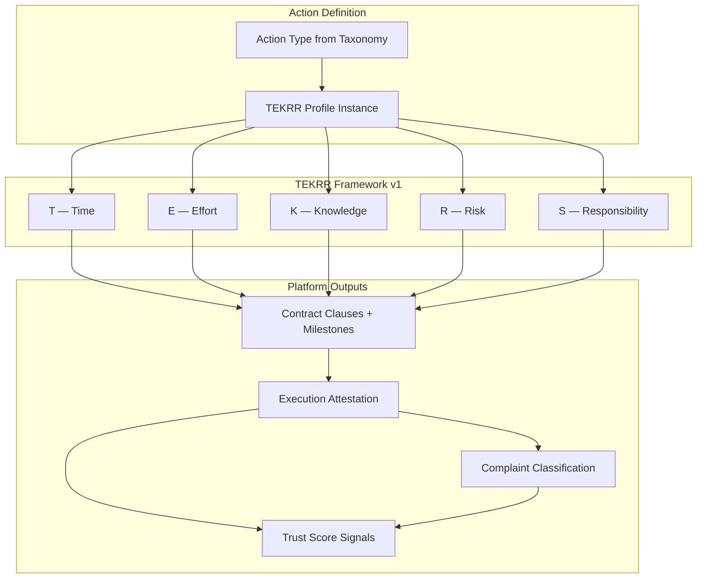
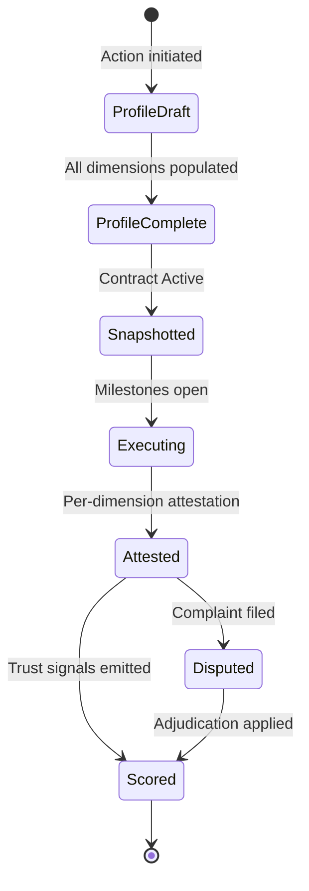

# APP13 TEKRR Framework v1

**Version:** 1.0  
**Status:** Specification — Pre-implementation  
**Last updated:** June 19, 2026  
**Depends on:** [Action Taxonomy v1](./APP13-Action-Taxonomy-v1.md) · [Contract Engine v1](./contract-engine/CONTRACT-ENGINE-v1.md) · [Approval Addendum v1.1](./architecture/APPROVAL-ADDENDUM-v1.1.md)

---

## Document purpose

The **TEKRR Framework** is APP13's universal model for decomposing every professional action into five measurable dimensions. It is the analytical core of the Professional Operating System — feeding contract generation, execution tracking, trust scoring, and complaint resolution.

**No application code or UI is included.**

---

## 1. The five dimensions

| Code | Dimension | Core question |
|------|-----------|---------------|
| **T** | **Time** | When is work performed, for how long, and by what deadline? |
| **E** | **Effort** | What work is physically or operationally performed? |
| **K** | **Knowledge** | What expertise, credentials, and judgment are required? |
| **R** | **Risk** | What can go wrong, and what liability exists? |
| **S** | **Responsibility** | Who is accountable for outcomes, compliance, and acceptance? |

### Canonical coding note

The fifth dimension is **Responsibility**. It is coded **S** (accountability **S**take) to avoid collision with **R** (Risk). All APP13 specifications use:

```
TEKRR = T + E + K + R + S
```

When spoken: *"TEKRR"* — five dimensions, two R-sounds in the acronym mapping to Risk and Responsibility (S).

---

## 2. Framework principles

| Principle | Meaning |
|-----------|---------|
| **Universality** | Every action type in the taxonomy decomposes into all five dimensions; none are omitted. |
| **Measurability** | Each dimension has a defined scale and produces numeric or enum signals. |
| **Contract binding** | TEKRR values at activation become immutable contract obligations. |
| **Evidence linkage** | Measurement requires evidence types mapped to milestones. |
| **Trust derivation** | Trust Score components derive from TEKRR fulfillment signals. |
| **Complaint anchoring** | Every complaint references one or more TEKRR dimensions. |
| **Domain weighting** | Dimensions carry different emphasis by action domain, not different existence. |

---

## 3. Framework architecture



---

## 4. Cross-dimensional composition model

### 4.1 Profile structure

Every action instance carries a **TEKRR Profile**:

```yaml
tekrr_profile:
  action_code: string          # e.g., B.2.1
  action_domain: enum          # A–H
  dimensions:
    T: { fields, score, weight }
    E: { fields, score, weight }
    K: { fields, score, weight }
    R: { fields, score, weight }
    S: { fields, score, weight }
  composite:
    profile_completeness: 0–100
    domain_emphasis_vector: [T,E,K,R,S weights summing to 1.0]
    execution_score_input: 0–1000  # per-contract
```

### 4.2 Two weighting layers

| Layer | Purpose | Scope |
|-------|---------|-------|
| **Domain emphasis weights** | How much each dimension matters for this action *type* | Set by taxonomy domain + action type |
| **Trust component weights** | How TEKRR feeds the Trust Score | Platform-wide (approved) |

**Domain emphasis weights** (per action type, sum = 1.00):

```
Example B.2.1 Electrical Installation:
  T: 0.15   E: 0.20   K: 0.25   R: 0.25   S: 0.15

Example C.1.1 Strategy Consulting:
  T: 0.20   E: 0.10   K: 0.35   R: 0.10   S: 0.25
```

**Trust Score weights** (platform, sum = 1.00):

| Component | Weight | Primary TEKRR sources |
|-----------|--------|---------------------|
| Verification | 30% | K (credentials), R (tier gates) |
| Execution Success | 30% | E, S (deliverables, acceptance) |
| Time Commitment | 20% | T |
| Complaints | 10% | All dimensions via complaint type |
| Customer Evaluation | 10% | All dimensions via structured eval |

### 4.3 Per-dimension fulfillment scale (universal)

Every dimension, on every contract, receives a **fulfillment rating** after execution:

| Rating | Code | Score value | Meaning |
|--------|------|-------------|---------|
| Fulfilled | `FUL` | 1.00 | Obligation fully met |
| Substantially fulfilled | `SUF` | 0.85 | Minor immaterial deviation |
| Partially fulfilled | `PAR` | 0.50 | Material gap, partial delivery |
| Unfulfilled | `UNF` | 0.00 | Obligation not met |
| Not applicable | `N/A` | excluded | Dimension inactive for this action |
| Disputed pending | `PEN` | excluded | Complaint open; excluded from aggregate |

**Per-contract dimension score:**

```
dimension_score = fulfillment_score × domain_emphasis_weight × 1000
```

**Per-contract execution input (fed to Trust Score Execution Success 30%):**

```
execution_input = Σ(dimension_score for FUL/SUF/PAR/UNF) / Σ(applicable weights) 
```

---

## 5. Dimension T — Time

### 5.1 Definition

Time captures **temporal obligations**: when work starts, how long it takes, response windows, milestone deadlines, and schedule adherence across single or recurring sessions.

### 5.2 Measurement scale

| Metric | Scale | Unit | Source |
|--------|-------|------|--------|
| **Schedule adherence** | 0–100 | % on-time milestones | Milestone timestamps vs due_at |
| **Start punctuality** | −∞ to +∞ | Minutes delta | Actual start − scheduled_start |
| **Duration accuracy** | 0–100 | % within tolerance | Actual duration vs estimated_duration |
| **Deadline compliance** | Boolean + delta | Met / missed by N days | completion_deadline vs M-DELIVER/M-VERIFY |
| **SLA compliance** | 0–100 | % SLAs met | response_sla windows (if declared) |
| **Session completion rate** | 0–100 | % sessions delivered | Recurring actions (D, G) |

**Punctuality bands (start punctuality):**

| Band | Delta | Signal |
|------|-------|--------|
| Early acceptable | ≤ 15 min early | Neutral |
| On time | −15 to +15 min | +full |
| Late minor | +16 to +60 min | −0.25 time score |
| Late major | +61 to +240 min | −0.50 time score |
| Late critical | > 240 min or no-show | −1.00; complaint trigger |

**Duration tolerance:** ±20% of estimated_duration unless contract specifies otherwise.

### 5.3 Weighting model

| Context | T emphasis range | Notes |
|---------|------------------|-------|
| Domain A Physical | 0.15–0.25 | Deadlines drive completion |
| Domain B Technical | 0.10–0.20 | SLAs critical for troubleshooting |
| Domain C Advisory | 0.15–0.25 | Delivery dates for reports |
| Domain D Care | 0.20–0.30 | Session schedule is core |
| Domain E Creative | 0.15–0.20 | Revision timelines |
| Domain F Operational | 0.25–0.35 | Event dates immovable |
| Domain G Knowledge | 0.25–0.35 | Session schedule |
| Domain H Inspection | 0.15–0.20 | Report delivery deadline |

**Trust Score mapping:** T signals feed **Time Commitment (20%)** exclusively.

```
time_commitment_signal = (
  0.40 × schedule_adherence +
  0.25 × deadline_compliance +
  0.20 × start_punctuality_normalized +
  0.15 × sla_compliance
) × 1000
```

### 5.4 Contract impact

| TEKRR field | Contract clause | Milestone impact |
|-------------|-----------------|------------------|
| scheduled_start | CL-TIME-001: start obligation | M-ACCESS, M-WIP due_at |
| estimated_duration | Duration expectation | WIP duration tracking |
| completion_deadline | Hard deadline | M-VERIFY, M-DELIVER due_at |
| response_sla | Response window | M-WIP start for B.3.3 etc. |
| session_schedule[] | Recurring obligations | Per-session M-WIP |
| period_end | Contract term end | M-COMPLETE trigger |

**Contract gates:**
- scheduled_start < completion_deadline (VR-006)
- Recurring actions: ≥1 session in schedule

### 5.5 Trust impact

| Event | Time Commitment (20%) effect |
|-------|------------------------------|
| All time milestones on time | +full signal |
| One minor late milestone | −5 to −15 points (normalized) |
| Deadline missed | −30 to −50 points |
| No-show / critical late | −80+ points; may cap contract execution score |
| Recurring: ≥95% sessions on time | +full |
| Recurring: <85% sessions delivered | −40+ points |

**Recency:** Last 20 contracts weighted; older than 24 months at 50% weight.

### 5.6 Complaint impact

| Complaint type | Code | Trigger conditions |
|----------------|------|-------------------|
| TIME_BREACH | `TIME_BREACH` | Start >60 min late; deadline missed; session no-show; SLA violated |

**Severity defaults:**

| Condition | Severity |
|-----------|----------|
| Minor delay (<60 min) | low |
| Missed deadline | medium |
| No-show | high |
| Pattern: 3+ TIME_BREACH upheld in 12mo | critical (tier review) |

**Fulfillment on upheld complaint:** T → `UNF`  
**Trust Complaints component:** penalty × risk normalization factor

---

## 6. Dimension E — Effort

### 6.1 Definition

Effort captures **operational and physical work performed**: deliverables, tasks, scope items, materials, location of work, and explicit exclusions.

### 6.2 Measurement scale

| Metric | Scale | Unit | Source |
|--------|-------|------|--------|
| **Deliverable completion rate** | 0–100 | % deliverables met | deliverables[] vs evidence |
| **Scope fidelity** | 0–100 | % scope unchanged | Scope vs execution; exclusions honored |
| **Checklist completion** | 0–100 | % items checked | EV-CHECK on milestones |
| **Rework rate** | 0–100 | % requiring redo | Issue Raised before acceptance |
| **Evidence completeness** | 0–100 | Required EV present | Evidence rules per milestone |

**Deliverable states:**

| State | Code | Score |
|-------|------|-------|
| Delivered as specified | `DEL` | 1.00 |
| Delivered with minor variance | `VAR` | 0.85 |
| Partially delivered | `PTL` | 0.50 |
| Not delivered | `NDL` | 0.00 |
| Out of scope | `OOS` | N/A (may trigger S complaint) |

### 6.3 Weighting model

| Context | E emphasis range |
|---------|------------------|
| Domain A Physical | 0.30–0.40 (primary) |
| Domain B Technical | 0.20–0.30 |
| Domain C Advisory | 0.10–0.20 (deliverables as docs) |
| Domain D Care | 0.15–0.25 (task checklists) |
| Domain E Creative | 0.25–0.35 |
| Domain F Operational | 0.20–0.30 |
| Domain G Knowledge | 0.15–0.25 (session tasks) |
| Domain H Inspection | 0.15–0.20 (report as deliverable) |

**Trust Score mapping:** E signals feed **Execution Success (30%)** primarily.

```
effort_execution_signal = (
  0.50 × deliverable_completion_rate +
  0.25 × scope_fidelity +
  0.15 × checklist_completion +
  0.10 × (1 − rework_rate)
) × 1000
```

### 6.4 Contract impact

| TEKRR field | Contract clause | Milestone impact |
|-------------|-----------------|------------------|
| deliverables[] | CL-EFFORT-001: scope binding | M-DELIVER, M-VERIFY checklist |
| location_type | Work location obligation | M-ACCESS |
| materials_party | Materials responsibility | E clause in contract |
| excluded_scope | Negative scope | Dispute reference |
| session tasks (D, G) | Per-session deliverables | Recurring M-WIP checklists |

**Contract gates:**
- ≥1 deliverable defined (where applicable, VR-007)
- deliverables[] must be enumerable (not vague)

### 6.5 Trust impact

| Event | Execution Success (30%) effect |
|-------|-------------------------------|
| 100% deliverables met | +full effort signal |
| 1 deliverable partial | −10 to −25 points |
| Material scope gap | −40 to −60 points |
| Rework required post-acceptance | −20 points + complaint flag |
| Pattern: low deliverable rate across 5+ contracts | Confidence band stays low |

### 6.6 Complaint impact

| Complaint type | Code | Trigger conditions |
|----------------|------|-------------------|
| EFFORT_DEFICIENCY | `EFFORT_DEFICIENCY` | Deliverable missing; checklist incomplete; quality below acceptance_criteria |

**Severity defaults:**

| Condition | Severity |
|-----------|----------|
| Single item missing | low–medium |
| Core deliverable missing | medium–high |
| Systematic scope abandonment | high |
| EFFORT_DEFICIENCY + rework within 7 days | medium (recurrence flag) |

**Fulfillment on upheld:** E → `UNF` or `PAR`  
**Cross-dimension:** Scope dispute may also invoke S (Responsibility)

---

## 7. Dimension K — Knowledge

### 7.1 Definition

Knowledge captures **expertise required and applied**: credentials, licenses, standard of care, professional judgment, and verification that the provider holds claimed qualifications at execution time.

### 7.2 Measurement scale

| Metric | Scale | Unit | Source |
|--------|-------|------|--------|
| **Credential match** | Boolean | Match / mismatch | required_credentials[] vs Identity verification |
| **Credential validity at execution** | Boolean | Valid / expired | Verification snapshot vs execution date |
| **Standard of care declared** | Enum | Declared / absent | TEKRR field completeness |
| **Standard of care met** | 0–100 | Expert attestation + evidence | M-VERIFY, customer eval |
| **Knowledge misrepresentation** | Boolean | Yes / no | Complaint outcome |

**Credential match levels:**

| Level | Code | Score |
|-------|------|-------|
| Full match — active credential | `CRM` | 1.00 |
| Match — expiring within 30 days | `CRE` | 0.85 |
| Partial — related but not exact credential | `CRP` | 0.50 |
| No match | `CNM` | 0.00 |
| Not required for action | `CRN` | N/A |

### 7.3 Weighting model

| Context | K emphasis range |
|---------|------------------|
| Domain A Physical | 0.05–0.15 |
| Domain B Technical | 0.20–0.35 (primary for trades) |
| Domain C Advisory | 0.30–0.40 (primary) |
| Domain D Care | 0.15–0.25 |
| Domain E Creative | 0.20–0.30 |
| Domain F Operational | 0.10–0.20 |
| Domain G Knowledge | 0.30–0.40 (primary) |
| Domain H Inspection | 0.25–0.35 (primary) |

**Trust Score mapping:** K signals feed **Verification (30%)** and **Execution Success (30%)**.

```
verification_signal_contribution = credential_match × tier_weight
execution_knowledge_signal = standard_of_care_met × 1000
```

**Tier weights for Verification component:**

| Tier | Weight |
|------|--------|
| T0 | 0.00 |
| T1 | 0.40 |
| T2 | 0.70 |
| T3 | 0.90 |
| T4 | 1.00 |

### 7.4 Contract impact

| TEKRR field | Contract clause | Milestone impact |
|-------------|-----------------|------------------|
| required_credentials[] | CL-KNOW-001: credential obligation | M-VERIFY: EV-CRED required |
| standard_of_care | Professional standard binding | M-VERIFY checklist |
| supervision_required | Supervision clause | S cross-reference |

**Contract gates:**
- Provider tier ≥ action min_provider_tier
- required_credentials[] ⊆ provider verified credentials (VR-005)
- B.2.1, B.1.2, H.1.1, D.1.1: credentials mandatory non-empty

### 7.5 Trust impact

| Event | Verification (30%) | Execution (30%) |
|-------|-------------------|-----------------|
| Credential match at activation | +baseline | — |
| Credential expired during contract | Tier review flag | K → PAR pending |
| Standard of care met per eval | — | +full K signal |
| KNOWLEDGE_MISREP upheld | −major Verification penalty | K → UNF |
| Unlicensed work (B.2.1, B.1.2) | Suspension trigger | K → UNF |

### 7.6 Complaint impact

| Complaint type | Code | Trigger conditions |
|----------------|------|-------------------|
| KNOWLEDGE_MISREP | `KNOWLEDGE_MISREP` | Credential not held; work outside standard of care; unqualified practice |

**Severity defaults:**

| Condition | Severity |
|-----------|----------|
| Expertise below expectation (subjective) | low–medium |
| Credential not held | high |
| Unlicensed regulated work | critical |

**Fulfillment on upheld:** K → `UNF`  
**Platform action:** Tier review; possible suspension for critical

---

## 8. Dimension R — Risk

### 8.1 Definition

Risk captures **exposure to harm**: physical injury, property damage, data loss, financial liability, regulatory exposure, and vulnerability of beneficiaries. Risk declares what can go wrong and allocates liability between parties.

### 8.2 Measurement scale

| Metric | Scale | Unit | Source |
|--------|-------|------|--------|
| **Declared risk level** | 1–5 | Ordinal | TEKRR risk_level field |
| **Hazard declaration completeness** | 0–100 | % required hazards declared | hazard_declarations[] |
| **Incident occurrence** | Boolean | Yes / no | Complaint, Issue Raised |
| **Safety checklist compliance** | 0–100 | % items | EV-CHECK at M-VERIFY |
| **Liability allocation clarity** | Boolean | Declared / absent | liability_allocation field |

**Risk level definitions (platform universal):**

| Level | Label | Description | Example actions |
|-------|-------|-------------|-----------------|
| 1 | Negligible | No meaningful harm potential | E.1.1 Graphic Design |
| 2 | Low | Minor property or inconvenience | A.4.2 Cleaning, G.1.1 Tutoring |
| 3 | Moderate | Property damage or moderate harm | A.2.1 Repair, B.3.3 Troubleshooting |
| 4 | Significant | Injury, major damage, regulatory | B.1.2 Plumbing, D.1.1 Care |
| 5 | Critical | Life safety, major liability | B.2.1 Electrical |

**Risk fulfillment (post-execution):**

| Outcome | Code | Score |
|---------|------|-------|
| No incident; hazards managed | `RSF` | 1.00 |
| Minor incident, remediated | `RMI` | 0.60 |
| Significant incident | `RSI` | 0.00 |
| Incident + upheld complaint | `RIN` | 0.00 + complaint penalty |

### 8.3 Weighting model

| Context | R emphasis range |
|---------|------------------|
| Domain A Physical | 0.15–0.25 |
| Domain B Technical | 0.20–0.30 |
| Domain C Advisory | 0.05–0.15 |
| Domain D Care | 0.20–0.30 |
| Domain E Creative | 0.05–0.15 |
| Domain F Operational | 0.10–0.20 |
| Domain G Knowledge | 0.05–0.10 |
| Domain H Inspection | 0.15–0.25 |

**Complaint normalization factor by declared risk level:**

| risk_level | Complaint weight multiplier |
|------------|------------------------------|
| 1 | 0.6 |
| 2 | 0.8 |
| 3 | 1.0 |
| 4 | 1.2 |
| 5 | 1.5 |

Higher-risk actions: complaints are *expected to be rarer but heavier* when upheld.

**Trust Score mapping:** R feeds **Complaints (10%)** normalization and partially **Verification (30%)** via tier gates.

### 8.4 Contract impact

| TEKRR field | Contract clause | Milestone impact |
|-------------|-----------------|------------------|
| risk_level | CL-RISK-001 / CL-RISK-002 | Evidence strictness at M-VERIFY |
| hazard_declarations[] | Hazard binding | M-SCOPE acknowledgment |
| liability_allocation | Liability clause | All parties accept at Proposed |
| insurance_declaration | Declarative note (MVP) | M-VERIFY if self-declared |

**Contract gates:**
- risk_level ≥ 4 → hazard_declarations[] non-empty (VR-004)
- risk_level ≥ 4 → CL-RISK-002 injected
- risk_level ≥ 4 → provider min tier T2

**Evidence escalation by risk level:**

| risk_level | M-VERIFY minimum evidence |
|------------|---------------------------|
| 1–2 | EV-TS or EV-CHECK |
| 3 | EV-PHOTO + EV-CHECK |
| 4–5 | EV-PHOTO + EV-TEST or EV-DOC + EV-CRED |

### 8.5 Trust impact

| Event | Trust impact |
|-------|--------------|
| Clean execution (no incidents) | Neutral to positive (maintains score) |
| RISK_INCIDENT upheld low | Complaints −10 to −20 (× multiplier) |
| RISK_INCIDENT upheld high | Complaints −40 to −80 |
| Critical incident | Tier review + possible suspension |
| False hazard declaration (hidden risk) | KNOWLEDGE_MISREP crossover; critical |

### 8.6 Complaint impact

| Complaint type | Code | Trigger conditions |
|----------------|------|-------------------|
| RISK_INCIDENT | `RISK_INCIDENT` | Injury, damage, data breach, safety failure, safeguarding concern |

**Severity defaults:**

| Condition | Severity |
|-----------|----------|
| Minor property damage | low–medium |
| Injury | high |
| Life safety (electrical, gas) | critical |
| Safeguarding (minor learner, vulnerable adult) | critical |

**Fulfillment on upheld:** R → `UNF`  
**Immediate Issue Raised:** risk_level ≥ 4 incidents skip filing window wait during Active

---

## 9. Dimension S — Responsibility

### 9.1 Definition

Responsibility captures **accountability for outcomes**: who accepts work, who confirms completion, compliance obligations, permit ownership, warranty terms, IP allocation, and boundary declarations (e.g., non-medical care).

### 9.2 Measurement scale

| Metric | Scale | Unit | Source |
|--------|-------|------|--------|
| **Acceptance criteria clarity** | 0–100 | Rubric completeness | acceptance_criteria field quality |
| **Acceptance obtained** | Boolean | Signed / not | M-ACCEPT EV-SIGN |
| **Compliance obligations met** | 0–100 | % met | permit, boundary, IP clauses |
| **Warranty honored** | Boolean | Within period | Post-completion complaints |
| **Scope boundary respected** | Boolean | Yes / no | excluded_scope vs work performed |

**Responsibility fulfillment:**

| Outcome | Code | Score |
|---------|------|-------|
| Accepted without dispute | `ACF` | 1.00 |
| Accepted with noted reservations | `ACR` | 0.85 |
| Not accepted; rework completed | `ACW` | 0.60 |
| Not accepted; unresolved | `ACN` | 0.00 |
| Upheld RESPONSIBILITY_FAILURE | `ACF` → `UNF` | 0.00 |

### 9.3 Weighting model

| Context | S emphasis range |
|---------|------------------|
| Domain A Physical | 0.10–0.20 |
| Domain B Technical | 0.10–0.20 |
| Domain C Advisory | 0.20–0.30 |
| Domain D Care | 0.25–0.35 (primary) |
| Domain E Creative | 0.20–0.30 (IP) |
| Domain F Operational | 0.20–0.30 |
| Domain G Knowledge | 0.15–0.25 |
| Domain H Inspection | 0.20–0.30 (scope limits) |

**Trust Score mapping:** S feeds **Execution Success (30%)** and **Customer Evaluation (10%)**.

```
responsibility_execution_signal = (
  0.40 × acceptance_obtained +
  0.30 × compliance_obligations_met +
  0.20 × scope_boundary_respected +
  0.10 × warranty_honored
) × 1000
```

### 9.4 Contract impact

| TEKRR field | Contract clause | Milestone impact |
|-------------|-----------------|------------------|
| acceptance_criteria | CL-RESP-001 | M-ACCEPT binding rubric |
| acceptance_party | Sign-off authority | M-ACCEPT EV-SIGN |
| warranty_period | CL-RESP-002 | Extends complaint window for E/B |
| permit_responsibility | Compliance clause | M-VERIFY EV-DOC if provider |
| ip_allocation | CL-IP-001 (domain E) | M-ACCEPT |
| compliance_notes | Boundary declarations | M-SCOPE (D, H) |

**Contract gates:**
- acceptance_criteria non-empty (VR-008)
- acceptance_party designated

### 9.5 Trust impact

| Event | Execution (30%) | Customer Eval (10%) |
|-------|-----------------|---------------------|
| Clean acceptance | +full S signal | High eval correlation |
| Acceptance after rework | −15 execution points | Reduced eval |
| RESPONSIBILITY_FAILURE upheld | S → UNF | Strong negative eval |
| Warranty claim upheld within period | Complaint crossover | −eval |

### 9.6 Complaint impact

| Complaint type | Code | Trigger conditions |
|----------------|------|-------------------|
| RESPONSIBILITY_FAILURE | `RESPONSIBILITY_FAILURE` | Permit not obtained; boundary breached; IP violation; warranty denied; scope of assessment misstated |

**Severity defaults:**

| Condition | Severity |
|-----------|----------|
| Warranty dispute | low–medium |
| IP violation | medium–high |
| Compliance/permit failure | high |
| Care boundary breach (medical act) | critical |

**Fulfillment on upheld:** S → `UNF`

---

## 10. Composite TEKRR scoring

### 10.1 Profile completeness (pre-contract)

Before contract generation, TEKRR profile must reach **100% completeness**:

```
completeness = (required_fields_populated / required_fields_total) × 100
```

Gate: completeness = 100 to proceed Draft → Proposed.

### 10.2 Per-contract TEKRR execution score

After contract Completed (or Closed post-complaint):

```
For each dimension d ∈ {T, E, K, R, S} where applicable:
  fulfillment_score[d] ∈ {1.0, 0.85, 0.5, 0.0}

  weighted[d] = fulfillment_score[d] × domain_emphasis[d]

execution_score_contract = (Σ weighted[d] / Σ domain_emphasis[d]) × 1000
```

### 10.3 Mapping to Trust Score (platform weights)

| Trust component | TEKRR sources | Calculation |
|-----------------|---------------|-------------|
| **Verification (30%)** | K, R | tier + credential state (mostly pre-contract) |
| **Execution Success (30%)** | E, S, K (execution) | Rolling avg of execution_score_contract |
| **Time Commitment (20%)** | T | Rolling avg of time_commitment_signal |
| **Complaints (10%)** | All via complaint type | Penalty on upheld; × risk multiplier |
| **Customer Evaluation (10%)** | All via eval form | Structured eval mapped to dimensions |

**Customer Evaluation dimension mapping (EVAL forms):**

| Eval field cluster | Primary dimension |
|--------------------|-------------------|
| Punctuality, schedule | T |
| Quality of work, completeness | E |
| Expertise, professionalism | K |
| Safety, problems occurred | R |
| Would hire again, acceptance fairness | S |

---

## 11. Domain default emphasis vectors

Sum = 1.00 for each domain (defaults; action types may override):

| Domain | T | E | K | R | S |
|--------|---|---|---|---|---|
| **A** Physical | 0.20 | 0.35 | 0.10 | 0.20 | 0.15 |
| **B** Technical | 0.15 | 0.25 | 0.30 | 0.25 | 0.05 |
| **C** Advisory | 0.20 | 0.10 | 0.35 | 0.10 | 0.25 |
| **D** Care | 0.25 | 0.20 | 0.20 | 0.25 | 0.10 |
| **E** Creative | 0.15 | 0.30 | 0.25 | 0.10 | 0.20 |
| **F** Operational | 0.30 | 0.25 | 0.15 | 0.10 | 0.20 |
| **G** Knowledge | 0.30 | 0.20 | 0.35 | 0.05 | 0.10 |
| **H** Inspection | 0.15 | 0.15 | 0.30 | 0.20 | 0.20 |

---

## 12. MVP action type emphasis overrides

Per-action domain emphasis (sum = 1.00) — overrides domain defaults where specified:

| Action | T | E | K | R | S |
|--------|---|---|---|---|---|
| A.2.1 Surface Repair | 0.18 | 0.32 | 0.08 | 0.22 | 0.20 |
| A.4.1 Routine Maintenance | 0.22 | 0.38 | 0.05 | 0.15 | 0.20 |
| A.4.2 Cleaning | 0.20 | 0.35 | 0.05 | 0.18 | 0.22 |
| B.1.2 Plumbing | 0.12 | 0.22 | 0.28 | 0.28 | 0.10 |
| B.2.1 Electrical | 0.10 | 0.18 | 0.28 | 0.32 | 0.12 |
| B.3.3 Troubleshooting | 0.25 | 0.22 | 0.25 | 0.18 | 0.10 |
| C.1.1 Strategy Consulting | 0.22 | 0.08 | 0.38 | 0.08 | 0.24 |
| C.1.2 Operations Advisory | 0.18 | 0.15 | 0.32 | 0.10 | 0.25 |
| D.1.1 Personal Care | 0.28 | 0.18 | 0.22 | 0.22 | 0.10 |
| D.3.1 Household Aid | 0.25 | 0.28 | 0.08 | 0.15 | 0.24 |
| E.1.1 Graphic Design | 0.15 | 0.32 | 0.22 | 0.08 | 0.23 |
| E.3.1 Software Dev | 0.18 | 0.28 | 0.28 | 0.12 | 0.14 |
| F.1.2 Event Coordination | 0.32 | 0.28 | 0.12 | 0.12 | 0.16 |
| G.1.1 Tutoring | 0.32 | 0.18 | 0.35 | 0.08 | 0.07 |
| H.1.1 Property Assessment | 0.15 | 0.12 | 0.32 | 0.18 | 0.23 |

---

## 13. TEKRR lifecycle integration



| Phase | TEKRR state | Editable |
|-------|-------------|----------|
| Draft | ProfileDraft | Yes — all dimensions |
| Proposed | ProfileComplete | No |
| Active | Snapshotted | No — immutable |
| Executing | Snapshotted + fulfillment tracking | Fulfillment only |
| Completed | Final fulfillment ratings | No |
| Disputed | Frozen per affected dimension | No |

---

## 14. Complaint ↔ TEKRR dimension matrix

| Complaint type | Primary dimension | Secondary dimensions |
|----------------|-------------------|---------------------|
| TIME_BREACH | T | S (if schedule was acceptance criteria) |
| EFFORT_DEFICIENCY | E | S, K |
| KNOWLEDGE_MISREP | K | R, S |
| RISK_INCIDENT | R | E, K, S |
| RESPONSIBILITY_FAILURE | S | E, K |
| CONTRACT_INTEGRITY | All | Cross-cutting |

**Rule:** Complaint must declare ≥1 primary dimension. Secondary dimensions optional for adjudication context.

---

## 15. Required TEKRR fields by dimension (universal minimum)

Every action, regardless of type, must populate at minimum:

| Dimension | Universal required fields |
|-----------|--------------------------|
| **T** | scheduled_start, completion_deadline |
| **E** | deliverables[] OR session_tasks[] (recurring) |
| **K** | standard_of_care |
| **R** | risk_level, liability_allocation |
| **S** | acceptance_criteria, acceptance_party |

Action templates may add mandatory fields beyond this minimum.

---

## 16. Versioning

| Artifact | Version | Notes |
|----------|---------|-------|
| TEKRR Framework | v1.0 | This document |
| Fulfillment scale | v1 | FUL/SUF/PAR/UNF |
| Domain emphasis vectors | v1 | Table §11 |
| Action overrides | v1 | Table §12 |
| Trust mapping | v1 | Aligns with Approval Addendum v1.1 |

Changes to fulfillment scales or trust mapping require **prospective application** — contracts reference `tekrr_framework_version` at activation.

---

## 17. Related documents

| Document | Relationship |
|----------|--------------|
| [Action Taxonomy v1](./APP13-Action-Taxonomy-v1.md) | Action types and domain defaults |
| [Contract Engine v1](./contract-engine/CONTRACT-ENGINE-v1.md) | Template TEKRR inputs and clauses |
| [Contract Templates MVP](./contract-engine/templates/README.md) | Per-action TEKRR field requirements |
| [Complaint Lifecycle v1](./architecture/06-complaint-lifecycle.md) | Dimension-bound disputes |
| [Approval Addendum v1.1](./architecture/APPROVAL-ADDENDUM-v1.1.md) | Trust Score weights |

---

*End of TEKRR Framework v1 specification.*
