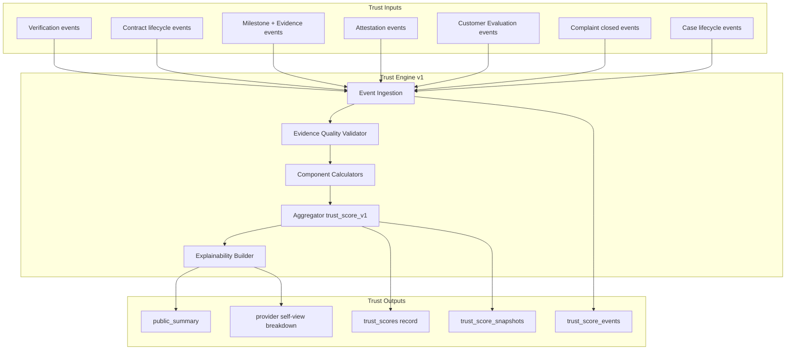
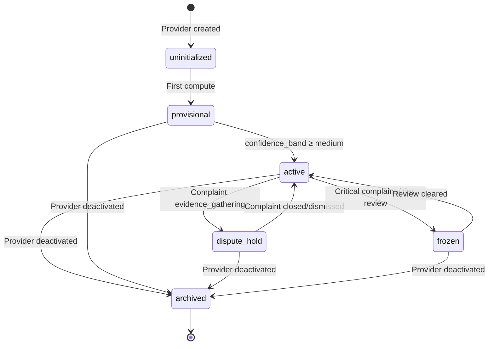

# APP13 Trust Engine v1

**Version:** 1.0  
**Status:** Specification — Pre-implementation  
**Last updated:** June 19, 2026  
**Engine ID:** `trust`  
**Implementation host:** Identity Engine → Scoring Service  
**Depends on:** [Core Principles v1](./APP13-Core-Principles-v1.md) · [Approval Addendum v1.1](./architecture/APPROVAL-ADDENDUM-v1.1.md) · [TEKRR Framework v1](./APP13-TEKRR-Framework-v1.md) · [State Machine v1](./APP13-State-Machine-v1.md) · [Complaint Lifecycle v1](./architecture/06-complaint-lifecycle.md)

---

## Document purpose

The **Trust Engine** is APP13's constitutional credibility system — not a star rating, not a marketplace ranking, and not a manually editable reputation score.

It answers one question for each scored party:

> *Given verified platform evidence, how reliably does this party honor professional obligations bound by Contracts?*

**Audience:** Engineering, trust operations, product, legal.  
**Scope:** Complete trust system design for MVP (`trust_score_v1`) with forward-compatible hooks for Phase 2–3.

---

## 1. Trust philosophy and objectives

### 1.1 Constitutional positioning

Trust is the **fourth link** in the accountability chain:

```
Action → Contract → Execution (Evidence) → Trust → Complaint (when triggered)
```

Trust is **derived**, never declared. It exists to:

| Objective | Description |
|-----------|-------------|
| **Predict reliability** | Help customers assess provider execution risk before contract acceptance |
| **Reward evidence** | Strengthen scores when milestones, attestations, and evaluations prove fulfillment |
| **Penalize proven failure** | Reduce scores only when platform evidence or adjudicated complaints confirm fault |
| **Preserve neutrality** | No pay-for-ranking, no discovery manipulation, no commercial score override |
| **Enable audit** | Every score change traceable to an immutable event (Law 16, Law 24) |
| **Bind to identity** | Trust travels with verified identity across Actions (Law 17) |

### 1.2 What Trust is not

| Not trust | Why excluded |
|-----------|--------------|
| Anonymous star ratings | Law 15 — opinion without contract linkage |
| Social follower counts | No platform evidence |
| Manual admin score edits | Law 16 — computed only |
| Complaint filing alone | No penalty until adjudication closes |
| Marketing testimonials | Unverified external input |
| Payment history (MVP) | Payments excluded from MVP scope |

### 1.3 Design principles

| Principle | Rule |
|-----------|------|
| **Explainability** | Every score exposes component breakdown + contributing event IDs |
| **Event sourcing** | `trust_score_events` append-only; score is a projection |
| **Prospective versioning** | Algorithm changes apply forward only (Law 25) |
| **Evidence quality weighting** | Stronger evidence types carry higher attestation confidence |
| **Pending exclusion** | Contracts/dimensions with open complaints excluded from aggregate (`PEN`) |
| **Recency awareness** | Recent performance weighs more; old events decay |

---

## 2. Engine architecture



**Authority:** No engine other than Trust Engine (via Identity Engine Scoring Service) may write `trust_scores.score` or component fields.

---

## 3. Trust inputs

### 3.1 Primary input categories

| Category | Source engine | Examples |
|----------|---------------|----------|
| **Identity assurance** | Identity / Verification | Tier approved, credential verified, tier expired |
| **Contract lifecycle** | Contract | activated, completed, cancelled, amended |
| **Execution evidence** | Action | milestone submitted, evidence uploaded, attestation recorded |
| **Structured evaluation** | Action / Contract | EVAL-{domain}-v1 submitted post-completion |
| **Adjudicated disputes** | Complaint | complaint.closed with outcome + severity |
| **Case operations** | Complaint | case.opened, case.closed (SLA / hold signals) |

### 3.2 Required event metadata (all inputs)

Every ingested event must carry:

| Field | Required | Purpose |
|-------|:--------:|---------|
| `event_id` | Yes | UUID |
| `event_type` | Yes | Canonical type code |
| `provider_id` | Yes | Scored party |
| `source_entity_type` | Yes | `contract`, `milestone`, `evidence`, `complaint`, etc. |
| `source_entity_id` | Yes | FK for explainability |
| `contract_id` | If applicable | Contract context |
| `occurred_at` | Yes | Event timestamp |
| `score_version` | Yes | `trust_score_v1` |
| `payload` | Yes | JSON Schema per event type |
| `evidence_quality_factor` | If evidence-linked | 0.0–1.0 multiplier |

### 3.3 Non-inputs (explicitly rejected)

| Rejected input | Response |
|----------------|----------|
| Raw complaint filing | Logged; no score change until `complaint.closed` |
| Issue raised (informal) | No penalty; optional minor rework signal on informal resolution |
| User-submitted score | Rejected at API layer |
| External review import | Rejected (Phase 2+ third-party attestation only via verified integrations) |

---

## 4. Trust outputs

### 4.1 Provider Trust Score (MVP)

| Output | Table / artifact | Consumer |
|--------|------------------|----------|
| Composite score | `trust_scores.score` (0–1000) | Public profile, pre-contract display |
| Component scores | `trust_scores.*_component` | Provider self-view |
| Dimension breakdown | `trust_scores.dimension_scores` JSONB | Provider self-view, admin |
| Confidence band | `trust_scores.confidence_band` | Public profile qualifier |
| Public summary | `trust_scores.public_summary` JSONB | Customer-facing aggregate |
| Event log | `trust_score_events` | Audit, appeals, recompute |
| Score snapshot | `trust_score_snapshots` (v1.1) | Historical appeals |
| Explainability bundle | API response | Provider support, admin |

### 4.2 Client Trust Score (Phase 2)

| Output | Status | Purpose |
|--------|--------|---------|
| `client_trust_scores` | Phase 2 | Frivolous complaint detection; repeat customer reliability |
| Public visibility | Phase 2+ | Restricted — not shown pre-contract in MVP |

### 4.3 Company Trust Score (Phase 3)

| Output | Status | Purpose |
|--------|--------|---------|
| `company_trust_scores` | Phase 3 | Institutional KYB + aggregate member performance |
| Endorsement linkage | Phase 3 | Company ↔ Provider relationship trust |

---

## 5. Trust Formula

**Version:** `trust_score_v1`  
**Scale:** 0–1000 (integer, rounded half-up)  
**Authority:** [Approval Addendum v1.1](./architecture/APPROVAL-ADDENDUM-v1.1.md)

### 5.1 Master formula

```
trust_score = round(
    0.30 × verification_component +
    0.30 × execution_component +
    0.20 × time_component +
    0.10 × complaints_component +
    0.10 × evaluation_component
)
```

All components ∈ [0, 1000].

### 5.2 Component formulas

#### Verification component (30%)

```
verification_component = (
    0.50 × tier_score +
    0.35 × credential_score +
    0.15 × renewal_recency_score
) × 1000

tier_score:
  T0 = 0.00, T1 = 0.40, T2 = 0.70, T3 = 0.85, T4 = 0.95

credential_score:
  valid_required_credentials / required_credentials_count
  (from contract snapshots + current credential state)

renewal_recency_score:
  1.00 if tier/credentials current
  0.50 if expiring within 30 days
  0.00 if expired (blocks new contracts; existing score decays on expiry event)
```

#### Execution component (30%)

Rolling aggregate over eligible completed contracts (max 20, recency-weighted):

```
For each eligible contract c:
  fulfillment_score[d] ∈ {1.00, 0.85, 0.50, 0.00}  // FUL, SUF, PAR, UNF
  domain_emphasis[d] from tekrr_snapshot at activation

  execution_input[c] = (
    Σ(fulfillment_score[d] × domain_emphasis[d]) /
    Σ(domain_emphasis[d] where d ≠ N/A)
  ) × evidence_confidence[c] × 1000

execution_component = weighted_avg(execution_input[c], recency_weight[c])
```

**Eligible contract:** `completed` or `closed` (issue path), no `PEN` dimensions, not under active dispute hold at time of recompute.

#### Time component (20%)

Per eligible contract:

```
time_commitment_input[c] = (
    0.40 × schedule_adherence +
    0.25 × deadline_compliance +
    0.20 × start_punctuality_normalized +
    0.15 × sla_compliance
) × 1000

time_component = weighted_avg(time_commitment_input[c], recency_weight[c])
```

#### Complaints component (10%)

```
Base complaints_component = 1000  // start neutral

For each upheld complaint event (at complaint.closed only):
  penalty = base_penalty_units[severity]
          × risk_normalization_factor[contract.risk_level]
          × recency_weight[complaint.occurred_at]
          × repeat_offense_multiplier

  complaints_component -= penalty

For dismissed complaints: no penalty (neutral)

Floor: complaints_component ≥ 0
```

**Critical constraint:** Penalty events emitted **only** on `complaint.closed` with outcome ∈ {`upheld_provider_fault`, `shared_fault` (partial)}.

#### Customer Evaluation component (10%)

```
For each EVAL-{domain}-v1 submission linked to completed contract:
  eval_input[c] = map_eval_fields_to_dimensions(form_responses)
                × 1000

evaluation_component = weighted_avg(eval_input[c], recency_weight[c])
```

Eval fields map to TEKRR dimensions per TEKRR Framework §10.3.

### 5.3 Recency weight function

Applied to contract-level inputs (execution, time, evaluation) and complaint penalties:

```
age_months = months_between(event.occurred_at, now)

recency_weight:
  age ≤ 24 months  → 1.00
  24 < age ≤ 36    → 0.50
  age > 36         → 0.00 (excluded from rolling window)

Rolling window: last 20 eligible contracts (or all if fewer)
```

### 5.4 Confidence band

```
confidence_band:
  completed_contract_count < 3  → "low"
  3 ≤ count < 10                → "medium"
  count ≥ 10                    → "high"
```

Public display must show confidence band when `low` or `medium`.

---

## 6. Weight Tables

### 6.1 Platform component weights (trust_score_v1)

| Component | Weight | Primary TEKRR sources |
|-----------|--------|----------------------|
| Verification | **30%** | K (credentials), tier gates |
| Execution Success | **30%** | E, S (deliverables, acceptance) |
| Time Commitment | **20%** | T |
| Complaints | **10%** | All via complaint type |
| Customer Evaluation | **10%** | All via structured eval |
| **Total** | **100%** | |

### 6.2 Fulfillment rating weights

| Rating | Code | Score value |
|--------|------|-------------|
| Fulfilled | `FUL` | 1.00 |
| Substantially fulfilled | `SUF` | 0.85 |
| Partially fulfilled | `PAR` | 0.50 |
| Unfulfilled | `UNF` | 0.00 |
| Not applicable | `N/A` | excluded |
| Disputed pending | `PEN` | excluded until closed |

### 6.3 Evidence type quality weights

Evidence quality affects **attestation confidence** (`evidence_confidence[c]`):

| Evidence type | Base quality weight | Rationale |
|---------------|:-------------------:|-----------|
| `EV-SIGN` | 1.00 | Named party acceptance |
| `EV-CRED` | 0.95 | Verified credential |
| `EV-TEST` | 0.95 | Measurable test output |
| `EV-CHECK` | 0.85 | Structured checklist |
| `EV-DOC` | 0.85 | Document deliverable |
| `EV-PHOTO` | 0.80 | Visual proof |
| `EV-TS` | 0.70 | Timestamp only |
| `EV-NOTE` | 0.70 | Structured note |

**Contract evidence confidence:**

```
evidence_confidence[c] = min(1.0,
  Σ(required_evidence_type_weight × present) /
  Σ(required_evidence_type_weight)
)

If required evidence missing at attestation: confidence capped at 0.60
If attestation disputed then upheld against provider: confidence = 0.00 for affected dimension
```

### 6.4 Complaint severity penalty units

| Severity | Base penalty units | Additional action |
|----------|:------------------:|-------------------|
| `low` | 10 | — |
| `medium` | 25 | — |
| `high` | 50 | — |
| `critical` | 100 | Tier review flag → `frozen` state |

### 6.5 Risk normalization factor

From contract TEKRR snapshot at activation:

| Risk level | Multiplier |
|:----------:|:----------:|
| 1 | 0.80 |
| 2 | 0.90 |
| 3 | 1.00 |
| 4 | 1.15 |
| 5 | 1.30 |

### 6.6 Repeat offense multiplier (complaints)

| Upheld complaints (12 months) | Multiplier |
|:-----------------------------:|:----------:|
| 1 | 1.00 |
| 2 | 1.15 |
| 3+ | 1.30 (+ tier review at 3) |

### 6.7 Cancellation fault weights

| Fault party | Execution impact | Time impact | Complaints impact |
|-------------|:----------------:|:-----------:|:-----------------:|
| `none` (pre-execution) | Neutral | Neutral | Neutral |
| `customer` | Neutral to provider | Neutral | Neutral |
| `provider` (after active) | −40 contract input | −30 contract input | — |
| `shared` | −20 contract input | −15 contract input | — |

---

## 7. Event Matrix

### 7.1 Positive trust events

| Event type | Component | Trigger | Payload minimum |
|------------|-----------|---------|-----------------|
| `verification.tier_approved` | Verification | Tier → approved | tier, approved_at |
| `verification.credential_verified` | Verification | Credential approved | credential_id, type |
| `contract.completed` | Execution, Time | Contract → completed | contract_id, fulfillment_ratings, time_metrics |
| `milestone.on_time` | Time | Milestone accepted on/before due_at | milestone_id, delta_minutes |
| `milestone.accepted` | Execution | Milestone → accepted | milestone_id, evidence_ids |
| `attestation.fulfilled` | Execution | Dimension → FUL/SUF | contract_id, dimension, evidence_confidence |
| `evaluation.submitted` | Evaluation | EVAL form submitted | contract_id, eval_scores |
| `complaint.dismissed` | Complaints | Complaint → closed dismissed | complaint_id (neutral — no penalty) |
| `complaint.upheld_customer_fault` | Complaints | Provider protected | complaint_id (neutral to provider) |
| `issue.resolved_informally` | Execution | Issue → resolved_informally | contract_id (minor: rework flag only) |
| `contract.completed_streak` | Execution | 5 consecutive FUL contracts | streak_count (Phase 2 recovery bonus) |

### 7.2 Negative trust events

| Event type | Component | Trigger | Payload minimum |
|------------|-----------|---------|-----------------|
| `verification.tier_expired` | Verification | Tier/credential expired | tier, expired_at |
| `verification.credential_revoked` | Verification | Admin revocation | credential_id, reason |
| `milestone.late` | Time | Milestone accepted after due_at | milestone_id, delta_minutes |
| `milestone.failed` | Execution | Milestone → disputed → upheld UNF | milestone_id |
| `attestation.unfulfilled` | Execution | Dimension → UNF | contract_id, dimension |
| `contract.cancelled_provider_fault` | Execution, Time | Cancel with provider fault | contract_id, fault_party |
| `complaint.upheld_provider_fault` | Complaints, Execution | Complaint → closed upheld | complaint_id, severity, dimensions |
| `complaint.shared_fault` | Complaints, Execution | Complaint → closed shared | complaint_id, severity, fault_pct |
| `complaint.critical_severity` | All | Critical upheld | complaint_id, tier_review_flag |
| `evaluation.poor` | Evaluation | Eval below threshold (<400) | contract_id, eval_scores |

### 7.3 Neutral / hold events (no score change)

| Event type | Effect |
|------------|--------|
| `complaint.filed` | Record only; Contract excluded from aggregate (`PEN`) |
| `complaint.evidence_gathering` | → `dispute_hold` state; no penalty |
| `case.opened` | SLA clock; no penalty |
| `case.informal` | Monitor only |
| `issue.raised` | No penalty; partial freeze only |

### 7.4 Full event matrix

| Source | Event | V | E | T | C | Ev | Score change timing |
|--------|-------|:-:|:-:|:-:|:-:|:-:|:-------------------:|
| Verification | tier_approved | ✓ | | | | | Immediate |
| Verification | tier_expired | ✓ | | | | | Immediate |
| Verification | credential_verified | ✓ | | | | | Immediate |
| Contract | completed | | ✓ | ✓ | | | Within 24h |
| Contract | cancelled (provider fault) | | ✓ | ✓ | | | Immediate |
| Contract | cancelled (no fault) | | | | | | Neutral |
| Milestone | on_time | | | ✓ | | | On contract complete |
| Milestone | late | | | ✓ | | | On contract complete |
| Attestation | fulfilled (FUL/SUF) | | ✓ | | | | On contract complete |
| Attestation | unfulfilled (UNF) | | ✓ | | | | On complaint close OR complete |
| Evaluation | submitted | | | | | ✓ | On submit |
| Complaint | filed | | | | | | **None** (hold only) |
| Complaint | closed upheld | | ✓ | | ✓ | | On close |
| Complaint | closed dismissed | | | | ✓ | | On close (neutral) |
| Complaint | closed shared | | ✓ | | ✓ | | On close |
| Issue | resolved_informally | | ± | | | | Minor rework signal |
| Case | closed (no complaint) | | | | | | Neutral |
| Amendment | activated (Phase 2) | | ± | ± | | | On amendment close |

**Legend:** V=Verification, E=Execution, T=Time, C=Complaints, Ev=Evaluation

---

## 8. Impact by lifecycle event

### 8.1 Contract completion impact

When `contract.completed`:

1. Compute per-dimension fulfillment ratings from attestations + evidence confidence
2. Emit `contract.completed` trust event with full payload
3. Compute `execution_input[c]`, `time_commitment_input[c]`
4. Exclude if any dimension still `PEN`
5. Queue recompute → update execution + time components
6. If evaluation already submitted, include; else wait for eval event
7. Set `confidence_band` based on completed count

**Positive completion example:** All dimensions FUL, all milestones on time, evidence confidence 0.95 → strong positive execution + time signals.

### 8.2 Amendment impact

**MVP:** Amendments deferred — cancel + recreate workaround. No amendment events in MVP.

**Phase 2 (future version):**

| Amendment outcome | Trust impact |
|-------------------|--------------|
| Amendment accepted, work continues | TEKRR snapshot v2; prior execution signals retained |
| Amendment due to provider scope error | −15 execution signal on amendment event |
| Amendment due to customer scope change | Neutral to provider |
| Post-amendment completion | Score computed against final snapshot fulfillment |

Amendments never delete prior trust events — new events reference `amendment_id`.

### 8.3 Cancellation impact

| Cancellation scenario | Trust impact |
|-----------------------|--------------|
| Before `active` (void) | Neutral — no execution signals |
| After `active`, fault = none | Neutral |
| After `active`, fault = customer | Neutral to provider |
| After `active`, fault = provider | Negative execution + time contract inputs |
| After `active`, fault = shared | Partial negative |

Cancellation emits `contract.cancelled` with `cancellation_fault_party` — never modifies past completed contract scores.

### 8.4 Complaint impact

**Filing (`complaint.filed` → `evidence_gathering`):**

- Contract marked `PEN` on affected dimensions
- Provider → `dispute_hold` record state
- **No complaints_component penalty**
- Contract excluded from rolling aggregate

**Adjudication closed (`complaint.closed`):**

| Outcome | Complaints component | Execution component | Attestation |
|---------|:--------------------:|:-------------------:|-------------|
| `upheld_provider_fault` | Penalty by severity × risk × recency | Dimension → UNF | Updated |
| `upheld_customer_fault` | Neutral | Original protected | Restored |
| `dismissed` | Neutral | Original restored | Restored |
| `shared_fault` | Partial penalty (50% × severity) | Dimension → PAR | Updated |
| `resolved_mutual` | Per agreement (typically partial) | Per agreement | Per agreement |
| `external_referral` | Pending until admin close | Frozen until close | Frozen |

**Law 22 enforcement:** Penalty proportional to severity; dismissed = neutral.

### 8.5 Case impact

Case is the operational dispute container — trust impact is **indirect** via Complaint and hold states:

| Case state | Trust impact |
|------------|--------------|
| `open` | None (audit log only) |
| `informal` | None; Issue may emit minor rework signal on informal close |
| `formal` | Inherits Complaint hold rules |
| `pending_closure` | No new penalty; awaiting engine apply |
| `closed` | Complaint penalty applied if applicable |
| `withdrawn` | Neutral (no complaint adjudication) |

Case SLA breach (MVP): admin flag only — no automatic score penalty.

### 8.6 Dispute resolution impact

Dispute resolution flows through Complaint → Trust:

```
Complaint closed
  → adjudication outcome recorded
  → attestation updated (Action Engine)
  → trust_score_event appended (Trust Engine)
  → recompute triggered
  → trust_score updated
  → public_summary refreshed
```

**Mutual resolution recovery:** If mutual resolution restores dimension to SUF/FUL, execution component may partially recover on next recompute — the adjudication event records the restored fulfillment rating.

### 8.7 Evidence weighting in dispute resolution

During adjudication, admin references evidence package weighted by type:

| Evidence role | Weight in adjudication |
|---------------|:----------------------:|
| Auto-attached contract snapshot | 1.00 (baseline truth) |
| EV-SIGN acceptance | 0.95 |
| EV-TEST / EV-CRED | 0.90 |
| EV-PHOTO / EV-DOC | 0.80 |
| EV-NOTE (party) | 0.65 |
| Party statement without corroboration | 0.40 |

Trust penalty severity may be **reduced one level** if provider evidence quality ≥ 0.90 and customer evidence ≤ 0.50 (admin documented).

---

## 9. Time decay rules

### 9.1 Contract-level decay

| Age | Weight in rolling aggregate |
|-----|:---------------------------:|
| 0–24 months | 1.00 |
| 24–36 months | 0.50 |
| > 36 months | Excluded |

Rolling window: **last 20 eligible contracts**.

### 9.2 Complaint penalty decay

Same recency function applied to `complaint.occurred_at` at time of penalty emission (on close, not filing).

### 9.3 Verification decay

| Condition | Effect |
|-----------|--------|
| Tier expires | Immediate `verification.tier_expired` event; renewal_recency_score → 0 |
| Credential expires | credential_score reduced proportionally |
| Tier renewed | `verification.tier_approved` restores scores prospectively |

### 9.4 Natural recovery via decay

Older negative events gradually lose weight as they age past 24 months and exit the 36-month window — **no manual forgiveness required**.

---

## 10. Trust recovery mechanisms

| Mechanism | How it works | MVP |
|-----------|--------------|:---:|
| **Time decay** | Negative contract/complaint inputs age out of window | ✓ |
| **Subsequent clean contracts** | New FUL completions dilute rolling average | ✓ |
| **Credential/tier renewal** | Verification component restores on renewal event | ✓ |
| **Dismissed complaint** | No penalty; contract re-enters aggregate | ✓ |
| **Mutual resolution** | Restored attestation rating on agreement | ✓ |
| **Event correction appeal** | Admin corrects underlying event (not score); recompute | Phase 2 |
| **Remediation completion** | Template-defined rework milestone → SUF upgrade | ✓ |
| **Completion streak bonus** | 5 consecutive FUL contracts → +5 execution (cap) | Phase 2 |

**Recovery constraint:** Recovery always via **new verified events** — never manual score bump.

---

## 11. Anti-manipulation protections

| Threat | Protection |
|--------|------------|
| **Self-dealing contracts** | Unique customer-provider pairs flagged; repeat collusion pattern → Trust Ops review (Phase 2) |
| **Score stuffing** | Minimum TEKRR complexity + evidence requirements per template |
| **Complaint bombing** | One active complaint per dimension; frivolous pattern detection (Phase 2 client score) |
| **Evidence fabrication** | Content hash on upload; duplicate hash detection; admin audit queue |
| **Tier hopping** | Trust binds to verified identity; deactivated accounts retain audit trail (Law 17) |
| **Pay-for-ranking** | No commercial score influence — platform neutrality |
| **Pre-adjudication penalty** | Complaints excluded until `closed` — prevents weaponized filing |
| **Eval manipulation** | Eval linked to completed contract; one eval per contract; outlier detection |
| **Account reset** | New account does not inherit trust; identity matching flags duplicates |
| **Admin score edit** | Forbidden — admin corrects events only with audit trail |

---

## 12. Trust score lifecycle states

Aligned with [State Machine v1 §6](./APP13-State-Machine-v1.md#6-trust-score).

### 12.1 State Machine



### 12.2 State definitions

| State | Code | Score mutable | Public visible |
|-------|------|:-------------:|:--------------:|
| Uninitialized | `uninitialized` | On first event | No |
| Provisional | `provisional` | Yes | Yes (low confidence) |
| Active | `active` | Yes | Yes |
| Dispute hold | `dispute_hold` | Yes (excludes pending) | Yes (prior score) |
| Frozen | `frozen` | No (until release) | Yes (with flag) |
| Archived | `archived` | No | No |

### 12.3 Computation sub-states (transient)

`pending_recompute` → `recomputing` → `current` (or `stale` on failure)

---

## 13. Scored party models

### 13.1 Provider Trust Score (MVP)

| Attribute | Value |
|-----------|-------|
| **Subject** | `providers.id` |
| **Cardinality** | 1:1 with `trust_scores` |
| **Public** | Yes — aggregated summary |
| **Components** | All five (V/E/T/C/Ev) |
| **Pre-contract display** | Yes — customers see before acceptance |
| **Minimum sample** | Confidence band `low` until 3 completions |

### 13.2 Client Trust Score (Phase 2)

| Attribute | Value |
|-----------|-------|
| **Subject** | `customers.id` |
| **Purpose** | Frivolous complaint detection; contract initiation gating (optional) |
| **Public** | No in Phase 2 |
| **Components** | Complaint filer ratio, eval response rate, contract completion as customer |

**Phase 2 formula (preview):**

```
client_trust = (
    0.40 × complaint_filer_fairness +
    0.30 × contract_completion_as_customer +
    0.20 × evaluation_participation +
    0.10 × verification_tier
) × 1000
```

**Negative events (Phase 2):** 3+ dismissed complaints filed in 12 months → −complaint_filer_fairness.

### 13.3 Company Trust Score (Phase 3)

| Attribute | Value |
|-----------|-------|
| **Subject** | `companies.id` |
| **Purpose** | Institutional reliability for org-mediated contracts |
| **Public** | Yes — B2B context |
| **Components** | KYB status, aggregate member scores, org complaint record |

**Phase 3 formula (preview):**

```
company_trust = (
    0.35 × kyb_assurance +
    0.35 × member_aggregate_execution +
    0.20 × org_complaint_record +
    0.10 × tenure_volume
) × 1000
```

---

## 14. Examples

### 14.1 Example A — Clean contract completion (positive)

**Context:** Provider completes B.2.1 Electrical Installation. All milestones on time. All dimensions FUL. Evidence confidence 0.95. Customer eval 850/1000.

| Step | Event | Component effect |
|------|-------|------------------|
| 1 | `contract.completed` | Execution +850, Time +920 (recency weight 1.0) |
| 2 | `evaluation.submitted` | Evaluation +850 |
| 3 | Recompute | Score rises from 720 → 768 |

**Explainability output:**

```json
{
  "score": 768,
  "score_version": "trust_score_v1",
  "components": {
    "verification": 700,
    "execution": 820,
    "time": 880,
    "complaints": 1000,
    "evaluation": 850
  },
  "contributing_events": ["evt-001-contract-completed", "evt-002-eval-submitted"],
  "confidence_band": "medium"
}
```

### 14.2 Example B — Complaint filed then dismissed (no penalty)

**Context:** Customer files TIME_BREACH during active contract. Provider dispute_hold activated. Admin dismisses — provider was 20 min late, within tolerance.

| Step | Event | Score change |
|------|-------|--------------|
| 1 | `complaint.filed` | **None** — dispute_hold only |
| 2 | Contract excluded from aggregate | Score stays 768 publicly |
| 3 | `complaint.closed` dismissed | Neutral — contract re-enters aggregate |
| 4 | Recompute | Score returns to 768 |

### 14.3 Example C — Upheld complaint with severity (negative)

**Context:** EFFORT_DEFICIENCY upheld, severity `medium`, risk_level 3, provider's 2nd upheld in 12 months.

```
penalty = 25 (medium) × 1.00 (risk 3) × 1.00 (recency) × 1.15 (2nd offense) = 28.75
complaints_component: 1000 → 971
execution: dimension E → UNF on contract → execution drops
Final score: 768 → 712
```

### 14.4 Example D — Provider cancellation after active (negative)

**Context:** Provider cancels after work started. Fault = provider.

| Event | Effect |
|-------|--------|
| `contract.cancelled_provider_fault` | Execution input −40, Time input −30 for this contract |
| Recompute | Score drops proportionally in rolling window |

### 14.5 Example E — Recovery over time

**Context:** Provider had medium complaint 20 months ago (penalty applied). Since then: 4 clean FUL contracts.

| Month | Effect |
|-------|--------|
| 0 | Complaint penalty applied; score 712 |
| 6 | 2 clean contracts; score 745 |
| 18 | 4 clean contracts; complaint recency still 1.0; score 780 |
| 26 | Complaint age > 24mo; weight 0.5; score 802 |
| 38 | Complaint excluded; score 815 |

---

## 15. Edge cases

| Edge case | Rule |
|-----------|------|
| Contract completed while complaint pending on different dimension | Completed dimensions score; pending dimension `PEN` excluded |
| Post-completion complaint on completed contract | Contract stays `completed`; retroactive attestation update on close |
| Multiple dimensions in one complaint | Penalty uses **highest severity** among upheld dimensions |
| Eval submitted before complaint closes | Eval included; complaint may override dimension fulfillment on close |
| Eval never submitted | Evaluation component uses neutral 500 for that contract slot |
| Provider with 0 completed contracts | Score = verification_component only; confidence `low` |
| Tier expires mid-contract | Existing contract valid; verification event on expiry; new contracts blocked |
| Recurring action (D, G) partial session failure | Session-level time signals aggregated; <85% sessions → −40 time |
| Auto-accept milestone (7-day silence) | Counts as accepted with audit flag; evidence confidence capped 0.75 |
| Mutual resolution to PAR | Partial penalty; execution dimension PAR (0.50) |
| Critical complaint | Penalty 100 + mandatory `frozen` until tier review |
| Duplicate evidence hash | Second upload rejected; no double credit |
| Recompute failure | State → `stale`; retry with exponential backoff; prior score retained |
| Score appeal (Phase 2) | Correct underlying event → append correction event → recompute — never edit score |

---

## 16. Forbidden Rules

| ID | Rule | Law / rationale |
|----|------|-----------------|
| **FR-1** | No manual assignment of `trust_scores.score` or component fields | Law 16 |
| **FR-2** | No trust penalty on `complaint.filed` — only on `complaint.closed` | User constraint; Law 22 |
| **FR-3** | No trust input from unverified external reviews | Law 15 |
| **FR-4** | No retroactive algorithm change on completed contracts | Law 25 |
| **FR-5** | No deletion of `trust_score_events` | Law 16, Law 24 |
| **FR-6** | No trust score for customers in MVP | MVP Scope |
| **FR-7** | No inclusion of `PEN` dimensions in aggregate | TEKRR Framework §4.3 |
| **FR-8** | No recompute during `frozen` without admin release | Integrity hold |
| **FR-9** | No pay-for-ranking or commercial weight override | Platform neutrality |
| **FR-10** | No trust signal from Issue alone (except minor informal rework flag) | Law 23 |
| **FR-11** | No double-counting — one trust event per contract completion | Event integrity |
| **FR-12** | No score without `score_version` | Law 25 |
| **FR-13** | No evidence type credit above weight table maximum | Anti-manipulation |
| **FR-14** | No admin "score correction" — event correction only | Law 16 |
| **FR-15** | No trust aggregation across deactivated and active provider IDs | Law 17 |

---

## 17. MVP Version (`trust_score_v1`)

### 17.1 Included

| Capability | Status |
|------------|--------|
| Provider Trust Score (0–1000) | ✓ |
| Five components (30/30/20/10/10) | ✓ |
| Event-sourced `trust_score_events` | ✓ |
| Evidence quality weighting | ✓ |
| Recency decay (24/36 month) | ✓ |
| Complaint penalty on close only | ✓ |
| Dispute hold during pending complaint | ✓ |
| Customer Evaluation component | ✓ |
| Confidence band | ✓ |
| Public summary + provider breakdown | ✓ |
| Explainability (event IDs per component) | ✓ |
| Cancellation fault attribution | ✓ |
| Critical severity → frozen | ✓ |

### 17.2 Excluded from MVP

| Capability | Phase |
|------------|-------|
| Client Trust Score | Phase 2 |
| Company Trust Score | Phase 3 |
| Amendment trust events | Phase 2 |
| Score appeal workflow | Phase 2 |
| Completion streak bonus | Phase 2 |
| Collusion detection automation | Phase 2 |
| Third-party attestation component | Phase 2 |
| `trust_score_snapshots` history table | v1.1 schema |
| External API trust export | Phase 3 |

### 17.3 Recompute SLA

| Trigger | Target recompute time |
|---------|----------------------|
| `contract.completed` | ≤ 24 hours |
| `complaint.closed` | ≤ 1 hour |
| `evaluation.submitted` | ≤ 24 hours |
| `verification.*` | ≤ 1 hour |

---

## 18. Future Version (`trust_score_v2` preview)

| Enhancement | Description |
|-------------|-------------|
| **Client Trust Score** | Frivolous filer detection; optional contract gating |
| **Company Trust Score** | KYB + member aggregate for institutional layer |
| **Amendment events** | Full amendment chain trust impact |
| **Score appeals** | Formal event correction workflow with SLA |
| **ML anomaly detection** | Collusion and fabrication patterns (advisory only — never auto-penalize) |
| **Third-party attestation** | Verified external credentials (15% weight reallocation from Tenure) |
| **Cross-platform portability** | Export trust summary with cryptographic proof (Phase 3) |
| **Industry calibration** | Regulator-configurable severity tables |

Version migration: existing contracts retain `trust_score_v1` events; v2 applies prospectively to new completions.

---

## 19. Constitutional law alignment

| Law | Trust Engine enforcement |
|-----|-------------------------|
| **Law 14** — Every Evidence Affects Trust | Evidence events emit trust signals on milestone/contract completion |
| **Law 15** — Evidence-Based, Not Opinion | Structured eval only; no star ratings |
| **Law 16** — Never Manually Set | Event-sourced computation; FR-1, FR-14 |
| **Law 17** — Travels With Identity | Provider-bound; deactivation archives, not erases |
| **Law 18** — Verification Gates | Verification component; tier expiry events |
| **Law 22** — Complaint Outcomes Modify Trust | Penalty on close proportional to severity |
| **Law 24** — Immutable Record | Append-only events; snapshots |
| **Law 25** — Versioned and Prospective | `score_version` on all events; FR-4 |

---

## 20. Engine integration

### 20.1 Events consumed

| Event | Source engine |
|-------|---------------|
| `verification.approved` / `expired` / `revoked` | Identity |
| `contract.completed` / `cancelled` / `activated` | Contract |
| `milestone.accepted` / `late` / `evidence_submitted` | Action |
| `attestation.recorded` | Action |
| `evaluation.submitted` | Action |
| `complaint.closed` / `complaint.filed` | Complaint |
| `case.opened` / `case.closed` | Complaint |
| `issue.resolved_informally` | Contract |

### 20.2 Events emitted

| Event | When |
|-------|------|
| `trust.event.ingested` | Any input event stored |
| `trust.recomputed` | Score projection updated |
| `trust.dispute_hold.applied` | Provider enters hold |
| `trust.dispute_hold.released` | Complaint terminal |
| `trust.frozen` | Critical severity / tier review |
| `trust.frozen.released` | Admin clearance |

### 20.3 API queries (other engines)

| Method | Consumer | Purpose |
|--------|----------|---------|
| `getTrustScore(provider_id)` | Contract, Customer UI | Pre-contract display |
| `getTrustBreakdown(provider_id, viewer)` | Provider self-view | Component detail |
| `explainScore(provider_id, event_id?)` | Admin, Support | Audit trail |
| `checkDisputeHold(provider_id)` | Contract | Block misrepresentation during dispute |

---

## 21. Related documents

| Document | Relationship |
|----------|--------------|
| [TEKRR Framework v1](./APP13-TEKRR-Framework-v1.md) | Fulfillment scales, dimension mapping |
| [State Machine v1](./APP13-State-Machine-v1.md) | Trust record lifecycle states |
| [Entity Model v1](./APP13-Entity-Model-v1.md) | `trust_scores`, `trust_score_events` schema |
| [Complaint Lifecycle v1](./architecture/06-complaint-lifecycle.md) | Severity, outcomes, penalty timing |
| [Action-Contract-Trust Chain v1](./contract-engine/ACTION-CONTRACT-TRUST-CHAIN-v1.md) | Cross-engine flow |
| [Identity Engine v1](./architecture/engines/identity-engine.md) | Implementation host — §6 formula superseded by this document |

---

## 22. Quick reference card

```
FORMULA:  0.30V + 0.30E + 0.20T + 0.10C + 0.10Ev  →  0–1000

PENALTY:  Only on complaint.closed (upheld/shared)
HOLD:     complaint.filed → dispute_hold; no penalty
DECAY:    24mo=100%, 36mo=50%, >36mo=excluded
WINDOW:   Last 20 eligible contracts
EVIDENCE: EV-SIGN/CRED/TEST highest; EV-TS/NOTE lowest
RECOVERY: New clean contracts + time decay + renewal events
FORBIDDEN: Manual edit, pre-adjudication penalty, external reviews
MVP:      Provider only · trust_score_v1
FUTURE:   Client (P2) · Company (P3) · trust_score_v2
```

---

**Next suggested deliverables:**

1. ADR-003: Trust Score v1 computation spec (implementation binding)
2. JSON Schema pack for `trust_score_events.payload` per event type
3. Entity Model v1.1 — `trust_score_snapshots`, `customer_evaluations`

---

*Trust Engine v1 complete. No existing files were modified.*
