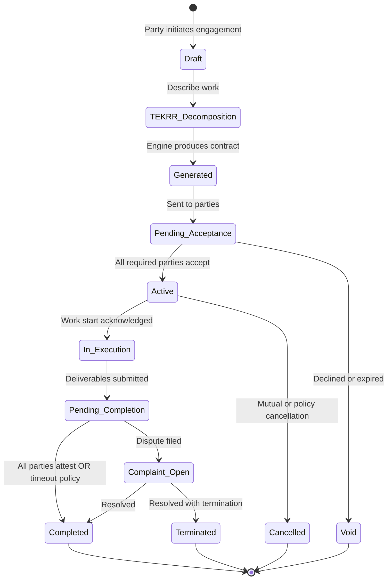
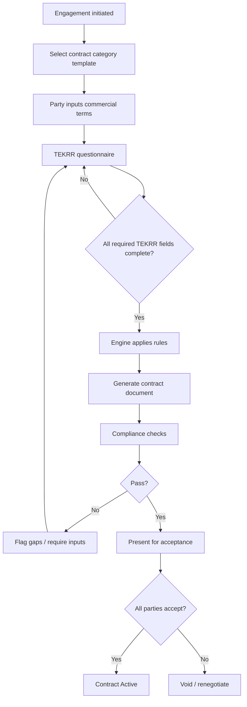
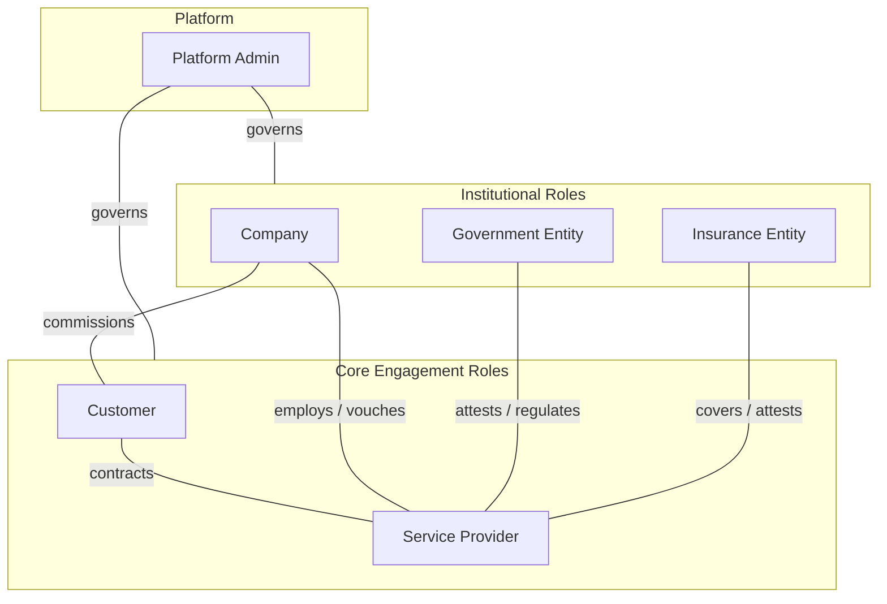
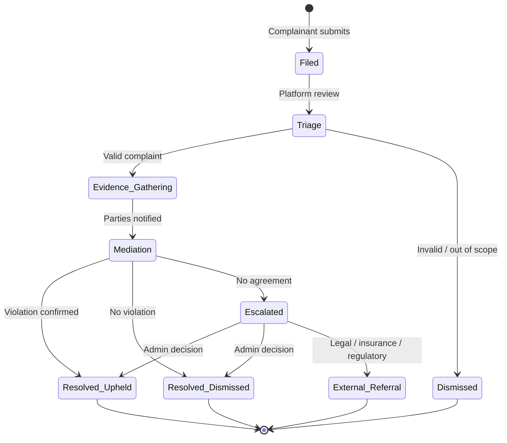
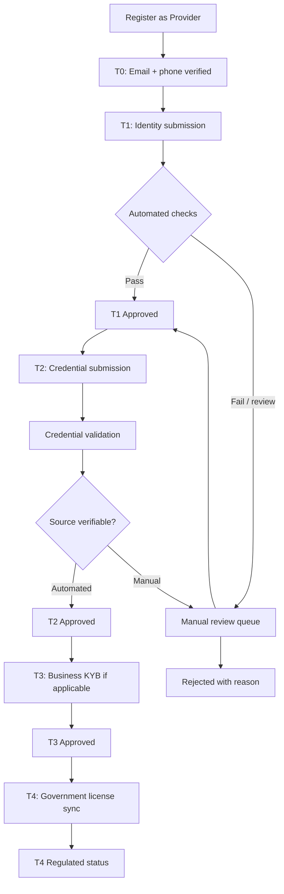

# APP13 — Product Requirements Document (PRD)

**Version:** 2.0  
**Status:** Draft — Awaiting stakeholder approval  
**Last updated:** June 19, 2026  
**Document type:** Product & platform specification (pre-implementation)

---

## Executive summary

APP13 is a **trust and execution platform** — not a service marketplace.

The platform does **not** sell, list, or broker services. It provides the infrastructure through which professional work is **defined, contracted, verified, executed, and held accountable**. Every engagement is decomposed into measurable dimensions of professional obligation, bound by an auto-generated contract, tracked through execution, and governed by a trust system that persists across customers, companies, and regulatory bodies.

**Core systems:** Trust · Contracts · Execution · Complaints

**Primary actors:** Customer · Service Provider · Company · Government Entity · Insurance Entity

This document defines vision, business model, trust framework, contract engine, roles, workflows, and MVP scope. **No application code or UI specifications are included.** Implementation begins only after approval.

---

## Table of contents

1. [Vision](#1-vision)
2. [Business model](#2-business-model)
3. [Trust framework](#3-trust-framework)
4. [Contract engine](#4-contract-engine)
5. [User roles](#5-user-roles)
6. [Complaint workflow](#6-complaint-workflow)
7. [Verification workflow](#7-verification-workflow)
8. [MVP scope](#8-mvp-scope)
9. [Appendices](#9-appendices)

---

## 1. Vision

### 1.1 One-liner

**APP13 is the accountability layer for professional work — decomposing every action into Time, Effort, Knowledge, Risk, and Responsibility, then binding it with verifiable trust, auto-generated contracts, and measurable execution.**

### 1.2 The problem

Professional services fail at the **accountability gap**, not the discovery gap.

| Failure mode | Root cause |
|--------------|------------|
| Scope disputes | Obligations were never formally defined |
| Quality disputes | No shared definition of "done" tied to professional standards |
| Payment disputes | Work dimensions (risk, knowledge) were invisible in pricing |
| Repeat bad actors | Reputation is fragmented, unverifiable, or easily reset |
| Regulatory exposure | Companies and governments lack auditable contract and execution records |
| Insurance gaps | Liability is assumed, not structured or evidenced before work begins |

Existing platforms optimize for **matching** (marketplaces) or **scheduling** (booking apps). APP13 optimizes for **accountability** — what was promised, what was delivered, who bears risk, and what the record shows.

### 1.3 The APP13 model

Professional work is not a single SKU. It is a composition of five irreducible dimensions:

| Dimension | Definition | Platform role |
|-----------|------------|---------------|
| **Time** | Duration, deadlines, availability windows, response SLAs | Quantified and scheduled in contract |
| **Effort** | Physical or operational labor required | Scoped with measurable deliverables |
| **Knowledge** | Expertise, credentials, judgment applied | Linked to verified qualifications |
| **Risk** | Liability exposure, safety hazards, financial downside | Declared, allocated, optionally insured |
| **Responsibility** | Accountability for outcomes, compliance, third-party impact | Assigned to named parties in contract |

Every engagement on APP13 is modeled as a **TEKRR profile** before any work begins. The contract engine materializes this profile into a binding agreement. Trust and execution scores reflect historical performance against TEKRR commitments.

### 1.4 What APP13 is and is not

| APP13 is | APP13 is not |
|----------|--------------|
| A trust and execution infrastructure | A service catalog or marketplace |
| A contract generation and lifecycle system | A payment-first booking app |
| A persistent professional reputation ledger | A star-rating review site |
| A multi-stakeholder accountability network | A two-sided consumer app |
| A platform companies and regulators can audit | A lead-generation tool for providers |

### 1.5 Mission

To make professional accountability **standard, verifiable, and portable** — so that trust is earned from evidence, contracts reflect reality, and execution is measurable.

### 1.6 Strategic outcomes (24-month horizon)

| Outcome | Indicator |
|---------|-----------|
| Contracts precede execution by default | ≥ 95% of engagements have signed contract before start |
| Trust scores are actionable | Companies reject providers below threshold automatically |
| Execution is measurable | TEKRR fulfillment rate tracked per engagement |
| Complaints resolve with evidence | Median resolution time ≤ 10 business days with full audit trail |
| Regulatory readiness | Government entities can query verified contract records |
| Insurance integration | Risk dimension triggers coverage check on eligible engagements |

### 1.7 Design principles

1. **Contract before execution** — No work is recognized by the platform until a contract is generated and accepted.
2. **Evidence over opinion** — Scores derive from verified events, not anonymous ratings alone.
3. **Dimension transparency** — TEKRR decomposition is visible to all contract parties.
4. **Persistent identity** — Provider trust travels with verified identity; it cannot be discarded after a bad engagement.
5. **Multi-stakeholder by design** — Companies, government, and insurance are first-class actors, not afterthoughts.
6. **Neutrality** — APP13 does not sell services, set prices, or take sides in commercial negotiation beyond enforcing contract terms.

---

## 2. Business model

### 2.1 Revenue thesis

APP13 monetizes **accountability infrastructure**, not transaction volume on service sales. Revenue aligns with trust verification, contract lifecycle management, and institutional access to execution records.

### 2.2 Revenue streams

| Stream | Description | Primary payer | Phase |
|--------|-------------|---------------|-------|
| **Contract lifecycle fee** | Fee per executed contract (generation, storage, audit trail, amendments) | Customer, Company, or split per contract template | MVP |
| **Verification fee** | Identity, credential, and entity verification (one-time + renewal) | Service Provider, Company | MVP |
| **Trust & execution API access** | Programmatic access to scores, history, and verification status | Company, Insurance Entity | Phase 2 |
| **Institutional subscription** | Dashboard, bulk verification, compliance reporting, SLA tools | Company, Government Entity | Phase 2 |
| **Insurance referral / integration fee** | Risk-dimension triggers coverage offer; premium share or integration fee | Insurance Entity (rev share) | Phase 2 |
| **Complaint mediation fee** | Optional expedited resolution or third-party mediation | Parties per dispute policy | Phase 2 |
| **Data attestations** | Certified export of contract/execution records for legal or regulatory use | Any party | Phase 3 |

### 2.3 Pricing philosophy

- **Low barrier for individual customers** — Contract fees scaled to engagement complexity (TEKRR weight), not GMV.
- **Value-aligned for companies** — Subscription tied to verified provider pool size and audit capabilities.
- **Free read access for government** — Query and attestation on authorized records (funded by institutional agreements).
- **Insurance pays for risk visibility** — Structured risk data reduces underwriting uncertainty.

### 2.4 Unit economics (conceptual)

```
Revenue per engagement ≈ Contract fee + (Verification amortization) + (Optional insurance touch)
Cost per engagement ≈ Verification processing + Contract storage + Support + (Complaint handling if escalated)
Margin driver = Automation of contract generation + self-service verification + low complaint rate
```

### 2.5 Go-to-market sequence

| Phase | Segment | Wedge |
|-------|---------|-------|
| **MVP** | Individual customers + independent service providers | "Get a real contract before anyone starts work" |
| **Phase 2** | Small/medium companies hiring contractors | Verified provider pool + execution dashboard |
| **Phase 3** | Regulated industries + insurance partners | Risk-dimension insurance triggers + compliance exports |
| **Phase 4** | Government licensing / oversight bodies | Read-only registry and attestation APIs |

### 2.6 What APP13 does not monetize (explicitly)

- Commission on service price (platform is not the seller)
- Pay-for-ranking or promoted listings
- Selling customer leads to providers
- Selling personal data to third parties

---

## 3. Trust framework

### 3.1 Purpose

The Trust Framework is APP13's system for **measuring and presenting verifiable professional credibility**. It replaces opaque reviews with a structured, evidence-based model composed of identity assurance, historical performance, and third-party attestations.

### 3.2 Provider trust profile

Every service provider maintains a persistent **Trust Profile** containing:

| Attribute | Description | Source |
|-----------|-------------|--------|
| **Identity verification status** | Level of identity assurance achieved | Verification workflow |
| **Trust score** | Composite credibility index (0–1000) | Computed |
| **Execution score** | Performance against contracted TEKRR obligations | Computed |
| **Customer history** | Record of past customer engagements and outcomes | Platform records |
| **Contract history** | Complete ledger of contracts, statuses, amendments | Platform records |

These attributes are **platform-owned records** tied to verified identity. They cannot be edited by the provider; they accrue from events.

### 3.3 Trust score — composition

Trust Score answers: *"Can this party be relied upon to enter and honor professional commitments?"*

| Component | Weight (initial) | Inputs |
|-----------|------------------|--------|
| **Identity assurance** | 25% | Verification tier, document validity, liveness, renewal recency |
| **Contract integrity** | 30% | Completion rate, cancellation fault attribution, amendment frequency |
| **Complaint record** | 25% | Complaints filed, upheld/dismissed ratio, severity, recency decay |
| **Third-party attestation** | 15% | Company endorsements, government license validity, insurance standing |
| **Tenure & volume** | 5% | Account age, contract count (confidence modifier, not dominance) |

**Rules:**
- Scores are computed nightly and event-triggered on major events (complaint resolution, verification expiry).
- Recency decay: older events weigh less after 24 months.
- Scores below threshold can restrict contract types (e.g., high-risk TEKRR profiles require minimum Trust Score).
- Score methodology is **published and versioned** (e.g., `trust_score_v1`).

### 3.4 Execution score — composition

Execution Score answers: *"How reliably does this party deliver what the contract specified?"*

Execution is measured **per TEKRR dimension**, then aggregated:

| Dimension | Execution signals |
|-----------|-------------------|
| **Time** | On-time start, deadline adherence, SLA compliance |
| **Effort** | Deliverable submission, milestone completion |
| **Knowledge** | Quality checks, rework rate, credential-matched work |
| **Risk** | Incident reports, safety compliance, insurance claim events |
| **Responsibility** | Acceptance sign-off, regulatory compliance confirmations |

**Per-contract execution rating:**
- Each dimension scored: `fulfilled` · `partially_fulfilled` · `unfulfilled` · `not_applicable`
- Customer and provider can submit execution attestations; conflicts trigger complaint pathway
- Auto-fulfillment from objective signals where possible (timestamp, document upload, IoT/future)

**Aggregate Execution Score (0–1000):**
- Weighted rolling average of last N contracts (N = 20 minimum for full confidence, fewer with confidence band)
- Separate display of per-dimension strengths/weaknesses (not just a single number)

### 3.5 Trust tiers

Verification depth maps to **Trust Tiers** that gate contract complexity:

| Tier | Requirements | Unlocks |
|------|--------------|---------|
| **T0 — Unverified** | Email/phone only | Draft contracts only; cannot execute |
| **T1 — Basic** | Government ID, liveness check | Low-risk contracts (minimal Risk/Responsibility weight) |
| **T2 — Professional** | T1 + credential/license verification | Standard professional contracts |
| **T3 — Enterprise** | T2 + business entity verification (KYB) | High-value, multi-party, company contracts |
| **T4 — Regulated** | T3 + government license sync + insurance standing | Regulated industry contracts, government visibility |

### 3.6 Customer history (on provider profile)

Not a marketing feature — an **evidence ledger**:

- Number of completed contracts
- Repeat customer rate
- Complaints received (count and disposition)
- Average execution score by TEKRR dimension
- Contract types historically performed (TEKRR profile patterns)

**Privacy rule:** Customer identities are not publicly exposed. Public view shows aggregated counts and anonymized patterns. Full detail available to the provider for their own history and to authorized parties (company admin, government query with legal basis).

### 3.7 Contract history (on provider profile)

Immutable, append-only record:

- Contract ID, date, TEKRR profile summary, parties, outcome status
- Execution scores per dimension
- Amendments and complaint linkages (if any)
- Verification snapshot at time of contract (what tier was held when contract signed)

This history **persists beyond account deactivation** in anonymized form for systemic integrity (configurable per jurisdiction).

### 3.8 Third-party trust inputs

| Actor | Trust input |
|-------|-------------|
| **Company** | "Preferred provider" endorsement; workplace access approval; contract vouching |
| **Government Entity** | License validity; sanctions/exclusion list status; compliance certification |
| **Insurance Entity** | Coverage confirmation; claim history flag (not detail); risk eligibility status |

Third-party inputs are **attestations**, not score overrides. A government license revocation triggers score recalculation; it does not manually set a score.

### 3.9 Trust score governance

- **Transparency:** Providers see their score breakdown and contributing events.
- **Appeals:** Providers can dispute incorrect underlying events (not the algorithm).
- **Versioning:** Algorithm changes apply prospectively; historical scores archived with version tag.
- **Anti-gaming:** Sybil detection, collusive five-star execution attestation patterns flagged.

---

## 4. Contract engine

### 4.1 Purpose

The Contract Engine is APP13's core product. It transforms a described professional engagement into a **structured, signed, auditable contract** before execution begins.

The platform does not negotiate commercial terms on behalf of parties. It **generates the contractual framework** from TEKRR inputs and party data, ensuring all five dimensions are explicitly addressed.

### 4.2 Contract lifecycle



**Invariant:** Platform recognizes no execution phase unless contract status is `Active`.

### 4.3 TEKRR decomposition model

Every contract is built on a **TEKRR Profile** — a structured declaration of the engagement:

#### Time
- Estimated duration (hours/days)
- Scheduled start and end
- Milestone dates
- Response and communication SLAs
- Late completion consequences (from template library)

#### Effort
- Deliverables list ( countable, verifiable items )
- Location of work (on-site, remote, hybrid)
- Materials/equipment responsibility
- Excluded work (explicit scope boundaries)

#### Knowledge
- Required credentials/licenses (linked to verification records)
- Standard of care reference (trade standards, regulations)
- Supervision requirements
- Documentation deliverables (permits, reports)

#### Risk
- Risk classification level (1–5)
- Hazard declarations
- Insurance requirements (type, minimum coverage)
- Liability allocation (provider, customer, company)
- Indemnification clauses (from approved template set)

#### Responsibility
- Named responsible parties per deliverable
- Compliance obligations (permits, inspections)
- Third-party impact (subcontractors, tenants, public)
- Acceptance criteria (who signs off, by when)
- Warranty/guarantee period

Each dimension has **required fields** based on contract category. The engine rejects generation if mandatory TEKRR fields are incomplete.

### 4.4 Contract generation process



**Engine inputs:**
- Contract category (e.g., home repair, IT consulting, healthcare aide, construction subcontract)
- Party identities and verification tiers
- Commercial terms (price, payment schedule — **entered by parties**, not set by APP13)
- TEKRR profile responses
- Applicable jurisdiction
- Optional: company policy overlays, insurance requirements, government-mandated clauses

**Engine outputs:**
- Human-readable contract document (PDF + structured JSON)
- Machine-readable obligation graph (for execution tracking)
- Audit hash (document integrity)
- Signature capture records

### 4.5 Contract templates and rules

| Layer | Owner | Description |
|-------|-------|-------------|
| **Base templates** | APP13 | Category-specific TEKRR question sets and clause library |
| **Jurisdiction packs** | APP13 (+ legal review) | Regional regulatory clauses |
| **Company overlays** | Company | Additional mandatory terms for their engagements |
| **Government mandates** | Government Entity | Required clauses for regulated categories |
| **Insurance riders** | Insurance Entity | Coverage-linked clauses when policy bound |

Templates are **versioned**. Contracts reference exact template versions for reproducibility.

### 4.6 Multi-party contracts

Contracts may involve multiple actor types simultaneously:

| Pattern | Parties | Example |
|---------|---------|---------|
| **Direct** | Customer + Provider | Homeowner hires electrician |
| **Company-mediated** | Company + Provider (+ Customer optional) | Property manager hires contractor for tenant |
| **Insured** | Customer + Provider + Insurance Entity | Roofing work with liability coverage confirmation |
| **Regulated** | Customer + Provider + Government Entity | Licensed plumbing with permit tracking |

Each party has a defined **role in the contract** with specific acceptance requirements and obligations.

### 4.7 Amendments

- Amendments require TEKRR delta declaration (what dimension changed)
- All affected parties must re-accept
- Amendment chain preserved in contract history
- Execution tracking adjusts to amended obligation graph

### 4.8 Execution binding

Once Active, the contract's obligation graph drives the **Execution Tracker**:

| Obligation type | Tracking mechanism |
|-----------------|-------------------|
| Time milestone | Timestamp + optional GPS/check-in |
| Effort deliverable | Document upload, photo evidence, checklist |
| Knowledge requirement | Credential re-verification at execution time |
| Risk compliance | Insurance confirmation token, safety checklist |
| Responsibility sign-off | Named party digital acceptance |

### 4.9 Contract storage and integrity

- Canonical structured record in platform database
- Rendered PDF with cryptographic hash
- Immutable event log (created, viewed, accepted, amended, completed)
- Optional: future blockchain anchoring for timestamp proof (Phase 3, not MVP)

---

## 5. User roles

### 5.1 Role architecture

All actors authenticate as **platform identities** with one or more **role bindings**. Roles determine capabilities, not separate accounts (except where entity type requires organizational account).



### 5.2 Customer

**Definition:** An individual or sole party engaging a service provider for a professional action.

| Capability | Description |
|------------|-------------|
| Initiate engagement | Start TEKRR decomposition and contract generation |
| Accept / decline contracts | Binding acceptance with identity verification |
| Track execution | View obligation status against contract |
| Attest execution | Confirm or dispute TEKRR fulfillment |
| File complaint | Open formal complaint linked to contract |
| View provider trust profile | Trust score, execution score, aggregated history |
| Maintain customer record | Own contract history and complaint history |

**Constraints:** Cannot execute contracts with unverified identity beyond T0 drafts. High-risk contracts may require minimum provider Trust Tier.

### 5.3 Service Provider

**Definition:** An individual or sole proprietor performing professional actions.

| Capability | Description |
|------------|-------------|
| Complete verification | Progress through Trust Tiers |
| Receive contract invitations | Review and accept/decline generated contracts |
| Manage TEKRR profile inputs | Provide effort, knowledge, risk declarations |
| Execute and report | Submit deliverables, milestones, compliance evidence |
| Maintain trust profile | View (not edit) trust score, execution score, histories |
| Respond to complaints | Provide evidence, accept remediation |
| Bind insurance | Link insurance attestation to risk dimension |

**Constraints:** Cannot begin execution without Active contract. Trust Tier gates eligible contract categories.

### 5.4 Company

**Definition:** An organization that engages providers on behalf of itself, customers, or assets — or vouches for providers in its network.

| Capability | Description |
|------------|-------------|
| Organization verification (KYB) | Achieve Company trust status |
| Manage provider relationships | Preferred lists, blocked lists, endorsement |
| Initiate or co-sign contracts | Company-mediated engagements |
| Apply policy overlays | Mandatory clauses on company contracts |
| Bulk trust queries | Dashboard of provider scores in network |
| Execution oversight | View execution status across company contracts |
| Company complaint filing | File on behalf of affected customer/asset |

**Sub-roles (RBAC within Company):**
- **Org Admin** — verification, policies, billing
- **Contract Manager** — initiate/approve contracts
- **Viewer** — read-only audit access

**MVP note:** Company is defined in the PRD but **limited to read-only provider lookup** in MVP (see Section 8). Full company-mediated contracts in Phase 2.

### 5.5 Government Entity

**Definition:** A licensing body, regulator, or authorized public agency with legitimate interest in professional accountability.

| Capability | Description |
|------------|-------------|
| Entity verification | Authorized government account |
| License registry sync | Publish/update license validity for providers |
| Mandatory clause injection | Require regulatory clauses for categories |
| Authorized record query | Search contract/verification records by license ID, provider ID (within legal scope) |
| Sanctions / exclusion flags | Mark providers as excluded from regulated contracts |
| Compliance attestation | Confirm regulatory compliance events post-execution |

**Constraints:** No commercial role. Cannot initiate consumer contracts. All queries audit-logged. Data access scoped by jurisdiction and legal agreement.

**MVP note:** Manual admin-facilitated government actions only (see Section 8).

### 5.6 Insurance Entity

**Definition:** An insurer or underwriting agency providing coverage attestation linked to contract risk dimensions.

| Capability | Description |
|------------|-------------|
| Entity verification | Authorized insurance account |
| Coverage attestation API | Confirm/invalidate coverage for provider + contract type |
| Risk eligibility rules | Define which TEKRR risk profiles are insurable |
| Claim event notification | Report claim existence (not details) affecting execution/trust |
| Insurance rider templates | Provide optional clause modules |

**Constraints:** No access to commercial terms beyond risk-relevant fields. Cannot modify trust scores directly.

**MVP note:** Insurance Entity not in MVP execution path; risk dimension captured but coverage is manual attestation field (see Section 8).

### 5.7 Platform Admin

Internal APP13 operators with RBAC:

| Sub-role | Scope |
|----------|-------|
| **Verification Analyst** | Process identity/credential reviews |
| **Complaint Adjudicator** | Mediate and resolve complaints |
| **Trust Operations** | Score appeals, fraud investigation |
| **Institutional Admin** | Onboard government/insurance/company entities |
| **Super Admin** | Template management, system configuration |

---

## 6. Complaint workflow

### 6.1 Purpose

Complaints are APP13's **formal accountability mechanism** when execution attestation fails or trust is broken. Complaints are always **linked to a specific contract** and TEKRR dimension(s). There are no "general reviews."

### 6.2 Complaint types

| Type | TEKRR dimension | Example |
|------|-----------------|---------|
| **Time breach** | Time | Provider missed deadline by > agreed threshold |
| **Effort deficiency** | Effort | Deliverables incomplete or not as scoped |
| **Knowledge misrepresentation** | Knowledge | Work performed without claimed credential |
| **Risk incident** | Risk | Safety incident, uninsured work performed |
| **Responsibility failure** | Responsibility | Required sign-off or compliance step skipped |
| **Contract integrity** | Cross-cutting | Work started before contract active, unauthorized amendment |

### 6.3 Complaint lifecycle



### 6.4 Filing rules

- **Who can file:** Any contract party (Customer, Provider, Company co-signer)
- **Window:** Within configurable period after contract completion or incident date (default: 30 days)
- **Required fields:** Contract ID, TEKRR dimension(s), factual description, evidence attachments
- **One active complaint per dimension per contract** (prevents spam); amendments to scope require admin approval

### 6.5 Triage (platform)

Within **2 business days** of filing:

| Check | Action if failed |
|-------|------------------|
| Contract exists and was Active | Dismiss — no standing |
| Filing within window | Dismiss — out of time |
| Dimension was in contract | Dismiss — out of scope |
| Duplicate active complaint | Merge or reject |

Valid complaints move to **Evidence Gathering** — both parties notified, execution record frozen for disputed dimensions.

### 6.6 Evidence and mediation

| Step | Description |
|------|-------------|
| **Evidence submission** | Both parties upload documents, timestamps, messages (platform-recorded only) |
| **Auto-evidence pull** | Platform attaches contract, execution tracker data, verification snapshot |
| **Mediation period** | 5 business days for mutual resolution proposal |
| **Platform recommendation** | Non-binding suggested outcome based on evidence + TEKRR obligation graph |

Mutual agreement → resolved with logged terms (e.g., partial execution score adjustment, acknowledged remediation).

### 6.7 Adjudication outcomes

| Outcome | Trust impact | Execution impact |
|---------|--------------|------------------|
| **Upheld — provider fault** | Trust score penalty (severity-scaled) | Dimension marked `unfulfilled` |
| **Upheld — customer fault** | Minor/no provider penalty | Provider dimension protected |
| **Dismissed** | No penalty; frivolous flag if pattern detected | Original attestation stands |
| **Shared fault** | Partial penalties | Partial fulfillment recorded |
| **External referral** | Pending flag until external outcome | Frozen until return |

### 6.8 Escalation paths

| Trigger | Escalation target |
|---------|-------------------|
| Risk dimension + incident | Insurance Entity notification (if coverage was attested) |
| Knowledge dimension + license issue | Government Entity notification (if regulated category) |
| Company-mediated contract | Company Contract Manager included in all stages |
| Criminal or safety matter | Platform admin immediate escalation + jurisdiction guidance |

APP13 **mediates platform accountability**; it does not replace courts, insurers, or regulators.

### 6.9 Complaint impact on scores

- **Trust score:** Complaint upheld events apply penalty with recency decay. Pattern detection (3+ upheld in 12 months) triggers Trust Tier downgrade review.
- **Execution score:** Upheld complaints finalize dimension execution rating. Pending complaints exclude contract from aggregate score until resolved.
- **Visibility:** Upheld complaints appear on provider history as disposition summary (not full narrative) unless public interest (regulatory).

### 6.10 SLA summary

| Stage | Target |
|-------|--------|
| Triage | 2 business days |
| Evidence period | 5 business days |
| Mediation | 5 business days |
| Admin adjudication (if escalated) | 5 business days |
| **Total median resolution** | **≤ 10 business days** |

---

## 7. Verification workflow

### 7.1 Purpose

Verification establishes **identity assurance** — the foundation of trust. Without verification, contracts cannot activate. Verification is tiered, renewable, and auditable.

### 7.2 Verification objects

| Object | Applies to | Examples |
|--------|------------|----------|
| **Identity (KYC)** | Customer, Provider | Government ID, liveness, address |
| **Business (KYB)** | Company, Provider (business) | Registration, beneficial owners, tax ID |
| **Credential** | Provider | Trade license, professional certification, degree |
| **Entity authorization** | Government, Insurance | Authorized representative docs, jurisdiction scope |
| **Insurance standing** | Provider | Policy validity, coverage types, limits |

### 7.3 Service Provider verification flow



### 7.4 Verification tiers (mapped to Trust Tiers T0–T4)

| Tier | Required verifications | Renewal |
|------|------------------------|---------|
| **T0** | Email + phone OTP | N/A |
| **T1** | Government ID + liveness + name match | 24 months |
| **T2** | T1 + ≥1 credential in declared trade | Credential expiry-driven |
| **T3** | T2 + business registration (if entity) | 12 months KYB refresh |
| **T4** | T3 + government license attestation + insurance minimum | License period + 12 months insurance |

### 7.5 Verification methods

| Method | Use case | MVP |
|--------|----------|-----|
| **Automated ID scan** | T1 identity | Yes (third-party KYC provider) |
| **Liveness detection** | T1 anti-fraud | Yes |
| **Credential upload + manual review** | T2 | Yes |
| **Registry API lookup** | T2/T4 license verification | Phase 2 (manual in MVP) |
| **KYB document review** | T3 | Phase 2 (manual in MVP) |
| **Insurance API attestation** | T4 risk contracts | Phase 2 (self-declared in MVP) |

### 7.6 Customer verification

Customers require **minimum T1** to activate (sign) contracts. Lighter path than providers:

1. Email + phone verification
2. Identity verification (T1) before first contract acceptance
3. Re-verification on identity expiry or high-risk contract category

### 7.7 Company verification (Phase 2 full; MVP stub)

1. Authorized representative T1 identity
2. Business registration documents
3. Beneficial ownership declaration
4. Platform approval → Company account active
5. Annual KYB refresh

### 7.8 Government Entity verification

1. Official domain email + authorized letter upload
2. Platform Institutional Admin review
3. Jurisdiction and scope configuration (which categories, which query permissions)
4. All actions audit-logged; public official contact on file

### 7.9 Insurance Entity verification

1. Regulatory registration proof
2. API credential issuance for attestation endpoints
3. Coverage rule configuration by TEKRR risk profile
4. Periodic re-verification annually

### 7.10 Verification states

| State | Meaning |
|-------|---------|
| `not_started` | Tier not attempted |
| `pending` | Documents submitted, in review |
| `approved` | Tier achieved |
| `rejected` | Failed; reason provided; re-submit allowed |
| `expired` | Previously approved, renewal overdue |
| `suspended` | Fraud flag or admin action |

**Expired or suspended verification:**
- Cannot activate new contracts at that tier
- Active contracts may continue per policy overlay or enter grace period (30 days MVP default)

### 7.11 Verification data handling

- Documents stored encrypted; access restricted to Verification Analyst role
- Retention per jurisdiction (minimum: life of account + 7 years for audit)
- Provider can export own verification certificates; third parties see status only, not documents
- Right to deletion balanced against contract audit requirements (anonymize, don't purge contract-linked verification snapshots)

---

## 8. MVP scope

### 8.1 MVP definition

**MVP proves the core loop:**

> Verify identity → Decompose work (TEKRR) → Auto-generate contract → Execute with tracking → Attest fulfillment → (Complaint if needed) → Update trust & execution scores

**MVP does not prove:** full institutional integration, insurance API, government registry sync, or marketplace discovery.

### 8.2 MVP actors

| Actor | MVP inclusion |
|-------|---------------|
| **Customer** | Full |
| **Service Provider** | Full |
| **Company** | Stub — view provider trust profiles only; no company-mediated contracts |
| **Government Entity** | Manual admin proxy only (no self-service portal) |
| **Insurance Entity** | Not a live actor — risk dimension captured as self-declared coverage field |
| **Platform Admin** | Full operational tooling |

### 8.3 MVP feature matrix

| System | Feature | In MVP |
|--------|---------|--------|
| **Trust** | T0–T2 provider verification | Yes |
| **Trust** | T1 customer verification | Yes |
| **Trust** | Trust score v1 (identity + contract + complaint components) | Yes |
| **Trust** | Execution score v1 (manual attestation) | Yes |
| **Trust** | Provider trust profile (public summary) | Yes |
| **Trust** | Customer history / contract history on provider | Yes (aggregated) |
| **Trust** | Third-party attestation (company/gov/insurance) | No — Phase 2 |
| **Contracts** | TEKRR decomposition wizard | Yes |
| **Contracts** | Auto-generation from 3–5 category templates | Yes |
| **Contracts** | Multi-party acceptance (Customer + Provider) | Yes |
| **Contracts** | PDF + structured record + audit log | Yes |
| **Contracts** | Amendments | Yes (basic) |
| **Contracts** | Company overlays / gov mandates / insurance riders | No |
| **Execution** | Obligation checklist from contract | Yes |
| **Execution** | Milestone + deliverable upload | Yes |
| **Execution** | Dual-party attestation (confirm/dispute) | Yes |
| **Execution** | Auto time-tracking (check-in timestamp) | Yes |
| **Complaints** | File linked to contract + TEKRR dimension | Yes |
| **Complaints** | Triage + evidence + admin adjudication | Yes |
| **Complaints** | Automated mediation recommendations | No — Phase 2 |
| **Complaints** | Insurance / gov escalation notifications | No — manual admin |
| **Verification** | Automated KYC (T1) | Yes |
| **Verification** | Credential upload + manual review (T2) | Yes |
| **Verification** | KYB (T3), license sync (T4) | No — Phase 2 |
| **Platform** | Admin: verification queue | Yes |
| **Platform** | Admin: complaint adjudication | Yes |
| **Platform** | Admin: template management (limited) | Yes |
| **Platform** | Contract lifecycle fee billing | Yes (Stripe) |
| **Platform** | Discovery / search / marketplace listings | **No — explicitly out of scope** |
| **Platform** | In-app messaging | No — Phase 2 (email notifications MVP) |
| **Platform** | Mobile native apps | No — responsive web |

### 8.4 MVP contract categories (initial)

Launch with **3–5 categories** where TEKRR decomposition is well-defined:

1. **Home maintenance / repair** (effort + risk heavy)
2. **Professional consulting** (knowledge + time heavy)
3. **Personal care / aide services** (responsibility + knowledge heavy)
4. **Event services** (time + effort heavy)
5. **Tutoring / instruction** (knowledge + time heavy)

Each category has a validated TEKRR question set and clause template pack.

### 8.5 MVP user flows (conceptual — not UI)

**Flow A — First engagement:**
1. Customer registers, completes T1 verification
2. Customer initiates engagement, selects category, describes work
3. Customer completes TEKRR questionnaire
4. Customer invites Provider (by email/link — no marketplace browse)
5. Provider registers/completes T1+T2 verification
6. Provider reviews TEKRR inputs, adds provider-side declarations
7. Contract engine generates contract
8. Both parties accept → Active
9. Provider executes, submits evidence
10. Customer attests TEKRR dimensions
11. Contract Completed → scores updated

**Flow B — Complaint:**
1. Customer attests `partially_fulfilled` on Effort dimension
2. Provider disputes → complaint auto-suggested or customer files
3. Admin triages, collects evidence
4. Admin resolves upheld/dismissed
5. Scores and history updated

### 8.6 MVP non-goals (explicit)

- Service listings, search rankings, or browse-by-category provider discovery
- Platform-set pricing or service packages
- Payment escrow or disbursement (parties handle payment off-platform or declare terms in contract; payment tracking is Phase 2)
- Real-time chat
- Company-initiated contracts
- Government self-service portal
- Insurance API integration
- ML-based trust scoring or fraud detection

### 8.7 MVP success criteria

| Criterion | Target |
|-----------|--------|
| End-to-end contract completion (happy path) | Works without admin intervention |
| Contract generated before execution | 100% enforcement |
| Verification gate before acceptance | 100% enforcement |
| Complaint resolution (median) | ≤ 15 business days (relaxed from 10 for MVP manual ops) |
| Trust score updates after contract/complaint | Within 24 hours |
| Provider can onboard and reach T2 | ≤ 48h (excluding manual credential review backlog) |

### 8.8 MVP technical boundaries (for future architecture doc — not implementation)

- Single jurisdiction legal template pack
- English language only
- Web application (responsive)
- PostgreSQL + object storage for documents
- Third-party KYC provider integration
- Email notifications only
- Monolithic application acceptable

### 8.9 Phase 2 preview (post-MVP, not in scope)

- Company-mediated contracts and policy overlays
- Payment schedule tracking and escrow
- Insurance Entity attestation API
- Government license registry integration
- Trust & execution API for institutional subscribers
- Additional contract categories and jurisdictions
- In-app messaging and richer execution evidence types

---

## 9. Appendices

### Appendix A — Glossary

| Term | Definition |
|------|------------|
| **TEKRR** | Time, Effort, Knowledge, Risk, Responsibility — the five dimensions of professional action |
| **Trust Score** | Composite index of professional credibility based on verification, history, and complaints |
| **Execution Score** | Performance index against TEKRR obligations in completed contracts |
| **Trust Profile** | Persistent provider record of verification, scores, and histories |
| **Contract Engine** | System that generates binding contracts from TEKRR profiles and templates |
| **Attestation** | Formal confirmation of a fact by a party or authorized third party |
| **Active Contract** | Contract accepted by all required parties; execution may begin |
| **Accountability gap** | Failure caused by undefined obligations, unverified identity, or missing execution record |

### Appendix B — TEKRR example (home electrical repair)

| Dimension | Declared value |
|-----------|----------------|
| **Time** | 4 hours on-site; completion by March 15; 2-hour response SLA |
| **Effort** | Replace 3 outlets, install 1 GFCI, test circuit |
| **Knowledge** | Licensed electrician (T2 credential required) |
| **Risk** | Level 3 — live wiring exposure; $1M liability insurance required |
| **Responsibility** | Provider obtains permit; customer provides access; provider warrants 12 months |

### Appendix C — Open decisions requiring approval

| # | Decision | Options | Recommendation |
|---|----------|---------|----------------|
| 1 | MVP launch jurisdiction | US state / EU country / other | Single US state with favorable contract law |
| 2 | KYC provider | Persona / Onfido / Jumio | Evaluate cost + API maturity |
| 3 | Contract fee payer default | Customer / Provider / split | Customer initiator pays |
| 4 | Off-platform payment stance | Acknowledge in contract only / integrate Stripe escrow Phase 2 | Acknowledge only in MVP |
| 5 | Initial contract categories | 3 vs 5 | 3 for depth over breadth |
| 6 | Provider invitation model | Email invite only / shareable link | Both |

### Appendix D — Approval checklist

Before implementation begins, stakeholders must confirm:

- [ ] Vision and "not a marketplace" positioning approved
- [ ] TEKRR model accepted as core decomposition framework
- [ ] Trust score v1 weightings approved (or adjusted)
- [ ] Contract engine lifecycle and invariants approved
- [ ] All five actor roles accepted with MVP boundaries
- [ ] Complaint workflow and SLAs approved
- [ ] Verification tiers T0–T2 MVP scope approved
- [ ] MVP non-goals explicitly accepted (no discovery, no payments)
- [ ] Open decisions in Appendix C resolved

---

**Status: AWAITING APPROVAL**

Upon approval, next deliverables will be:
1. Architecture Decision Records (ADR) — data model, contract engine design, scoring algorithms
2. Legal review brief for initial template pack
3. Technical specification (still pre-code)

*No code or UI specifications will be produced until this PRD is approved.*

---

*End of document.*
