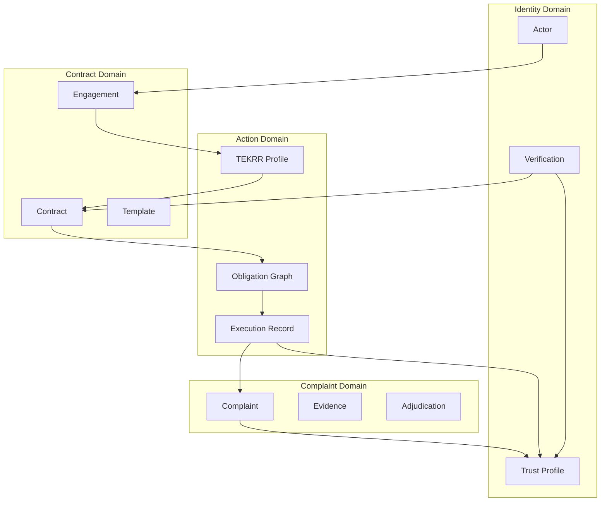
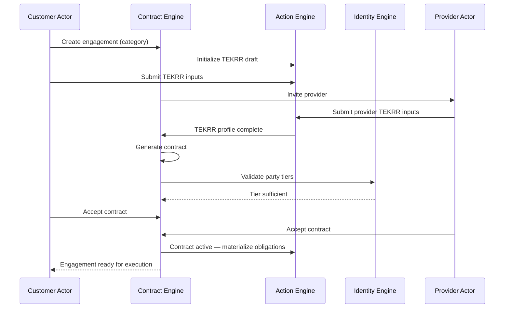
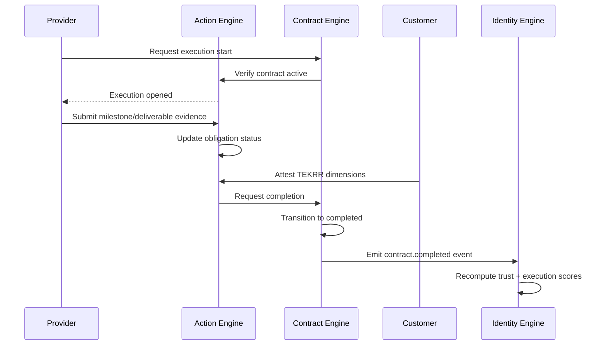
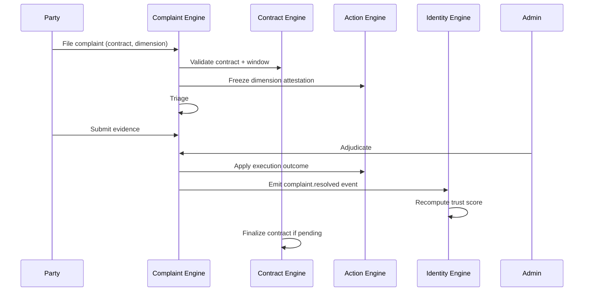

# APP13 — Business Architecture v1

**Version:** 1.0  
**Status:** Draft  
**Scope:** Identity · Action · Contract · Complaint engines

---

## 1. Architectural intent

APP13 is organized as a **modular platform core** of four cooperating engines. Each engine owns a bounded domain, exposes well-defined capabilities to other engines, and persists data through shared infrastructure governed by clear ownership rules.

The platform does not implement marketplace, payment, or discovery domains in the core architecture. Those remain external or future bounded contexts.

---

## 2. Domain model

### 2.1 Core domain concepts



### 2.2 Bounded contexts

| Context | Owns | Does not own |
|---------|------|--------------|
| **Identity** | Actor registry, credentials, verification state, trust/execution score computation, trust profiles | Contract text, TEKRR input forms, complaint rulings |
| **Action** | TEKRR profiles, obligation graphs, execution events, attestation state, execution score inputs | Legal contract rendering, identity document storage |
| **Contract** | Engagements, templates, generated contracts, acceptance records, amendments, contract status | Raw execution evidence, complaint outcomes |
| **Complaint** | Complaint cases, evidence packages, mediation state, adjudication outcomes | Trust score formulas, contract generation rules |

### 2.3 Supporting contexts (outside core v1)

| Context | Relationship to core |
|---------|-------------------|
| **Billing** | Listens to `contract.activated` for lifecycle fees; listens to `verification.approved` for verification fees |
| **Notification** | Subscribes to all engine events; no business logic |
| **Audit** | Append-only log of cross-engine actions; required for admin and institutional queries |
| **Document Storage** | Stores PDFs, uploads, verification docs; engines store references only |

---

## 3. Engine topology

### 3.1 Platform layer diagram

```
┌─────────────────────────────────────────────────────────────────────────┐
│                         APP13 Platform Core v1                           │
├─────────────────────────────────────────────────────────────────────────┤
│  ┌──────────────┐  ┌──────────────┐  ┌──────────────┐  ┌─────────────┐ │
│  │   Identity   │  │    Action    │  │   Contract   │  │  Complaint  │ │
│  │    Engine    │  │    Engine    │  │    Engine    │  │   Engine    │ │
│  └──────┬───────┘  └──────┬───────┘  └──────┬───────┘  └──────┬──────┘ │
│         │                 │                 │                 │         │
│         └─────────────────┴────────┬────────┴─────────────────┘         │
│                                    │                                     │
│                         ┌──────────▼──────────┐                          │
│                         │   Event Bus /       │                          │
│                         │   Domain Events     │                          │
│                         └──────────┬──────────┘                          │
│                                    │                                     │
│         ┌──────────────────────────┼──────────────────────────┐         │
│         ▼                          ▼                          ▼         │
│  ┌─────────────┐          ┌─────────────┐          ┌─────────────┐     │
│  │  PostgreSQL │          │  Object     │          │  Audit Log  │     │
│  │  (entities) │          │  Storage    │          │  (append)   │     │
│  └─────────────┘          └─────────────┘          └─────────────┘     │
└─────────────────────────────────────────────────────────────────────────┘
         ▲                          ▲
         │                          │
┌────────┴────────┐        ┌─────────┴─────────┐
│ External KYC    │        │ Email / Webhooks  │
│ Provider        │        │ (Phase 2 APIs)    │
└─────────────────┘        └───────────────────┘
```

### 3.2 Engine responsibility matrix

| Capability | Identity | Action | Contract | Complaint |
|------------|:--------:|:------:|:--------:|:---------:|
| Register actor | ● | | | |
| Verify identity/credentials | ● | | | |
| Compute trust score | ● | | | |
| Compute execution score | ● | ○ inputs | | ○ inputs |
| Define TEKRR profile | | ● | ○ reads | ○ reads |
| Build obligation graph | | ● | ○ triggers | |
| Track execution | | ● | ○ gates | ○ freezes |
| Initiate engagement | | | ● | |
| Generate contract | | ○ TEKRR | ● | |
| Accept/activate contract | ○ tier check | | ● | |
| Amend contract | | ○ delta | ● | |
| File complaint | | | ○ link | ● |
| Adjudicate dispute | | ○ outcome | | ● |
| Publish trust profile | ● | | | |

● = primary owner · ○ = consumer or contributor

---

## 4. Cross-engine interaction patterns

### 4.1 Primary engagement sequence



### 4.2 Execution and scoring sequence



### 4.3 Complaint sequence



---

## 5. Domain events catalog

Events are the **integration contract** between engines. All engines publish to a shared event bus; subscribers react idempotently.

### 5.1 Identity Engine events

| Event | Payload summary | Subscribers |
|-------|-----------------|-------------|
| `actor.registered` | actor_id, actor_type | Audit, Notification |
| `verification.submitted` | actor_id, tier, verification_id | Audit, Notification |
| `verification.approved` | actor_id, tier, expires_at | Contract, Billing, Notification |
| `verification.rejected` | actor_id, tier, reason | Notification |
| `verification.expired` | actor_id, tier | Contract, Notification |
| `trust_score.updated` | actor_id, score, version, breakdown | Audit |
| `execution_score.updated` | actor_id, score, version, breakdown | Audit |

### 5.2 Action Engine events

| Event | Payload summary | Subscribers |
|-------|-----------------|-------------|
| `tekrr.draft_created` | engagement_id, category | Audit |
| `tekrr.completed` | engagement_id, profile_id | Contract |
| `tekrr.amended` | engagement_id, delta, profile_version | Contract |
| `obligation.created` | contract_id, obligation_ids[] | Audit |
| `execution.started` | contract_id, started_at | Audit, Notification |
| `execution.evidence_submitted` | contract_id, obligation_id | Notification |
| `execution.attestation_recorded` | contract_id, dimension, status | Complaint, Contract |
| `execution.dimension_frozen` | contract_id, dimension, complaint_id | Contract |

### 5.3 Contract Engine events

| Event | Payload summary | Subscribers |
|-------|-----------------|-------------|
| `engagement.created` | engagement_id, initiator_id, category | Audit, Notification |
| `engagement.provider_invited` | engagement_id, provider_id | Notification |
| `contract.generated` | contract_id, engagement_id, version | Audit, Notification |
| `contract.party_accepted` | contract_id, party_id | Contract (orchestration) |
| `contract.activated` | contract_id, parties[] | Action, Billing, Identity, Notification |
| `contract.amended` | contract_id, amendment_id | Action, Audit, Notification |
| `contract.completed` | contract_id, outcome | Identity, Billing, Audit |
| `contract.cancelled` | contract_id, reason, fault_party | Identity, Audit |
| `contract.voided` | contract_id, reason | Audit |

### 5.4 Complaint Engine events

| Event | Payload summary | Subscribers |
|-------|-----------------|-------------|
| `complaint.filed` | complaint_id, contract_id, dimension | Audit, Notification |
| `complaint.triaged` | complaint_id, status | Notification |
| `complaint.evidence_requested` | complaint_id, party_id | Notification |
| `complaint.mediation_started` | complaint_id | Notification |
| `complaint.resolved` | complaint_id, outcome, fault, severity | Identity, Action, Contract, Audit |
| `complaint.escalated_external` | complaint_id, target_type | Audit, Notification |

---

## 6. Business rules (cross-cutting)

### 6.1 Gating rules

| Rule ID | Rule | Enforced by |
|---------|------|-------------|
| BR-001 | Customer must be ≥ T1 to accept contract | Identity → Contract |
| BR-002 | Provider must be ≥ category minimum tier to accept | Identity → Contract |
| BR-003 | TEKRR profile must be `complete` before generation | Action → Contract |
| BR-004 | All required parties must accept before `active` | Contract |
| BR-005 | Execution cannot start unless contract is `active` | Contract → Action |
| BR-006 | High-risk TEKRR (risk level ≥ 4) requires provider ≥ T2 | Identity → Contract |
| BR-007 | Complaint must reference valid contract + TEKRR dimension | Contract + Action → Complaint |
| BR-008 | Trust score uses only verified events | Identity |

### 6.2 Data ownership rules

| Data | Authoritative engine | Others may |
|------|---------------------|------------|
| Actor identity | Identity | Read tier status |
| Verification documents | Identity (via storage refs) | None |
| TEKRR profile | Action | Contract reads snapshot |
| Contract PDF / JSON | Contract | Read via party authorization |
| Obligation status | Action | Complaint reads; Contract reads summary |
| Complaint outcome | Complaint | Identity reads for scoring |
| Trust score | Identity | Read published profile |

### 6.3 Consistency model

- **Strong consistency** within a single engine transaction (e.g., contract acceptance + status update).
- **Eventual consistency** for score recomputation (target: ≤ 24 hours; MVP: synchronous on major events acceptable).
- **Snapshot immutability** — Contract stores TEKRR snapshot and verification tier snapshot at activation time; later tier changes do not retroactively alter active contract requirements.

---

## 7. Actor model (business layer)

### 7.1 Actor types

| Actor type | Identity representation | Primary engines used |
|------------|------------------------|----------------------|
| Customer | Individual actor | Contract, Action, Complaint |
| Service Provider | Individual or sole-prop actor | Identity, Contract, Action, Complaint |
| Company | Organizational actor + members | Identity (Phase 2), Contract (Phase 2) |
| Government Entity | Institutional actor + authorized reps | Identity (Phase 2), Complaint (escalation) |
| Insurance Entity | Institutional actor + API credentials | Identity (Phase 2), Action (risk attestation) |
| Platform Admin | Staff actor with admin roles | All engines (operational) |

### 7.2 Actor lifecycle (Identity Engine)

```
registered → contact_verified → identity_verified (T1) → [credential_verified (T2)]
    → [entity_verified (T3)] → [regulated_verified (T4)]
         ↓ any stage
    suspended → [reinstated] OR deactivated
```

---

## 8. Integration boundaries

### 8.1 MVP integrations

| Integration | Engine | Direction | Purpose |
|-------------|--------|-----------|---------|
| KYC provider (e.g., Persona) | Identity | Outbound | T1 automated verification |
| Object storage (S3/R2) | All | Outbound | Documents, evidence, PDFs |
| Email provider | Notification | Outbound | Transactional messages |
| Stripe Billing | Billing | Outbound | Contract + verification fees |

### 8.2 Phase 2 integrations

| Integration | Engine | Purpose |
|-------------|--------|---------|
| License registry API | Identity | T4 credential validation |
| Insurance attestation API | Identity + Action | Risk dimension coverage confirmation |
| Government query API | Contract + Identity | Authorized record access |
| Webhook subscriptions | All | Institutional event consumers |

---

## 9. Non-functional architecture

| Concern | Approach |
|---------|----------|
| **Availability** | Monolith acceptable MVP; engines as logical modules |
| **Auditability** | Append-only audit log for all state transitions |
| **Security** | Engine-level authorization checks; no cross-engine trust of client claims |
| **Privacy** | PII confined to Identity; aggregated history on public trust profiles |
| **Extensibility** | Template versioning for contracts; score algorithm versioning for trust |
| **Jurisdiction** | Single jurisdiction pack MVP; template packs scoped by region |

---

## 10. MVP vs Phase 2 engine scope

| Engine | MVP | Phase 2 |
|--------|-----|---------|
| **Identity** | T0–T2, trust score v1, execution score v1 | T3–T4, third-party attestation, API |
| **Action** | TEKRR wizard, obligation tracking, manual attestation | Auto-evidence rules, IoT hooks, insurance risk gate |
| **Contract** | 2-party, 3–5 categories, amendments | Multi-party, company overlays, gov clauses |
| **Complaint** | File, triage, evidence, admin adjudication | Auto-mediation, external escalation automation |

---

## 11. Architecture decision records (planned)

| ADR | Topic | Status |
|-----|-------|--------|
| ADR-001 | Modular monolith with logical engine boundaries | Pending |
| ADR-002 | PostgreSQL as system of record | Pending |
| ADR-003 | Domain events for cross-engine integration | Pending |
| ADR-004 | TEKRR profile owned by Action Engine | Pending |
| ADR-005 | Snapshot model for contract activation | Pending |

---

*See engine-specific documents in [./engines/](./engines/) for detailed internal design.*
