# APP13 — User Flows v1

**Version:** 1.0  
**Status:** Draft  
**Scope:** Flows across Identity, Action, Contract, Complaint engines

---

## 1. Flow conventions

| Symbol | Meaning |
|--------|---------|
| `[Gate]` | Hard block — flow cannot proceed |
| `{Optional}` | May be skipped |
| `→ Engine` | Primary engine handling step |
| **MVP** | Included in MVP |
| **P2** | Phase 2 |

Each flow lists **actors**, **preconditions**, **steps**, **postconditions**, and **engine touchpoints**.

---

## 2. Flow index

| ID | Flow | Actors | MVP |
|----|------|--------|-----|
| UF-01 | Platform registration | All | Yes |
| UF-02 | Customer identity verification (T1) | Customer | Yes |
| UF-03 | Provider verification (T1 → T2) | Provider | Yes |
| UF-04 | Initiate engagement | Customer | Yes |
| UF-05 | Provider invitation & onboarding | Customer, Provider | Yes |
| UF-06 | TEKRR decomposition | Customer, Provider | Yes |
| UF-07 | Contract generation & acceptance | Customer, Provider | Yes |
| UF-08 | Execution & attestation | Customer, Provider | Yes |
| UF-09 | Contract completion | Customer, Provider | Yes |
| UF-10 | File complaint | Customer or Provider | Yes |
| UF-11 | Complaint resolution | Parties, Admin | Yes |
| UF-12 | View trust profile | Any authorized viewer | Yes |
| UF-13 | Contract amendment | Customer, Provider | Yes |
| UF-14 | Company provider lookup | Company | Stub |
| UF-15 | Institutional verification | Company, Gov, Insurance | P2 |

---

## 3. UF-01 — Platform registration

**Actors:** Any new user  
**Preconditions:** None  
**Postconditions:** Actor exists at T0; contact verified

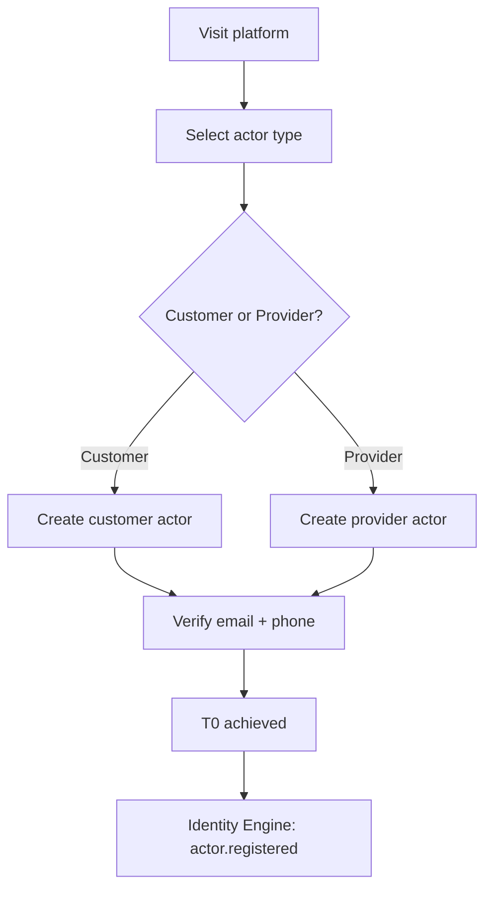

| Step | Action | Engine |
|------|--------|--------|
| 1 | User selects actor type | Identity |
| 2 | User submits email, phone, password | Identity |
| 3 | System sends OTP / verification link | Identity → Notification |
| 4 | User confirms contact | Identity |
| 5 | Actor record created at T0 | Identity |

---

## 4. UF-02 — Customer identity verification (T1)

**Actors:** Customer  
**Preconditions:** T0, email/phone verified  
**Postconditions:** Customer at T1; may accept contracts

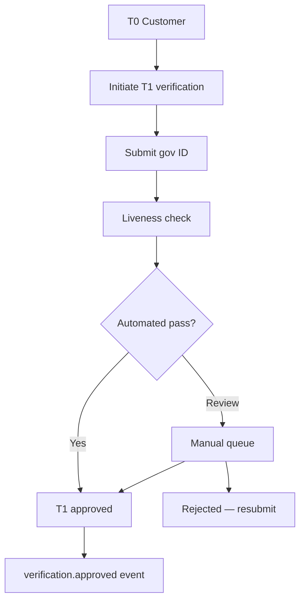

| Step | Action | Engine |
|------|--------|--------|
| 1 | Customer starts T1 flow | Identity |
| 2 | ID scan + liveness via KYC provider | Identity (external) |
| 3 | `[Gate]` Name match validation | Identity |
| 4 | T1 approved or rejected | Identity |
| 5 | `{Optional}` Verification fee charged | Billing |

**Gate:** Customer cannot accept contracts below T1.

---

## 5. UF-03 — Provider verification (T1 → T2)

**Actors:** Service Provider  
**Preconditions:** T0  
**Postconditions:** Provider at T1 minimum; T2 if credentials approved

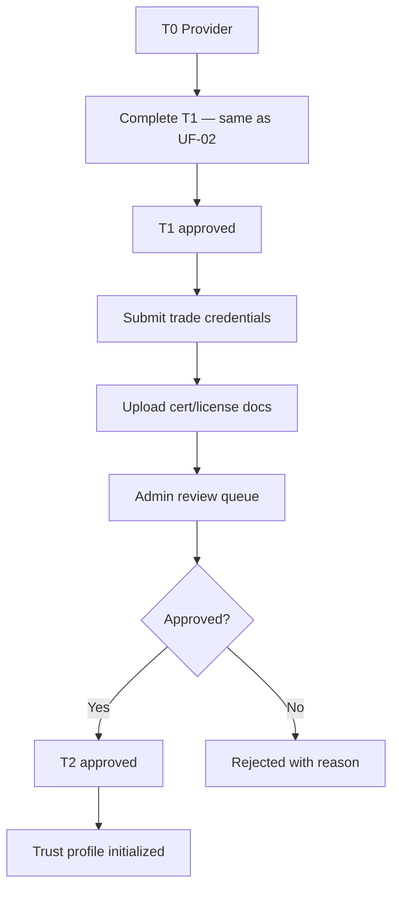

| Step | Action | Engine |
|------|--------|--------|
| 1–4 | T1 flow (UF-02) | Identity |
| 5 | Provider declares trade category + credentials | Identity |
| 6 | Document upload | Identity → Storage |
| 7 | Admin reviews credential | Identity (Admin) |
| 8 | T2 approved → provider eligible for professional categories | Identity |

**Gate:** Category-specific contracts may require T2 (e.g., knowledge dimension credentials).

---

## 6. UF-04 — Initiate engagement

**Actors:** Customer (T1+)  
**Preconditions:** Customer ≥ T1  
**Postconditions:** Engagement created; TEKRR draft initialized

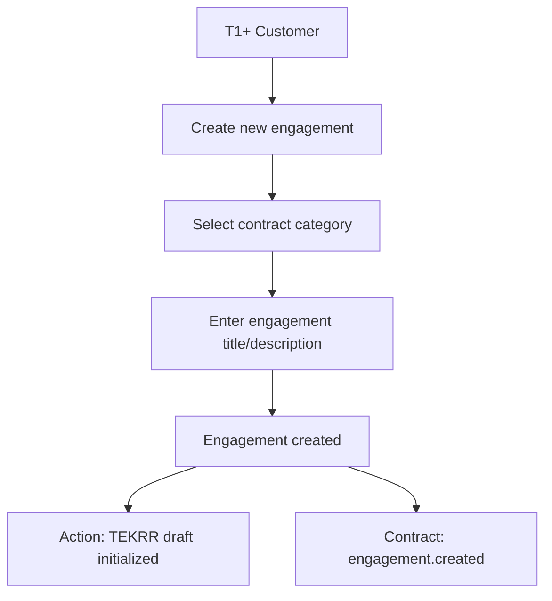

| Step | Action | Engine |
|------|--------|--------|
| 1 | Customer selects "New engagement" | Contract |
| 2 | Customer picks category (e.g., home_maintenance) | Contract |
| 3 | System creates engagement record | Contract |
| 4 | System initializes TEKRR draft for category | Action |
| 5 | Customer proceeds to TEKRR input OR invites provider first | Action / Contract |

**Note:** No marketplace browse — customer invites known provider by email.

---

## 7. UF-05 — Provider invitation & onboarding

**Actors:** Customer, Provider (new or existing)  
**Preconditions:** Engagement in `draft`  
**Postconditions:** Provider linked to engagement

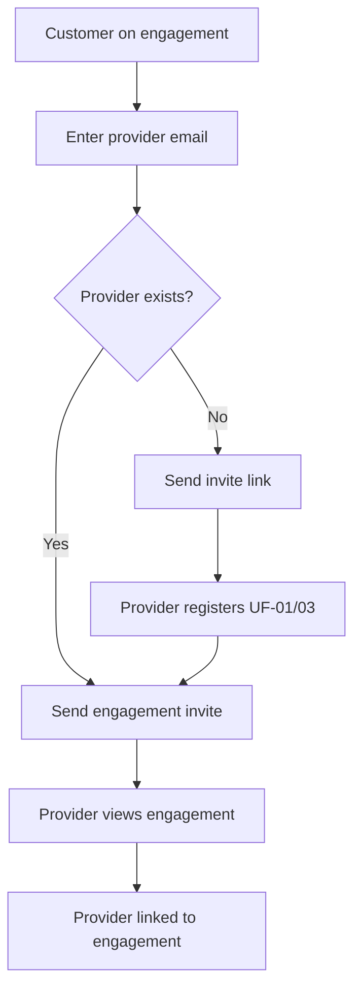

| Step | Action | Engine |
|------|--------|--------|
| 1 | Customer enters provider email | Contract |
| 2 | `[Gate]` If new provider: must complete T1 before acceptance | Identity |
| 3 | Provider receives invitation | Notification |
| 4 | Provider opens engagement | Contract |
| 5 | Provider linked as `provider` party | Contract |

---

## 8. UF-06 — TEKRR decomposition

**Actors:** Customer, Provider  
**Preconditions:** Engagement with linked provider  
**Postconditions:** TEKRR profile `complete`

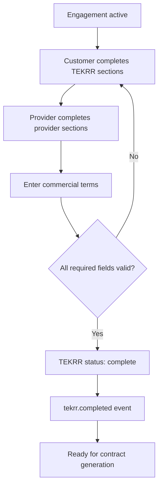

| Step | Action | Engine |
|------|--------|--------|
| 1 | Customer fills Time, Effort, Responsibility inputs | Action |
| 2 | Customer declares Risk level + hazards | Action |
| 3 | Provider fills Knowledge credentials + confirmations | Action |
| 4 | Provider confirms/adjusts Effort deliverables | Action |
| 5 | Customer enters commercial terms (price, payment schedule) | Contract |
| 6 | `[Gate]` Action validates completeness per category schema | Action |
| 7 | TEKRR marked complete | Action → Contract |

### TEKRR input split (typical)

| Dimension | Primary input party |
|-----------|---------------------|
| Time | Customer |
| Effort | Customer + Provider |
| Knowledge | Provider |
| Risk | Customer + Provider |
| Responsibility | Customer + Provider |

---

## 9. UF-07 — Contract generation & acceptance

**Actors:** Customer, Provider  
**Preconditions:** TEKRR complete; parties meet tier requirements  
**Postconditions:** Contract `active`; obligations materialized

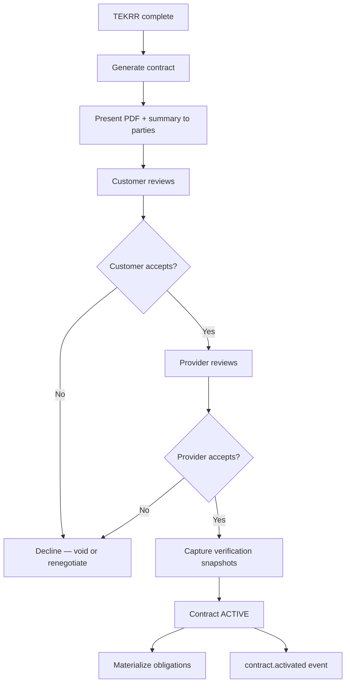

| Step | Action | Engine |
|------|--------|--------|
| 1 | Contract Engine loads template + TEKRR snapshot | Contract |
| 2 | `[Gate]` Identity tier check per party | Identity → Contract |
| 3 | Generate PDF + JSON + hash | Contract |
| 4 | Notify parties to review | Notification |
| 5 | Customer digital acceptance | Contract |
| 6 | Provider digital acceptance | Contract |
| 7 | Store verification snapshots | Contract + Identity |
| 8 | Transition to `active` | Contract |
| 9 | Materialize obligation graph | Action |
| 10 | Trigger contract lifecycle fee | Billing |

**Gate:** Both acceptances required. Either decline → contract `voided` or returns to TEKRR edit.

---

## 10. UF-08 — Execution & attestation

**Actors:** Provider (primary), Customer  
**Preconditions:** Contract `active`  
**Postconditions:** All obligations addressed; attestations recorded

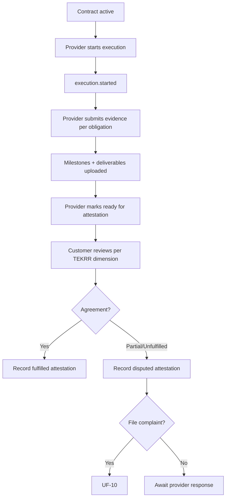

| Step | Action | Engine |
|------|--------|--------|
| 1 | `[Gate]` Contract status = active | Contract → Action |
| 2 | Provider opens execution | Action |
| 3 | Provider time check-in (if on-site) | Action |
| 4 | Provider uploads deliverables / checklists | Action → Storage |
| 5 | Provider submits completion | Action |
| 6 | Customer attests each dimension T/E/K/R/S | Action |
| 7 | Conflict → dimension `disputed` | Action |
| 8 | All dimensions resolved → ready for completion | Action → Contract |

---

## 11. UF-09 — Contract completion

**Actors:** System, Customer, Provider  
**Preconditions:** All dimensions attested or policy timeout  
**Postconditions:** Contract `completed`; scores updated

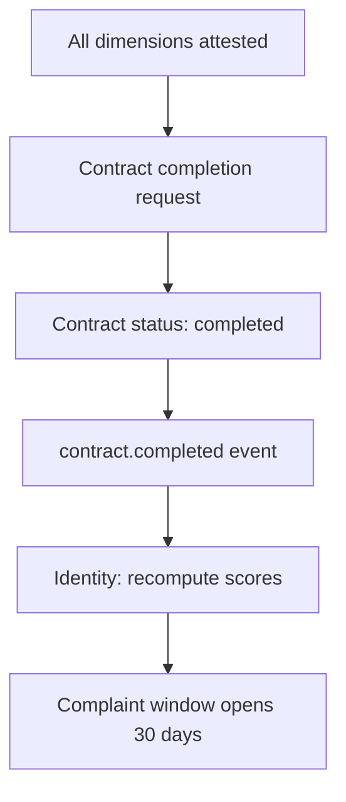

| Step | Action | Engine |
|------|--------|--------|
| 1 | Action signals completion eligibility | Action → Contract |
| 2 | Contract transitions to `completed` | Contract |
| 3 | Emit completion event | Contract |
| 4 | Identity recomputes trust + execution scores | Identity |
| 5 | Start complaint filing window | Complaint |

**Auto-complete policy (MVP):** If customer silent 7 days after provider completion request, provider attestation stands with audit flag.

---

## 12. UF-10 — File complaint

**Actors:** Customer or Provider  
**Preconditions:** Contract completed or incident during execution; within filing window  
**Postconditions:** Complaint case open; dimension frozen

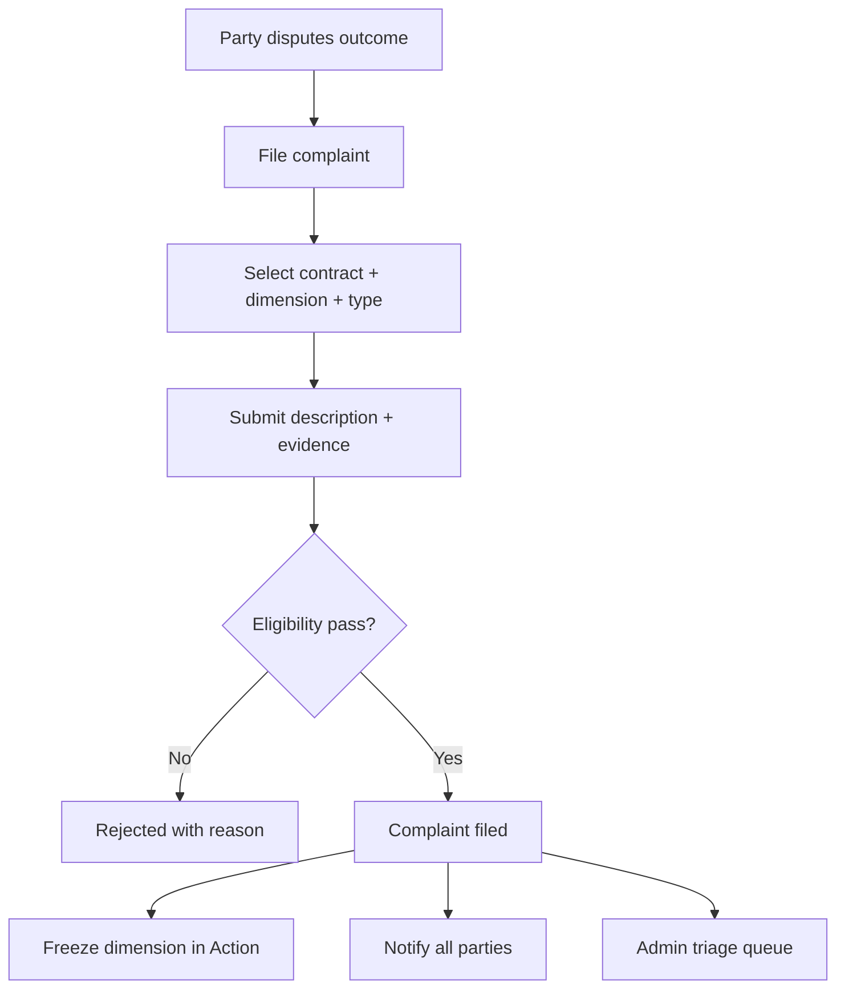

| Step | Action | Engine |
|------|--------|--------|
| 1 | Party selects contract and TEKRR dimension(s) | Complaint |
| 2 | Party selects complaint type | Complaint |
| 3 | Party submits narrative + attachments | Complaint |
| 4 | `[Gate]` Validate window, party, dimension | Contract + Action → Complaint |
| 5 | Create case; freeze dimension | Complaint → Action |
| 6 | Auto-assemble evidence package | Complaint |
| 7 | Queue for triage | Complaint |

---

## 13. UF-11 — Complaint resolution

**Actors:** Parties, Admin  
**Preconditions:** Complaint filed and triaged valid  
**Postconditions:** Outcome applied; scores updated; contract finalized

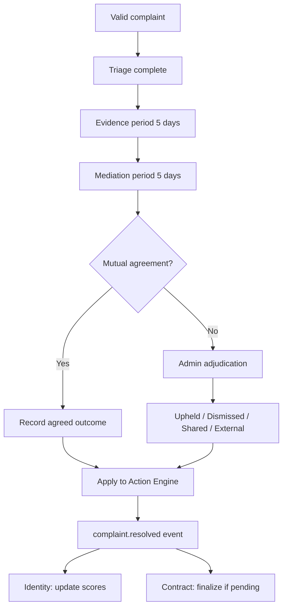

| Step | Action | Engine |
|------|--------|--------|
| 1 | Admin validates complaint (2 days) | Complaint |
| 2 | Both parties submit evidence (5 days) | Complaint |
| 3 | Mediation period (5 days) | Complaint |
| 4 | Admin adjudicates if no agreement | Complaint (Admin) |
| 5 | Apply outcome to execution record | Complaint → Action |
| 6 | Emit resolved event with severity | Complaint |
| 7 | Recompute trust score | Identity |
| 8 | Release dimension freeze | Action |

---

## 14. UF-12 — View trust profile

**Actors:** Customer, Company (stub), Provider (self)  
**Preconditions:** Provider has identity record  
**Postconditions:** None (read-only)

| Viewer | Visible data |
|--------|--------------|
| **Public / Customer** | Tier badge, trust score, execution score, dimension breakdown, contract count, complaint disposition summary (aggregated) |
| **Provider (self)** | Full breakdown + contributing events |
| **Company (P2)** | Extended history for due diligence |
| **Admin** | Full record including verification status detail |

**Engine:** Identity (all reads)

---

## 15. UF-13 — Contract amendment

**Actors:** Customer, Provider  
**Preconditions:** Contract `active`  
**Postconditions:** Amendment `active`; obligation graph updated

| Step | Action | Engine |
|------|--------|--------|
| 1 | Party requests amendment (TEKRR and/or commercial delta) | Contract |
| 2 | Action validates and versions TEKRR profile | Action |
| 3 | Contract generates amendment document | Contract |
| 4 | Both parties re-accept | Contract |
| 5 | Action updates obligation graph | Action |
| 6 | Emit `contract.amended` | Contract |

---

## 16. UF-14 — Company provider lookup (MVP stub)

**Actors:** Company (verified stub account)  
**Preconditions:** Company org registered (minimal)  
**Postconditions:** None

| Step | Action | Engine |
|------|--------|--------|
| 1 | Company user searches provider by ID or email | Identity |
| 2 | View public trust profile | Identity |
| 3 | `{P2}` Initiate company-mediated contract | Contract |

---

## 17. Cross-flow dependency map

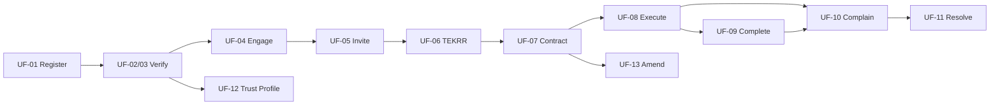

---

## 18. MVP flow coverage summary

| Engine | Flows |
|--------|-------|
| Identity | UF-01, UF-02, UF-03, UF-12 |
| Action | UF-06, UF-08 |
| Contract | UF-04, UF-05, UF-07, UF-09, UF-13 |
| Complaint | UF-10, UF-11 |

All MVP flows must be completable on responsive web without native apps.
