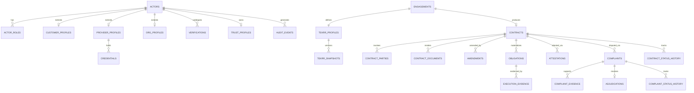

# APP13 — Database Entities v1

**Version:** 1.0  
**Status:** Draft  
**Scope:** Logical schema — implementation-agnostic, no SQL

---

## 1. Conventions

| Convention | Rule |
|------------|------|
| Primary keys | UUID v4 (`id`) |
| Timestamps | `created_at`, `updated_at` on all mutable entities |
| Soft delete | `deleted_at` where noted |
| Ownership | Each entity tagged with **Owner Engine** |
| References | Foreign keys logical; enforce in application layer or DB constraints |
| Money | Integer cents + ISO 4217 currency code |
| Enums | Documented as string enums; versioned where noted |

---

## 2. Entity map by engine

---

## 3. Identity Engine entities

### 3.1 `actors`

**Owner:** Identity  
**Description:** Root identity for all platform users and institutional representatives.

| Column | Type | Required | Notes |
|--------|------|----------|-------|
| id | UUID | Yes | PK |
| email | string | Yes | Unique, normalized |
| phone | string | No | E.164 format |
| password_hash | string | No | Null if SSO (P2) |
| actor_type | enum | Yes | `customer`, `provider`, `admin`, `org_member` |
| status | enum | Yes | `active`, `suspended`, `deactivated` |
| email_verified_at | timestamp | No | |
| phone_verified_at | timestamp | No | |
| last_login_at | timestamp | No | |

**Indexes:** `email` (unique), `actor_type`, `status`

---

### 3.2 `actor_roles`

**Owner:** Identity  
**Description:** RBAC role bindings; actor may hold multiple roles.

| Column | Type | Required | Notes |
|--------|------|----------|-------|
| id | UUID | Yes | PK |
| actor_id | UUID | Yes | FK → actors |
| role | enum | Yes | See Permissions Matrix |
| scope_type | enum | No | `platform`, `organization` |
| scope_id | UUID | No | org id when scoped |
| granted_at | timestamp | Yes | |
| granted_by | UUID | No | FK → actors (admin) |
| revoked_at | timestamp | No | |

**Indexes:** `(actor_id, role)`, `(scope_type, scope_id)`

---

### 3.3 `customer_profiles`

**Owner:** Identity

| Column | Type | Required | Notes |
|--------|------|----------|-------|
| id | UUID | Yes | PK |
| actor_id | UUID | Yes | FK → actors, unique |
| display_name | string | Yes | |
| legal_name | string | No | From T1 verification |
| avatar_storage_key | string | No | |

---

### 3.4 `provider_profiles`

**Owner:** Identity

| Column | Type | Required | Notes |
|--------|------|----------|-------|
| id | UUID | Yes | PK |
| actor_id | UUID | Yes | FK → actors, unique |
| business_name | string | No | |
| display_name | string | Yes | |
| slug | string | No | Public identifier (P2) |
| primary_trade | string | No | Category alignment |
| bio | text | No | |
| status | enum | Yes | `pending`, `active`, `suspended` |

---

### 3.5 `org_profiles`

**Owner:** Identity  
**Description:** Company, Government, Insurance institutional accounts (P2 full; MVP stub).

| Column | Type | Required | Notes |
|--------|------|----------|-------|
| id | UUID | Yes | PK |
| org_type | enum | Yes | `company`, `government`, `insurance` |
| legal_name | string | Yes | |
| registration_number | string | No | |
| jurisdiction | string | Yes | ISO region |
| status | enum | Yes | `pending`, `active`, `suspended` |
| verified_at | timestamp | No | |

---

### 3.6 `org_members`

**Owner:** Identity

| Column | Type | Required | Notes |
|--------|------|----------|-------|
| id | UUID | Yes | PK |
| org_id | UUID | Yes | FK → org_profiles |
| actor_id | UUID | Yes | FK → actors |
| org_role | enum | Yes | `admin`, `contract_manager`, `viewer` |
| status | enum | Yes | `active`, `removed` |

---

### 3.7 `verifications`

**Owner:** Identity  
**Description:** Verification attempts and outcomes per tier.

| Column | Type | Required | Notes |
|--------|------|----------|-------|
| id | UUID | Yes | PK |
| actor_id | UUID | Yes | FK → actors |
| tier | enum | Yes | `T0`–`T4` |
| verification_type | enum | Yes | `identity`, `credential`, `kyb`, `entity_auth`, `insurance` |
| status | enum | Yes | `not_started`, `pending`, `approved`, `rejected`, `expired`, `suspended` |
| external_ref | string | No | KYC provider reference |
| submitted_at | timestamp | No | |
| reviewed_at | timestamp | No | |
| reviewed_by | UUID | No | FK → actors (admin) |
| expires_at | timestamp | No | |
| rejection_reason | text | No | |
| metadata | JSON | No | Provider-specific payload |

**Indexes:** `(actor_id, tier)`, `(status)`, `(expires_at)`

---

### 3.8 `verification_documents`

**Owner:** Identity

| Column | Type | Required | Notes |
|--------|------|----------|-------|
| id | UUID | Yes | PK |
| verification_id | UUID | Yes | FK → verifications |
| document_type | enum | Yes | `gov_id`, `license`, `certification`, `business_reg`, etc. |
| storage_key | string | Yes | Encrypted object storage ref |
| content_hash | string | Yes | Integrity |
| uploaded_at | timestamp | Yes | |

---

### 3.9 `credentials`

**Owner:** Identity  
**Description:** Verified professional credentials linked to provider.

| Column | Type | Required | Notes |
|--------|------|----------|-------|
| id | UUID | Yes | PK |
| provider_profile_id | UUID | Yes | FK → provider_profiles |
| credential_type | string | Yes | e.g., `electrician_license` |
| issuing_authority | string | Yes | |
| credential_number | string | No | |
| issued_at | date | No | |
| expires_at | date | No | |
| verification_id | UUID | Yes | FK → verifications |
| status | enum | Yes | `active`, `expired`, `revoked` |

---

### 3.10 `trust_profiles`

**Owner:** Identity  
**Description:** Computed trust state for providers (customers do not have public trust profiles).

| Column | Type | Required | Notes |
|--------|------|----------|-------|
| id | UUID | Yes | PK |
| provider_profile_id | UUID | Yes | FK → provider_profiles, unique |
| current_tier | enum | Yes | Highest approved tier |
| tier_expires_at | timestamp | No | Earliest expiry driving tier |
| trust_score | int | Yes | 0–1000 |
| trust_score_version | string | Yes | e.g., `trust_score_v1` |
| execution_score | int | Yes | 0–1000 |
| execution_score_version | string | Yes | e.g., `execution_score_v1` |
| dimension_scores | JSON | Yes | Per TEKRR dimension |
| contract_count | int | Yes | Denormalized |
| completed_count | int | Yes | |
| complaint_upheld_count | int | Yes | |
| repeat_customer_rate | decimal | No | |
| confidence_band | enum | Yes | `low`, `medium`, `high` |
| public_summary | JSON | Yes | Privacy-safe aggregate |
| computed_at | timestamp | Yes | Last recomputation |

---

### 3.11 `score_events`

**Owner:** Identity  
**Description:** Immutable inputs to score computation (event sourcing lite).

| Column | Type | Required | Notes |
|--------|------|----------|-------|
| id | UUID | Yes | PK |
| provider_profile_id | UUID | Yes | FK |
| event_type | string | Yes | Source domain event name |
| source_entity_type | string | Yes | `contract`, `complaint`, etc. |
| source_entity_id | UUID | Yes | |
| payload | JSON | Yes | Scoring-relevant data |
| occurred_at | timestamp | Yes | |
| score_version | string | Yes | Algorithm version applied |

**Indexes:** `(provider_profile_id, occurred_at)`

---

## 4. Action Engine entities

### 4.1 `tekrr_profiles`

**Owner:** Action  
**Description:** Living TEKRR decomposition for an engagement.

| Column | Type | Required | Notes |
|--------|------|----------|-------|
| id | UUID | Yes | PK |
| engagement_id | UUID | Yes | FK → engagements, unique |
| category_id | string | Yes | Template category |
| schema_version | string | Yes | Category schema version |
| status | enum | Yes | `draft`, `in_progress`, `complete`, `snapshotted` |
| time_data | JSON | Yes | Dimension T |
| effort_data | JSON | Yes | Dimension E |
| knowledge_data | JSON | Yes | Dimension K |
| risk_data | JSON | Yes | Dimension R |
| responsibility_data | JSON | Yes | Dimension S |
| validation_errors | JSON | No | Last validation result |
| completed_at | timestamp | No | |

---

### 4.2 `tekrr_snapshots`

**Owner:** Action  
**Description:** Immutable TEKRR copy bound to contract version.

| Column | Type | Required | Notes |
|--------|------|----------|-------|
| id | UUID | Yes | PK |
| tekrr_profile_id | UUID | Yes | FK → tekrr_profiles |
| contract_id | UUID | Yes | FK → contracts |
| version | int | Yes | Incrementing |
| snapshot_data | JSON | Yes | Full TEKRR at point in time |
| snapshot_hash | string | Yes | Integrity |
| created_at | timestamp | Yes | |

---

### 4.3 `obligations`

**Owner:** Action

| Column | Type | Required | Notes |
|--------|------|----------|-------|
| id | UUID | Yes | PK |
| contract_id | UUID | Yes | FK → contracts |
| tekrr_dimension | enum | Yes | `T`, `E`, `K`, `R`, `S` |
| obligation_type | enum | Yes | See Action Engine doc |
| description | text | Yes | |
| required | boolean | Yes | Default true |
| status | enum | Yes | `pending`, `in_progress`, `submitted`, `accepted`, `disputed`, `frozen`, `waived` |
| due_at | timestamp | No | |
| sort_order | int | Yes | |
| metadata | JSON | No | Type-specific fields |

**Indexes:** `(contract_id)`, `(contract_id, tekrr_dimension)`, `(status)`

---

### 4.4 `execution_sessions`

**Owner:** Action

| Column | Type | Required | Notes |
|--------|------|----------|-------|
| id | UUID | Yes | PK |
| contract_id | UUID | Yes | FK → contracts, unique |
| status | enum | Yes | `ready`, `in_progress`, `pending_attestation`, `completed`, `disputed` |
| started_at | timestamp | No | |
| started_by | UUID | No | FK → actors |
| completed_at | timestamp | No | |
| check_in_at | timestamp | No | Time dimension |
| check_in_location | JSON | No | Optional geo (P2) |

---

### 4.5 `execution_evidence`

**Owner:** Action

| Column | Type | Required | Notes |
|--------|------|----------|-------|
| id | UUID | Yes | PK |
| obligation_id | UUID | Yes | FK → obligations |
| submitted_by | UUID | Yes | FK → actors |
| evidence_type | enum | Yes | `document`, `photo`, `checklist`, `timestamp`, `note` |
| storage_key | string | No | If file |
| content_hash | string | No | |
| metadata | JSON | No | |
| submitted_at | timestamp | Yes | |

---

### 4.6 `attestations`

**Owner:** Action  
**Description:** Per-dimension fulfillment attestation for a contract.

| Column | Type | Required | Notes |
|--------|------|----------|-------|
| id | UUID | Yes | PK |
| contract_id | UUID | Yes | FK → contracts |
| tekrr_dimension | enum | Yes | `T`, `E`, `K`, `R`, `S` |
| customer_status | enum | No | `fulfilled`, `partially_fulfilled`, `unfulfilled` |
| customer_attested_at | timestamp | No | |
| provider_response | text | No | |
| provider_responded_at | timestamp | No | |
| final_status | enum | Yes | Derived or adjudicated |
| final_status_source | enum | Yes | `mutual`, `auto_policy`, `complaint`, `admin` |
| frozen | boolean | Yes | Default false |
| frozen_by_complaint_id | UUID | No | FK → complaints |

**Unique:** `(contract_id, tekrr_dimension)`

---

## 5. Contract Engine entities

### 5.1 `engagements`

**Owner:** Contract

| Column | Type | Required | Notes |
|--------|------|----------|-------|
| id | UUID | Yes | PK |
| initiator_actor_id | UUID | Yes | FK → actors (customer) |
| category_id | string | Yes | Contract category |
| title | string | Yes | |
| description | text | No | |
| status | enum | Yes | `draft`, `tekrr_in_progress`, `ready_to_generate`, `contract_pending`, `contract_active`, `completed`, `cancelled` |
| invited_provider_email | string | No | Before provider registers |
| provider_profile_id | UUID | No | FK → provider_profiles |

**Indexes:** `(initiator_actor_id)`, `(provider_profile_id)`, `(status)`

---

### 5.2 `contracts`

**Owner:** Contract

| Column | Type | Required | Notes |
|--------|------|----------|-------|
| id | UUID | Yes | PK |
| engagement_id | UUID | Yes | FK → engagements |
| contract_number | string | Yes | Human-readable, unique |
| template_id | UUID | Yes | FK → contract_templates |
| template_version | string | Yes | |
| jurisdiction_pack | string | Yes | e.g., `US-CA-v1` |
| status | enum | Yes | See Contract Lifecycle doc |
| tekrr_snapshot_id | UUID | No | FK → tekrr_snapshots (set at activation) |
| commercial_terms | JSON | Yes | Price, payment schedule, cancellation |
| verification_snapshot | JSON | No | Party tiers at activation |
| content_hash | string | No | Canonical JSON hash |
| activated_at | timestamp | No | |
| completed_at | timestamp | No | |
| cancelled_at | timestamp | No | |
| cancellation_fault_party | UUID | No | FK → actors |
| complaint_window_ends_at | timestamp | No | |

**Indexes:** `(engagement_id)`, `(status)`, `(contract_number)` unique

---

### 5.3 `contract_parties`

**Owner:** Contract

| Column | Type | Required | Notes |
|--------|------|----------|-------|
| id | UUID | Yes | PK |
| contract_id | UUID | Yes | FK → contracts |
| actor_id | UUID | Yes | FK → actors |
| party_role | enum | Yes | `customer`, `provider`, `company_cosigner`, etc. |
| acceptance_required | boolean | Yes | |
| accepted_at | timestamp | No | |
| acceptance_ip | string | No | Audit |
| acceptance_user_agent | string | No | Audit |
| declined_at | timestamp | No | |

**Unique:** `(contract_id, actor_id, party_role)`

---

### 5.4 `contract_templates`

**Owner:** Contract

| Column | Type | Required | Notes |
|--------|------|----------|-------|
| id | UUID | Yes | PK |
| category_id | string | Yes | |
| name | string | Yes | |
| version | string | Yes | Semver |
| jurisdiction_pack | string | Yes | |
| min_provider_tier | enum | Yes | Default `T1` |
| clause_rules | JSON | Yes | Assembly rules |
| tekrr_schema_ref | string | Yes | Links to Action category schema |
| is_active | boolean | Yes | |
| published_at | timestamp | Yes | |

**Unique:** `(category_id, version, jurisdiction_pack)`

---

### 5.5 `contract_documents`

**Owner:** Contract

| Column | Type | Required | Notes |
|--------|------|----------|-------|
| id | UUID | Yes | PK |
| contract_id | UUID | Yes | FK → contracts |
| document_type | enum | Yes | `pdf`, `structured_json` |
| storage_key | string | Yes | |
| content_hash | string | Yes | |
| generated_at | timestamp | Yes | |
| amendment_id | UUID | No | FK → amendments if amendment doc |

---

### 5.6 `amendments`

**Owner:** Contract

| Column | Type | Required | Notes |
|--------|------|----------|-------|
| id | UUID | Yes | PK |
| contract_id | UUID | Yes | FK → contracts |
| amendment_number | int | Yes | Sequential per contract |
| status | enum | Yes | `draft`, `pending_acceptance`, `active`, `rejected` |
| tekrr_delta | JSON | No | |
| commercial_delta | JSON | No | |
| tekrr_snapshot_id | UUID | No | New snapshot on activation |
| requested_by | UUID | Yes | FK → actors |
| activated_at | timestamp | No | |

---

### 5.7 `contract_status_history`

**Owner:** Contract

| Column | Type | Required | Notes |
|--------|------|----------|-------|
| id | UUID | Yes | PK |
| contract_id | UUID | Yes | FK → contracts |
| from_status | enum | Yes | |
| to_status | enum | Yes | |
| actor_id | UUID | No | Who triggered |
| reason | text | No | |
| created_at | timestamp | Yes | |

---

## 6. Complaint Engine entities

### 6.1 `complaints`

**Owner:** Complaint

| Column | Type | Required | Notes |
|--------|------|----------|-------|
| id | UUID | Yes | PK |
| case_number | string | Yes | Human-readable, unique |
| contract_id | UUID | Yes | FK → contracts |
| filed_by | UUID | Yes | FK → actors |
| complaint_types | JSON | Yes | Array of type codes |
| tekrr_dimensions | JSON | Yes | Array of T/E/K/R/S |
| description | text | Yes | |
| status | enum | Yes | See Complaint Lifecycle doc |
| severity | enum | No | Set on resolution |
| outcome | enum | No | Set on resolution |
| fault_party_id | UUID | No | FK → actors |
| filed_at | timestamp | Yes | |
| window_valid | boolean | Yes | Validated at filing |
| triaged_at | timestamp | No | |
| triaged_by | UUID | No | FK → actors |
| resolved_at | timestamp | No | |
| resolved_by | UUID | No | FK → actors (admin) |

**Indexes:** `(contract_id)`, `(status)`, `(filed_by)`, `(case_number)` unique

---

### 6.2 `complaint_evidence`

**Owner:** Complaint

| Column | Type | Required | Notes |
|--------|------|----------|-------|
| id | UUID | Yes | PK |
| complaint_id | UUID | Yes | FK → complaints |
| submitted_by | UUID | Yes | FK → actors |
| evidence_source | enum | Yes | `party`, `auto_attached`, `admin` |
| evidence_type | enum | Yes | `document`, `statement`, `system_record` |
| storage_key | string | No | |
| reference_entity_type | string | No | e.g., `execution_evidence` |
| reference_entity_id | UUID | No | |
| description | text | No | |
| submitted_at | timestamp | Yes | |

---

### 6.3 `adjudications`

**Owner:** Complaint

| Column | Type | Required | Notes |
|--------|------|----------|-------|
| id | UUID | Yes | PK |
| complaint_id | UUID | Yes | FK → complaints, unique |
| outcome | enum | Yes | See Complaint Engine doc |
| severity | enum | No | |
| fault_party_id | UUID | No | |
| findings | text | Yes | Admin narrative |
| remediation_notes | text | No | |
| adjudicated_by | UUID | Yes | FK → actors |
| adjudicated_at | timestamp | Yes | |
| parties_notified_at | timestamp | No | |

---

### 6.4 `complaint_status_history`

**Owner:** Complaint

| Column | Type | Required | Notes |
|--------|------|----------|-------|
| id | UUID | Yes | PK |
| complaint_id | UUID | Yes | FK → complaints |
| from_status | enum | Yes | |
| to_status | enum | Yes | |
| actor_id | UUID | No | |
| notes | text | No | |
| created_at | timestamp | Yes | |

---

### 6.5 `mediation_records`

**Owner:** Complaint

| Column | Type | Required | Notes |
|--------|------|----------|-------|
| id | UUID | Yes | PK |
| complaint_id | UUID | Yes | FK → complaints |
| proposed_by | UUID | Yes | FK → actors |
| proposal | JSON | Yes | Terms |
| status | enum | Yes | `pending`, `accepted`, `rejected`, `expired` |
| responded_at | timestamp | No | |
| created_at | timestamp | Yes | |

---

## 7. Shared / supporting entities

### 7.1 `audit_events`

**Owner:** Platform (Audit context)  
**Append-only.**

| Column | Type | Required | Notes |
|--------|------|----------|-------|
| id | UUID | Yes | PK |
| actor_id | UUID | No | |
| action | string | Yes | e.g., `contract.accepted` |
| entity_type | string | Yes | |
| entity_id | UUID | Yes | |
| engine | enum | Yes | `identity`, `action`, `contract`, `complaint` |
| metadata | JSON | No | |
| ip_address | string | No | |
| created_at | timestamp | Yes | |

**Indexes:** `(entity_type, entity_id)`, `(actor_id)`, `(created_at)`

---

### 7.2 `domain_outbox`

**Owner:** Platform  
**Description:** Transactional outbox for cross-engine events (implementation pattern).

| Column | Type | Required | Notes |
|--------|------|----------|-------|
| id | UUID | Yes | PK |
| event_type | string | Yes | |
| payload | JSON | Yes | |
| engine_source | enum | Yes | |
| published_at | timestamp | No | Null until dispatched |
| created_at | timestamp | Yes | |

---

### 7.3 `category_schemas`

**Owner:** Action (catalog); referenced by Contract templates

| Column | Type | Required | Notes |
|--------|------|----------|-------|
| id | UUID | Yes | PK |
| category_id | string | Yes | |
| version | string | Yes | |
| tekrr_schema | JSON | Yes | Field definitions + validation |
| risk_tier_rules | JSON | Yes | Min provider tier by risk level |
| is_active | boolean | Yes | |

---

## 8. Entity ownership summary

| Entity | Owner Engine |
|--------|--------------|
| actors, verifications, trust_profiles, credentials | Identity |
| tekrr_profiles, obligations, execution_*, attestations | Action |
| engagements, contracts, templates, amendments | Contract |
| complaints, adjudications, mediation_records | Complaint |
| audit_events, domain_outbox | Platform |

---

## 9. Retention policy

| Entity group | Retention |
|--------------|-----------|
| Contracts + snapshots + attestations | 7+ years post-completion |
| Verification documents | Account life + 7 years |
| Complaints + adjudications | 7+ years |
| Audit events | 7+ years |
| Draft engagements (never activated) | 90 days then purge |

---

## 10. MVP entity subset

**Must implement for MVP:** All Identity entities (except full org), all Action entities, all Contract entities, all Complaint entities, audit_events.

**Stub only:** org_profiles, org_members (read-only company lookup).

**Defer:** domain_outbox (can use synchronous events MVP), mediation_records (optional MVP).
