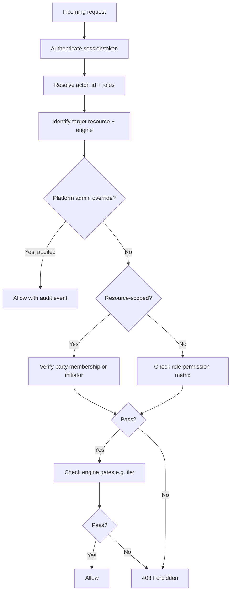

# APP13 — Permissions Matrix v1

**Version:** 1.0  
**Status:** Draft  
**Scope:** RBAC across Identity, Action, Contract, Complaint engines

---

## 1. Authorization model

### 1.1 Principles

| Principle | Implementation |
|-----------|----------------|
| **Server-side enforcement** | Every engine validates permissions on every mutation and sensitive read |
| **Least privilege** | Roles grant minimum required capabilities |
| **Resource-scoped access** | Contract party membership gates contract-scoped resources |
| **Engine boundaries** | Engines do not trust client-supplied role claims; Identity provides tier/role truth |
| **Admin separation** | Admin roles cannot impersonate party acceptance without audit flag |
| **Institutional scope** | Org roles scoped to `org_id` (Phase 2) |

### 1.2 Role hierarchy

```
Platform Admin (super_admin)
    ├── Trust Operations Admin
    ├── Verification Analyst
    ├── Complaint Adjudicator
    └── Institutional Admin (P2)

Org Admin (P2) → Org Contract Manager → Org Viewer

Customer (actor role)
Provider (actor role)
```

Actors may hold **multiple roles** (e.g., provider who is also a customer on other engagements).

---

## 2. Role definitions

| Role | Code | Description |
|------|------|-------------|
| Customer | `customer` | Individual engaging providers |
| Service Provider | `provider` | Professional performing contracted work |
| Verification Analyst | `verification_analyst` | Reviews verification submissions |
| Complaint Adjudicator | `complaint_adjudicator` | Resolves disputes |
| Trust Operations | `trust_ops` | Score appeals, fraud flags |
| Platform Admin | `platform_admin` | Full operational access |
| Super Admin | `super_admin` | System configuration, template publish |
| Org Admin | `org_admin` | Company/gov/insurance org management (P2) |
| Org Contract Manager | `org_contract_manager` | Company contract initiation (P2) |
| Org Viewer | `org_viewer` | Read-only org dashboards (P2) |

---

## 3. Resource catalog

| Resource | Engine | Scope key |
|----------|--------|-----------|
| `actor.self` | Identity | Own actor_id |
| `actor.other` | Identity | Any actor (admin/authorized) |
| `verification` | Identity | actor_id |
| `trust_profile.public` | Identity | provider_profile_id |
| `trust_profile.full` | Identity | provider_profile_id |
| `credential` | Identity | provider_profile_id |
| `engagement` | Contract | engagement_id |
| `contract` | Contract | contract_id + party |
| `contract_template` | Contract | platform |
| `tekrr_profile` | Action | engagement_id |
| `obligation` | Action | contract_id |
| `execution` | Action | contract_id |
| `attestation` | Action | contract_id |
| `evidence` | Action | obligation_id → contract_id |
| `complaint` | Complaint | complaint_id + contract party |
| `adjudication` | Complaint | complaint_id |
| `audit_log` | Platform | platform / entity |
| `org` | Identity | org_id |

---

## 4. Permissions matrix — Identity Engine

| Permission | Customer | Provider | Verif. Analyst | Complaint Adj. | Trust Ops | Platform Admin | Super Admin |
|------------|:--------:|:--------:|:--------------:|:--------------:|:---------:|:--------------:|:-----------:|
| Register self | ✓ | ✓ | — | — | — | — | — |
| Read own actor profile | ✓ | ✓ | ✓ | ✓ | ✓ | ✓ | ✓ |
| Update own profile (non-verified fields) | ✓ | ✓ | — | — | — | — | — |
| Submit T1 verification (self) | ✓ | ✓ | — | — | — | — | — |
| Submit T2 credential (self) | — | ✓ | — | — | — | — | — |
| Read verification queue | — | — | ✓ | — | ✓ | ✓ | ✓ |
| Approve/reject verification | — | — | ✓ | — | — | ✓ | ✓ |
| View verification documents | — | — | ✓ | — | ✓ | ✓ | ✓ |
| Read public trust profile | ✓ | ✓ | ✓ | ✓ | ✓ | ✓ | ✓ |
| Read full trust profile (any provider) | — | — | — | — | ✓ | ✓ | ✓ |
| Read own full trust profile | — | ✓ | — | — | — | ✓ | ✓ |
| Suspend actor | — | — | — | — | ✓ | ✓ | ✓ |
| Manage actor roles | — | — | — | — | — | ✓ | ✓ |
| Appeal score event | — | ✓ | — | — | ✓ | ✓ | ✓ |
| Resolve score appeal | — | — | — | — | ✓ | ✓ | ✓ |
| Onboard institutional org (P2) | — | — | — | — | — | ✓ | ✓ |

---

## 5. Permissions matrix — Action Engine

| Permission | Customer | Provider | Complaint Adj. | Platform Admin | Super Admin |
|------------|:--------:|:--------:|:--------------:|:--------------:|:-----------:|
| Read TEKRR profile (own engagement) | ✓* | ✓* | ✓† | ✓ | ✓ |
| Write TEKRR customer sections | ✓* | — | — | — | — |
| Write TEKRR provider sections | — | ✓* | — | — | — |
| Validate TEKRR complete | ✓* | ✓* | — | ✓ | ✓ |
| Read obligations (own contract) | ✓* | ✓* | ✓† | ✓ | ✓ |
| Start execution | — | ✓* | — | ✓‡ | ✓‡ |
| Submit execution evidence | — | ✓* | — | ✓‡ | ✓‡ |
| Read execution evidence (own contract) | ✓* | ✓* | ✓† | ✓ | ✓ |
| Submit customer attestation | ✓* | — | — | ✓‡ | ✓‡ |
| Submit provider response to attestation | — | ✓* | — | ✓‡ | ✓‡ |
| Freeze dimension (complaint) | — | — | ✓ | ✓ | ✓ |
| Apply adjudication outcome | — | — | ✓ | ✓ | ✓ |
| Manage category schemas | — | — | — | — | ✓ |

\* Only when actor is party on the engagement/contract (or initiator for TEKRR draft)  
† Complaint adjudicator when assigned to case  
‡ Admin override — requires audit event with reason (emergency support only)

### TEKRR write scope by dimension

| Dimension | Customer write | Provider write |
|-----------|:--------------:|:--------------:|
| Time (T) | ✓ | Read + propose |
| Effort (E) | ✓ | ✓ |
| Knowledge (K) | Read | ✓ |
| Risk (R) | ✓ | ✓ |
| Responsibility (S) | ✓ | ✓ |

---

## 6. Permissions matrix — Contract Engine

| Permission | Customer | Provider | Complaint Adj. | Platform Admin | Super Admin |
|------------|:--------:|:--------:|:--------------:|:--------------:|:-----------:|
| Create engagement | ✓ | — | — | ✓‡ | ✓ |
| Invite provider to engagement | ✓* | — | — | ✓‡ | ✓ |
| Read engagement (party/initiator) | ✓* | ✓* | ✓† | ✓ | ✓ |
| Enter commercial terms | ✓* | Read | — | ✓‡ | ✓ |
| Trigger contract generation | ✓* | ✓* | — | ✓ | ✓ |
| Read contract document (party) | ✓* | ✓* | ✓† | ✓ | ✓ |
| Accept contract (as party) | ✓* | ✓* | — | — | — |
| Decline contract (as party) | ✓* | ✓* | — | — | — |
| Request amendment | ✓* | ✓* | — | ✓‡ | ✓ |
| Accept amendment (as party) | ✓* | ✓* | — | — | — |
| Cancel active contract | ✓* | ✓* | — | ✓‡ | ✓ |
| Force void contract | — | — | — | ✓ | ✓ |
| Read all contracts (search) | — | — | ✓ | ✓ | ✓ |
| Publish contract templates | — | — | — | — | ✓ |
| Edit contract templates (draft) | — | — | — | ✓ | ✓ |

\* Scoped to own engagements/contracts as party or initiator  
† When complaint case references contract  
‡ Audited admin action

### Contract acceptance gates (not permissions — enforced regardless)

| Gate | Rule |
|------|------|
| Customer accept | Customer ≥ T1 |
| Provider accept | Provider ≥ category `min_provider_tier` |
| High risk (level ≥ 4) | Provider ≥ T2 |
| Activation | All required parties accepted |

---

## 7. Permissions matrix — Complaint Engine

| Permission | Customer | Provider | Complaint Adj. | Platform Admin | Super Admin |
|------------|:--------:|:--------:|:--------------:|:--------------:|:-----------:|
| File complaint (own contract) | ✓* | ✓* | — | ✓‡ | ✓ |
| Read complaint (party) | ✓* | ✓* | ✓ | ✓ | ✓ |
| Submit complaint evidence | ✓* | ✓* | — | ✓‡ | ✓ |
| Read auto-attached evidence package | ✓* | ✓* | ✓ | ✓ | ✓ |
| Triage complaint | — | — | ✓ | ✓ | ✓ |
| Assign complaint to self | — | — | ✓ | ✓ | ✓ |
| Submit mediation proposal | ✓* | ✓* | ✓ | ✓ | ✓ |
| Adjudicate complaint | — | — | ✓ | ✓ | ✓ |
| Escalate external | — | — | ✓ | ✓ | ✓ |
| Dismiss at triage | — | — | ✓ | ✓ | ✓ |
| Read complaint queue (all) | — | — | ✓ | ✓ | ✓ |

\* Must be contract party; filing window open  
‡ Audited admin action

---

## 8. Permissions matrix — institutional actors (Phase 2)

| Permission | Company Viewer | Company Contract Mgr | Company Admin | Gov Entity | Insurance Entity |
|------------|:--------------:|:--------------------:|:-------------:|:----------:|:----------------:|
| Read public trust profile | ✓ | ✓ | ✓ | ✓ | ✓ |
| Read extended provider history | ✓ | ✓ | ✓ | ✓† | ✓† |
| Initiate company contract | — | ✓ | ✓ | — | — |
| Apply company policy overlay | — | ✓ | ✓ | — | — |
| Endorse provider | — | ✓ | ✓ | — | — |
| Query authorized contract records | — | — | ✓ | ✓ | — |
| Sync license status | — | — | — | ✓ | — |
| Attest insurance coverage | — | — | — | — | ✓ |
| Report claim event flag | — | — | — | — | ✓ |

† Scoped to jurisdiction / legal agreement

---

## 9. Data visibility rules

### 9.1 Trust profile visibility

| Field | Public | Customer | Provider (self) | Admin |
|-------|:------:|:--------:|:---------------:|:-----:|
| Trust score | ✓ | ✓ | ✓ | ✓ |
| Execution score | ✓ | ✓ | ✓ | ✓ |
| Dimension breakdown | ✓ | ✓ | ✓ | ✓ |
| Contract count | ✓ | ✓ | ✓ | ✓ |
| Complaint disposition (aggregated) | ✓ | ✓ | ✓ | ✓ |
| Contributing score events | — | — | ✓ | ✓ |
| Customer identities in history | — | — | — | ✓ |
| Verification document content | — | — | — | ✓ (analyst) |

### 9.2 PII isolation

| Data | Visible to |
|------|------------|
| Gov ID images | Verification Analyst, Super Admin |
| Customer legal name | Customer self, contract party provider, admin |
| Provider legal name | Provider self, contract party customer, admin |
| Party email on contract | Contract parties + admin |

---

## 10. Authorization check flow



---

## 11. IDOR prevention rules

| Resource | Access rule |
|----------|-------------|
| `engagement` | Initiator OR linked provider OR admin |
| `contract` | Contract party OR assigned adjudicator OR admin |
| `tekrr_profile` | Engagement initiator OR linked provider OR admin |
| `obligation`, `execution`, `attestation` | Contract party OR assigned adjudicator OR admin |
| `complaint` | Contract party OR assigned adjudicator OR admin |
| `verification` | Subject actor OR verification analyst OR admin |
| `trust_profile.full` | Subject provider OR trust_ops OR admin |

**Implementation requirement:** All reads by UUID must resolve ownership chain; never expose sequential IDs publicly.

---

## 12. MVP permission subset

**Implement fully:** Customer, Provider, Verification Analyst, Complaint Adjudicator, Platform Admin, Super Admin.

**Stub:** Org Viewer (trust profile read only).

**Defer:** Company Contract Manager, Government Entity, Insurance Entity API roles.

---

## 13. Audit requirements for privileged actions

| Action | Audit fields required |
|--------|----------------------|
| Verification approve/reject | actor, verification_id, decision, reason |
| Admin contract force void | admin_id, contract_id, reason |
| Complaint adjudication | adjudicator_id, complaint_id, outcome, findings |
| Score appeal resolution | admin_id, score_event_id, decision |
| Admin attestation override | admin_id, contract_id, dimension, reason |
| Template publish | admin_id, template_id, version |

All audit events append to `audit_events` (immutable).
