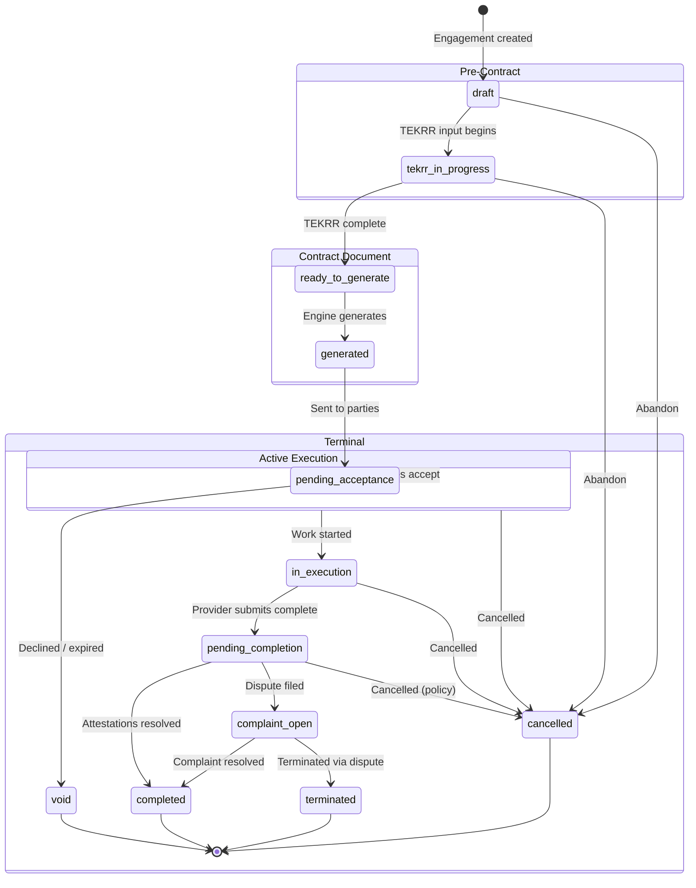
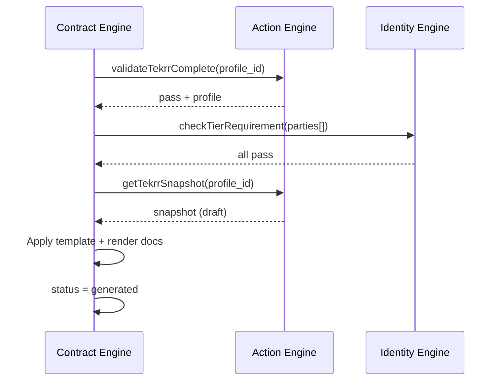
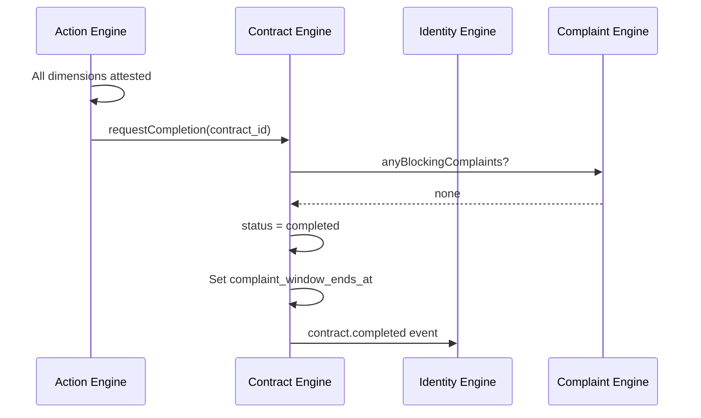

# APP13 — Contract Lifecycle v1

**Version:** 1.0  
**Status:** Draft  
**Owner engine:** Contract Engine  
**Related:** Action Engine (obligations), Identity Engine (tier gates)

---

## 1. Purpose

This document defines the **contract state machine**, transition rules, invariants, and cross-engine handoffs from engagement creation through archival.

---

## 2. Lifecycle overview



---

## 3. State definitions

### 3.1 Engagement states (pre-contract)

| State | Code | Description | Visible to |
|-------|------|-------------|------------|
| Draft | `draft` | Engagement created; provider may not be linked | Initiator |
| TEKRR in progress | `tekrr_in_progress` | TEKRR decomposition underway | Initiator + provider |
| Ready to generate | `ready_to_generate` | TEKRR validated complete | Initiator + provider |

### 3.2 Contract states

| State | Code | Description | Execution allowed |
|-------|------|-------------|-------------------|
| Generated | `generated` | Document produced; not yet sent | No |
| Pending acceptance | `pending_acceptance` | Awaiting party signatures | No |
| Active | `active` | All parties accepted; obligations materialized | Yes (start) |
| In execution | `in_execution` | Work has started | Yes |
| Pending completion | `pending_completion` | Provider submitted completion; awaiting attestation | Limited |
| Complaint open | `complaint_open` | Active complaint blocking completion | Frozen per dimension |
| Completed | `completed` | All obligations attested; complaint window may be open | No |
| Cancelled | `cancelled` | Terminated before completion | No |
| Terminated | `terminated` | Ended via dispute resolution | No |
| Void | `void` | Never activated; declined or expired | No |

---

## 4. Transition table

| From | To | Trigger | Actor | Engine | Preconditions |
|------|-----|---------|-------|--------|---------------|
| — | `draft` | Create engagement | Customer | Contract | Customer ≥ T1 |
| `draft` | `tekrr_in_progress` | Provider linked OR TEKRR edit started | Customer/Provider | Contract/Action | — |
| `tekrr_in_progress` | `ready_to_generate` | TEKRR validation pass | System | Action → Contract | All required TEKRR fields |
| `ready_to_generate` | `generated` | Generate contract | Customer/Provider | Contract | Tier gates pass |
| `generated` | `pending_acceptance` | Publish to parties | System | Contract | Documents stored |
| `pending_acceptance` | `active` | All required acceptances | Parties | Contract | Tier gates; snapshots stored |
| `pending_acceptance` | `void` | Any party declines | Party | Contract | — |
| `pending_acceptance` | `void` | Acceptance timeout | System | Contract | Default: 7 days |
| `active` | `in_execution` | Execution start | Provider | Action → Contract | Contract active |
| `in_execution` | `pending_completion` | Submit completion | Provider | Action → Contract | Required evidence submitted |
| `pending_completion` | `completed` | All dimensions attested | System/Parties | Action → Contract | No blocking complaints |
| `pending_completion` | `complaint_open` | Complaint filed | Party | Complaint → Contract | Valid complaint |
| `complaint_open` | `completed` | Complaint resolved + attestations final | System | Complaint → Contract | — |
| `complaint_open` | `terminated` | Adjudication terminates contract | Admin | Complaint → Contract | — |
| `active` | `cancelled` | Cancellation request | Party/Admin | Contract | Per cancellation policy |
| `in_execution` | `cancelled` | Cancellation request | Party/Admin | Contract | Per cancellation policy |
| `pending_completion` | `cancelled` | Cancellation (rare) | Admin | Contract | Audit required |
| `draft` / `tekrr_in_progress` | `cancelled` | Abandon engagement | Customer | Contract | — |
| `completed` | — | Complaint window elapses | System | Complaint | Informational; contract stays completed |

---

## 5. Invariants

| ID | Invariant | Enforcement |
|----|-----------|-------------|
| CL-1 | No state transition to `in_execution` unless contract is `active` | Contract → Action gate |
| CL-2 | `active` requires all `acceptance_required` parties have `accepted_at` | Contract |
| CL-3 | `active` requires `tekrr_snapshot_id` and `verification_snapshot` populated | Contract |
| CL-4 | Obligation graph exists iff contract ≥ `active` | Action |
| CL-5 | Generated document hash must match stored artifact at acceptance time | Contract |
| CL-6 | Void contracts cannot be reactivated; new engagement required | Contract |
| CL-7 | Amendment does not change status backward from `in_execution` to pre-active | Contract |
| CL-8 | `completed` requires all non-waived obligations in terminal state | Action → Contract |
| CL-9 | Only one `active` contract version per engagement at a time | Contract |
| CL-10 | Commercial terms immutable after `active` except via amendment | Contract |

---

## 6. Tier gates at transitions

| Transition | Identity check |
|------------|----------------|
| Create engagement | Customer ≥ T1 |
| Generate contract | Customer ≥ T1; Provider ≥ category minimum |
| Party acceptance | Accepting party ≥ required tier at moment of acceptance |
| Activate (implicit on last acceptance) | Re-validate all parties; snapshot stored |
| High-risk TEKRR (risk ≥ 4) | Provider ≥ T2 at generation and acceptance |

**Tier expiry during pending acceptance:** If provider tier expires before acceptance, block activation until renewed.

---

## 7. Cross-engine handoffs

### 7.1 `ready_to_generate` → `generated`



### 7.2 `pending_acceptance` → `active`

```mermaid
sequenceDiagram
    participant P as Party
    participant CE as Contract Engine
    participant IE as Identity Engine
    participant AE as Action Engine

    P->>CE: accept(contract_id)
    CE->>IE: checkTierRequirement(party)
    CE->>CE: Record acceptance
    CE->>CE: All required accepted?
    CE->>IE: getVerificationSnapshot(all parties)
    CE->>AE: getTekrrSnapshot + materializeObligations
    CE->>CE: Store snapshots; status = active
    CE->>CE: Emit contract.activated
```

### 7.3 `in_execution` → `completed`



---

## 8. Amendment lifecycle (parallel sub-state machine)

| Amendment state | Description |
|-----------------|-------------|
| `draft` | Delta proposed |
| `pending_acceptance` | Amendment doc generated; awaiting parties |
| `active` | All accepted; obligation graph updated |
| `rejected` | Declined or expired |

**Rules:**
- Active contract must be `active` or `in_execution` to request amendment (not `pending_completion` unless admin)
- TEKRR delta processed by Action Engine before amendment doc generation
- Re-acceptance required from all parties affected by delta
- On `active` amendment: new `tekrr_snapshot` version; obligation graph patched

---

## 9. Timeout and auto-transition policies

| Policy | Default (MVP) | Action |
|--------|---------------|--------|
| Acceptance timeout | 7 days from `pending_acceptance` | → `void` |
| Provider completion attestation silence | 7 days after `pending_completion` | Customer attestation stands (audit flag) |
| Customer attestation silence | 7 days after provider completion request | Provider attestation stands (audit flag) |
| Complaint window | 30 days from `completed` | Filing allowed |
| Draft engagement purge | 90 days in `draft` / `tekrr_in_progress` | Archive/delete |

---

## 10. Cancellation policy framework

Cancellation terms are **declared in commercial_terms** from template options:

| Policy type | Typical rule |
|-------------|--------------|
| `flexible` | Either party may cancel before `in_execution`; no fault |
| `moderate` | Cancel before start: free; after start: fault attribution |
| `strict` | Cancel after `active`: fault party recorded; trust impact |

**Fault attribution** on cancel feeds Identity Engine `contract.cancelled` event with `cancellation_fault_party`.

---

## 11. Events emitted by state

| State entered | Event |
|---------------|-------|
| Engagement created | `engagement.created` |
| `generated` | `contract.generated` |
| Each acceptance | `contract.party_accepted` |
| `active` | `contract.activated` |
| `in_execution` | (Action) `execution.started` |
| Amendment active | `contract.amended` |
| `completed` | `contract.completed` |
| `cancelled` | `contract.cancelled` |
| `void` | `contract.voided` |
| `terminated` | `contract.cancelled` (with termination reason) |

---

## 12. Status history

Every transition writes to `contract_status_history`:

| Field | Required |
|-------|----------|
| contract_id | Yes |
| from_status | Yes |
| to_status | Yes |
| actor_id | If human-triggered |
| reason | If void/cancel/terminate |
| created_at | Yes |

---

## 13. MVP scope

**In MVP:**
- Full state machine through `completed`, `void`, `cancelled`
- `complaint_open` blocking path
- Basic amendments
- Acceptance timeout
- Auto-attestation silence policy

**Post-MVP:**
- `terminated` via automated adjudication rules
- Multi-party acceptance (company co-signer)
- Automated renewal contracts

---

## 14. Contract lifecycle diagram (compact)

```
ENGAGEMENT                    CONTRACT                         EXECUTION
──────────                    ────────                         ─────────

draft
  ↓
tekrr_in_progress  ──→  Action Engine (TEKRR)
  ↓
ready_to_generate
  ↓
generated ──→  pending_acceptance  ──→  [void]
  ↓ (all accept + snapshots)
active  ──→  Action: obligations created
  ↓
in_execution  ──→  Action: evidence + attestations
  ↓
pending_completion
  ↓                    ↘
completed  ←────────  complaint_open  ──→  terminated
  ↓
[complaint window 30d]
```

---

*Contract Engine is the authoritative source for contract status. Action and Complaint engines request transitions; they do not set contract status directly.*
