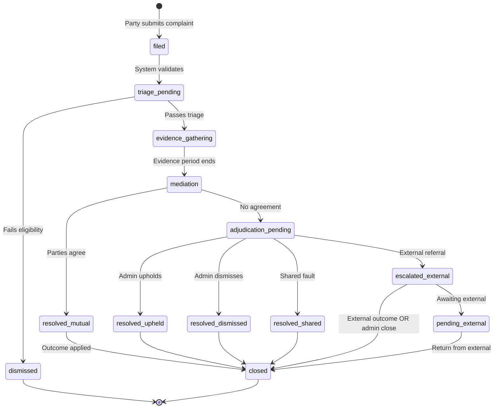
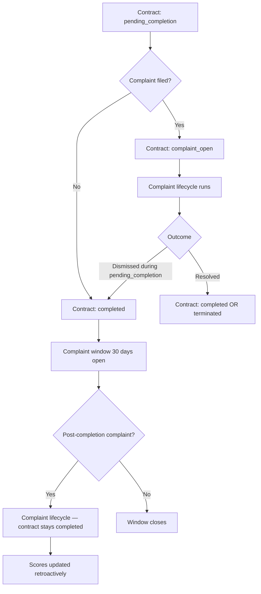

# APP13 — Complaint Lifecycle v1

**Version:** 1.0  
**Status:** Draft  
**Owner engine:** Complaint Engine  
**Related:** Contract Engine (validation), Action Engine (freeze/apply), Identity Engine (scoring)

---

## 1. Purpose

This document defines the **complaint state machine**, eligibility rules, SLAs, cross-engine effects, and terminal outcomes for APP13's dispute accountability system.

**Core rule:** Every complaint is bound to exactly one `contract_id` and one or more `tekrr_dimensions`.

---

## 2. Lifecycle overview



---

## 3. State definitions

| State | Code | Description | Contract impact |
|-------|------|-------------|-----------------|
| Filed | `filed` | Submitted; pending system validation | None yet |
| Triage pending | `triage_pending` | In admin validation queue | Dimension freeze pending |
| Dismissed | `dismissed` | Invalid complaint | No freeze |
| Evidence gathering | `evidence_gathering` | Parties submitting evidence | Dimension(s) frozen |
| Mediation | `mediation` | Mutual resolution period | Frozen |
| Adjudication pending | `adjudication_pending` | Awaiting admin decision | Frozen |
| Resolved (mutual) | `resolved_mutual` | Parties agreed | Outcome applied |
| Resolved (upheld) | `resolved_upheld` | Violation confirmed | Outcome applied |
| Resolved (dismissed) | `resolved_dismissed` | No violation found | Outcome applied |
| Resolved (shared) | `resolved_shared` | Partial fault | Outcome applied |
| Escalated external | `escalated_external` | Referred to insurer/regulator/court | Pending flag |
| Pending external | `pending_external` | Awaiting external outcome | Frozen |
| Closed | `closed` | Terminal; all engine updates complete | Contract may complete |

---

## 4. Transition table

| From | To | Trigger | Actor | Preconditions |
|------|-----|---------|-------|---------------|
| — | `filed` | Submit complaint form | Contract party | Authenticated |
| `filed` | `triage_pending` | System validation pass | System | Contract exists |
| `filed` | `dismissed` | System validation fail | System | Eligibility failed |
| `triage_pending` | `dismissed` | Admin dismiss at triage | Admin | Invalid/spam/duplicate |
| `triage_pending` | `evidence_gathering` | Admin accept triage | Admin | Within 2 business days |
| `evidence_gathering` | `mediation` | Evidence period expires | System | 5 business days elapsed |
| `mediation` | `resolved_mutual` | Both parties accept proposal | Parties | Agreement recorded |
| `mediation` | `adjudication_pending` | Mediation period expires | System | No agreement |
| `adjudication_pending` | `resolved_upheld` | Admin decision | Admin | — |
| `adjudication_pending` | `resolved_dismissed` | Admin decision | Admin | — |
| `adjudication_pending` | `resolved_shared` | Admin decision | Admin | — |
| `adjudication_pending` | `escalated_external` | Admin escalation | Admin | Risk/regulatory trigger |
| `escalated_external` | `pending_external` | External body acknowledged | Admin | — |
| `pending_external` | `closed` | External outcome recorded | Admin | — |
| `resolved_*` | `closed` | Outcome applied to engines | System | Action + Identity updated |
| `dismissed` | — | Terminal | — | Optional frivolous flag |

---

## 5. Eligibility rules (filing gate)

All must pass for `filed` → `evidence_gathering`:

| Rule ID | Rule | Validation engine |
|---------|------|-------------------|
| EL-1 | Filer is contract party | Contract |
| EL-2 | Contract status ∈ `in_execution`, `pending_completion`, `completed` | Contract |
| EL-3 | If `completed`: current time ≤ `complaint_window_ends_at` | Contract |
| EL-4 | If during execution: incident date within contract active period | Contract |
| EL-5 | Each declared dimension exists in contract TEKRR snapshot | Action |
| EL-6 | No other active complaint on same `(contract_id, dimension)` | Complaint |
| EL-7 | Complaint type maps to declared dimension(s) | Complaint |
| EL-8 | Description ≥ minimum length (e.g., 50 chars) | Complaint |

**Failure:** Status → `dismissed` with reason code; filer notified.

### Dismissal reason codes

| Code | Meaning |
|------|---------|
| `OUT_OF_WINDOW` | Filing period expired |
| `NOT_A_PARTY` | Filer not on contract |
| `INVALID_DIMENSION` | Dimension not in TEKRR snapshot |
| `DUPLICATE_ACTIVE` | Active complaint exists |
| `CONTRACT_NOT_ACTIVE` | Contract never activated |
| `INSUFFICIENT_DETAIL` | Description too vague |
| `TYPE_MISMATCH` | Complaint type doesn't match dimension |

---

## 6. Invariants

| ID | Invariant | Enforcement |
|----|-----------|-------------|
| PL-1 | Complaint cannot exist without valid `contract_id` | Complaint |
| PL-2 | ≥ 1 TEKRR dimension per complaint | Complaint |
| PL-3 | Dimension freeze in Action before `evidence_gathering` | Complaint → Action |
| PL-4 | Adjudication recorded before `complaint.resolved` event | Complaint |
| PL-5 | Action outcome applied before `closed` | Complaint → Action |
| PL-6 | Trust score update only after `closed` | Identity subscribes to resolved |
| PL-7 | Dismissed complaints do not freeze dimensions | Complaint |
| PL-8 | One adjudication record per complaint | Complaint |
| PL-9 | Auto-attached evidence is read-only | Complaint |
| PL-10 | External escalation does not auto-resolve without admin close | Complaint |

---

## 7. SLA schedule

| Stage | Starts | Duration (business days) | Responsible |
|-------|--------|--------------------------|-------------|
| Triage | `filed` | ≤ 2 | Admin |
| Evidence gathering | Triage pass | 5 | Both parties |
| Mediation | Evidence end | 5 | Both parties |
| Adjudication | Mediation end (no agreement) | ≤ 5 (MVP) | Admin |
| **Total median target** | | **≤ 15 (MVP)** / **≤ 10 (prod)** | |

**SLA breach handling (MVP):** Admin dashboard flag; no auto-escalation.

---

## 8. Cross-engine effects by state

### 8.1 On `evidence_gathering` entry

| Engine | Action |
|--------|--------|
| **Action** | `freezeDimension(contract_id, dimension, complaint_id)` for each dimension |
| **Contract** | If status = `pending_completion` → `complaint_open` |
| **Complaint** | Auto-assemble evidence package |
| **Notification** | Notify all contract parties |

### 8.2 During `evidence_gathering` and `mediation`

| Actor | Capability |
|-------|------------|
| Parties | Upload evidence; submit mediation proposals |
| Admin | View package; request clarifications |
| Action | Obligations on frozen dimensions locked |

### 8.3 On resolution (`resolved_*` → `closed`)

| Engine | Action |
|--------|--------|
| **Complaint** | Write `adjudications` record |
| **Action** | `applyAdjudicationOutcome(contract_id, dimension, outcome)` |
| **Action** | Release dimension freeze |
| **Identity** | Emit `score_events` from outcome; recompute trust score |
| **Contract** | If no other blocking complaints → allow `completed` transition |
| **Notification** | Notify parties of outcome |

---

## 9. Outcome model

### 9.1 Outcome types

| Outcome | Code | Provider at fault | Attestation result |
|---------|------|:-----------------:|-------------------|
| Upheld — provider fault | `upheld_provider_fault` | Yes | `unfulfilled` |
| Upheld — customer fault | `upheld_customer_fault` | No | Original provider attestation protected |
| Dismissed | `dismissed` | No | Original attestation restored |
| Shared fault | `shared_fault` | Partial | `partially_fulfilled` |
| Mutual resolution | `resolved_mutual` | Per agreement | Per agreement |
| External referral | `external_referral` | Pending | Frozen until close |

### 9.2 Severity (for trust score)

Applied on upheld outcomes against provider:

| Severity | When | Base penalty units |
|----------|------|-------------------|
| `low` | Minor, remediated | 10 |
| `medium` | Material unfulfillment | 25 |
| `high` | Safety, credential fraud | 50 |
| `critical` | Platform integrity violation | 100 + tier review |

Penalty × recency decay × complaint history multiplier → feeds Identity `score_events`.

### 9.3 Complaint type → default severity hint

| Type | Default severity hint |
|------|----------------------|
| `TIME_BREACH` | low–medium |
| `EFFORT_DEFICIENCY` | medium |
| `KNOWLEDGE_MISREP` | high |
| `RISK_INCIDENT` | high–critical |
| `RESPONSIBILITY_FAILURE` | medium–high |
| `CONTRACT_INTEGRITY` | critical |

Admin may override severity with documented reason.

---

## 10. Evidence package specification

Auto-assembled at triage pass (`evidence_source = auto_attached`):

| # | Artifact | Source entity |
|---|----------|---------------|
| 1 | Contract structured JSON | contract_documents |
| 2 | Contract PDF | contract_documents |
| 3 | TEKRR snapshot | tekrr_snapshots |
| 4 | Verification snapshot | contracts.verification_snapshot |
| 5 | Obligation graph + statuses | obligations |
| 6 | Execution evidence | execution_evidence |
| 7 | Attestation records | attestations |
| 8 | Party acceptance log | contract_parties |
| 9 | Amendment chain (if any) | amendments |
| 10 | Contract status history | contract_status_history |

Parties may add `evidence_source = party` items during evidence period.

---

## 11. Mediation model

| Element | Rule |
|---------|------|
| Initiator | Either party or admin |
| Proposal | JSON terms: attestation outcome, optional remediation, optional fee acknowledgment (declarative) |
| Acceptance | Both parties must accept same proposal |
| Expiry | Mediation period end → `adjudication_pending` |
| Multiple proposals | Allowed; only one active at a time |

MVP: Mediation tracked manually; no automated recommendation engine.

---

## 12. External escalation paths

| Trigger | Escalation target | MVP handling |
|---------|-------------------|--------------|
| Risk incident + insurance attested on contract | Insurance Entity | Admin logs referral manually |
| Knowledge misrep + regulated category | Government Entity | Admin logs referral manually |
| Criminal conduct suspicion | Law enforcement guidance | Admin documents; platform does not investigate |
| Contract integrity critical | Platform Admin + Trust Ops | Immediate tier review flag |

External escalation sets complaint to `escalated_external` → `pending_external`. Trust score may receive `pending` flag until admin records external outcome or closes with best available evidence.

---

## 13. Multi-dimension complaints

A single complaint case may reference multiple TEKRR dimensions:

| Rule | Description |
|------|-------------|
| MD-1 | Each dimension listed independently in `tekrr_dimensions` |
| MD-2 | All listed dimensions frozen on evidence_gathering |
| MD-3 | Adjudication may differ per dimension (stored in `adjudications.findings` JSON) |
| MD-4 | Action Engine applies outcome per dimension |
| MD-5 | Trust penalty uses highest severity among upheld dimensions |

---

## 14. Frivolous complaint detection

| Signal | Action |
|--------|--------|
| 3+ complaints dismissed against same filer in 12 months | Flag filer for admin review |
| Pattern of collusive disputes | Trust Ops investigation |
| Complaint contradicts signed attestation without evidence | Triage priority lower |

Does not block filing; affects triage priority and may affect filer trust (Phase 2 for customer trust score).

---

## 15. Events catalog

| Event | When emitted |
|-------|--------------|
| `complaint.filed` | On successful submit |
| `complaint.triaged` | Triage pass or dismiss |
| `complaint.evidence_requested` | Enter evidence_gathering |
| `complaint.mediation_started` | Enter mediation |
| `complaint.resolved` | Outcome applied; includes outcome, severity, fault_party |
| `complaint.escalated_external` | External referral logged |

### `complaint.resolved` payload (minimum)

```json
{
  "complaint_id": "uuid",
  "contract_id": "uuid",
  "outcome": "upheld_provider_fault",
  "severity": "medium",
  "fault_party_id": "uuid",
  "dimensions": [
    { "dimension": "E", "final_status": "unfulfilled" }
  ],
  "provider_profile_id": "uuid"
}
```

---

## 16. Interaction with contract lifecycle



**Post-completion complaints:** Contract status remains `completed`; attestations and scores updated retroactively via Action + Identity.

---

## 17. Admin operational views (requirements only)

| Queue | Filter |
|-------|--------|
| Triage inbox | status = `triage_pending` |
| Evidence overdue | status = `evidence_gathering`, past SLA |
| Adjudication inbox | status = `adjudication_pending` |
| External pending | status = `pending_external` |
| SLA breached | Any stage past target |

---

## 18. MVP scope

**In MVP:**
- Full lifecycle through `closed` and `dismissed`
- Single and multi-dimension complaints
- Auto evidence package
- Manual adjudication
- Dimension freeze/unfreeze
- Trust score impact on close
- Manual external escalation logging

**Post-MVP:**
- Automated mediation recommendations
- Insurance/Government API notifications
- Customer filer trust score
- Expedited paid resolution track

---

## 19. Complaint lifecycle diagram (compact)

```
FILED → TRIAGE ──┬──→ DISMISSED (end)
                 │
                 └──→ EVIDENCE (5d) → MEDIATION (5d) ──┬──→ RESOLVED_MUTUAL ──┐
                                                      │                       │
                                                      └──→ ADJUDICATION (5d) ──┤
                                                             │                 │
                                    ┌────────────────────────┼─────────────┐   │
                                    ↓                        ↓             ↓   ↓
                              UPHELD / DISMISSED / SHARED / EXTERNAL → CLOSED
                                                                    ↓
                                                          Identity: score update
                                                          Action: attestation final
                                                          Contract: complete if pending
```

---

*Complaint Engine is the authoritative source for complaint status. Resolution outcomes drive Action and Identity engines via events; it does not directly mutate trust scores or attestations.*
