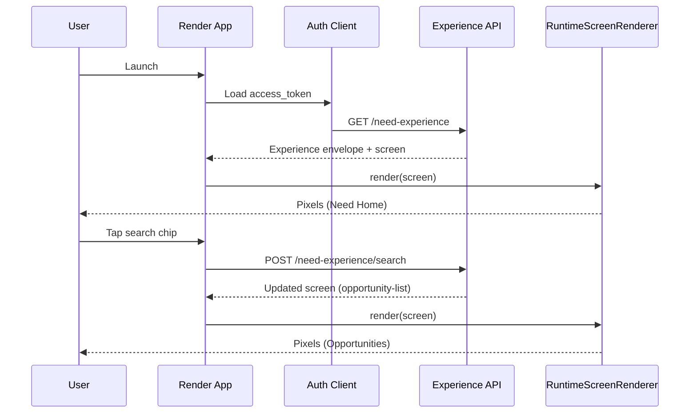
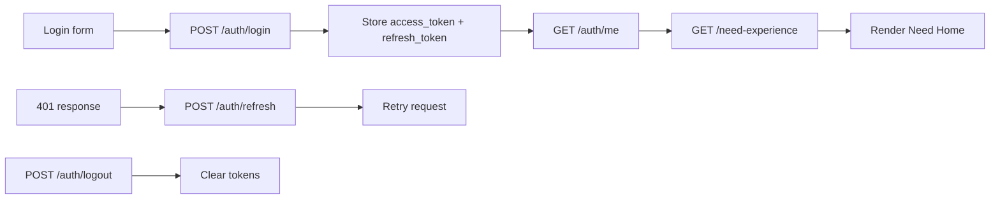
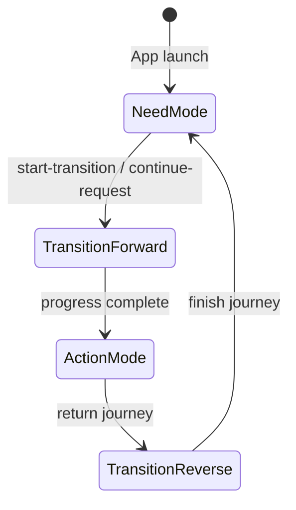
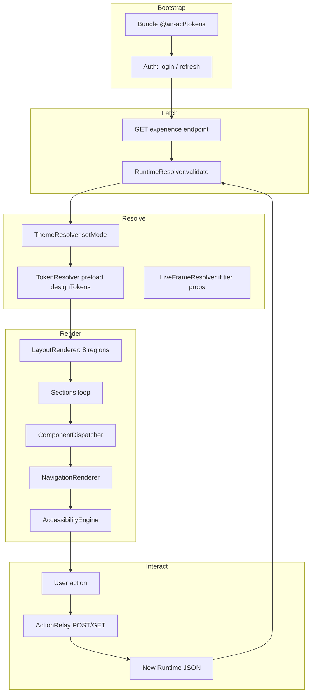
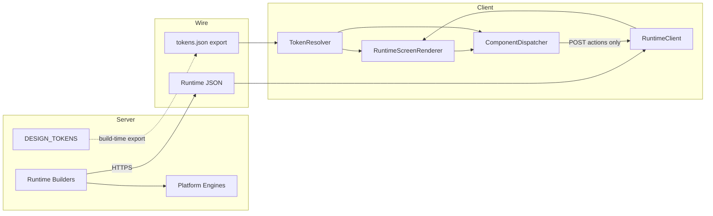

# AN ACT — Render Layer Architecture

**Version:** 1.0  
**Status:** Official frontend architecture specification (documentation)  
**Scope:** How every future interface consumes the existing backend without business logic  
**Constraint:** Derived from repository evidence and prior architecture docs. No source code modified.

---

## Status Classification Key

| Label | Meaning |
|-------|---------|
| **Implemented** | Exists in backend, design system, or CH3 runtime today |
| **Documented** | Specified in prior architecture docs |
| **Concept only** | Recommended client layer; not yet built |
| **Recommended** | Official v1.0 guidance |

---

## Companion Documents

| Document | Role |
|----------|------|
| [Runtime JSON Contract](./AN-ACT-Runtime-JSON-Contract.md) | What the client receives |
| [Design Tokens Specification](./AN-ACT-Design-Tokens-Specification.md) | How the client resolves visual values |
| [Live Frame v1.0 Specification](./AN-ACT-Live-Frame-v1.0-Specification.md) | Trust ring rendering rules |
| [Transition To MVP Plan](./AN-ACT-Transition-To-MVP-Plan.md) | Build order and milestones |
| [Implementation Guide](./AN-ACT-Render-Layer-Implementation-Guide.md) | Practical build instructions |

---

## 1. Official Render Layer Philosophy

**Classification:** **Documented** (Product Bible §45); client implementation **Concept only**

The Render Layer is a **pure presentation tier**. It translates server-authored **Runtime JSON** and bundled **Design Tokens** into native pixels. It does not own product rules, trust formulas, matching, pricing, contracts, or intelligence logic.

### Three laws

| Law | Statement |
|-----|-----------|
| **Server authoritative** | Screen structure, navigation hints, and action outcomes come from experience APIs — **Implemented** |
| **Token faithful** | All colors, spacing, typography, motion resolve from `@an-act/tokens` — **Concept only** package |
| **Zero business logic** | Clients render and relay user intent; engines decide — **Recommended** invariant |

### What the Render Layer is

- A **component dispatcher** mapping `core-ui-*` IDs to native widgets
- A **theme resolver** mapping `screen.mode` + semantic paths to resolved values
- A **layout engine** mapping 8 screen regions to platform containers
- An **action relay** posting declared actions to experience endpoints
- An **accessibility executor** applying labels, roles, touch targets from JSON

### What the Render Layer is not

- Not a second backend — no trust scoring, matching, or contract validation locally
- Not a replacement for CH4/CH5 intelligence — intelligence stays read-only API
- Not an extension of legacy `src/ui/pages/` — **Documented** freeze
- Not a place to hardcode Need/Action hex values — **Recommended** prohibition

### Platform targets

| Platform | MVP tier | Classification |
|----------|----------|----------------|
| React (web) | Primary | **Recommended** |
| React Native | Primary (shared components) | **Recommended** |
| Flutter | Secondary / mobile-native | **Recommended** |
| SwiftUI | Secondary / iOS-first | **Recommended** |
| Bubble | Prototype only | **Documented** (`noBubbleIntegration` on executive modules — **Implemented**) |

---

## 2. Zero Business Logic Rule

**Classification:** **Recommended** (constitutional for Render Layer)

### Allowed in the client

| Category | Examples |
|----------|----------|
| **Rendering** | Map JSON → widgets; apply tokens; animate transitions |
| **Layout** | Regions, scroll, safe area, responsive breakpoints |
| **Input capture** | Read form field values from `core-ui-input` props |
| **Action relay** | POST `/need-experience/search` with `{ keyword }` from user input |
| **Navigation relay** | GET `/need-experience/opportunities` when user taps chip with known route |
| **Auth transport** | Attach Bearer token; refresh on 401 |
| **Caching** | Cache tokens JSON, last screen snapshot, auth tokens |
| **Validation (UI-only)** | `required` field empty → disable submit button |
| **Accessibility** | Focus order, screen reader labels from JSON |
| **Dev tooling** | Show `prototypeId`, log unknown `componentId` |

### Forbidden in the client

| Category | Why | Backend owner |
|----------|-----|---------------|
| Trust tier calculation | Formula lives in S5 trust profile | `trust-profile.ts` |
| Live Frame tier from score | Use `ui_tier` / props from server | Live Frame adapter — **Recommended** |
| Provider ranking / match score | Discovery engine | `discovery-service.ts` |
| Contract readiness | Contract experience `review` object | `contract-experience-service.ts` |
| Pricing / TEKRR | Financial and action engines | Platform core |
| AI foundation confidence | CH5 read-only | `ai-experience-foundation-service.ts` |
| Permission / role decisions | Security kernel | `security/guards.ts` |
| Idempotency / state machines | Engines | ADR-defined lifecycles |

### Decision test

> If removing the client and calling the API directly would change platform outcomes, the logic belongs on the server — not in the Render Layer.

### Action relay pattern (**Implemented** server contract)

User taps button with `props.action: "continue-request"` → client POSTs to `/need-experience/request/continue` → server returns new `RuntimeScreenView` → client re-renders. **No local state machine for request flow.**

---

## 3. Runtime JSON Consumption Pipeline

**Classification:** **Implemented** (server builders); client pipeline **Concept only**

```
┌─────────────────────────────────────────────────────────────────┐
│                        BACKEND (existing)                        │
│  Experience Service → buildRuntimeScreenView() → JSON response   │
└───────────────────────────────┬─────────────────────────────────┘
                                │ HTTPS + Bearer
                                ▼
┌─────────────────────────────────────────────────────────────────┐
│                     RENDER LAYER (Concept only)                  │
│  1. RuntimeClient.fetch(experienceEndpoint)                      │
│  2. RuntimeResolver.validate(envelope | screen)                  │
│  3. ThemeResolver.setMode(screen.mode)                           │
│  4. RuntimeScreenRenderer.render(screen)                         │
│  5. ComponentDispatcher.dispatch(instance) × N                   │
│  6. ActionRelay.onUserIntent(action) → POST/GET experience API   │
└─────────────────────────────────────────────────────────────────┘
```

### Input types

| Input | Source | Client handling |
|-------|--------|-----------------|
| Full envelope | `GET /need-experience` | Render `envelope.screen`; store session fields read-only |
| Screen only | `GET /need-experience/home` | Render screen directly |
| Error | 4xx/5xx Problem Details | Error renderer — no screen tree |
| Semantic adjunct | `GET /live-frame` | Optional enrichment; do not recompute tiers |

### Validation steps (**Recommended**)

1. Required screen fields present (`screenId`, `layoutId`, `sections`, …)
2. Each `componentId` ∈ known registry (warn if unknown)
3. Each `designTokens[]` path resolvable in current mode
4. `accessibility.minimumTouchTargetPx >= 44`

---

## 4. Design Token Consumption

**Classification:** **Implemented** (server tokens); client package **Concept only**

See [Design Tokens Specification](./AN-ACT-Design-Tokens-Specification.md).

```
screen.mode ──► ThemeResolver ──► AnActMode ("need" | "action" | "transition")
                      │
designTokens[] ───────┼──► TokenResolver.resolveColor(path) → #hex
typography.header ────┼──► TokenResolver.resolveTypography(style)
spacing.gap ──────────┼──► TokenResolver.resolveSpacing("space-12") → 12
elevation on component └──► TokenResolver.resolveShadow(level, mode)
```

**Rule:** Runtime JSON never carries hex for theme colors (except legacy intelligence views the Render Layer should not use for MVP screens). Client resolves all paths via `@an-act/tokens`.

---

## 5. Component Rendering Lifecycle

**Classification:** **Concept only**

```
Screen mount
    → ThemeResolver.apply(screen.mode, screen.designTokens)
    → LayoutRenderer.buildRegions(screen.regions, screen.layoutId)
    → for each section in screen.sections:
          for each instance in section.components:
              ComponentDispatcher.render(instance)
    → NavigationRenderer.apply(screen.navigation)
    → AccessibilityEngine.apply(screen.accessibility)
    → Screen ready (interactive unless transitionActive)
```

### ComponentDispatcher contract

| Input | Output |
|-------|--------|
| `RuntimeComponentInstance` | Native widget tree |
| Unknown `componentId` | Fallback panel + dev warning — **Recommended** |
| Nested props (`liveFrame`, `badges`) | Delegate to sub-dispatchers |

Registry authority: `CORE_UI_COMPONENT_REGISTRY` — 22 components — **Implemented**.

---

## 6. Navigation Rendering

**Classification:** **Implemented** (JSON fields); client **Concept only**

### Screen-level navigation view

From `screen.navigation`:

| Field | Client behavior |
|-------|-----------------|
| `pattern` | stack → push route; tab → bottom nav; modal/sheet → overlay |
| `canGoBack` | Show back affordance |
| `backRoute` | Pop or GET previous screen endpoint |
| `bottomNavigationVisible` | Show/hide bottom nav region |
| `activeBottomNavId` | Highlight tab |
| `nextRoute` | Optional forward hint (dev/QA) |

### Session navigation state

Full envelopes include `NavigationState` with `phase`, `stack`, `transitionActive` — **Implemented**.

| `phase` | Client behavior |
|---------|-----------------|
| `idle` | Normal interaction |
| `transitioning` | Block input; show transition layer — **Implemented** rule |
| `modal-open` / `sheet-open` | Trap focus; hide bottom nav |

**Rule:** Client does not maintain authoritative navigation stack — refetch or POST actions; server returns updated `navigation` — **Recommended**.

---

## 7. Live Frame Rendering

**Classification:** **Implemented** (component spec); resolver **Concept only**

See [Live Frame v1.0 Specification](./AN-ACT-Live-Frame-v1.0-Specification.md).

### Runtime path (MVP)

```json
{
  "componentId": "core-ui-live-frame",
  "props": { "tier": "gold", "score": 88, "readOnly": true }
}
```

**LiveFrameResolver:**

1. Read `props.tier` as `ui_tier` (bronze | silver | gold | platinum | diamond)
2. Map to accent token per CH3 X2 (`TIER_ACCENT`) — **Implemented**
3. Resolve accent via `TokenResolver.resolveColor(mode, accentToken)`
4. Render ring: `radius: circle`, `strokeWidth: 2`, `elevation: medium`, `motion: slow`
5. Display `score` (0–100) if present; never compute tier from score locally — **Recommended**

### Trust enrichment path (optional)

Fetch `GET /live-frame` for dashboard surfaces — render semantic sections separately; do not merge formulas into ring component.

---

## 8. Screen Rendering Flow

**Classification:** **Concept only**



### Region mapping (**Implemented** spec)

| Region | Platform container |
|--------|-------------------|
| `safeArea` | SafeArea / padding insets |
| `statusArea` | Status bar spacer |
| `topNavigation` | App bar / `core-ui-navigation-bar` |
| `screenHeader` | Title block |
| `contentArea` | Scrollable sections |
| `floatingActionArea` | FAB overlay |
| `bottomNavigation` | Tab bar / `core-ui-bottom-navigation` |
| `transitionLayer` | Full-screen `core-ui-loading` |

---

## 9. State Management Philosophy

**Classification:** **Recommended**

| State type | Owner | Client role |
|------------|-------|-------------|
| **Business session** | Server (in-memory per experience — **Implemented**) | Display; refresh via API |
| **Auth session** | Server + JWT | Store tokens securely; refresh |
| **Current screen** | Server response | Render latest `screen` field |
| **Form draft** | Server `request_draft` in envelope | Bind inputs to props; POST updates |
| **UI ephemeral** | Client | Scroll position, focus, animation frame |
| **Cached snapshot** | Client (offline) | Read-only last screen — **Recommended** |

### Anti-patterns

- Duplicating `request_draft` as source of truth in Redux without server sync
- Computing `current_screen` locally after navigation
- Storing trust scores for display logic beyond cache

### Recommended client stores

| Store | Contents |
|-------|----------|
| `AuthStore` | tokens, user_id, session_id |
| `RuntimeStore` | last envelope, loading, error |
| `ThemeStore` | current mode, reducedMotion flag |
| `TokenStore` | bundled `@an-act/tokens` (static) |

Server remains authoritative — **Implemented** pattern in Need/Contract/Profile services.

---

## 10. Offline Strategy

**Classification:** **Concept only** (not in platform today)

| Capability | MVP | Post-MVP |
|------------|-----|----------|
| Bundle design tokens | Yes — ship with app | Same |
| Cache last Runtime screen | Yes — read-only banner | Same |
| Mutations offline | **No** — queue forbidden for business actions | Optional action queue with server reconciliation — **Concept only** |
| Auth offline | Show cached screen + "connection required" | Same |
| Discovery / trust | No local rank or tier | Same |

**Rule:** Offline mode is **read-only display** of cached JSON + tokens. No business logic executes offline — **Recommended**.

---

## 11. Authentication Flow

**Classification:** **Implemented** (API); client **Concept only**



| Step | Endpoint | Render Layer action |
|------|----------|---------------------|
| Login | `POST /auth/login` | Store `AuthTokens` |
| Profile | `GET /auth/me` | Display role; no permission logic |
| API calls | All experience routes | Header: `Authorization: Bearer {access_token}` |
| Refresh | `POST /auth/refresh` | Rotate tokens on 401 |
| Logout | `POST /auth/logout` | Clear store; navigate to login |

Render Layer never interprets `roles[]` for engine decisions — only for conditional **display** if server sends different screens per role — **Recommended**.

---

## 12. Error Rendering

**Classification:** **Implemented** (Problem Details)

### RFC 7807 response

```json
{
  "type": "https://app13.dev/problems/NOT_FOUND",
  "title": "Not Found",
  "status": 404,
  "detail": "Unknown need screen: invalid-id",
  "code": "NOT_FOUND",
  "engine": "platform",
  "request_id": "req_abc"
}
```

### Client behavior

| Status | UI |
|--------|-----|
| 401 | Redirect to login / refresh flow |
| 403 | Static forbidden screen — message from `detail` |
| 404 | Empty or error screen — no fake Runtime JSON |
| 422 / 400 | Inline validation from server if returned; else toast |
| 5xx | Retry affordance + support reference (`request_id`) |

Prototype reference: `ERROR_PROTOTYPE` in prototype library — **Implemented**.

**Rule:** Do not synthesize `RuntimeScreenView` from errors — use dedicated error UI — **Recommended**.

---

## 13. Loading Rendering

**Classification:** **Implemented** (transition + waiting screens)

### Fetch loading

While awaiting experience API: skeleton or `core-ui-loading` with neutral message — **Recommended**.

### Official transition (`screenId: transition`)

| Property | Source | Client |
|----------|--------|--------|
| Brand line | `an act...` | Terminal typography |
| Stage text | `NeedTransitionView.stageText` | Animate through 5 stages |
| Duration | 640ms | `MOTION_DURATIONS.extraSlow` |
| Progress | `core-ui-progress` | Linear 4px pill |
| Background | Interpolate `transition.start/mid/end` | TokenResolver |
| Input blocked | `navigation.phase === transitioning` | **Implemented** |

### Waiting screen

Action experience `waiting-screen` uses `core-ui-loading` — **Implemented**.

### Reduced motion

Query `reduced_motion=true` or `prefers-reduced-motion`: skip animation, instant background — **Implemented** in accessibility spec.

---

## 14. Accessibility

**Classification:** **Implemented** (rules in design system + JSON)

| Requirement | Source | Client |
|-------------|--------|--------|
| Min touch target 44px | `ACCESSIBILITY_RULES` | Enforce on all interactives |
| Labels | `instance.accessibility.label` | aria-label / accessibilityLabel |
| Roles | `instance.accessibility.role` | ARIA / platform role |
| Focus ring | `border.focus` token | 2px ring, 2px offset |
| Landmarks | `accessibility.landmarkRegions` | Region roles |
| Reduced motion | screen + query param | Honor spec |
| Live Frame | `ariaRole: img` | Required label with tier |

Keyboard: tab order follows layout regions — **Implemented** in navigation accessibility spec.

---

## 15. Animation Strategy

**Classification:** **Implemented** (motion tokens)

| Animation | Token | Duration | When |
|-----------|-------|----------|------|
| Button press | fast | 120ms | Interactive feedback |
| Card hover | normal | 240ms | Web hover |
| Live Frame ring | slow | 400ms | Focus/hover |
| Mode transition | extraSlow | 640ms | Need ↔ Action |
| Progress fill | extraSlow | 640ms | Transition screen |

Easing: `emphasized` for forward transition, `decelerate` for reverse — **Implemented**.

**Rule:** Animations are presentational only — never gate business actions — **Recommended**.

---

## 16. Need Mode / Action Mode Transitions

**Classification:** **Implemented** (transition spec)



| Phase | `screen.mode` | Theme |
|-------|---------------|-------|
| Discovery | `need` | Need Mode colors |
| Transition | `transition` | Interpolated `transition.*` |
| Execution | `action` | Action Mode colors |

Client switches `ThemeResolver` on `screen.mode` change — not OS dark mode — **Documented** in Design Tokens Spec §20.

Forward transition stages (**Documented**): Preparing…, Matching…, Building Contract…, Securing…, Action Ready.

---

## 17. Render Adapter Interfaces

**Classification:** **Concept only** — official TypeScript contracts for all platforms

### RuntimeClient

```typescript
interface RuntimeClient {
  fetchExperience(path: string, options?: RuntimeFetchOptions): Promise<RuntimeExperienceEnvelope>;
  fetchScreen(path: string, options?: RuntimeFetchOptions): Promise<AnActRuntimeScreenView>;
  postAction(path: string, body: unknown): Promise<RuntimeActionResult>;
}
```

### RuntimeResolver

```typescript
interface RuntimeResolver {
  validateScreen(screen: unknown): ValidationResult;
  validateEnvelope(envelope: unknown): ValidationResult;
  parseExperienceVersion(envelope: { version?: string }): string;
}
```

### ThemeResolver

```typescript
interface ThemeResolver {
  setMode(mode: "need" | "action" | "transition"): void;
  getMode(): AnActMode;
  resolveColor(path: SemanticColorTokenPath): string;
  resolveTypography(style: TypographyStyle): TypographyToken;
  resolveSpacing(name: SpacingTokenName): number;
  resolveShadow(level: ElevationLevel): string;
  setReducedMotion(enabled: boolean): void;
}
```

### TokenResolver

Alias of theme + static token access from `@an-act/tokens` — see [Export Plan](./AN-ACT-Design-Tokens-Export-Plan.md).

### ComponentDispatcher

```typescript
interface ComponentDispatcher {
  register(componentId: string, renderer: ComponentRenderer): void;
  render(instance: RuntimeComponentInstance, context: RenderContext): NativeNode;
  has(componentId: string): boolean;
}

type ComponentRenderer = (
  instance: RuntimeComponentInstance,
  ctx: RenderContext
) => NativeNode;
```

### LiveFrameResolver

```typescript
interface LiveFrameResolver {
  resolveAccent(uiTier: LiveFrameTier, mode: AnActMode): SemanticColorTokenPath;
  renderProps(props: LiveFrameProps, ctx: RenderContext): LiveFrameRenderModel;
}
```

### RuntimeScreenRenderer

```typescript
interface RuntimeScreenRenderer {
  render(screen: AnActRuntimeScreenView): NativeScreenTree;
}
```

### ActionRelay

```typescript
interface ActionRelay {
  dispatch(action: UserActionHint, context: ActionContext): Promise<void>;
}
```

---

## 18. Platform Strategies (Summary)

Detailed build steps: [Implementation Guide](./AN-ACT-Render-Layer-Implementation-Guide.md).

| Platform | Approach | Business logic |
|----------|----------|----------------|
| **React** | `@an-act/tokens` + `@an-act/runtime-ui` + hooks | None — POST actions |
| **React Native** | Shared runtime-ui where possible | None |
| **Flutter** | JSON tokens + Widget registry | None |
| **SwiftUI** | Bundled tokens + View factory | None |
| **Bubble** | API Connector + static token option sets | None — Need Mode MVP only |

---

## 19. Future Extensibility

**Classification:** **Recommended**

| Extension | Mechanism |
|-----------|-----------|
| New component | Register in server `CORE_UI_COMPONENT_REGISTRY`; add client renderer |
| New screen | Server adds screenId + builder; client needs no code if components exist |
| New experience module | Register in runtime registry; client adds route map entry |
| New token path | Update `@an-act/tokens` major version |
| CH4/CH5 dashboards | Adapter maps intelligence JSON → component trees — optional |
| CH2 Living | Separate adapter; not MVP Render Layer — **Documented** |

Forward compatibility: unknown props ignored; unknown components show fallback — **Recommended**.

---

## 20. Recommended Package Structure

**Classification:** **Recommended** (from Transition To MVP Plan + Export Plan)

```
packages/
  tokens/              @an-act/tokens
  runtime-core/        @an-act/runtime-core — interfaces, resolver, validation
  runtime-ui/          @an-act/runtime-ui — React/RN components + RuntimeScreenRenderer
  runtime-client/      @an-act/runtime-client — fetch, auth, action relay
apps/
  web/                 MVP shell
  mobile/              RN shell (optional)
```

Platform-specific: `an_act_tokens` (Flutter), `AnActKit` (SwiftUI) — consume same JSON.

---

## 21. Migration Roadmap

**Classification:** **Recommended** — aligns with [Transition To MVP Plan](./AN-ACT-Transition-To-MVP-Plan.md)

| Phase | Deliverable | Depends on |
|-------|-------------|------------|
| **R0** | This architecture doc | — ✅ |
| **R1** | `@an-act/tokens` + `@an-act/runtime-core` | Design Tokens Export Plan |
| **R2** | 5 P0 components + ComponentDispatcher | R1 |
| **R3** | RuntimeScreenRenderer + Need flow pixels | R2, Runtime JSON |
| **R4** | Auth + action relay + E2E | R3 |
| **R5** | Transition screen 640ms | R3 |
| **R6** | Action + Contract screens | R5 |
| **R7** | Flutter/SwiftUI/Bubble adapters | R3 (parallel optional) |
| **R8** | Deprecate legacy `src/ui/` for new features | Governance |

**Do not migrate:** CH4/CH5 intelligence to client logic — surface read-only when needed.

---

## 22. Risks

| Risk | Severity | Mitigation |
|------|----------|------------|
| Business logic creeps into components | High | Code review + zero-logic checklist |
| Client computes Live Frame tier | High | LiveFrameResolver — display props only |
| Three UI tracks diverge | High | CH3 canonical; freeze legacy UI |
| Token/package drift | Medium | CI sync from `src/design-system/` |
| Demo data mistaken for rules | Medium | Wire discovery before production |
| Bubble scope creep | Medium | Need Mode only; no transition engine |
| Offline queue inventing sync rules | High | Read-only offline for MVP |

---

## 23. Best Practices

1. **Fetch screen, render screen** — no local screen builders mirroring server
2. **POST user intent, render response** — action relay pattern
3. **Resolve tokens, never hex** — `@an-act/tokens` only
4. **Register components once** — mirror `CORE_UI_COMPONENT_IDS`
5. **Log `prototypeId` in dev** — design QA against X4
6. **Honor `transitionActive`** — block input during transition
7. **Treat envelope session fields as read-only** — display, don't mutate business state
8. **Use semantic views only as props** — don't build parallel screen trees from `/home`
9. **Test against live APIs** — `verify:ch3-x5` backends
10. **Storybook every `core-ui-*`** — both Need and Action modes

---

## 24. Official Recommendations

### Can the Render Layer architecture begin implementation now?

**Yes.** Backend Runtime JSON, design tokens, navigation framework, component registry, and prototype library are **Implemented**. Render Layer code is **Concept only** but fully specified.

### Primary path

**React + `@an-act/tokens` + `@an-act/runtime-ui`** — shared with React Native where feasible.

### Constitutional rules

1. **Zero business logic** in all client code
2. **Runtime JSON** is the only screen authority for MVP pixels
3. **Design Tokens** are the only color/spacing authority
4. **Live Frame** renders `ui_tier` from props — no local tier formulas
5. **Legacy `src/ui/`** frozen — no new features

### Success criteria (MVP)

- [ ] Need Home renders from `GET /need-experience/home` with correct Need Mode tokens
- [ ] Search → Opportunities → Request via action relay only
- [ ] Transition screen 640ms with terminal brand line
- [ ] Live Frame ring from `core-ui-live-frame` props
- [ ] No trust/matching/pricing logic in client packages
- [ ] E2E: login → need flow → transition

---

## Appendix A — Complete Rendering Lifecycle Diagram



---

## Appendix B — Data Flow Diagram



---

*Render Layer Architecture v1.0 — documentation only; no source code modified.*

*Implementation: [AN-ACT-Render-Layer-Implementation-Guide.md](./AN-ACT-Render-Layer-Implementation-Guide.md)*
