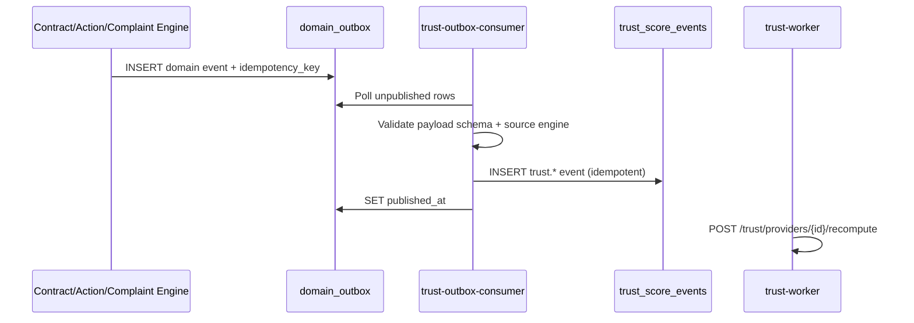

# APP13 API Architecture v1.1

**Version:** 1.1  
**Status:** Draft — Pre-implementation  
**Last updated:** June 20, 2026  
**Supersedes:** [API Architecture v1](./APP13-API-Architecture-v1.md) for all P0 items below  
**Applies review:** [API Review v1](./APP13-API-Review-v1.md)  
**Depends on:** [Core Principles v1](../APP13-Core-Principles-v1.md) · [MVP Scope v1](../APP13-MVP-Scope-v1.md) · [State Machine v1](../APP13-State-Machine-v1.md) · [PostgreSQL Schema v1.1 Review](./APP13-PostgreSQL-v1.1-Review.md) · [Permissions Matrix v1](./04-permissions-matrix.md) · [Contract Engine v1](../APP13-Contract-Engine-v1.md) · [Trust Engine v1.1](../APP13-Trust-Engine-v1.1.md) · [Complaint Lifecycle v1](./06-complaint-lifecycle.md) · ADR-001/002/003

---

## Document purpose

This document defines the **MVP API architecture** for APP13 — REST-first HTTP surfaces, authentication, hardened authorization, engine-owned resource boundaries, and OpenAPI 3.1 conventions.

**Audience:** Engineering, API consumers, QA, security review.  
**Scope:** MVP v1.1 — P0 fixes from API Review v1 only. P1/P2 deferred.

**Constitutional chain preserved:**

```
Action → Contract → Execution (Milestone + Evidence + Attestation) → Trust → Complaint
```

---

## Change summary (v1 → v1.1)

All changes apply **P0 fixes only** from [API Review v1](./APP13-API-Review-v1.md).

| ID | Category | v1.1 resolution |
|----|----------|-----------------|
| **P0-S1** | Security | Mandatory DB revalidation of tier/roles/status on gated mutations |
| **P0-S2** | Security | Trust ingest restricted to Outbox Consumer service |
| **P0-S3** | Security | Signed `X-Actor-Context-Token` for internal impersonation |
| **P0-S4** | Security | Upload-intent tenancy binding + confirm hash verification |
| **P0-S5** | Security | `Idempotency-Key` **required** on all POST create/transition |
| **P0-E1** | Endpoints | Full Identity verification API (T1/T2, credentials, KYC webhook) |
| **P0-E2** | Endpoints | `/me`, customer/provider profile routes |
| **P0-E3** | Endpoints | Internal contract completion orchestration |
| **P0-E4** | Endpoints | `POST /auth/token/refresh` with rotation policy |
| **P0-A1** | Authorization | Dimension-scoped TEKRR routes + RBAC |
| **P0-A2** | Authorization | Adjudicator assignment-scoped complaint access |
| **P0-A3** | Authorization | CA-2 executable states aligned with PostgreSQL v1.1 |
| **P0-CE1** | Contract Engine | Documented generate preconditions + 422 codes |
| **P0-CE2** | Contract Engine | Cross-engine issue-path contract transition contract |
| **P0-CE3** | Contract Engine | CA-8 corrected — per-party accept in `proposed`; activation when all accept |
| **P0-T1** | Trust Engine | Trust event DTO field allowlist (no customer PII) |
| **P0-T2** | Trust Engine | Trust events via outbox consumer only (CA-5 / ADR-003) |
| **P0-CM1** | Complaint | Adjudication admin-only; parties GET-only |
| **P0-CM2** | Complaint | EL-2 mapped to State Machine v1 contract statuses |

**Endpoint count (approx.):** Public ~105 · Admin ~21 · Internal ~18

---

## Executive summary

| Surface | Base path | Consumers | Auth |
|---------|-----------|-----------|------|
| **Public API** | `/v1` | Web client (MVP) | Session cookie or Bearer JWT |
| **Internal API** | `/internal/v1` | Workers, outbox consumer | Service JWT + mTLS; signed actor context |

| Principle | v1.1 rule |
|-----------|-----------|
| **State via transitions** | Clients never PATCH lifecycle status |
| **Server-side auth truth** | JWT claims are hints; DB is authority on gated mutations |
| **Trust from domain events** | No arbitrary trust event POST (ADR-003 / CA-5) |
| **Idempotency required** | All mutating POSTs require `Idempotency-Key` |
| **Neutrality** | No marketplace/discovery routes (ADR-001) |

---

## 1. Public API

### 1.1 Design principles

Unchanged from v1 except:

| Principle | v1.1 addition |
|-----------|---------------|
| **Server-side gate truth** | Tier, roles, account status loaded from DB on every gated mutation (P0-S1) |
| **Mandatory idempotency** | `Idempotency-Key` header required on POST create/transition (P0-S5) |
| **Upload tenancy** | Presigned URLs bound to party + contract + milestone (P0-S4) |

### 1.2 Base URL and versioning

```
Production:  https://api.app13.example/v1
Internal:    https://api.app13.internal/internal/v1   (private network only)
```

OpenAPI: `openapi: 3.1.0` · Public spec version `1.1.0`

### 1.3 Public resource catalog (MVP)

| Resource | Path prefix | Engine | v1.1 notes |
|----------|-------------|--------|------------|
| Auth | `/auth/*` | Identity | + token refresh |
| Current user | `/me` | Identity | **P0-E2** — defined |
| Customers / Providers | `/customers`, `/providers` | Identity | **P0-E2** |
| Verifications | `/verifications/*` | Identity | **P0-E1** — T1/T2 |
| Credentials | `/credentials` | Identity | **P0-E1** — T2 docs |
| Actions / TEKRR | `/actions` | Action | Dimension-scoped TEKRR |
| Contracts | `/contracts` | Contract | Generate gates documented |
| Execution | `/contracts/{id}/milestones`, `/attestations` | Action | CA-2 states |
| Evidence | `/contracts/{id}/evidence` | Action | Tenancy-bound upload |
| Trust | `/trust/providers/{id}` | Identity | Event DTO allowlist |
| Cases / Issues | `/cases`, `/issues` | Complaint / Contract | Cross-engine transitions |
| Complaints | `/complaints` | Complaint | EL-2 mapping; no public adjudicate |
| Operations | `/operations/{id}` | Platform | Async poll |
| Notifications | `/notifications` | Platform | Catalog only (P1) |

**Forbidden (constitutional):** `/services`, `/listings`, `/gigs`, `/marketplace/*`, `PUT/PATCH /trust/.../score`, `/payments/*`

### 1.4 Request conventions

#### Required headers (mutating requests)

| Header | Required | Purpose |
|--------|:--------:|---------|
| `Authorization` | Yes* | Bearer JWT or session cookie |
| `Content-Type` | Yes | `application/json` |
| **`Idempotency-Key`** | **Yes** | UUID v4; dedup within 24h (**P0-S5**) |
| `X-Request-Id` | Optional | Client trace |

\* Except unauthenticated auth routes (register, login, reset, KYC webhook with signature).

**Idempotency behavior:**

| Case | Response |
|------|----------|
| Same key + same body | Replay cached success response |
| Same key + different body | `409` `IDEMPOTENCY_KEY_REUSE` |
| Missing key on POST create/transition | `400` `IDEMPOTENCY_KEY_REQUIRED` |

#### Pagination, errors

Unchanged from v1 — RFC 7807 Problem Details; cursor pagination; `409` for invalid transitions; `422` for eligibility failures.

---

## 2. Internal API

### 2.1 Purpose and boundary protection

Internal routes are **never internet-routable**. All callers authenticate with service JWT (`service_id` claim) and mTLS client certificate.

| Control | Rule |
|---------|------|
| Network | Private VPC / service mesh only |
| Authentication | mTLS **and** `Authorization: Bearer {service_jwt}` |
| Service allowlist | Each route restricted to named `service_id` values |
| Actor impersonation | **P0-S3** — see §2.2 |
| Audit | Every mutation logs `service_id`, `original_request_id`, optional `actor_user_id` |

### 2.2 Signed actor context (P0-S3)

Raw `X-Actor-Context: {uuid}` is **forbidden**.

When an internal call continues a user-initiated chain:

```
X-Actor-Context-Token: {signed_jwt}
```

| Claim | Purpose |
|-------|---------|
| `sub` | Original user UUID |
| `request_id` | Public API `X-Request-Id` |
| `issued_by` | Gateway service_id |
| `exp` | ≤ 5 minutes |

Gateway issues token when enqueueing async work. Internal handlers verify signature + expiry. Audit row includes all three identifiers.

### 2.3 Internal route catalog (v1.1)

| Method | Path | Allowed `service_id` | Description |
|--------|------|----------------------|-------------|
| `POST` | `/contracts/{id}/materialize` | `contract-worker` | Milestones + attestation shells |
| `POST` | `/contracts/{id}/activate` | `contract-engine` | `accepted` → `active` after all parties accept |
| **`POST`** | **`/contracts/{id}/complete`** | **`contract-engine`** | **`active` → `completed` when milestones + attestations satisfied (P0-E3)** |
| `POST` | `/contracts/{id}/transitions/issue-path` | `contract-engine` | Cross-engine issue-path transitions (P0-CE2) |
| `POST` | `/complaints/{id}/validate` | `complaint-worker` | EL-1–EL-8 triage |
| `POST` | `/complaints/{id}/apply-outcome` | `complaint-engine` | Post-adjudication apply |
| `POST` | `/trust/providers/{id}/recompute` | `trust-worker` | Projection recompute |
| **`POST`** | **`/trust/ingest-from-outbox`** | **`trust-outbox-consumer`** | **Consume domain_outbox → append trust_score_events (P0-T2)** |
| `POST` | `/outbox/publish-batch` | `outbox-publisher` | Mark published |
| `POST` | `/audit/events` | `*` (allowlisted engines) | Append audit |
| `GET` | `/health/engines` | `ops-probe` | Readiness |

**Removed from v1:** `POST /trust/events` open to any engine — replaced by outbox consumer (P0-S2, P0-T2).

### 2.4 Trust ingest path (P0-T2 / CA-5 / ADR-003)



No engine may append `trust_score_events` except `trust-outbox-consumer` after validating a source outbox row.

---

## 3. Authentication

### 3.1 Auth endpoints (public)

| Method | Path | Auth | Description |
|--------|------|------|-------------|
| `POST` | `/auth/register/customer` | None | Create customer account |
| `POST` | `/auth/register/provider` | None | Create provider account |
| `POST` | `/auth/login` | None | Email + password → session + JWT |
| **`POST`** | **`/auth/token/refresh`** | **Refresh cookie / refresh JWT** | **New access token (P0-E4)** |
| `POST` | `/auth/logout` | Session | Invalidate session + refresh |
| `POST` | `/auth/password-reset/request` | None | Send reset email |
| `POST` | `/auth/password-reset/confirm` | None | Set new password |
| `POST` | `/auth/verify-email/request` | Session | Resend verification |
| `POST` | `/auth/verify-email/confirm` | None | Confirm with token |
| `POST` | `/auth/verify-phone/request` | Session | Send SMS OTP |
| `POST` | `/auth/verify-phone/confirm` | Session | Confirm OTP |
| `GET` | `/auth/session` | Session | Current session metadata |

### 3.2 Token refresh policy (P0-E4)

| Token | TTL | Storage |
|-------|-----|---------|
| Access JWT | 15 minutes | Memory / Authorization header |
| Refresh token | 7 days | HttpOnly Secure SameSite=Strict cookie (web) or refresh JWT (API clients) |

`POST /auth/token/refresh` rotates refresh token on each use. Reuse of revoked refresh token invalidates all sessions for user (detect theft).

### 3.3 JWT structure (informational only)

JWT carries `sub`, `actor`, `roles`, `tier`, `session_id` for client UX. **P0-S1:** gated mutations **must not** trust JWT alone — see §4.6.

---

## 4. Authorization

### 4.1 Model (RBAC + resource-scoped ABAC)

1. Authenticate session/JWT  
2. **Load authoritative identity from DB** (P0-S1)  
3. Identify resource + engine  
4. Role matrix check  
5. Resource scope (party / initiator / **assignment**)  
6. Engine gates (tier, contract status, filing window)  
7. Allow or audited admin override  

### 4.2 Executable contract states (P0-A3 / CA-2)

Aligned with PostgreSQL v1.1 `is_contract_execution_allowed`:

| Status | Evidence / attestation / milestone progress |
|--------|:---------------------------------------------:|
| `active` | ✅ Full execution |
| `issue_raised` | ✅ Limited (non-frozen dimensions/milestones) |
| `disputed` | ✅ Frozen dimensions only; read + complaint evidence |
| `resolved` | ✅ Outcome apply path only |
| `completed` | ✅ Post-completion attestation/eval only |
| `closed` | ✅ Read + complaint window artifacts |
| `draft`, `proposed`, `accepted`, `void`, `cancelled` | ❌ Blocked |

**Bypass:** Internal `apply-outcome` sets `app13.complaint_outcome_apply=on` for attestation writes during complaint resolution.

### 4.3 TEKRR dimension authorization (P0-A1)

**Removed:** monolithic `PATCH /actions/{id}/tekrr`

**Added:** dimension-scoped routes:

| Method | Path | Actor | Permission |
|--------|------|-------|------------|
| `PATCH` | `/actions/{id}/tekrr/dimensions/T` | Customer | `tekrr.t.write` |
| `PATCH` | `/actions/{id}/tekrr/dimensions/E` | Customer, Provider | `tekrr.e.write` |
| `PATCH` | `/actions/{id}/tekrr/dimensions/K` | Provider | `tekrr.k.write` |
| `PATCH` | `/actions/{id}/tekrr/dimensions/R` | Customer, Provider | `tekrr.r.write` |
| `PATCH` | `/actions/{id}/tekrr/dimensions/S` | Customer, Provider | `tekrr.s.write` |
| `GET` | `/actions/{id}/tekrr/dimensions/{dim}` | Party | `tekrr.*.read` |
| `POST` | `/actions/{id}/tekrr/dimensions/T/proposals` | Provider | Provider propose on T (read + propose) |

Handler rejects cross-dimension writes with `403` `TEKRR_DIMENSION_FORBIDDEN`.

### 4.4 Adjudicator assignment scope (P0-A2)

Complaint reads and admin mutations require **one of**:

| Condition | Access |
|-----------|--------|
| Contract party | Own complaints on party contracts |
| `complaints.assigned_admin_user_id = current_user` | Assigned adjudicator |
| `platform_admin` / `super_admin` | Full queue (audited) |

Non-assigned `complaint_adjudicator` receives **404** on unassigned complaint UUIDs (IDOR-safe).

Admin queue endpoints (`/admin/complaints/*`) list unassigned + own assignments; adjudicators self-assign via `POST /admin/complaints/{id}/assign`.

### 4.5 Resource scope rules (IDOR)

| Resource | Access rule |
|----------|-------------|
| `action` | Initiator customer OR linked provider OR admin |
| `contract` | Party OR **assigned** adjudicator OR admin |
| `complaint`, `case`, `issue` | Party OR **assigned** adjudicator OR admin |
| `verification` | Subject OR verification_analyst OR admin |
| `trust_profile.full` | Subject provider OR trust_ops OR admin |
| `trust_profile.public` | Any authenticated user |

### 4.6 Server-side identity revalidation (P0-S1)

On **every gated mutation** (contract accept, evidence upload, complaint file, milestone transition, etc.):

```sql
-- conceptual check
SELECT status, verification_tier, roles FROM identity resolution WHERE user_id = :sub
```

| Check | Fail code |
|-------|-----------|
| `users.status != 'active'` | `403 ACCOUNT_SUSPENDED` |
| JWT `tier` ≠ DB tier | `403 TIER_STALE` — client must refresh token |
| JWT `roles` ⊄ DB roles | `403 ROLES_STALE` |
| Tier gate (T1 accept, T2 high-risk) | `422 TIER_INSUFFICIENT` |

JWT claims remain valid for **read-only** endpoints until expiry.

### 4.7 Engine gates summary

| Gate | Endpoints |
|------|-----------|
| Customer ≥ T1 | Contract accept (customer) |
| Provider ≥ action `min_provider_tier` | Contract accept (provider) |
| Provider ≥ T2 if TEKRR risk ≥ 4 | Contract accept (provider) |
| Action `ready_for_contract` + TEKRR 100% | Contract generate |
| Executable contract status (§4.2) | Milestones, evidence, attestations |
| EL-1–EL-8 + EL-2 status map (§7.6) | Complaint file |
| EL-6 | Complaint dimensions |

---

## 5. Identity & profile APIs (P0-E1, P0-E2)

### 5.1 Profile endpoints (P0-E2)

| Method | Path | Actor | Description |
|--------|------|-------|-------------|
| `GET` | `/me` | Self | User + profile IDs + tier + roles |
| `PATCH` | `/me` | Self | Display preferences (non-verified fields) |
| `GET` | `/customers/{id}` | Self / party / admin | Customer profile |
| `PATCH` | `/customers/{id}` | Self | Update display_name, avatar (non-verified) |
| `GET` | `/providers/{id}` | Any auth | **Public** provider profile + trust summary link |
| `PATCH` | `/providers/{id}` | Self | Update bio, business_name, primary_trade |
| `GET` | `/providers/{id}/trust-summary` | Any auth | Alias to public trust GET |

### 5.2 Verification endpoints (P0-E1)

Supports **UF-02** (customer T1) and **UF-03** (provider T1 → T2).

| Method | Path | Actor | Description |
|--------|------|-------|-------------|
| `GET` | `/verifications/me` | Self | Current verification status |
| `POST` | `/verifications/t1/start` | Self | Initiate T1 KYC session |
| `POST` | `/verifications/t1/complete` | Self | Client callback after KYC UI |
| `POST` | `/verifications/t1/webhook` | KYC provider | Server-to-server result (signed) |
| `POST` | `/credentials` | Provider | Submit T2 credential metadata |
| `POST` | `/credentials/{id}/documents/upload-intent` | Provider | Presigned doc upload |
| `POST` | `/credentials/{id}/documents` | Provider | Confirm document upload |
| `GET` | `/credentials/me` | Provider | List own credentials |

**T1 flow:** `start` → external KYC → `webhook` validates signature → tier updated → `verification.approved` outbox event.

**Gates:** Action create requires email verified (T0). Contract accept requires T1 (customer) and action-min tier (provider).

---

## 6. Contract APIs

**Owner:** Contract Engine · **State authority:** State Machine v1 §2

### 6.1 Contract states and party acceptance (P0-CE3)

| State | Meaning | Client transitions |
|-------|---------|-------------------|
| `draft` | Record created | — |
| `proposed` | Document published to parties | Per-party `accept` / `decline` |
| `accepted` | **All required parties have accepted** | — (system activates next) |
| `active` | Activated; milestones materialized | — |
| `completed` | All blocking work done | — (system via §6.5) |
| Issue path | `issue_raised` → `disputed` → `resolved` → `closed` | Via Issue/Complaint engines (§6.6) |
| Terminal | `void`, `cancelled` | `decline`, `cancel` |

**CA-8 (corrected):** While status is `proposed`, each party may call `accept` independently. Status becomes `accepted` only when **all** required parties have recorded acceptance. Activation (`accepted` → `active`) is **system-only** after snapshots + materialization.

### 6.2 Contract generate preconditions (P0-CE1)

`POST /actions/{actionId}/contract/generate`

| Precondition | Fail |
|--------------|------|
| Action status = `ready_for_contract` | `409 NOT_READY_FOR_CONTRACT` |
| `tekrr_completeness = 100` | `422 TEKRR_INCOMPLETE` |
| Customer ≥ T1, provider linked | `422 TIER_INSUFFICIENT` |
| Provider ≥ action `min_provider_tier` | `422 PROVIDER_TIER_INSUFFICIENT` |
| No existing contract for action (CA-1) | `200` return existing |

Success: `201` contract in `draft`; async PDF render → `proposed` via internal pipeline or `POST …/transitions` `propose`.

### 6.3 Contract endpoints

| Method | Path | Actor | Description |
|--------|------|-------|-------------|
| `POST` | `/actions/{actionId}/contract/generate` | Customer / Provider | Generate (gates §6.2) |
| `GET` | `/contracts` | Party / admin | List |
| `GET` | `/contracts/{id}` | Party / assigned adj. / admin | Detail incl. `document_hash` |
| `GET` | `/contracts/{id}/document` | Party | Presigned PDF URL |
| `GET` | `/contracts/{id}/parties` | Party | Per-party acceptance timestamps |
| `PATCH` | `/contracts/{id}/commercial-terms` | Customer | Pre-`active` only |
| `POST` | `/contracts/{id}/transitions` | Party / admin | `propose`, `accept`, `decline`, `cancel` |
| `GET` | `/contracts/{id}/status-history` | Party | Append-only |
| `GET` | `/contracts/{id}/milestones` | Party | Materialized milestones |
| `GET` | `/contracts/{id}/attestations` | Party | Dimension attestations |
| `GET` | `/contracts/{id}/evaluation` | Party | Customer eval if present |
| `POST` | `/contracts/{id}/evaluation` | Customer | Post-completion eval |

### 6.4 Transition schema

```json
{
  "transition": "accept",
  "party_role": "customer",
  "document_hash_ack": "sha256:…",
  "idempotency_key": "uuid"
}
```

`document_hash_ack` required on `accept` — client confirms hash from GET contract (CL-5).

### 6.5 Contract completion orchestration (P0-E3)

**Trigger:** When all blocking milestones are `accepted`/`waived` and required attestations resolved, and no blocking complaints:

1. Action/Contract engine evaluates completion preconditions  
2. **`POST /internal/v1/contracts/{id}/complete`** (`contract-engine`)  
3. Transition `active` → `completed` (or `resolved` → `completed` on issue path)  
4. Emit `contract.completed` → outbox → trust ingest  
5. Set `complaint_window_ends_at`  
6. Return `202` + `operation_id` to initiating public chain if applicable  

Public clients poll `GET /operations/{operationId}`.

### 6.6 Cross-engine issue-path transitions (P0-CE2)

| Trigger API | Contract transition | Actor |
|-------------|---------------------|-------|
| `POST /issues` (contract `active`) | → `issue_raised` | Contract engine (internal) |
| `POST /internal/v1/complaints/{id}/validate` pass | → `disputed` | Complaint worker |
| `POST /internal/v1/complaints/{id}/apply-outcome` | → `resolved` | Complaint engine |
| Outcome applied + engine updates done | → `closed` or `completed` | Contract engine |
| Issue withdrawn / informal resolve | → `active` | Contract engine |

Documented in OpenAPI as **webhook-less orchestration** — public API returns updated contract status on subsequent GET.

### 6.7 Contract Engine rule mapping

| Rule | API enforcement |
|------|-----------------|
| CA-1 | One contract per action |
| CA-2 | §4.2 executable states on execution routes |
| CA-5 | Domain events to outbox only |
| CA-7 | Immutable `template_id` post-generate |
| CA-8 | §6.1 per-party accept in `proposed` |

---

## 7. Trust APIs

**Owner:** Identity (Trust service) · **ADR-003:** no direct score writes

### 7.1 Public trust endpoints

| Method | Path | Actor | Notes |
|--------|------|-------|-------|
| `GET` | `/trust/providers/{providerId}` | Any auth | Public summary |
| `GET` | `/trust/providers/{providerId}/full` | Self / trust_ops / admin | Full breakdown |
| `GET` | `/trust/providers/{providerId}/events` | Self / trust_ops / admin | **Field allowlist (P0-T1)** |
| `GET` | `/trust/providers/{providerId}/snapshots` | Self / trust_ops / admin | Historical |
| `POST` | `/trust/providers/{providerId}/appeals` | Provider | Correction request |
| `GET` | `/trust/providers/{providerId}/appeals` | Provider / trust_ops | Status |

### 7.2 Trust event response DTO (P0-T1)

Provider self-view **excludes** customer-identifying fields per Permissions Matrix §9.1:

| Field | Provider self | trust_ops / admin |
|-------|:-------------:|:-----------------:|
| `event_type`, `occurred_at`, `score_version` | ✅ | ✅ |
| `contract_id` (UUID only) | ✅ | ✅ |
| `source_entity_type`, `source_entity_id` | ✅ | ✅ |
| `payload` (sanitized) | ✅ | ✅ |
| `customer_id`, party email, legal names | ❌ | ✅ |
| `contributing_customer_ids[]` | ❌ | ✅ |

### 7.3 Forbidden operations

| Operation | Status |
|-----------|--------|
| `PUT/PATCH /trust/providers/{id}/score` | Route does not exist |
| Public trust event POST | Route does not exist |
| Direct internal `POST /trust/events` | **Removed** — outbox consumer only |

---

## 8. Complaint APIs

**Owner:** Complaint Engine · **ADR-002:** every complaint requires `contract_id`

### 8.1 Complaint endpoints (P0-CM1)

| Method | Path | Actor | Description |
|--------|------|-------|-------------|
| `POST` | `/complaints` | Contract party | File complaint |
| `GET` | `/complaints` | Party / assigned adj. / admin | Scoped list |
| `GET` | `/complaints/{id}` | Party / assigned adj. / admin | Detail + dimensions |
| `GET` | `/complaints/{id}/status-history` | Party / assigned adj. | Transitions |
| `POST` | `/complaints/{id}/transitions` | Party | `withdraw`, `accept_mediation` only |
| `GET` | `/complaints/{id}/evidence` | Party / assigned adj. | Package |
| `POST` | `/complaints/{id}/evidence` | Party | Upload party evidence |
| `GET` | `/complaints/{id}/evidence/auto-attached` | Party / assigned adj. | Auto-assembled |
| `POST` | `/complaints/{id}/mediation/proposals` | Party / assigned adj. | Submit proposal |
| `POST` | `/complaints/{id}/mediation/proposals/{pid}/accept` | Party | Accept mediation |
| **`GET`** | **`/complaints/{id}/adjudication`** | **Party / assigned adj.** | **Read-only adjudication record** |

**Removed from v1:** `POST /complaints/{id}/adjudication` — adjudication is **admin-only** via `POST /admin/complaints/{id}/adjudicate`.

### 8.2 File complaint body

```json
{
  "contract_id": "uuid",
  "case_id": "uuid",
  "issue_id": "uuid | null",
  "complaint_types": ["TIME_BREACH"],
  "dimensions": [
    { "tekrr_dimension": "T", "description": "…" }
  ],
  "description": "≥ 50 characters…",
  "idempotency_key": "uuid"
}
```

Server creates `complaint_dimensions` (CK-7). Validates EL-1–EL-8 atomically with advisory lock (EL-6).

### 8.3 EL-2 contract status mapping (P0-CM2)

Complaint Lifecycle EL-2 **deprecated terms** mapped to State Machine v1:

| EL-2 (legacy doc term) | Authoritative status (EL-2 check) |
|------------------------|-----------------------------------|
| `in_execution` | `active`, `issue_raised` |
| `pending_completion` | `active`, `disputed`, `resolved` |
| `completed` | `completed` (+ `complaint_window_ends_at` for EL-3) |
| Never activated | `void`, `cancelled`, `draft`, `proposed`, `accepted` → EL `CONTRACT_NOT_ACTIVE` |

**EL-2 pass:** contract status ∈ `{ active, issue_raised, disputed, resolved, completed }` with EL-3 window check when `completed`.

---

## 9. Evidence APIs

### 9.1 Upload tenancy binding (P0-S4)

**Step 1 — upload-intent**

`POST /contracts/{contractId}/milestones/{milestoneId}/evidence/upload-intent`

| Server validation | Fail |
|-------------------|------|
| Actor is contract party | `404` |
| Actor authorized for milestone `responsible_party` | `403` |
| Contract in executable state (§4.2) | `409` |
| `content_hash` + `evidence_type` present | `400` |

Response binds:

```json
{
  "upload_url": "https://…",
  "storage_key": "contracts/{contractId}/milestones/{milestoneId}/{uuid}",
  "intent_id": "uuid",
  "expires_at": "…",
  "required_hash": "sha256:…"
}
```

`storage_key` is **server-generated** — client cannot specify path.

**Step 2 — confirm**

`POST …/evidence` must include `intent_id`, matching `storage_key`, and `content_hash`. Server verifies object exists and hash matches before INSERT.

---

## 10. Case & issue APIs

Unchanged structure from v1 with P0-CE2 side effects documented:

| Method | Path | Side effect |
|--------|------|-------------|
| `POST` | `/issues` | Contract → `issue_raised` when contract `active` |
| `POST` | `/cases` | Opens dispute file on `contract_id` |
| `POST` | `/complaints` | Links case; may escalate to `disputed` after triage |

Issue create requires ≥1 dimension or milestone in same transaction (CK-13).

---

## 11. Execution APIs (milestones & attestations)

Milestone/attestation routes use **§4.2 executable states** (not `active` only).

Attestation evidence/milestone link endpoints unchanged; Law 13 enforced at DB (CK-3).

---

## 12. Admin APIs

Adjudication consolidated under admin prefix (P0-CM1):

| Method | Path | Role |
|--------|------|------|
| `POST` | `/admin/complaints/{id}/adjudicate` | complaint_adjudicator (assigned or admin) |

All other admin routes unchanged from v1 §10. Admin adjudication triggers `POST /internal/v1/complaints/{id}/apply-outcome`.

---

## 13. Actions API (summary)

| Method | Path | Actor |
|--------|------|-------|
| `GET` | `/action-types`, `/action-types/{code}` | Any auth |
| `POST` | `/actions` | Customer (email verified) |
| `GET/PATCH` | `/actions/{id}` | Initiator / party |
| `PATCH` | `/actions/{id}/tekrr/dimensions/{T\|E\|K\|R\|S}` | Per §4.3 |
| `POST` | `/actions/{id}/transitions` | Customer / provider |
| `POST` | `/actions/{id}/provider-invite` | Customer |

---

## 14. Cross-engine orchestration

### 14.1 Async operations

`GET /v1/operations/{operationId}` — poll activation, completion, outcome apply.

### 14.2 MVP flow coverage (post-P0)

| Flow | Status |
|------|--------|
| UF-01 Registration | ✅ |
| UF-02/03 Verification | ✅ §5.2 |
| UF-04–07 Action → Contract | ✅ §6.2 gates |
| UF-08 Execution | ✅ §4.2 |
| UF-09 Completion | ✅ §6.5 |
| UF-10/11 Complaint | ✅ §8, EL-2 map |
| UF-12 Trust profile | ✅ §5.1, §7 |

---

## 15. Security and compliance (v1.1 additions)

| Control | Rule |
|---------|------|
| **P0-S1** | DB authority on gated mutations |
| **P0-S5** | Required idempotency keys |
| **P0-S4** | Upload intent tenancy |
| **P0-S3** | Signed actor context tokens |
| **P0-S2/T2** | Trust ingest service allowlist |
| TLS 1.2+, HSTS, CORS, CSRF | Unchanged from v1 |
| Rate limiting | 100/min auth'd; 20/min auth routes |

---

## 16. OpenAPI 3.1

| File | Version |
|------|---------|
| `openapi/public-v1.yaml` | `1.1.0` |
| `openapi/internal-v1.yaml` | `1.1.0` |

New component schemas: `VerificationT1`, `CredentialDocument`, `TrustEventPublic`, `UploadIntent`, `ActorContextToken`, `EligibilityError`.

`TransitionRequest` requires `idempotency_key` at OpenAPI level for all POST transitions.

---

## 17. Explicit exclusions (unchanged)

Marketplace, payments, amendments, third-party trust API, GraphQL, institutional org APIs — per v1 §16 and ADR-001.

---

## 18. P0 closure matrix

| ID | Closed | Section |
|----|:------:|---------|
| P0-S1 | ✅ | §4.6 |
| P0-S2 | ✅ | §2.3, §2.4 |
| P0-S3 | ✅ | §2.2 |
| P0-S4 | ✅ | §9.1 |
| P0-S5 | ✅ | §1.4 |
| P0-E1 | ✅ | §5.2 |
| P0-E2 | ✅ | §5.1 |
| P0-E3 | ✅ | §6.5 |
| P0-E4 | ✅ | §3.2 |
| P0-A1 | ✅ | §4.3 |
| P0-A2 | ✅ | §4.4 |
| P0-A3 | ✅ | §4.2 |
| P0-CE1 | ✅ | §6.2 |
| P0-CE2 | ✅ | §6.6 |
| P0-CE3 | ✅ | §6.1 |
| P0-T1 | ✅ | §7.2 |
| P0-T2 | ✅ | §2.4 |
| P0-CM1 | ✅ | §8.1, §12 |
| P0-CM2 | ✅ | §8.3 |

**19/19 P0 review IDs addressed.**

---

## 19. Related documents

| Document | Relationship |
|----------|--------------|
| [API Architecture v1](./APP13-API-Architecture-v1.md) | Superseded baseline |
| [API Review v1](./APP13-API-Review-v1.md) | Source P0 findings |
| [PostgreSQL Schema v1.1 Review](./APP13-PostgreSQL-v1.1-Review.md) | CA-2 gate alignment |
| [Permissions Matrix v1](./04-permissions-matrix.md) | Authorization source |
| [Contract Engine v1](../APP13-Contract-Engine-v1.md) | CA-1–CA-8 |
| [Trust Engine v1.1](../APP13-Trust-Engine-v1.1.md) | Trust surfaces + CA-5 |
| ADR-001/002/003 | Constitutional constraints |

---

## 20. Deferred (P1/P2 — not in v1.1)

See [API Review v1](./APP13-API-Review-v1.md) §P1/P2: notifications API, session revocation on suspend, TEKRR proposals CRUD, collusion_review_flag in public schema, composite complaint filing, admin attestation override, webhooks, amendments.

---

*v1.1 applies P0 fixes only. Ready for OpenAPI 1.1 authoring.*
