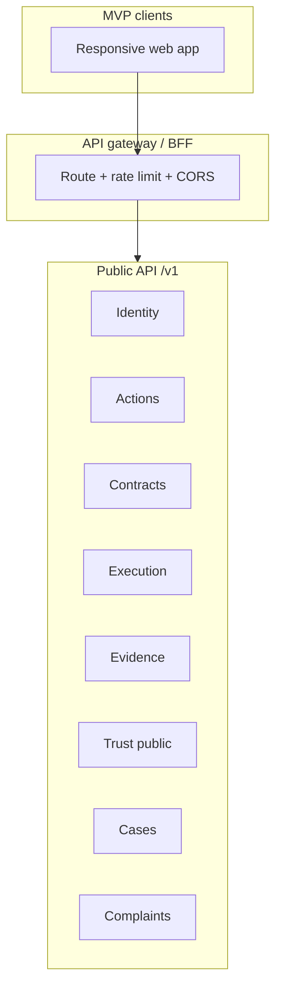
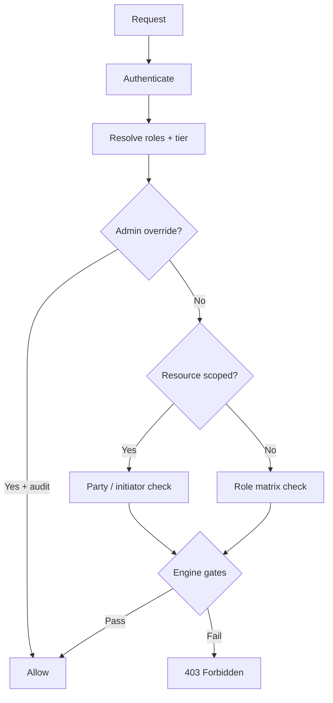
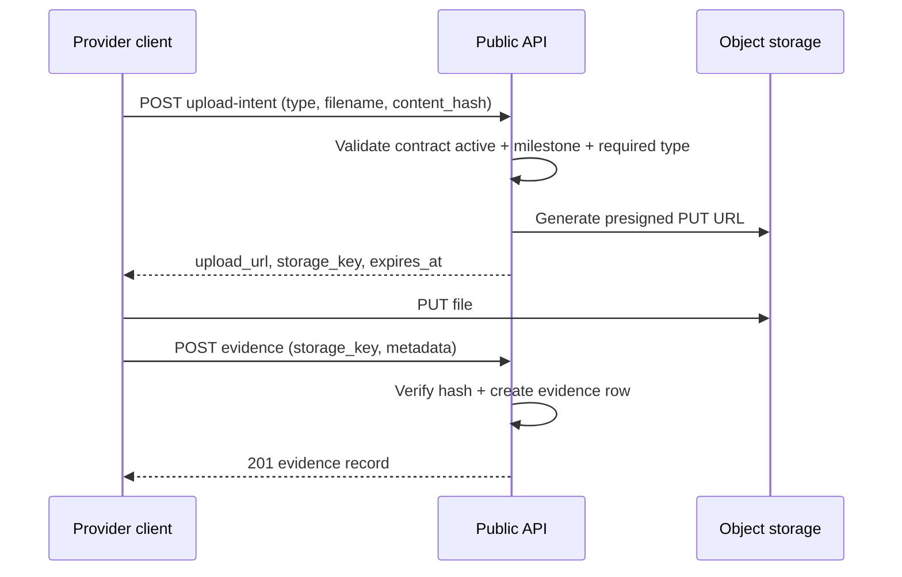

# APP13 API Architecture v1

**Version:** 1.0  
**Status:** Draft — Pre-implementation  
**Last updated:** June 20, 2026  
**Depends on:** [Core Principles v1](../APP13-Core-Principles-v1.md) · [MVP Scope v1](../APP13-MVP-Scope-v1.md) · [Entity Model v1](../APP13-Entity-Model-v1.md) · [State Machine v1](../APP13-State-Machine-v1.md) · [Database Architecture v1.1](./APP13-Database-Architecture-v1.1.md) · [PostgreSQL Schema v1.1 Review](./APP13-PostgreSQL-v1.1-Review.md) · [Permissions Matrix v1](./04-permissions-matrix.md) · [Contract Engine v1](../APP13-Contract-Engine-v1.md) · [Trust Engine v1.1](../APP13-Trust-Engine-v1.1.md) · [Complaint Lifecycle v1](./06-complaint-lifecycle.md) · [ADR-001](./adr/ADR-001-Action-Only.md) · [ADR-002](./adr/ADR-002-Complaint-Origin.md) · [ADR-003](./adr/ADR-003-Trust-Authority.md)

---

## Document purpose

This document defines the **MVP API architecture** for APP13 — REST-first HTTP surfaces, authentication and authorization models, engine-owned resource boundaries, and OpenAPI 3.1 conventions.

**Audience:** Engineering, API consumers, QA, security review.  
**Scope:** MVP v1 only. Phase 2 institutional, payment, and marketplace-adjacent capabilities are explicitly excluded.

**Constitutional chain preserved in API design:**

```
Action → Contract → Execution (Milestone + Evidence + Attestation) → Trust → Complaint
```

**Deliverables downstream of this document (not included here):**
- OpenAPI 3.1 YAML files per surface (`openapi/public-v1.yaml`, `openapi/internal-v1.yaml`)
- JSON Schema components for request/response bodies
- SDK generation (Phase 2)

---

## Executive summary

| Surface | Base path | Consumers | Auth |
|---------|-----------|-----------|------|
| **Public API** | `/v1` | Web client (MVP) | Session cookie or Bearer JWT |
| **Internal API** | `/internal/v1` | Engines, workers, admin backend | Service token + actor context |

APP13 exposes **resource-oriented REST** APIs grouped by engine ownership. Mutations are **state-machine driven** — clients request transitions; engines validate gates and emit domain events. No endpoint permits direct trust score writes (ADR-003).

| Area | MVP endpoints (approx.) | Owner engine |
|------|-------------------------|--------------|
| Identity / Auth | 12 | Identity |
| Actions / TEKRR | 14 | Action |
| Contracts | 16 | Contract |
| Execution (milestones, attestations) | 18 | Action + Contract gates |
| Evidence | 8 | Action |
| Trust | 9 | Identity (Trust service) |
| Cases / Issues | 10 | Complaint + Contract |
| Complaints | 14 | Complaint |
| Admin | 20 | Platform |
| Internal / system | 12 | Cross-engine |

---

## 1. Public API

### 1.1 Design principles

| Principle | Rule |
|-----------|------|
| **REST first** | HTTP verbs map to safe reads (`GET`, `HEAD`) and intent-based writes (`POST` for create/transition, `PATCH` for partial update of non-state fields) |
| **Resource-oriented** | URLs name nouns (`/contracts/{id}`), not verbs (`/activateContract`) |
| **State via transitions** | Lifecycle changes use `POST …/transitions` sub-resources with explicit `transition` body — never raw status PATCH from clients |
| **UUID identifiers** | All public IDs are UUID v4; no sequential IDs exposed |
| **Engine truth** | Response shapes reflect authoritative engine projections; no client-computed trust or contract hash |
| **Neutrality (Law 4)** | No pricing APIs, no provider ranking, no browse/discovery (ADR-001) |
| **MVP web-only** | Public API optimized for responsive web; CORS enabled for app origin |

### 1.2 Base URL and versioning

```
Production:  https://api.app13.example/v1
Staging:     https://api.staging.app13.example/v1
```

| Rule | Detail |
|------|--------|
| Version prefix | `/v1` on all public routes |
| Breaking changes | New major prefix (`/v2`); v1 supported ≥ 12 months post-v2 |
| Deprecation | `Sunset` + `Deprecation` response headers per RFC 8594 |
| Content type | `application/json; charset=utf-8` |
| OpenAPI version | `openapi: 3.1.0` |

### 1.3 Public API topology



### 1.4 Public resource catalog (MVP)

| Resource | Path prefix | Primary engine | Notes |
|----------|-------------|----------------|-------|
| Session / Auth | `/auth/*` | Identity | Registration, login, verification |
| Current user | `/me` | Identity | Profile, roles, tier |
| Customers | `/customers/{id}` | Identity | Self or admin |
| Providers | `/providers/{id}` | Identity | Public summary vs full self-view |
| Verifications | `/verifications` | Identity | T1/T2 flows |
| Actions | `/actions` | Action | TEKRR decomposition entry point |
| Action taxonomy | `/action-types` | Action | 15 MVP types — read-only catalog |
| Contracts | `/contracts` | Contract | Generated binding documents |
| Milestones | `/contracts/{id}/milestones` | Action | Nested under contract |
| Evidence | `/contracts/{id}/evidence` | Action | Upload + list |
| Attestations | `/contracts/{id}/attestations` | Action | Dimension fulfillment |
| Evaluations | `/contracts/{id}/evaluation` | Action | Post-completion customer eval |
| Trust profiles | `/trust/providers/{providerId}` | Identity | Public summary only |
| Cases | `/cases` | Complaint | Dispute file container |
| Issues | `/issues` | Contract | Informal pre-formal flags |
| Complaints | `/complaints` | Complaint | Formal disputes |
| Notifications | `/notifications` | Platform | In-app list (minimal MVP) |

**Explicitly absent from public API (constitutional):**
- `/services`, `/listings`, `/gigs`, `/marketplace/*` — forbidden (ADR-001)
- `/trust/scores/{id}` PUT/PATCH — forbidden (ADR-003)
- `/payments/*` — MVP excluded

### 1.5 Request conventions

#### Headers (all mutating requests)

| Header | Required | Purpose |
|--------|:--------:|---------|
| `Authorization` | Yes* | `Bearer {jwt}` or session cookie |
| `Content-Type` | Yes | `application/json` |
| `Idempotency-Key` | Recommended | UUID; dedup create/transition within 24h |
| `X-Request-Id` | Optional | Client trace; echoed in response |
| `Accept-Language` | Optional | MVP: `en` only |

\* Except unauthenticated auth routes.

#### Pagination

```
GET /v1/complaints?status=triage_pending&page[cursor]=eyJ...&page[size]=25
```

| Parameter | Default | Max |
|-----------|---------|-----|
| `page[size]` | 25 | 100 |
| `page[cursor]` | — | Opaque cursor |

Response envelope:

```json
{
  "data": [ … ],
  "meta": { "page": { "size": 25, "has_more": true, "next_cursor": "eyJ..." } }
}
```

#### Filtering and sorting

| Pattern | Example |
|---------|---------|
| Equality | `?status=active` |
| Multi-value | `?status=in:active,completed` |
| Sort | `?sort=-filed_at` |
| Include related | `?include=contract,case,dimensions` |

Includes are allowlisted per resource; default responses omit heavy nested objects.

### 1.6 Response conventions

#### Success

| Code | Usage |
|------|-------|
| `200 OK` | GET, PATCH (non-create) |
| `201 Created` | POST create |
| `202 Accepted` | Async work queued (PDF render, trust recompute) |
| `204 No Content` | DELETE / logout |

#### Error model (RFC 7807 Problem Details)

```json
{
  "type": "https://api.app13.example/problems/forbidden",
  "title": "Forbidden",
  "status": 403,
  "detail": "Actor is not a party on contract 7c9e…",
  "instance": "/v1/contracts/7c9e6685-…/milestones",
  "code": "NOT_CONTRACT_PARTY",
  "engine": "contract",
  "request_id": "req_01HXYZ…"
}
```

| HTTP | When |
|------|------|
| `400` | Validation failure |
| `401` | Unauthenticated |
| `403` | Authenticated but not authorized |
| `404` | Resource not found or not visible (IDOR-safe — same body) |
| `409` | Invalid state transition (State Machine v1) |
| `422` | Semantic validation (eligibility gate failed) |
| `429` | Rate limited |
| `503` | Dependency unavailable (KYC provider) |

State transition conflicts always return `409` with `code: INVALID_TRANSITION`.

### 1.7 Public API — Actions (entry point)

Actions are the **only contractable unit** (ADR-001). All professional work enters through Actions.

| Method | Path | Actor | Description |
|--------|------|-------|-------------|
| `GET` | `/action-types` | Any | List 15 MVP action types + TEKRR template refs |
| `GET` | `/action-types/{code}` | Any | Single type metadata |
| `POST` | `/actions` | Customer | Create action (`draft`) |
| `GET` | `/actions` | Customer | List own actions |
| `GET` | `/actions/{id}` | Party / admin | Action detail + TEKRR completeness |
| `PATCH` | `/actions/{id}` | Customer | Update title, description (non-status) |
| `PATCH` | `/actions/{id}/tekrr` | Customer / Provider | Partial TEKRR dimension updates |
| `POST` | `/actions/{id}/transitions` | Customer / Provider / System | `{ "transition": "begin_tekrr" \| "validate_tekrr" \| … }` |
| `POST` | `/actions/{id}/provider-invite` | Customer | Email invite specific provider |
| `POST` | `/actions/{id}/provider-invite/accept` | Provider | Accept invite; link provider |
| `GET` | `/actions/{id}/status-history` | Party / admin | Append-only history |

**TEKRR write scope** (Permissions Matrix §5):

| Dimension | Customer | Provider |
|-----------|:--------:|:--------:|
| T (Time) | Write | Read + propose |
| E, R, S | Write | Write |
| K (Knowledge) | Read | Write |

Provider proposals use `POST /actions/{id}/tekrr/proposals` (MVP: optional comment thread on dimension fields).

---

## 2. Internal API

### 2.1 Purpose

The Internal API serves **engine-to-engine coordination**, background workers, and privileged platform operations that must not be exposed on the public surface.

| Consumer | Examples |
|----------|----------|
| Contract materialization worker | Milestone factory at activation |
| Complaint triage worker | System validation EL-1–EL-8 |
| Trust recompute worker | Projection updates with `app13.trust_recompute=on` |
| Outbox publisher | `domain_outbox` → message bus |
| Notification service | Event subscription (may use outbox only in MVP) |
| Admin backend | Bulk queue operations |

### 2.2 Base URL and access

```
https://api.app13.internal/internal/v1
```

| Control | Rule |
|---------|------|
| Network | Private VPC / mesh only; not internet-routable |
| Authentication | mTLS client cert **or** `Authorization: Bearer {service_jwt}` |
| Actor context | `X-Actor-Context: {user_uuid}` when impersonating user request chain |
| Audit | All internal mutating calls log `engine`, `service_id`, `actor_context` |

### 2.3 Internal route catalog (MVP)

| Method | Path | Caller | Description |
|--------|------|--------|-------------|
| `POST` | `/contracts/{id}/materialize` | Contract worker | Milestones + attestation shells; sets DB session `app13.contract_materialization=on` |
| `POST` | `/contracts/{id}/activate` | Contract engine | System activation after party acceptance |
| `POST` | `/complaints/{id}/validate` | Complaint worker | Run EL-1–EL-8; transition `filed` → `triage_pending` or `dismissed` |
| `POST` | `/complaints/{id}/apply-outcome` | Complaint engine | Apply adjudication to execution + trust; sets `app13.complaint_outcome_apply=on` |
| `POST` | `/trust/providers/{id}/recompute` | Trust worker | Full projection recompute |
| `POST` | `/trust/events` | Any engine | Append trust event (idempotent key required) |
| `POST` | `/outbox/publish-batch` | Outbox worker | Mark `domain_outbox.published_at` |
| `GET` | `/health/engines` | Ops | Engine readiness probes |
| `POST` | `/audit/events` | Any engine | Append platform audit event |

### 2.4 Internal vs public boundary rules

| Rule | Detail |
|------|--------|
| No duplicate public routes | Internal paths never mirror `/v1` URLs |
| State authority unchanged | Internal callers still respect engine ownership |
| Trust writes | Only Trust worker may call `/trust/providers/{id}/recompute` |
| Direct SQL forbidden | Internal API is the cross-engine integration contract |

```mermaid
flowchart LR
    subgraph engines [Engine services — MVP monolith modules]
        A[Action]
        C[Contract]
        X[Complaint]
        T[Trust]
    end

    subgraph internal [Internal API]
        I[/internal/v1]
    end

    subgraph workers [Workers]
        W1[Materialization]
        W2[Triage]
        W3[Trust recompute]
    end

    W1 --> I --> C
    W2 --> I --> X
    W3 --> I --> T
    A --> I
    C --> I
    X --> I
```

---

## 3. Authentication

### 3.1 MVP authentication model

| Method | MVP | Phase 2+ |
|--------|-----|----------|
| Email + password | ✅ | ✅ |
| Email OTP / magic link | ✅ | ✅ |
| Phone OTP | ✅ | ✅ |
| Session cookie (web) | ✅ Primary | ✅ |
| Bearer JWT (API clients) | ✅ | ✅ |
| SSO / OAuth | ❌ | Planned |
| API keys (third party) | ❌ | Phase 3 |

**Session-based authentication** is primary for MVP web (MVP Scope §1.1). JWT issued at login for SPA/API flexibility.

### 3.2 Auth endpoints (public)

| Method | Path | Auth | Description |
|--------|------|------|-------------|
| `POST` | `/auth/register/customer` | None | Create customer account |
| `POST` | `/auth/register/provider` | None | Create provider account |
| `POST` | `/auth/login` | None | Email + password → session + JWT |
| `POST` | `/auth/logout` | Session | Invalidate session |
| `POST` | `/auth/password-reset/request` | None | Send reset email |
| `POST` | `/auth/password-reset/confirm` | None | Set new password with token |
| `POST` | `/auth/verify-email/request` | Session | Resend verification |
| `POST` | `/auth/verify-email/confirm` | None | Confirm with token |
| `POST` | `/auth/verify-phone/request` | Session | Send SMS OTP |
| `POST` | `/auth/verify-phone/confirm` | Session | Confirm OTP |
| `GET` | `/auth/session` | Session | Current session metadata |

### 3.3 Token structure (JWT)

```json
{
  "sub": "user_uuid",
  "actor": {
    "customer_id": "uuid | null",
    "provider_id": "uuid | null"
  },
  "roles": ["customer"],
  "tier": "T1",
  "session_id": "uuid",
  "iat": 1718841600,
  "exp": 1718928000
}
```

| Claim | Source |
|-------|--------|
| `sub` | `users.id` |
| `actor.*` | Profile FK resolution |
| `roles` | Platform roles (Permissions Matrix §2) |
| `tier` | `users.verification_tier` |
| `session_id` | Server-side session record |

Access token TTL: **15 minutes**. Refresh via HttpOnly refresh cookie (web) or `POST /auth/token/refresh` (JWT clients).

### 3.4 Registration gates

| Gate | Rule |
|------|------|
| Actor type | One of `customer`, `provider` at registration (MVP single role per account) |
| Email uniqueness | Case-insensitive unique |
| Password policy | ≥ 12 chars; breach list check |
| Contact verification | T0 requires verified email before Action create |

### 3.5 OpenAPI security schemes

```yaml
components:
  securitySchemes:
    sessionCookie:
      type: apiKey
      in: cookie
      name: app13_session
    bearerAuth:
      type: http
      scheme: bearer
      bearerFormat: JWT
    serviceToken:
      type: http
      scheme: bearer
      bearerFormat: JWT
      description: Internal service JWT with service_id claim
```

---

## 4. Authorization

### 4.1 Model

APP13 uses **RBAC + resource-scoped ABAC** (Permissions Matrix v1):

1. Authenticate → resolve `user_id`, profiles, roles, tier  
2. Identify target resource + owning engine  
3. Check role permission matrix  
4. If resource-scoped → verify party membership or initiator  
5. Apply engine gates (tier, contract status, filing window)  
6. Allow or deny with audit on admin override  



### 4.2 MVP roles

| Role code | MVP | Description |
|-----------|:---:|-------------|
| `customer` | ✅ | Action initiator, contract party |
| `provider` | ✅ | Executor, contract party |
| `verification_analyst` | ✅ | T2 credential review |
| `complaint_adjudicator` | ✅ | Dispute resolution |
| `trust_ops` | ✅ | Score appeals, fraud flags |
| `platform_admin` | ✅ | Operational support |
| `super_admin` | ✅ | Template/system config |
| `org_viewer` | Stub | Trust profile read only |
| Institutional roles | ❌ | Phase 2 |

### 4.3 Resource scope rules (IDOR prevention)

| Resource | Access rule |
|----------|-------------|
| `action` | Customer initiator OR linked provider OR admin |
| `contract` | Contract party OR assigned adjudicator OR admin |
| `milestone`, `evidence`, `attestation` | Contract party OR assigned adjudicator OR admin |
| `complaint`, `case`, `issue` | Contract party OR assigned adjudicator OR admin |
| `verification` | Subject user OR verification analyst OR admin |
| `trust_profile.full` | Subject provider OR trust_ops OR admin |
| `trust_profile.public` | Any authenticated user |

**404 vs 403:** Unauthorized UUID access returns **404** for party-scoped resources to prevent enumeration.

### 4.4 Engine gates (not permissions — always enforced)

| Gate | Endpoint impact |
|------|-----------------|
| Customer ≥ T1 | `POST /contracts/{id}/transitions` accept |
| Provider ≥ action min tier | Provider accept |
| Provider ≥ T2 if risk ≥ 4 | Provider accept |
| Contract = `active` (+ issue rules) | Evidence, attestation, milestone progress |
| TEKRR 100% | `POST /actions/{id}/transitions` → `validate_tekrr` |
| Complaint filing window | `POST /complaints` |
| EL-6 | One active complaint per `(contract, dimension)` |

### 4.5 Admin override

Privileged mutations require:

```json
{
  "reason": "Support ticket #12345 — party locked out",
  "support_ticket_id": "12345"
}
```

Logged to `platform.audit_events` with `engine`, `admin_user_id`, `entity_type`, `entity_id`.

---

## 5. Contract APIs

**Owner engine:** Contract  
**State authority:** [State Machine v1](../APP13-State-Machine-v1.md) §2 Contract  
**Database:** `contract` schema

### 5.1 Contract states (API exposure)

| State | Code | Public readable | Transitions from client |
|-------|------|:---------------:|:-----------------------:|
| Draft | `draft` | Party | — (system on generate) |
| Proposed | `proposed` | Party | — |
| Accepted | `accepted` | Party | Party accept (partial) |
| Active | `active` | Party | — (system on full accept) |
| Completed | `completed` | Party | — |
| Issue raised | `issue_raised` | Party | Via issue API |
| Disputed | `disputed` | Party | System / complaint |
| Resolved | `resolved` | Party | System |
| Closed | `closed` | Party | System |
| Void | `void` | Party | Decline |
| Cancelled | `cancelled` | Party | Cancel request |

### 5.2 Contract endpoints

| Method | Path | Actor | Description |
|--------|------|-------|-------------|
| `POST` | `/actions/{actionId}/contract/generate` | Customer / Provider | Generate contract from TEKRR-complete action → `draft`/`proposed` |
| `GET` | `/contracts` | Party / admin | List contracts (filtered) |
| `GET` | `/contracts/{id}` | Party / admin | Contract detail + status |
| `GET` | `/contracts/{id}/document` | Party / admin | PDF download URL (presigned) |
| `GET` | `/contracts/{id}/parties` | Party / admin | Acceptance status per party |
| `PATCH` | `/contracts/{id}/commercial-terms` | Customer | Declarative terms note (pre-active only) |
| `POST` | `/contracts/{id}/transitions` | Party / admin | `{ "transition": "propose" \| "accept" \| "decline" \| "cancel" }` |
| `GET` | `/contracts/{id}/status-history` | Party / admin | Append-only transitions |
| `GET` | `/contracts/{id}/milestones` | Party / admin | Materialized milestones |
| `GET` | `/contracts/{id}/attestations` | Party / admin | Dimension attestations |
| `GET` | `/contracts/{id}/evaluation` | Party | Customer evaluation if submitted |
| `POST` | `/contracts/{id}/evaluation` | Customer | Submit post-completion evaluation |

### 5.3 Transition request schema

```json
{
  "transition": "accept",
  "party_role": "customer",
  "idempotency_key": "550e8400-e29b-41d4-a716-446655440000"
}
```

| Transition | Actor | Preconditions |
|------------|-------|---------------|
| `propose` | Customer / Provider | Contract generated; sends to parties |
| `accept` | Party | Tier gates; records `*_accepted_at` |
| `decline` | Party | → `void` |
| `cancel` | Party / admin | Per cancellation policy |

Activation (`accepted` → `active`) is **system-triggered** when all required parties accept — exposed as async `202` with webhook/event, not direct client transition.

### 5.4 Contract response (core fields)

```json
{
  "id": "uuid",
  "action_id": "uuid",
  "contract_number": "CTR-2026-000042",
  "status": "active",
  "template_id": "CT-B.2.1@v1",
  "jurisdiction_pack": "US-GENERIC-v1",
  "customer_id": "uuid",
  "provider_id": "uuid",
  "tekrr_snapshot": { … },
  "commercial_terms": { "note": "…" },
  "activated_at": "2026-06-20T12:00:00Z",
  "complaint_window_ends_at": "2026-07-20T12:00:00Z",
  "links": {
    "document": "/v1/contracts/{id}/document",
    "milestones": "/v1/contracts/{id}/milestones"
  }
}
```

`tekrr_snapshot` is **read-only** after `activated_at` (Law 7).

### 5.5 Contract Engine rule mapping

| Rule | API enforcement |
|------|-----------------|
| CA-1 | One contract per action — `generate` returns existing if present |
| CA-2 | Milestone/evidence routes check contract status |
| CA-8 | `accept` rejected until all parties accepted |
| CA-7 | `template_id` + version immutable post-generate |

---

## 6. Trust APIs

**Owner engine:** Identity (Trust service)  
**Authority:** [Trust Engine v1.1](../APP13-Trust-Engine-v1.1.md) · [ADR-003](./adr/ADR-003-Trust-Authority.md)

### 6.1 Trust API principles

| Principle | Rule |
|-----------|------|
| **Read-only projection** | No client endpoint writes `trust_scores` directly |
| **Event-sourced truth** | Score changes follow domain events + recompute |
| **Public vs full** | Public summary hides sensitive dispute detail (P1-4) |
| **No third-party API** | MVP excludes external trust API (MVP Scope §1.8) |
| **Provider-only scores** | Customers have no public trust score MVP |

### 6.2 Trust endpoints (public)

| Method | Path | Actor | Visibility |
|--------|------|-------|------------|
| `GET` | `/trust/providers/{providerId}` | Any auth | **Public summary** |
| `GET` | `/trust/providers/{providerId}/full` | Provider self / trust_ops / admin | Full breakdown |
| `GET` | `/trust/providers/{providerId}/events` | Provider self / trust_ops / admin | Event log (paginated) |
| `GET` | `/trust/providers/{providerId}/snapshots` | Provider self / trust_ops / admin | Historical snapshots |
| `GET` | `/trust/providers/{providerId}/snapshots/{snapshotId}` | Same | Point-in-time score |
| `POST` | `/trust/providers/{providerId}/appeals` | Provider | Submit event correction request |
| `GET` | `/trust/providers/{providerId}/appeals` | Provider / trust_ops | Appeal status |

### 6.3 Public summary schema (response)

```json
{
  "provider_id": "uuid",
  "score": 742,
  "execution_score": 680,
  "score_version": "trust_score_v1",
  "confidence_band": "medium",
  "contract_count": 12,
  "completed_contract_count": 10,
  "complaint_upheld_count": 1,
  "public_summary": {
    "pending_disputes_count": 0,
    "dispute_hold_active": false,
    "dimension_highlights": { "T": "strong", "E": "adequate" }
  },
  "computed_at": "2026-06-20T08:00:00Z"
}
```

### 6.4 Trust internal endpoints

| Method | Path | Caller |
|--------|------|--------|
| `POST` | `/internal/v1/trust/events` | Engines |
| `POST` | `/internal/v1/trust/providers/{id}/recompute` | Trust worker |
| `POST` | `/internal/v1/trust/appeals/{id}/resolve` | trust_ops via admin |

Event ingest requires `idempotency_key` matching DB unique constraint.

### 6.5 Forbidden trust operations

| Operation | Status |
|-----------|--------|
| `PUT /trust/providers/{id}/score` | **404** — route does not exist |
| Manual score override | Admin appeal correction workflow only |
| Pre-adjudication complaint penalty exposure | Hidden in public summary |

---

## 7. Complaint APIs

**Owner engine:** Complaint  
**Lifecycle:** [Complaint Lifecycle v1](./06-complaint-lifecycle.md)  
**Constitutional:** [ADR-002](./adr/ADR-002-Complaint-Origin.md) — every complaint requires `contract_id`

### 7.1 Complaint states

`filed` · `triage_pending` · `dismissed` · `evidence_gathering` · `mediation` · `adjudication_pending` · `resolved_mutual` · `resolved_upheld` · `resolved_dismissed` · `resolved_shared` · `escalated_external` · `pending_external` · `closed`

Generic `resolved` is **forbidden** (CK-9).

### 7.2 Complaint endpoints

| Method | Path | Actor | Description |
|--------|------|-------|-------------|
| `POST` | `/complaints` | Contract party | File complaint |
| `GET` | `/complaints` | Party / adjudicator / admin | List (scoped) |
| `GET` | `/complaints/{id}` | Party / adjudicator / admin | Detail + dimensions |
| `GET` | `/complaints/{id}/status-history` | Party / adjudicator / admin | Transitions |
| `POST` | `/complaints/{id}/transitions` | Party / admin | Mediation accept, withdraw |
| `GET` | `/complaints/{id}/evidence` | Party / adjudicator / admin | Evidence package |
| `POST` | `/complaints/{id}/evidence` | Party | Upload party evidence |
| `GET` | `/complaints/{id}/evidence/auto-attached` | Party / adjudicator | System-assembled package |
| `POST` | `/complaints/{id}/mediation/proposals` | Party / adjudicator | Submit proposal |
| `POST` | `/complaints/{id}/mediation/proposals/{pid}/accept` | Party | Accept mediation |
| `GET` | `/complaints/{id}/adjudication` | Party / adjudicator | Adjudication record |
| `POST` | `/complaints/{id}/adjudication` | Adjudicator | Record decision (admin) |

### 7.3 File complaint request

```json
{
  "contract_id": "uuid",
  "case_id": "uuid",
  "issue_id": "uuid | null",
  "complaint_types": ["TIME_BREACH"],
  "dimensions": [
    { "tekrr_dimension": "T", "description": "Provider missed scheduled window by 4 hours…" }
  ],
  "description": "Detailed narrative ≥ 50 characters…",
  "idempotency_key": "uuid"
}
```

Server creates `complaint_dimensions` rows (CK-7). Validates EL-1–EL-8.

### 7.4 Eligibility error response (422)

```json
{
  "type": "https://api.app13.example/problems/complaint-ineligible",
  "status": 422,
  "code": "DUPLICATE_ACTIVE",
  "detail": "Active complaint already exists for contract dimension T",
  "dismissed_reason_code": "DUPLICATE_ACTIVE"
}
```

### 7.5 Cross-engine effects (async)

| Event | Effect |
|-------|--------|
| → `evidence_gathering` | Dimension freeze on milestones/attestations; trust `dispute_hold` |
| → `closed` | Apply outcome to attestations; trust recompute; contract path update |

---

## 8. Evidence APIs

**Owner engine:** Action (Execution)  
**Rules:** Law 11 (milestone binding) · Law 14 (audit) · CK-2 · CA-4

### 8.1 Evidence types (MVP)

`EV-TS` · `EV-PHOTO` · `EV-DOC` · `EV-CHECK` · `EV-TEST` · `EV-SIGN` · `EV-CRED` · `EV-NOTE`

Video upload excluded MVP.

### 8.2 Evidence endpoints

| Method | Path | Actor | Description |
|--------|------|-------|-------------|
| `GET` | `/contracts/{contractId}/evidence` | Party / adjudicator | List all evidence |
| `GET` | `/contracts/{contractId}/milestones/{milestoneId}/evidence` | Party / adjudicator | Milestone-scoped list |
| `POST` | `/contracts/{contractId}/milestones/{milestoneId}/evidence/upload-intent` | Provider* | Presigned upload URL |
| `POST` | `/contracts/{contractId}/milestones/{milestoneId}/evidence` | Provider* | Confirm upload + metadata |
| `GET` | `/evidence/{id}` | Party / adjudicator | Evidence detail |
| `GET` | `/evidence/{id}/download` | Party / adjudicator | Presigned download URL |
| `DELETE` | `/evidence/{id}` | — | **Not supported** — append-only record |

\* Customer may submit where `responsible_party` includes customer (e.g. `EV-SIGN`).

### 8.3 Upload flow (two-step)



### 8.4 Evidence create body

```json
{
  "evidence_type": "EV-PHOTO",
  "storage_key": "contracts/{contractId}/…",
  "content_hash": "sha256:…",
  "metadata": {
    "caption": "Completed installation",
    "captured_at": "2026-06-20T10:30:00Z"
  },
  "idempotency_key": "uuid"
}
```

Structured types (`EV-CHECK`, `EV-TEST`) may use `metadata` only — no file required if template allows.

### 8.5 Attestation binding (Law 13)

Attestations reference evidence via separate attestation API:

```
POST /contracts/{id}/attestations/{attestationId}/evidence
{ "evidence_ids": ["uuid", …] }
```

Non-`PEN` ratings require ≥ 1 linked evidence row (DB-enforced CK-3).

---

## 9. Case APIs

**Owner engine:** Complaint (Case container) + Contract (Issue)  
**Purpose:** Dispute file groups Issue (informal) and Complaint (formal) under one operational case.

### 9.1 Entity relationships

```
Case (1) ←→ (0..1) Issue
Case (1) ←→ (0..N) Complaints
Issue  → dimensions / milestones scope (Invariant I-1)
Complaint → complaint_dimensions (CK-7, EL-6)
```

### 9.2 Case states

`open` · `informal` · `formal` · `pending_closure` · `closed` · `withdrawn`

### 9.3 Issue states

`raised` · `acknowledged` · `in_discussion` · `escalated` · `resolved_informally` · `withdrawn` · `expired`

### 9.4 Case endpoints

| Method | Path | Actor | Description |
|--------|------|-------|-------------|
| `POST` | `/cases` | Contract party | Open case on contract |
| `GET` | `/cases` | Party / adjudicator / admin | List cases |
| `GET` | `/cases/{id}` | Party / adjudicator / admin | Case detail |
| `GET` | `/cases/{id}/complaints` | Party / adjudicator | Linked complaints |
| `GET` | `/cases/{id}/status-history` | Party / adjudicator | Case transitions |
| `POST` | `/cases/{id}/transitions` | Party / admin | `{ "transition": "escalate_to_formal" \| … }` |

### 9.5 Issue endpoints

| Method | Path | Actor | Description |
|--------|------|-------|-------------|
| `POST` | `/issues` | Contract party | Raise issue (contract must be `active`) |
| `GET` | `/issues/{id}` | Party / adjudicator | Issue detail |
| `PATCH` | `/issues/{id}` | Party | Update discussion fields |
| `POST` | `/issues/{id}/transitions` | Party / admin | Acknowledge, escalate, resolve |
| `POST` | `/issues/{id}/dimensions` | Party | Scope to TEKRR dimensions |
| `POST` | `/issues/{id}/milestones` | Party | Scope to milestones |
| `GET` | `/issues/{id}/status-history` | Party / adjudicator | History |

Issue create requires **≥ 1 dimension or milestone** in same transaction (CK-13 / Invariant I-1).

### 9.6 Issue → Complaint escalation

During active contract execution, issue path triggers contract `issue_raised` → `disputed` states. Formal complaint filing links to existing case:

```json
POST /complaints
{
  "contract_id": "uuid",
  "case_id": "uuid",
  "issue_id": "uuid",
  …
}
```

Post-completion disputes may open case + complaint without issue path (contract stays `completed`).

---

## 10. Admin APIs

**Audience:** Platform operators — verification analysts, complaint adjudicators, trust ops, platform admin.

Admin routes use prefix `/v1/admin` with elevated role checks. All mutations audit-logged.

### 10.1 Admin endpoints (MVP)

#### Verification

| Method | Path | Role | Description |
|--------|------|------|-------------|
| `GET` | `/admin/verifications/queue` | verification_analyst | Pending T2 submissions |
| `GET` | `/admin/verifications/{id}` | verification_analyst | Detail + documents |
| `POST` | `/admin/verifications/{id}/decision` | verification_analyst | Approve / reject |

#### Complaints

| Method | Path | Role | Description |
|--------|------|------|-------------|
| `GET` | `/admin/complaints/queue` | complaint_adjudicator | Triage + adjudication queues |
| `POST` | `/admin/complaints/{id}/assign` | complaint_adjudicator | Self-assign |
| `POST` | `/admin/complaints/{id}/triage` | complaint_adjudicator | Accept / dismiss |
| `POST` | `/admin/complaints/{id}/adjudicate` | complaint_adjudicator | Record adjudication |
| `POST` | `/admin/complaints/{id}/escalate-external` | complaint_adjudicator | External referral |

#### Trust operations

| Method | Path | Role | Description |
|--------|------|------|-------------|
| `GET` | `/admin/trust/appeals/queue` | trust_ops | Pending appeals |
| `POST` | `/admin/trust/appeals/{id}/resolve` | trust_ops | Approve correction → recompute |
| `GET` | `/admin/trust/collusion-flags` | trust_ops | >50% single-customer window |

#### User management

| Method | Path | Role | Description |
|--------|------|------|-------------|
| `GET` | `/admin/users` | platform_admin | Search users |
| `GET` | `/admin/users/{id}` | platform_admin | User + profiles |
| `POST` | `/admin/users/{id}/suspend` | platform_admin | Suspend account |
| `POST` | `/admin/users/{id}/reinstate` | platform_admin | Reinstate |
| `POST` | `/admin/users/{id}/roles` | super_admin | Assign platform roles |

#### Contract support

| Method | Path | Role | Description |
|--------|------|------|-------------|
| `GET` | `/admin/contracts` | platform_admin | Search contracts |
| `GET` | `/admin/contracts/{id}` | platform_admin | Full contract view |
| `POST` | `/admin/contracts/{id}/force-void` | platform_admin | Emergency void (audited) |

#### Platform metrics (MVP minimal)

| Method | Path | Role | Description |
|--------|------|------|-------------|
| `GET` | `/admin/metrics/summary` | platform_admin | Counts: users, contracts, complaints |

#### Audit

| Method | Path | Role | Description |
|--------|------|------|-------------|
| `GET` | `/admin/audit/events` | platform_admin | Query audit log |

### 10.2 Admin adjudication body

```json
{
  "outcome": "upheld_provider_fault",
  "severity": "medium",
  "fault_party": "provider",
  "findings": "Evidence confirms missed milestone M-VERIFY deadline…",
  "dimension_outcomes": [
    { "tekrr_dimension": "T", "fulfillment_rating": "UNF" }
  ],
  "idempotency_key": "uuid"
}
```

Triggers internal `/internal/v1/complaints/{id}/apply-outcome`.

---

## 11. Execution APIs (Milestones & Attestations)

Grouped under Contract nesting for public API; owned by Action Engine with Contract gates.

### 11.1 Milestone endpoints

| Method | Path | Actor | Description |
|--------|------|-------|-------------|
| `GET` | `/contracts/{id}/milestones` | Party | List milestones |
| `GET` | `/contracts/{id}/milestones/{milestoneId}` | Party | Detail |
| `POST` | `/contracts/{id}/milestones/{milestoneId}/transitions` | Provider* | `{ "transition": "start" \| "submit" \| … }` |
| `GET` | `/contracts/{id}/milestones/{milestoneId}/status-history` | Party | History |

\* Customer transitions where template assigns customer responsibility.

| Milestone transition | Actor | Gate |
|---------------------|-------|------|
| `start` | Responsible party | Contract executable |
| `submit` | Provider | Required evidence present |
| `accept` | Customer | Template requires M-ACCEPT |
| `dispute` | Either party | Opens issue path |

### 11.2 Attestation endpoints

| Method | Path | Actor | Description |
|--------|------|-------|-------------|
| `GET` | `/contracts/{id}/attestations` | Party | All dimension attestations |
| `GET` | `/contracts/{id}/attestations/{attestationId}` | Party | Single attestation |
| `POST` | `/contracts/{id}/attestations/{attestationId}/transitions` | Party | Rate dimension (`FUL`…`PEN`) |
| `POST` | `/contracts/{id}/attestations/{attestationId}/evidence` | Party | Link evidence IDs |
| `POST` | `/contracts/{id}/attestations/{attestationId}/milestones` | Party | Link milestone IDs |

---

## 12. OpenAPI 3.1 structure

### 12.1 File layout

```
openapi/
├── public-v1.yaml          # Public /v1 surface
├── internal-v1.yaml        # Internal /internal/v1 surface
└── components/
    ├── schemas/            # Shared JSON Schema objects
    │   ├── action.yaml
    │   ├── contract.yaml
    │   ├── complaint.yaml
    │   ├── evidence.yaml
    │   ├── trust.yaml
    │   ├── problem.yaml
    │   └── transitions.yaml
    └── security.yaml
```

### 12.2 Document skeleton

```yaml
openapi: 3.1.0
info:
  title: APP13 Public API
  version: 1.0.0
  description: APP13 Professional Operating System — MVP public surface
  license:
    name: Proprietary
servers:
  - url: https://api.app13.example/v1
    description: Production
tags:
  - name: Auth
  - name: Actions
  - name: Contracts
  - name: Evidence
  - name: Trust
  - name: Cases
  - name: Complaints
  - name: Admin
paths:
  # …
components:
  schemas:
    Problem:
      $ref: './components/schemas/problem.yaml'
  securitySchemes:
    bearerAuth:
      $ref: './components/security.yaml#/bearerAuth'
```

### 12.3 Schema conventions

| Convention | Rule |
|------------|------|
| `$id` | `https://api.app13.example/schemas/{name}` |
| Timestamps | `format: date-time` (RFC 3339 UTC) |
| UUIDs | `format: uuid` |
| Enums | `enum: […]` matching PostgreSQL / State Machine codes |
| Money | **Not in MVP** — commercial terms are declarative text |
| Nullable | OpenAPI 3.1 `type: [string, 'null']` |

### 12.4 Transition schema pattern (reusable)

```yaml
TransitionRequest:
  type: object
  required: [transition]
  properties:
    transition:
      type: string
      description: Named transition per State Machine v1
    reason:
      type: string
      maxLength: 2000
    idempotency_key:
      type: string
      format: uuid
```

Each resource documents allowed `transition` values in description + enum per endpoint.

---

## 13. Cross-engine orchestration

### 13.1 Synchronous vs asynchronous

| Pattern | When | HTTP response |
|---------|------|---------------|
| **Sync** | Single-engine CRUD, simple transitions | `200` / `201` |
| **Async** | Contract PDF render, activation materialization, trust recompute, complaint outcome apply | `202` + `operation_id` |
| **Event-driven** | Trust signals, notifications | Domain event via outbox |

### 13.2 Operation status (async)

```
GET /v1/operations/{operationId}
```

```json
{
  "id": "uuid",
  "status": "completed",
  "resource_type": "contract",
  "resource_id": "uuid",
  "completed_at": "2026-06-20T12:00:01Z"
}
```

### 13.3 Domain events (reference)

Engines emit to `platform.domain_outbox`; API layer does not expose raw outbox to public clients MVP.

| Event | Trigger API |
|-------|-------------|
| `contract.activated` | Party accept → system activation |
| `execution.milestone.submitted` | Milestone transition |
| `execution.evidence.recorded` | Evidence confirm |
| `complaint.filed` | POST /complaints |
| `complaint.closed` | Adjudication / mediation close |
| `trust.score.recomputed` | Internal recompute |

---

## 14. MVP endpoint summary

| Domain | Public | Admin | Internal |
|--------|:------:|:-----:|:--------:|
| Auth / Identity | 12 | 6 | 2 |
| Actions / TEKRR | 14 | — | 2 |
| Contracts | 12 | 3 | 4 |
| Milestones / Attestations | 10 | — | 2 |
| Evidence | 8 | — | 1 |
| Trust | 7 | 4 | 3 |
| Cases / Issues | 12 | — | 1 |
| Complaints | 12 | 6 | 3 |
| Platform | 2 | 2 | 2 |
| **Total** | **~89** | **~21** | **~20** |

Counts include transition sub-routes; exact OpenAPI path count may differ after `$ref` expansion.

---

## 15. Security and compliance

| Control | MVP |
|---------|-----|
| TLS 1.2+ | Required |
| HSTS | Required |
| Rate limiting | 100 req/min authenticated; 20 req/min auth routes |
| CORS | App origin allowlist |
| PII in logs | Redact gov ID, document content |
| File upload | Type allowlist; max 25 MB; virus scan (implementation) |
| CSRF | SameSite cookie + CSRF token on session mutations |
| IDOR | Ownership chain on every UUID read |

---

## 16. Explicit exclusions (MVP)

| Excluded API | Reason |
|--------------|--------|
| Marketplace / discovery | ADR-001, Law 1 |
| Service listings / SKUs | ADR-001 |
| Payment / billing | MVP Scope §4.1 |
| Contract amendments | MVP workaround: cancel + recreate |
| Third-party trust API | MVP Scope §1.8 |
| Webhooks (public) | Phase 2 — use polling `/operations` MVP |
| GraphQL | REST first — defer |
| Institutional org APIs | Phase 2 |
| Mobile push registration | MVP Scope §3 |
| AI / classification | MVP Scope §1.4 |

---

## 17. Implementation sequence

| Phase | Deliverable | Depends on |
|-------|-------------|------------|
| **A1** | OpenAPI public auth + identity | PostgreSQL identity schema |
| **A2** | Actions + TEKRR | Action templates deployed |
| **A3** | Contracts + transitions | Contract Engine |
| **A4** | Milestones + evidence + attestations | Execution gates (Schema v1.1) |
| **A5** | Trust public + self | Trust Engine v1.1 |
| **A6** | Cases + issues + complaints | Complaint Engine |
| **A7** | Admin queues | A5, A6 |
| **A8** | Internal workers API | Outbox + workers |

---

## 18. Related documents

| Document | Relationship |
|----------|--------------|
| [MVP Scope v1](../APP13-MVP-Scope-v1.md) | Capability boundaries |
| [Permissions Matrix v1](./04-permissions-matrix.md) | Authorization source |
| [State Machine v1](../APP13-State-Machine-v1.md) | Transition authority |
| [User Flows v1](./02-user-flows.md) | UF-01–UF-13 API mapping |
| [Database Architecture v1.1](./APP13-Database-Architecture-v1.1.md) | Persistence alignment |
| [PostgreSQL Schema v1.1 Review](./APP13-PostgreSQL-v1.1-Review.md) | DB gate alignment |
| [Contract Engine v1](../APP13-Contract-Engine-v1.md) | CA-1–CA-8 |
| [Trust Engine v1.1](../APP13-Trust-Engine-v1.1.md) | Trust surfaces |
| [Complaint Lifecycle v1](./06-complaint-lifecycle.md) | Complaint transitions |
| [ADR-001](./adr/ADR-001-Action-Only.md) | Forbidden routes |
| [ADR-002](./adr/ADR-002-Complaint-Origin.md) | Complaint contract binding |
| [ADR-003](./adr/ADR-003-Trust-Authority.md) | Trust write prohibition |

---

*API Architecture v1 — REST first, OpenAPI 3.1 compatible, MVP focused. OpenAPI YAML files are the next implementation artifact.*
