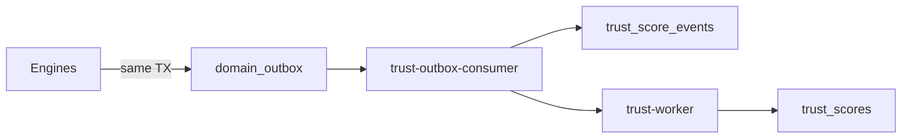

# APP13 Backend Architecture — Review v1

**Version:** 1.0  
**Status:** Verification complete  
**Last updated:** June 20, 2026  
**Subject:** [APP13-Backend-Architecture-v1.md](./APP13-Backend-Architecture-v1.md)  
**Baseline:** [OpenAPI Review v1.1](./APP13-OpenAPI-Review-v1.md) · [API Architecture v1.1](./APP13-API-Architecture-v1.1.md) · [Database Architecture v1.1](./APP13-Database-Architecture-v1.1.md) · [PostgreSQL Schema v1.1 Review](./APP13-PostgreSQL-v1.1-Review.md) · [Contract Engine v1](../APP13-Contract-Engine-v1.md) · [Trust Engine v1.1](../APP13-Trust-Engine-v1.1.md) · [State Machine v1](../APP13-State-Machine-v1.md) · ADR-001/002/003

---

## Verdict

# PASS

Backend Architecture v1 correctly translates OpenAPI v1.1, PostgreSQL Schema v1.1, and engine specifications into a coherent **modular monolith + worker** implementation model. Services, modules, repositories, outbox event bus, domain boundaries, background jobs, security, and deployment topology are defined at a level sufficient to **begin B1 implementation**.

**Caveat:** Two P1 schema gaps (`operations` table, outbox consumer ownership) and several P2 operational refinements should be closed before B6 (trust workers) and B9 (E2E).

---

## Verification summary

| Section | Result | Notes |
|---------|:------:|-------|
| 1. Services | **PASS** | Maps to OpenAPI internal allowlists; workers + monolith split sound |
| 2. Modules | **PASS** | Engine boundaries, dependency rules, layered architecture |
| 3. Repositories | **PASS** | 7 schemas covered; patterns match DB v1.1 |
| 4. Event bus | **PASS** | Transactional outbox; ADR-003 trust path correct |
| 5. Domain boundaries | **PASS** | CA-2, state machine ownership, write authority matrix |
| 6. Background jobs | **PASS** | 12 jobs cover full constitutional chain |
| 7. Security model | **PASS** | P0-S1–S5, GUC gates, authz pipeline |
| 8. Deployment architecture | **PASS** | MVP topology, HA, scaling path |

---

## 1. Services review

### 1.1 OpenAPI alignment

| Internal route (OpenAPI) | Service ID (Backend doc) | Match |
|--------------------------|--------------------------|:-----:|
| `POST …/materialize` | `contract-worker` | ✅ |
| `POST …/activate` | `contract-engine` | ✅ |
| `POST …/complete` | `contract-engine` | ✅ |
| `POST …/transitions/issue-path` | `contract-engine` | ✅ |
| `POST …/complaints/{id}/validate` | `complaint-worker` | ✅ |
| `POST …/complaints/{id}/apply-outcome` | `complaint-engine` | ✅ |
| `POST …/trust/ingest-from-outbox` | `trust-outbox-consumer` | ✅ |
| `POST …/trust/providers/{id}/recompute` | `trust-worker` | ✅ |
| `POST …/outbox/publish-batch` | `outbox-publisher` | ✅ |
| `POST …/audit/events` | allowlisted engines | ✅ |
| `GET …/health/engines` | `ops-probe` | ✅ |
| `POST …/trust/appeals/{id}/resolve` | *(not listed)* | ⚠️ P2 |

Public + admin surfaces correctly assigned to `app13-api` (105 paths / 118 operations per OpenAPI review).

### 1.2 Architectural strengths

| Strength | Evidence |
|----------|----------|
| **Modular monolith first** | Matches Roadmap Phase 1; extractable later (§8.7) |
| **Workers via internal HTTP** | Preserves service JWT + mTLS boundary even in-process-adjacent deployment |
| **No direct API → trust writes** | §1.2 explicitly forbids bypassing trust-outbox-consumer |
| **Async by default for cross-engine** | §1.3: outbox + operations, not sync engine HTTP |

### 1.3 Non-blocking notes

| Item | Severity | Recommendation |
|------|----------|----------------|
| `admin-backend` service ID for appeal resolve | P2 | Add to §1.1 catalog or map to `app13-api` admin handler calling internal route |
| `app13-internal` same container vs sidecar | P2 | Recommend same process + separate router in MVP; document when to split |
| Executive summary says "four workers" but catalog lists 5+ optional | P2 | Clarify count includes only required MVP workers |

**Services: PASS**

---

## 2. Modules review

### 2.1 Engine coverage

| Engine | Module path | OpenAPI tags served | Status |
|--------|-------------|---------------------|:------:|
| Identity | `identity/` | Auth, Identity, Verification | ✅ |
| Action | `action/` | Actions | ✅ |
| Contract | `contract/` | Contracts, Internal Contracts | ✅ |
| Execution | `execution/` | Execution, Evidence | ✅ |
| Complaint | `complaint/` | Cases, Issues, Complaints, Admin (partial) | ✅ |
| Trust | `trust/` + `identity/trust/` | Trust (read/write split) | ✅ |
| Platform | `platform/` | Operations, cross-cutting | ✅ |

### 2.2 Dependency rules

| Rule | Contract Engine / ADR alignment | Status |
|------|----------------------------------|:------:|
| Only `contract/` transitions `contracts.status` | CA authority matrix | ✅ |
| Only `trust/application/ingest` + `projection/` INSERT events | ADR-003 | ✅ |
| `complaint/` must not import `trust/projection/` | Prevents score manipulation | ✅ |
| State machines in `domain/` layer | State Machine v1 | ✅ |

### 2.3 Minor gaps

| Item | Severity | Note |
|------|----------|------|
| TEKRR profile storage not explicit in `ActionRepository` table list | P2 | TEKRR lives on `actions` JSONB columns — add to §3.1 |
| `identity/trust/` read vs `trust/` write split | P2 | Document that Trust Engine v1.1 "hosted in Identity" is a logical ownership, not a code import |
| Lint enforcement mechanism unnamed | P2 | Specify tool (e.g. dependency-cruiser, ArchUnit) in B1 |

**Modules: PASS**

---

## 3. Repositories review

### 3.1 Schema coverage (36 tables, Database Architecture v1.1)

| Schema | Repository | Tables covered | Status |
|--------|------------|------------------|:------:|
| `identity` | Identity + Verification | 7/7 | ✅ |
| `action` | Action | 2/2 | ✅ |
| `contract` | Contract | 3/3 | ✅ |
| `execution` | Execution | 8/8 | ✅ |
| `complaint` | Complaint | 14/14 | ✅ |
| `trust` | Trust | 4/4 | ✅ |
| `platform` | Platform | 2/2 | ✅ |

### 3.2 Pattern alignment (PostgreSQL v1.1)

| Pattern | Backend doc | Schema v1.1 | Status |
|---------|-------------|-------------|:------:|
| EL-6 advisory lock | §3.2 | Trigger + partial unique on `complaint_dimensions` | ✅ |
| GUC gates | §7.3 | `007_schema_v1_1_p0.sql` | ✅ |
| Append-only history | §3.2 | `*_status_history` triggers | ✅ |
| Idempotency keys | §3.4 | `domain_outbox`, `trust_score_events` UNIQUE | ✅ |
| No cross-schema joins in repos | §3.3 | Denormalized `contract_id` on junctions | ✅ |

### 3.3 P1 gap — operations table

| Issue | Detail |
|-------|--------|
| **`OperationsRepository` references table not in migrations** | `GET /operations/{id}` requires persistence; no `platform.operations` (or equivalent) in migrations 001–007 |
| **Impact** | Blocks reliable async polling for activate/complete/apply-outcome |
| **Fix** | Add migration `008_operations.sql` before B4; define schema in Backend doc §3.1 |

**Repositories: PASS** (with P1 migration follow-up)

---

## 4. Event bus review

### 4.1 ADR-003 / P0-T2 compliance



| Requirement | Backend doc | Status |
|-------------|-------------|:------:|
| Events in same TX as state change | §4.1, §4.4 | ✅ |
| Only consumer INSERTs trust events | §4.3, §2.2 trust write boundary | ✅ |
| Idempotent ingest | §4.2 `idempotency_key` | ✅ |
| JSON Schema validation at ingest | §4.1 | ✅ (Trust v1.1 Appendix A) |
| `dispute_hold` on `evidence_gathering` | §4.3 event vocabulary | ✅ (Trust P0-3) |

### 4.2 Event vocabulary completeness

| Constitutional step | Outbox event | Consumer | Status |
|--------------------|--------------|----------|:------:|
| Contract activate | `contract.activated` | trust-outbox-consumer | ✅ |
| Contract complete | `contract.completed` | trust-outbox-consumer | ✅ |
| Evidence upload | `execution.evidence.recorded` | trust-outbox-consumer | ✅ |
| Complaint file | `complaint.filed` | complaint-worker (triage) | ✅ |
| Complaint close | `complaint.closed` | apply-outcome → recompute | ✅ |
| Verification T1 | `verification.approved` | trust-outbox-consumer | ✅ |

### 4.3 P1 clarification needed

| Item | Issue | Recommendation |
|------|-------|----------------|
| **Dual `published_at` writers** | Both `trust-outbox-consumer` (§4.1 diagram) and `outbox-publisher` (§6.1) may mark outbox rows | Define single owner per event type: trust consumer marks after ingest; publisher for non-trust fan-out only |
| **Non-trust outbox consumers** | Complaint triage implied but poll mechanism unspecified | Document complaint-worker outbox subscription pattern in §4.3 |

**Event bus: PASS**

---

## 5. Domain boundaries review

### 5.1 Write authority matrix

Backend §5.1 matches Database Architecture §2.2 and Contract Engine §2.1:

| Boundary | Verified | Status |
|----------|----------|:------:|
| Action cannot write contract status | §5.1 | ✅ |
| Contract cannot write milestone progress | §5.1 | ✅ |
| Complaint cannot write trust scores | §5.1 + ADR-003 | ✅ |
| Execution cannot transition contract (except via Contract Engine) | §5.1 | ✅ |

### 5.2 CA-2 executable states

Backend §5.4 matches PostgreSQL v1.1 `is_contract_execution_allowed` and API Architecture §4.2:

| Status | Backend §5.4 | PostgreSQL v1.1 | Status |
|--------|:------------:|:---------------:|:------:|
| `active` | Full execution | ✅ | ✅ |
| `issue_raised` | Limited | ✅ | ✅ |
| `disputed` | Frozen dimensions | ✅ | ✅ |
| `resolved` | Outcome apply | ✅ | ✅ |
| `completed` | Post-completion only | ✅ | ✅ |
| `closed` | Read + artifacts | ✅ | ✅ |

### 5.3 State machine ownership

All six State Machine v1 entities mapped in §5.3 with correct transition APIs. Clients never PATCH status — consistent with OpenAPI v1.1.

### 5.4 P1 gap — complaint-close lock order

Database Architecture v1.1 **P0-C2** defines runtime lock order for complaint-close transactions. Backend doc references EL-6 advisory lock but **does not document P0-C2 lock sequence** in `complaint.apply-outcome` job.

**Recommended addition to §6.1 or §5.2:**

```
1. complaint.complaints (FOR UPDATE)
2. complaint.adjudications (FOR UPDATE)
3. execution.attestations (FOR UPDATE)
4. trust.trust_score_events (INSERT)
```

**Domain boundaries: PASS** (P0-C2 lock order should be added before B7)

---

## 6. Background jobs review

### 6.1 Constitutional chain coverage

| User flow | Jobs involved | Status |
|-----------|---------------|:------:|
| UF-04–07 Action → Contract | generate, PDF render, accept, materialize, activate | ✅ |
| UF-08 Execution | milestone/evidence (sync API; no job) | ✅ |
| UF-09 Completion | `contract.complete.evaluate` | ✅ |
| UF-10 Complaint file | `complaint.triage` (post-file) | ✅ |
| UF-11 Adjudication | `complaint.apply-outcome` | ✅ |
| UF-12 Trust update | `trust.ingest.batch` + `trust.recompute` | ✅ |
| UF-02/03 Verification | `kyc.webhook.process` | ✅ |

### 6.2 Job ↔ internal route mapping

All 12 jobs in §6.1 map to OpenAPI internal routes or in-process modules. Async `202` responses backed by `platform/operations` (once table exists).

### 6.3 Orchestration

| Feature | Definition | Status |
|---------|------------|:------:|
| Operation polling | `GET /operations/{id}` | ✅ |
| Retry policy | 3x exponential backoff | ✅ |
| Worker claim | `FOR UPDATE SKIP LOCKED` | ✅ |
| Idempotency propagation | Job carries HTTP idempotency key | ✅ |

**Background jobs: PASS**

---

## 7. Security model review

### 7.1 P0 security closure (API Review v1 → Backend)

| ID | Requirement | Backend § | Status |
|----|-------------|-----------|:------:|
| P0-S1 | DB revalidation on gated mutations | §7.2 pipeline step B | ✅ |
| P0-S2 | Trust ingest restricted | §1.2, §4.3 | ✅ |
| P0-S3 | Signed actor context | §7.1 | ✅ |
| P0-S4 | Upload tenancy | §7.4 | ✅ |
| P0-S5 | Mandatory idempotency | §7.5 | ✅ |

### 7.2 Authorization

| Control | Backend doc | Permissions Matrix | Status |
|---------|-------------|-------------------|:------:|
| RBAC + resource scope | §7.2 | §1.1 | ✅ |
| TEKRR dimension forbidden | §7.2 `TEKRR_DIMENSION_FORBIDDEN` | P0-A1 | ✅ |
| Adjudicator assignment IDOR | §7.2 404 | P0-A2 | ✅ |
| Admin override + audit | §7.2 step C | Matrix §admin | ✅ |

### 7.3 Database-enforced security

| GUC | Backend §7.3 | Migration | Status |
|-----|:------------:|:---------:|:------:|
| `app13.contract_materialization=on` | ✅ | 007 | ✅ |
| `app13.complaint_outcome_apply=on` | ✅ | 007 | ✅ |
| `app13.trust_recompute=on` | ✅ | 006/007 | ✅ |

**Security model: PASS**

---

## 8. Deployment architecture review

### 8.1 MVP topology

| Requirement | Backend §8 | MVP Scope | Status |
|-------------|------------|-----------|:------:|
| Web-only client | ALB → API | §1.1 | ✅ |
| HA API | 2+ replicas | Implied | ✅ |
| Private workers | Private subnet | ✅ | ✅ |
| Managed Postgres 16 | RDS Multi-AZ | Schema v1.1 | ✅ |
| Object storage | S3 for evidence | MVP Scope §1.5 | ✅ |
| Redis | Sessions + idempotency | Not in MVP Scope explicitly | ✅ (reasonable) |

### 8.2 Observability

| Requirement | Status |
|-------------|:------:|
| `request_id` correlation | ✅ §8.4 |
| Poll lag metric (trust consumer) | ✅ §8.3 |
| Health checks | ⚠️ `GET /health` not in OpenAPI — add liveness route in B1 |

### 8.3 Scaling path

§8.7 correctly identifies trust-worker and outbox-consumer as first scale targets — aligned with Trust Engine v1.1 recompute SLA.

**Deployment: PASS**

---

## 9. Implementation sequence review

Backend B1–B9 aligns with API Architecture §17 (A1–A8) and constitutional dependency order:

```
B1 Platform → B2 Identity → B3 Action → B4 Contract → B5 Execution
  → B6 Trust → B7 Complaint → B8 Admin → B9 E2E
```

Trust (B6) before Complaint (B7) is correct — complaint outcome apply requires trust recompute path.

**Implementation sequence: PASS**

---

## 10. Findings summary

### P1 — resolve before affected phase

| ID | Finding | Phase blocked | Action |
|----|---------|---------------|--------|
| **P1-B1** | `operations` table undefined in PostgreSQL migrations | B4 (async contract) | Add `008_operations.sql`; update §3.1 |
| **P1-B2** | P0-C2 complaint-close lock order not documented | B7 (complaint) | Add lock sequence to §5.2 or §6.1 |
| **P1-B3** | Outbox `published_at` ownership ambiguous (consumer vs publisher) | B6 (trust) | Clarify single-writer rule per event type in §4 |

### P2 — non-blocking

| ID | Finding | Action |
|----|---------|--------|
| P2-B1 | `admin-backend` service ID missing from §1.1 | Add or alias to monolith |
| P2-B2 | `GET /health` referenced in §8.3 but not in OpenAPI | Add health route in B1 |
| P2-B3 | TEKRR JSONB columns not listed under ActionRepository | Document in §3.1 |
| P2-B4 | ArchUnit / dependency lint tool not named | Specify in B1 platform kernel |

### No P0 findings

Backend Architecture v1 introduces no constitutional violations and no contradictions with PASS-reviewed upstream artifacts.

---

## 11. Cross-artifact verification matrix

| Upstream artifact | Review status | Backend alignment |
|-------------------|:-------------:|:-----------------:|
| OpenAPI v1.1 | PASS | §9 routing map; services match internal allowlists |
| API Architecture v1.1 | PASS | Security, async ops, engine gates |
| PostgreSQL Schema v1.1 | PASS | Repositories, GUC gates, indexes |
| Contract Engine v1 | — | CA-1–CA-8, issue path, materialization |
| Trust Engine v1.1 | — | Outbox ingest, recompute, dispute_hold |
| State Machine v1 | — | §5.3 ownership table |
| ADR-001/002/003 | — | No marketplace; complaint from contract; trust authority |

---

## 12. Recommended next steps

| Priority | Action |
|----------|--------|
| 1 | Add `database/migrations/008_operations.sql` and document in Backend §3.1 |
| 2 | Patch Backend §4 / §5 with P0-C2 lock order and outbox consumer ownership |
| 3 | Begin **B1** — platform kernel (db, authz, idempotency, outbox, errors) |
| 4 | Add `GET /health` to OpenAPI or document as non-spec infra route |
| 5 | Create ArchUnit/dependency-cruiser rules matching §2.2 import graph |

---

## Related documents

| Document | Relationship |
|----------|--------------|
| [APP13-Backend-Architecture-v1.md](./APP13-Backend-Architecture-v1.md) | Subject of this review |
| [APP13-OpenAPI-Review-v1.md](./APP13-OpenAPI-Review-v1.md) | Upstream PASS |
| [APP13-API-v1.1-Review.md](./APP13-API-v1.1-Review.md) | Upstream PASS |
| [APP13-PostgreSQL-v1.1-Review.md](./APP13-PostgreSQL-v1.1-Review.md) | Schema PASS |

---

*Review complete. No architecture files were modified.*
