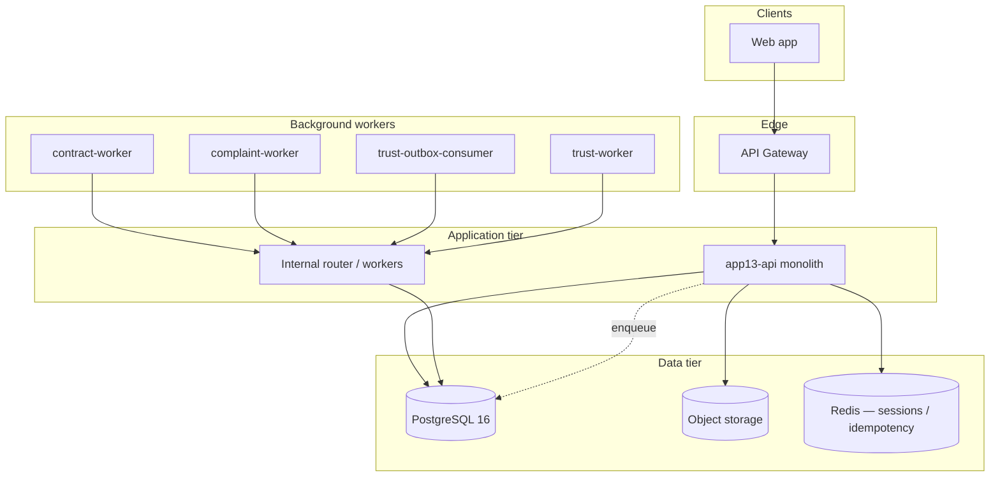
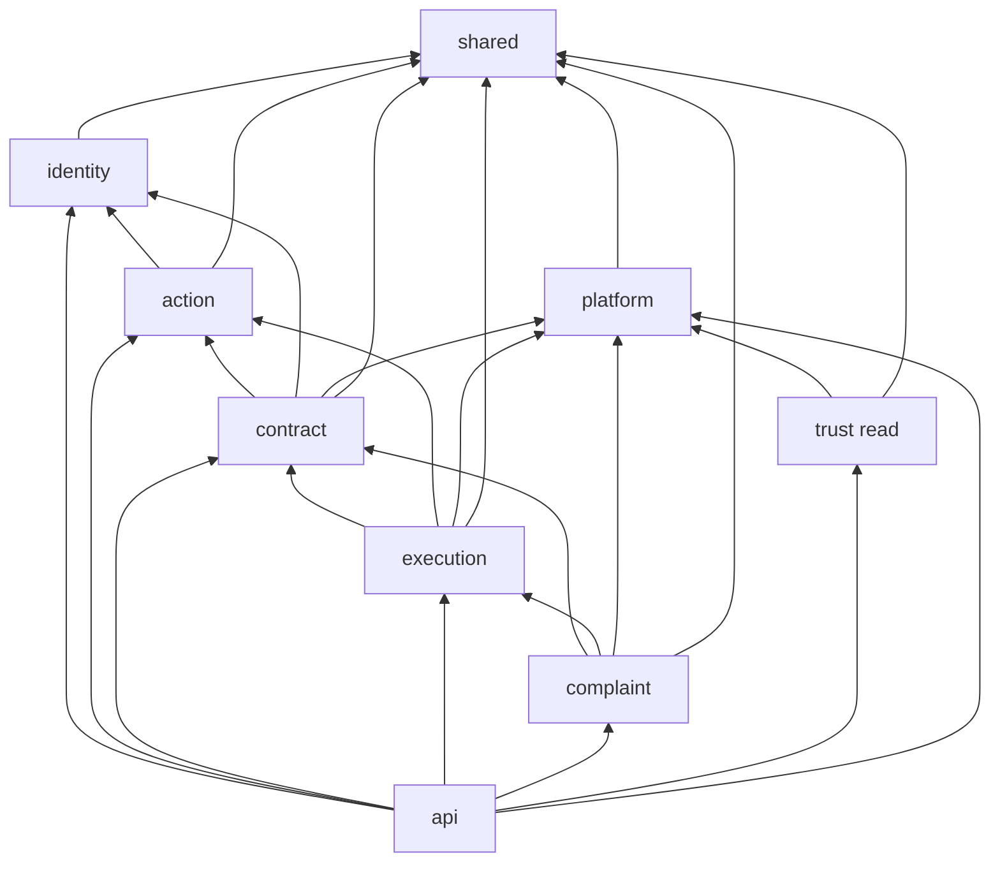
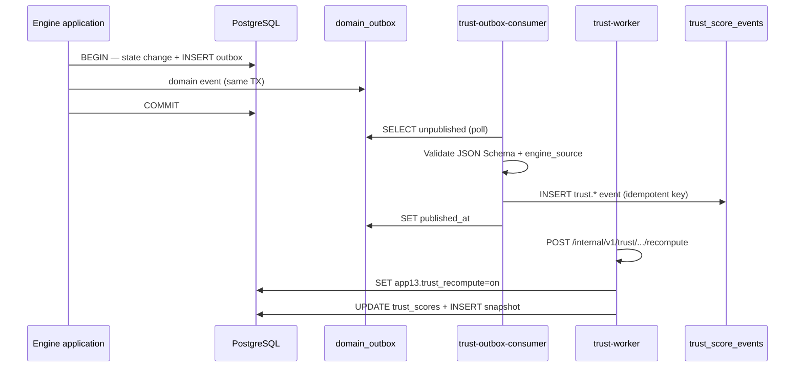
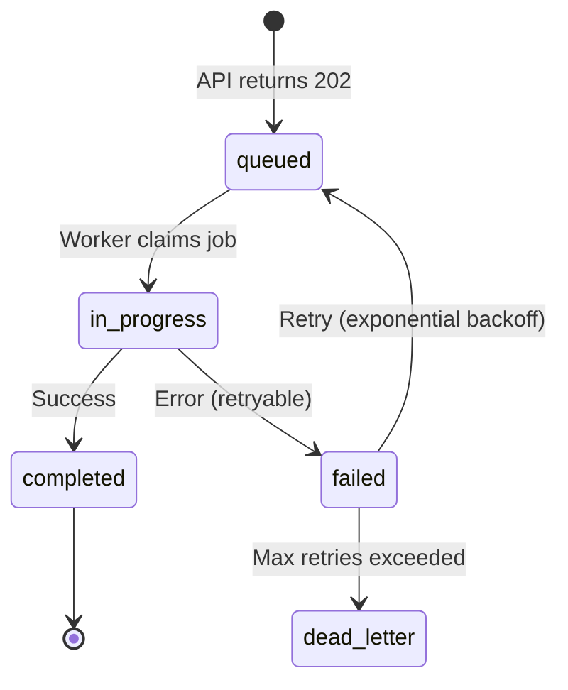
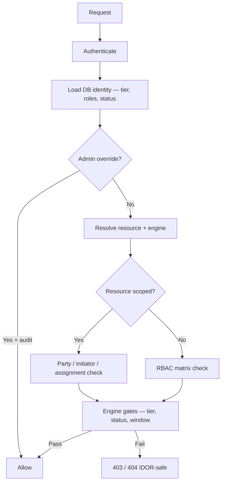
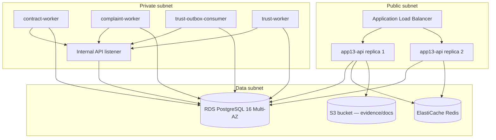

# APP13 Backend Architecture v1

**Version:** 1.0  
**Status:** Draft — Pre-implementation  
**Last updated:** June 20, 2026  
**Depends on:** [OpenAPI v1.1](../../api/public-v1.yaml) · [Internal OpenAPI v1.1](../../api/internal-v1.yaml) · [PostgreSQL Schema v1.1](../../database/migrations/) · [Database Architecture v1.1](./APP13-Database-Architecture-v1.1.md) · [API Architecture v1.1](./APP13-API-Architecture-v1.1.md) · [Contract Engine v1](../APP13-Contract-Engine-v1.md) · [Trust Engine v1.1](../APP13-Trust-Engine-v1.1.md) · [State Machine v1](../APP13-State-Machine-v1.md) · [Permissions Matrix v1](./04-permissions-matrix.md) · ADR-001/002/003

---

## Document purpose

This document defines the **MVP backend architecture** for APP13 — runtime services, code modules, persistence layer, event infrastructure, domain boundaries, background processing, security, and deployment topology.

**Audience:** Backend engineering, platform, DevOps, security review.  
**Scope:** Phase 1 MVP — modular monolith with extractable engine boundaries.

**Constitutional chain (preserved in all layers):**

```
Action → Contract → Execution (Milestone + Evidence + Attestation) → Trust → Complaint
```

**Explicitly excluded:** Frontend architecture, CI/CD pipeline YAML, language/framework selection (implementation choice), sprint plans.

---

## Executive summary

| Layer | MVP pattern |
|-------|-------------|
| **Runtime** | Modular monolith + worker processes |
| **API** | REST per OpenAPI v1.1 (`/v1` public, `/internal/v1` private) |
| **Persistence** | Single PostgreSQL 16 database, 7 schemas |
| **Events** | Transactional outbox (`platform.domain_outbox`) |
| **Trust writes** | Outbox consumer only (ADR-003) |
| **Auth** | Session + JWT public; mTLS + service JWT internal |
| **Deployment** | Containerized services; managed Postgres + object storage |



---

## 1. Services

MVP deploys **one primary application** and **four worker services**. Logical services map 1:1 to constitutional engines plus platform infrastructure.

### 1.1 Service catalog

| Service ID | Process | OpenAPI surface | Primary engine | MVP deployment |
|------------|---------|-----------------|----------------|----------------|
| `app13-api` | HTTP server | Public `/v1` + Admin `/v1/admin` | All engines (orchestration) | Required |
| `app13-internal` | HTTP server (private) | Internal `/internal/v1` | Cross-engine coordination | Same container as API or sidecar |
| `contract-worker` | Worker | Internal: materialize | Contract | Separate process |
| `contract-engine` | In-process module | Internal: activate, complete, issue-path | Contract | Module inside monolith; internal routes |
| `complaint-worker` | Worker | Internal: validate | Complaint | Separate process |
| `complaint-engine` | In-process module | Internal: apply-outcome | Complaint | Module inside monolith |
| `trust-outbox-consumer` | Worker | Internal: ingest-from-outbox | Trust | Separate process |
| `trust-worker` | Worker | Internal: recompute | Trust | Separate process |
| `outbox-publisher` | Worker | Internal: publish-batch | Platform | Optional MVP (poll in-process) |
| `ops-probe` | Health checker | Internal: health/engines | Platform | Sidecar or k8s probe |

### 1.2 Service responsibilities

#### `app13-api` (Public + Admin)

| Responsibility | Modules invoked |
|----------------|-----------------|
| Authentication and session management | Identity |
| Authorization gate (RBAC + resource scope) | Platform / shared |
| REST handlers per OpenAPI public paths | Engine modules |
| Idempotency deduplication | Platform |
| Async operation enqueue (`202` + `operation_id`) | Platform |
| RFC 7807 error mapping | Platform |
| Admin queue endpoints | Complaint, Identity, Trust, Platform |

Does **not** directly append `trust_score_events` or bypass engine gates.

#### `app13-internal` (Private HTTP)

| Responsibility | Allowed callers |
|----------------|-----------------|
| Engine-to-engine transitions | Service JWT allowlist per route |
| Signed actor context verification (P0-S3) | Gateway when continuing user chain |
| DB session GUC toggles for privileged writes | Named workers only |
| Health aggregation | `ops-probe` |

Internal routes are **never internet-routable** (private VPC / mesh only).

#### Worker services

| Worker | Trigger | Output |
|--------|---------|--------|
| **contract-worker** | Contract `accepted` → activation pipeline | Milestones + attestation shells materialized |
| **contract-engine** (internal) | All parties accepted | `accepted` → `active`; verification snapshots |
| **contract-engine** (internal) | Milestones + attestations satisfied | `active` → `completed`; `complaint_window_ends_at` |
| **complaint-worker** | Complaint `filed` / admin triage | EL-1–EL-8 validation; status transitions |
| **complaint-engine** (internal) | Admin adjudication recorded | Attestation updates; contract path; outbox events |
| **trust-outbox-consumer** | Unpublished outbox rows | Append `trust.trust_score_events` (idempotent) |
| **trust-worker** | Post-ingest / appeal / outcome | Recompute `trust.trust_scores` projection |
| **outbox-publisher** | Scheduled poll | Mark `domain_outbox.published_at` (MVP: optional) |

### 1.3 Service communication matrix

| From | To | Protocol | Auth |
|------|-----|----------|------|
| Web client | `app13-api` | HTTPS REST | Session / Bearer JWT |
| `app13-api` | PostgreSQL | TCP | App credentials |
| `app13-api` | S3-compatible storage | HTTPS presigned | IAM / app role |
| Workers | `app13-internal` | HTTPS (private) | mTLS + service JWT |
| `app13-api` | Workers | Async via DB outbox + operations table | N/A (no direct HTTP to workers MVP) |
| KYC provider | `app13-api` | HTTPS webhook | HMAC signature |

**MVP rule:** Cross-engine effects use **database transactions + outbox**, not synchronous HTTP between engines (except internal orchestration endpoints invoked by workers).

---

## 2. Modules

Code is organized as a **modular monolith** — one repository, engine-scoped packages, strict import boundaries enforced by lint rules.

### 2.1 Module map

```
app13/
├── api/                          # HTTP layer (thin)
│   ├── public/                   # OpenAPI /v1 handlers
│   ├── admin/                    # OpenAPI /v1/admin handlers
│   ├── internal/                 # OpenAPI /internal/v1 handlers
│   ├── middleware/               # Auth, idempotency, request-id, error handler
│   └── dto/                      # Request/response mapping (OpenAPI schemas)
│
├── identity/                     # Identity Engine
│   ├── domain/                   # User, Customer, Provider, Verification, Credential
│   ├── application/              # Register, login, tier gates, KYC orchestration
│   ├── infrastructure/           # Repositories, KYC adapter, session store
│   └── trust/                    # Trust profile read, appeal intake (not recompute)
│
├── action/                       # Action Engine
│   ├── domain/                   # Action, TEKRR profile, ActionType catalog
│   ├── application/              # Create action, TEKRR validation, transitions
│   └── infrastructure/           # ActionRepository, taxonomy loader
│
├── contract/                     # Contract Engine
│   ├── domain/                   # Contract, Party, Transition rules (CA-1–CA-8)
│   ├── application/              # Generate, accept, issue-path, completion gates
│   ├── infrastructure/           # ContractRepository, template renderer, PDF job
│   └── materialization/          # Milestone factory (template → execution rows)
│
├── execution/                    # Action Engine — execution subdomain
│   ├── domain/                   # Milestone, Evidence, Attestation, Evaluation
│   ├── application/              # Transitions, upload-intent, attestation rating
│   └── infrastructure/           # ExecutionRepository, storage adapter
│
├── complaint/                    # Complaint Engine
│   ├── domain/                   # Case, Issue, Complaint, Adjudication, EL rules
│   ├── application/              # File, triage, adjudicate, outcome apply
│   └── infrastructure/           # ComplaintRepository, evidence pack builder
│
├── trust/                        # Trust Engine (Scoring Service)
│   ├── domain/                   # TrustEvent, ScoreProjection, Snapshot
│   ├── application/              # Ingest, validate payload, recompute v1
│   ├── infrastructure/           # TrustRepository, event schema validator
│   └── projection/               # trust_score_v1 formula implementation
│
├── platform/                     # Cross-cutting
│   ├── authz/                    # RBAC checker, resource scope, engine gates
│   ├── audit/                    # audit_events append
│   ├── outbox/                   # domain_outbox write + poll
│   ├── operations/               # Async operation status (GET /operations)
│   ├── idempotency/              # Idempotency-Key store (24h TTL)
│   └── jobs/                     # Job scheduler / worker bootstrap
│
└── shared/                       # Kernel (no engine imports upward)
    ├── db/                       # Connection pool, transactions, GUC helpers
    ├── errors/                   # Problem types, engine error codes
    ├── events/                   # Domain event types (shared vocabulary)
    └── config/                   # Environment configuration
```

### 2.2 Module dependency rules



| Rule | Enforcement |
|------|---------------|
| **No upward imports** | `domain/` packages never import `api/` |
| **Engine isolation** | `complaint/` must not import `trust/projection/` |
| **Trust write boundary** | Only `trust/application/ingest` and `trust/projection/` may INSERT `trust_score_events` |
| **Contract authority** | Only `contract/` may transition `contracts.status` |
| **Shared kernel** | `shared/` has zero engine dependencies |
| **Cross-engine orchestration** | Use `platform/outbox` events or internal HTTP handlers — never direct cross-repository writes from foreign modules |

### 2.3 Application vs domain layer

| Layer | Responsibility | Example |
|-------|----------------|---------|
| **Domain** | Invariants, state machine transitions, gate checks | `Contract.accept(party, hashAck)` |
| **Application** | Use-case orchestration, transaction boundaries, outbox emit | `GenerateContractUseCase.execute(actionId)` |
| **Infrastructure** | PostgreSQL, S3, KYC HTTP, Redis | `ContractRepository.save()` |
| **API** | HTTP mapping, auth context injection, DTO validation | `POST /contracts/{id}/transitions` handler |

State machine authority lives in **domain** services aligned with [State Machine v1](../APP13-State-Machine-v1.md).

---

## 3. Repositories

Repositories encapsulate PostgreSQL access **one schema per repository interface**. MVP uses a single database connection pool; repositories do not cross schema boundaries without explicit application-layer orchestration.

### 3.1 Repository catalog

| Repository | PostgreSQL schema | Owner module | Primary tables |
|------------|-------------------|--------------|----------------|
| `IdentityRepository` | `identity` | identity | `users`, `customers`, `providers`, `companies` |
| `VerificationRepository` | `identity` | identity | `verifications`, `verification_documents`, `credentials` |
| `ActionRepository` | `action` | action | `actions`, `action_status_history` |
| `ContractRepository` | `contract` | contract | `contracts`, `contract_parties`, `contract_status_history` |
| `ExecutionRepository` | `execution` | execution | `milestones`, `evidence`, `attestations`, `attestation_evidence`, `attestation_milestones`, `customer_evaluations`, `milestone_status_history` |
| `ComplaintRepository` | `complaint` | complaint | `cases`, `case_dimensions`, `issues`, `issue_dimensions`, `issue_milestones`, `complaints`, `complaint_dimensions`, `complaint_evidence`, `adjudications`, `mediation_records`, `*_status_history` |
| `TrustRepository` | `trust` | trust | `trust_scores`, `trust_score_events`, `trust_score_snapshots`, `trust_score_event_corrections` |
| `PlatformRepository` | `platform` | platform | `audit_events`, `domain_outbox` |
| `OperationsRepository` | `platform` or app schema | platform | Async `operations` table (implementation) |
| `IdempotencyRepository` | `platform` or Redis | platform | Idempotency key cache |

### 3.2 Repository patterns

| Pattern | Usage |
|---------|-------|
| **Unit of Work** | Application service opens transaction; passes `tx` to repositories |
| **Optimistic concurrency** | Status transitions check current status (`UPDATE … WHERE status = $expected`) |
| **Append-only writes** | `*_status_history`, `trust_score_events`, `audit_events` — INSERT only |
| **Denormalized FK maintenance** | `contracts.customer_id/provider_id` at activation; `complaint_dimensions.contract_id` at file |
| **Advisory locks** | EL-6: `pg_advisory_xact_lock` on `(contract_id, tekrr_dimension)` during complaint file |
| **Session GUC gates** | Privileged writes require DB session variables (see §7.3) |

### 3.3 Query ownership

| Query type | Owner |
|------------|-------|
| Party-scoped list/filter | Engine repository + authz scope injection |
| Admin queue queries | Respective engine + admin role check |
| Trust public summary | TrustRepository read projection |
| Trust event log (PII-safe) | TrustRepository with field allowlist per role (P0-T1) |
| Cross-schema joins | **Forbidden in repositories** — compose in application layer or use denormalized columns |

### 3.4 Index reliance (performance contracts)

Repositories must use indexed access paths defined in Schema v1.1:

| Access pattern | Index / constraint |
|----------------|-------------------|
| Unpublished outbox poll | `idx_domain_outbox_unpublished` |
| EL-6 duplicate check | `uq_complaint_dimensions_active` (partial unique) |
| Trust event idempotency | `uq_trust_score_events_idempotency_key` |
| Evidence dedup | `uq_evidence_contract_content_hash` |
| Audit by entity | `idx_audit_events_entity` |

---

## 4. Event bus

MVP uses the **transactional outbox pattern** — not a separate message broker. `platform.domain_outbox` is the event bus; workers poll unpublished rows.

### 4.1 Event flow



### 4.2 Outbox record schema

Aligned with `platform.domain_outbox` (Schema v1.1):

| Column | Purpose |
|--------|---------|
| `id` | UUID primary key |
| `event_type` | Canonical domain event (e.g. `contract.completed`) |
| `payload` | JSONB — validated per engine |
| `engine_source` | Emitting engine (`contract`, `action`, `complaint`, `identity`) |
| `idempotency_key` | UNIQUE — dedup across retries |
| `published_at` | NULL until consumed |
| `created_at` | Ordering for poll |

### 4.3 Event vocabulary

| Domain event (outbox) | Primary emitter | Downstream consumer |
|----------------------|-----------------|---------------------|
| `action.created` | Action | Audit |
| `action.ready_for_contract` | Action | Audit |
| `contract.generated` | Contract | PDF render job |
| `contract.proposed` | Contract | Notifications (P1) |
| `contract.activated` | Contract | Trust ingest → `trust.contract.activated` |
| `contract.completed` | Contract | Trust ingest → `trust.contract.completed` |
| `contract.cancelled` | Contract | Trust ingest |
| `execution.milestone.submitted` | Execution | Trust ingest |
| `execution.evidence.recorded` | Execution | Trust ingest |
| `execution.attestation.rated` | Execution | Trust ingest |
| `verification.approved` | Identity | Trust ingest |
| `complaint.filed` | Complaint | Triage worker |
| `complaint.triaged` | Complaint | Contract issue-path |
| `complaint.evidence_gathering` | Complaint | Trust `dispute_hold` trigger |
| `complaint.closed` | Complaint | Outcome apply → trust recompute |
| `trust.score.recomputed` | Trust | Audit |

Trust-facing events are mapped to canonical `trust.*` types per [Trust Engine v1.1 §7](./APP13-Trust-Engine-v1.1.md). **Only `trust-outbox-consumer`** may INSERT into `trust.trust_score_events` (ADR-003 / P0-T2).

### 4.4 Delivery guarantees

| Guarantee | Mechanism |
|-----------|-----------|
| **At-least-once delivery** | Outbox poll + retry; consumers idempotent |
| **No lost events** | Outbox written in same TX as state change |
| **Ordering** | Per-aggregate ordering by `created_at`; cross-aggregate ordering not guaranteed MVP |
| **Poison messages** | Dead-letter after N failures → `platform.audit_events` + ops alert |

### 4.5 Phase 2 evolution

| MVP | Phase 2+ |
|-----|----------|
| PostgreSQL poll | Optional SNS/SQS/Kafka bridge via `outbox-publisher` |
| In-process job runner | Dedicated queue per consumer type |
| Single region | Multi-region outbox with global idempotency |

---

## 5. Domain boundaries

Domain boundaries follow **engine write authority** from Database Architecture v1.1 and Contract/Trust Engine specs.

### 5.1 Boundary matrix

| Domain | Schema | Authoritative engine | May write | Must not write |
|--------|--------|---------------------|-----------|----------------|
| **Identity** | `identity` | Identity | Users, profiles, verifications, credentials | Contracts, trust scores |
| **Action** | `action` | Action | Actions, TEKRR, action history | Contract status, trust events |
| **Contract** | `contract` | Contract | Contracts, parties, contract history | Milestone progress, trust scores |
| **Execution** | `execution` | Action | Milestones, evidence, attestations, evaluations | Contract status (except via Contract Engine), trust scores |
| **Complaint** | `complaint` | Complaint | Cases, issues, complaints, adjudications | Trust scores directly |
| **Trust** | `trust` | Trust (Scoring) | Events, projections, snapshots, corrections | Any non-trust domain state |
| **Platform** | `platform` | Platform | Audit, outbox | Business entity lifecycle |

### 5.2 Cross-domain interaction patterns

| Pattern | When | Example |
|---------|------|---------|
| **Synchronous gate check** | API mutation preconditions | Contract Engine validates tier before accept |
| **Same-transaction orchestration** | Atomic lifecycle step | Complaint file + dimension rows + advisory lock |
| **Outbox + async worker** | Cross-engine side effects | Activation → materialize milestones |
| **Internal HTTP** | Privileged multi-step orchestration | `POST /internal/v1/complaints/{id}/apply-outcome` |
| **DB trigger enforcement** | Hard invariants | CK-2 evidence milestone binding; ADR-003 trust INSERT guard |

### 5.3 State machine ownership

Per [State Machine v1](../APP13-State-Machine-v1.md):

| Entity | Owner module | Transition API |
|--------|--------------|----------------|
| Action | `action/domain` | `POST /actions/{id}/transitions` |
| Contract | `contract/domain` | `POST /contracts/{id}/transitions` + internal |
| Milestone | `execution/domain` | `POST …/milestones/{id}/transitions` |
| Issue | `complaint/domain` | `POST /issues/{id}/transitions` |
| Case | `complaint/domain` | `POST /cases/{id}/transitions` |
| Complaint | `complaint/domain` | Party + admin + internal workers |
| Trust record state | `trust/projection` | System-only (recompute) |

Clients **never PATCH status fields** — transitions only (OpenAPI v1.1).

### 5.4 Executable contract gate (CA-2)

Execution routes delegate to shared gate aligned with PostgreSQL v1.1 `is_contract_execution_allowed`:

| Contract status | Execution module behavior |
|-----------------|---------------------------|
| `active` | Full milestone/evidence/attestation |
| `issue_raised` | Limited — non-frozen dimensions |
| `disputed` | Frozen dimensions only |
| `resolved` | Outcome apply path |
| `completed` | Post-completion eval/attestation only |
| `closed` | Read + complaint artifacts |
| Pre-active / void / cancelled | Block all mutations (`409`) |

Internal `apply-outcome` sets `app13.complaint_outcome_apply=on` for attestation writes during complaint resolution.

---

## 6. Background jobs

### 6.1 Job catalog

| Job ID | Trigger | Handler | Internal route / module | Async response |
|--------|---------|---------|-------------------------|----------------|
| `contract.pdf.render` | After generate | contract-worker | `contract/infrastructure` | `202` operation |
| `contract.materialize` | Pre-activation | contract-worker | `POST …/materialize` | `202` |
| `contract.activate` | All parties accepted | contract-engine | `POST …/activate` | `202` |
| `contract.complete.evaluate` | Milestones + attestations done | contract-engine | `POST …/complete` | `202` |
| `contract.issue-path` | Issue/complaint events | contract-engine | `POST …/transitions/issue-path` | sync/async |
| `complaint.triage` | Complaint filed / admin triage | complaint-worker | `POST …/validate` | sync |
| `complaint.apply-outcome` | Admin adjudication | complaint-engine | `POST …/apply-outcome` | `202` |
| `trust.ingest.batch` | Scheduled / post-outbox | trust-outbox-consumer | `POST …/ingest-from-outbox` | sync |
| `trust.recompute` | Post-ingest / appeal / outcome | trust-worker | `POST …/recompute` | `202` |
| `outbox.publish` | Scheduled poll | outbox-publisher | `POST …/publish-batch` | sync |
| `idempotency.gc` | Scheduled | platform | Delete keys > 24h | — |
| `kyc.webhook.process` | KYC callback | identity | `POST /verifications/t1/webhook` | sync |

### 6.2 Job orchestration



| Component | Responsibility |
|-----------|----------------|
| `platform/operations` | Stores `operation_id`, status, resource linkage — backs `GET /operations/{id}` |
| Worker claim | `SELECT … FOR UPDATE SKIP LOCKED` on operations or outbox |
| Retry policy | 3 retries, exponential backoff (1m, 5m, 15m) MVP |
| Idempotency | Job payload includes same key as originating HTTP request |

### 6.3 Worker scheduling (MVP)

| Mode | Jobs |
|------|------|
| **Event-driven** (outbox poll loop) | trust ingest, complaint triage enqueue |
| **Completion-triggered** (API enqueues) | materialize, activate, complete, apply-outcome |
| **Cron** (every 1–5 min) | outbox publish sweep, idempotency GC, SLA monitors (P1) |

Workers run as **separate containers** in MVP — same image, different `SERVICE_ID` entrypoint.

---

## 7. Security model

### 7.1 Authentication

| Surface | Method | Storage / validation |
|---------|--------|----------------------|
| **Public web** | Session cookie (`app13_session`) + optional Bearer JWT | Server-side session store (Redis or DB) |
| **Public API clients** | Bearer JWT (15 min TTL) + refresh token rotation | `POST /auth/token/refresh` (P0-E4) |
| **KYC webhook** | HMAC header (`X-KYC-Signature`) | Shared secret per provider |
| **Internal API** | mTLS client cert **and** service JWT (`service_id` claim) | Allowlist per route (`x-allowed-service-ids`) |
| **Actor continuation** | Signed `X-Actor-Context-Token` JWT (≤ 5 min) | Gateway-issued; audit-bound (P0-S3) |

JWT carries `sub`, `roles`, `tier`, `session_id` for UX only. **Gated mutations revalidate from DB** (P0-S1).

### 7.2 Authorization pipeline

Every mutating request passes through `platform/authz`:



| Check | Fail code | Source |
|-------|-----------|--------|
| `users.status != active` | `403 ACCOUNT_SUSPENDED` | P0-S1 |
| JWT tier ≠ DB tier | `403 TIER_STALE` | P0-S1 |
| JWT roles ⊄ DB roles | `403 ROLES_STALE` | P0-S1 |
| Tier gate (T1 accept, etc.) | `422 TIER_INSUFFICIENT` | Engine gate |
| Wrong TEKRR dimension | `403 TEKRR_DIMENSION_FORBIDDEN` | P0-A1 |
| Unassigned adjudicator | `404` (IDOR-safe) | P0-A2 |
| Invalid transition | `409 INVALID_TRANSITION` | State Machine |
| Missing idempotency key | `400 IDEMPOTENCY_KEY_REQUIRED` | P0-S5 |

Role definitions and permission codes: [Permissions Matrix v1](./04-permissions-matrix.md).

### 7.3 Database session security (GUC gates)

PostgreSQL enforces write authority via session variables (Schema v1.1 migrations):

| GUC | Set by | Permits |
|-----|--------|---------|
| `app13.contract_materialization=on` | contract-worker | INSERT milestones during activation |
| `app13.complaint_outcome_apply=on` | complaint-engine | Attestation writes during outcome apply |
| `app13.trust_recompute=on` | trust-worker | UPDATE `trust_scores` projection columns |

Application code sets GUC at transaction start for privileged operations; resets on commit/rollback.

### 7.4 Data protection

| Control | Implementation |
|---------|----------------|
| **Upload tenancy** | Server-generated `storage_key`; hash verify on confirm (P0-S4) |
| **PII in trust events** | Field allowlist on provider self-view (P0-T1) |
| **Audit trail** | All admin mutations → `platform.audit_events` |
| **Secrets** | KYC keys, JWT signing keys, DB creds in secrets manager |
| **TLS** | TLS 1.2+ everywhere; HSTS on public API |
| **Rate limiting** | 100/min authenticated; 20/min auth routes |
| **CSRF** | SameSite cookie + CSRF token on session mutations |

### 7.5 Idempotency store

| Property | Value |
|----------|-------|
| Key source | `Idempotency-Key` header (UUID v4) |
| TTL | 24 hours |
| Storage | Redis (preferred) or PostgreSQL |
| Same key + same body | Replay cached response |
| Same key + different body | `409 IDEMPOTENCY_KEY_REUSE` |

---

## 8. Deployment architecture

### 8.1 MVP topology



### 8.2 Environment tiers

| Environment | Purpose | Data |
|-------------|---------|------|
| **local** | Developer workstations | Docker Compose Postgres + MinIO + Redis |
| **staging** | Integration / QA | Anonymized seed data; KYC sandbox |
| **production** | Live MVP | Encrypted RDS; real KYC; WAF on ALB |

### 8.3 Container specification (MVP)

| Container | CPU / Memory (starter) | Replicas | Health check |
|-----------|------------------------|----------|--------------|
| `app13-api` | 1 vCPU / 2 GB | 2+ (HA) | `GET /health` |
| `contract-worker` | 0.5 vCPU / 1 GB | 1–2 | Process heartbeat |
| `complaint-worker` | 0.5 vCPU / 1 GB | 1–2 | Process heartbeat |
| `trust-outbox-consumer` | 0.5 vCPU / 1 GB | 1 | Poll lag metric |
| `trust-worker` | 1 vCPU / 2 GB | 1–2 | Queue depth metric |

Single **Docker image** with `ENTRYPOINT` selected by `APP13_SERVICE_ID` environment variable.

### 8.4 Infrastructure dependencies

| Component | Service | MVP requirement |
|-----------|---------|-----------------|
| **Database** | PostgreSQL 16+ | Multi-AZ; automated backups; 7 schemas |
| **Object storage** | S3-compatible | Versioning off; lifecycle policy for temp uploads |
| **Cache** | Redis 7+ | Sessions, idempotency, optional rate-limit counters |
| **Secrets** | AWS Secrets Manager / equivalent | DB URL, JWT keys, KYC HMAC |
| **KYC** | External provider (e.g. Persona, Onfido) | Webhook + redirect flow |
| **Email / SMS** | Transactional provider | OTP, password reset |
| **Observability** | Logs + metrics + traces | `request_id` correlation across API and workers |

### 8.5 Network security

| Rule | Detail |
|------|--------|
| Public ingress | ALB → `app13-api` only (`/v1`) |
| Internal API | Private subnet; security group allows workers + monolith only |
| Database | Private subnet; no public access |
| Egress | Allowlist: KYC, email, SMS providers |
| mTLS | Internal service mesh or sidecar (implementation choice) |

### 8.6 Migration and schema management

| Practice | Detail |
|----------|--------|
| Migrations | Sequential SQL in `database/migrations/` (001–007+) |
| Zero-downtime | Expand-contract pattern for column additions |
| Rollback | Forward-only migrations; feature flags for code rollback |
| Seed data | Action taxonomy + contract templates as deployment artifacts (P0-M2) |

### 8.7 Scaling path (post-MVP)

| Trigger | Action |
|---------|--------|
| Trust recompute latency | Scale `trust-worker` horizontally |
| API RPS | Scale `app13-api` replicas; read replicas for list endpoints |
| Outbox lag | Scale `trust-outbox-consumer`; introduce message broker |
| Engine team boundaries | Extract `trust/` or `complaint/` to separate deployables |

---

## 9. OpenAPI ↔ module routing map

| OpenAPI tag | Module | Repository |
|-------------|--------|------------|
| Auth, Identity, Verification | `identity/` | Identity, Verification |
| Actions | `action/` | Action |
| Contracts | `contract/` | Contract |
| Execution, Evidence | `execution/` | Execution |
| Trust | `identity/trust` (read) + `trust/` (write) | Trust |
| Cases, Issues, Complaints | `complaint/` | Complaint |
| Admin | Cross-module + `platform/authz` | Multiple |
| Operations | `platform/operations` | Platform |
| Internal Contracts | `contract/` | Contract, Execution |
| Internal Complaints | `complaint/` | Complaint, Execution |
| Internal Trust | `trust/` | Trust, Platform |

---

## 10. Implementation sequence

| Phase | Deliverable | Depends on |
|-------|-------------|------------|
| **B1** | Platform kernel — DB, auth, authz, idempotency, outbox, errors | Migrations 001–007 |
| **B2** | Identity module + public auth/verification handlers | B1 |
| **B3** | Action + TEKRR + taxonomy loader | B2 |
| **B4** | Contract generate/accept + PDF job | B3, templates |
| **B5** | Execution — milestones, evidence, attestations | B4, S3 |
| **B6** | Trust ingest + recompute workers | B5, Trust v1.1 schemas |
| **B7** | Complaint file → triage → adjudicate → outcome | B5, B6 |
| **B8** | Admin queues + internal API hardening | B7 |
| **B9** | Staging deployment + UF-01–UF-12 E2E | B8 |

Aligns with [API Architecture v1.1 §17 implementation sequence](./APP13-API-Architecture-v1.1.md).

---

## 11. Related documents

| Document | Relationship |
|----------|--------------|
| [APP13-API-Architecture-v1.1.md](./APP13-API-Architecture-v1.1.md) | HTTP surface and auth rules |
| [APP13-OpenAPI-Review-v1.md](./APP13-OpenAPI-Review-v1.md) | OpenAPI verification (PASS) |
| [APP13-Database-Architecture-v1.1.md](./APP13-Database-Architecture-v1.1.md) | Schema ownership and tables |
| [APP13-Contract-Engine-v1.md](../APP13-Contract-Engine-v1.md) | Contract domain rules CA-1–CA-8 |
| [APP13-Trust-Engine-v1.1.md](../APP13-Trust-Engine-v1.1.md) | Trust projection and event catalog |
| [APP13-State-Machine-v1.md](../APP13-State-Machine-v1.md) | Transition authority |
| [04-permissions-matrix.md](./04-permissions-matrix.md) | RBAC source |
| ADR-001/002/003 | Constitutional constraints |

---

*Backend Architecture v1 — modular monolith, outbox-driven, engine-bounded. Ready for implementation planning.*
