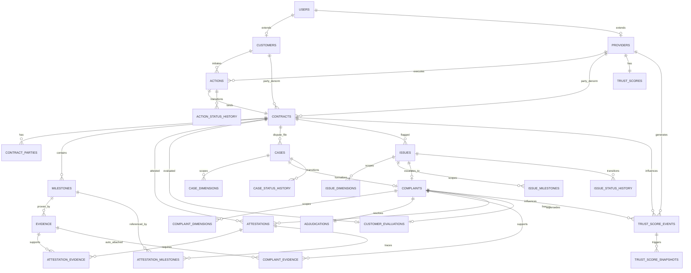

# APP13 Database Architecture v1.1

**Version:** 1.1  
**Status:** Draft — Pre-implementation  
**Last updated:** June 19, 2026  
**Supersedes:** [Database Architecture v1](./APP13-Database-Architecture-v1.md) for all P0 items below  
**Applies review:** [Database Architecture Review v1](./APP13-Database-Architecture-Review-v1.md)  
**Depends on:** [Core Principles v1](../APP13-Core-Principles-v1.md) · [Entity Model v1](../APP13-Entity-Model-v1.md) · [State Machine v1](../APP13-State-Machine-v1.md) · [Trust Engine v1.1](../APP13-Trust-Engine-v1.1.md) · [Contract Engine v1](../APP13-Contract-Engine-v1.md) · [Action Taxonomy v1](../APP13-Action-Taxonomy-v1.md) · [ADR-001](./adr/ADR-001-Action-Only.md) · [ADR-002](./adr/ADR-002-Complaint-Origin.md) · [ADR-003](./adr/ADR-003-Trust-Authority.md)

---

## Document purpose

This document defines the **logical database architecture** for APP13 MVP — domains, schemas, tables, keys, constraints, indexes, and migration strategy.

**No SQL is included.** Implementation migrations follow this spec in a separate deliverable.

**Constitutional chain preserved in storage:**

```
Action → Contract → Execution → Trust → Complaint
```

---

## Change summary (v1 → v1.1)

All changes apply **P0 fixes only** from [Database Architecture Review v1](./APP13-Database-Architecture-Review-v1.md). P1 and P2 items are **not** implemented.

| ID | Category | v1.1 resolution |
|----|----------|-----------------|
| **P0-E1** | Missing entity | Add `complaint_dimensions` junction with denormalized `contract_id` for EL-6 partial unique |
| **P0-E2** | Missing entity | Add `issue_dimensions`, `issue_milestones` junctions (Invariant I-1) |
| **P0-E3** | Missing entity | Add `action_status_history` |
| **P0-E4** | Missing entity | Add `issue_status_history`, `case_status_history` |
| **P0-F1** | Missing FK | Add `complaints.issue_id → issues.id` |
| **P0-F2** | Missing FK | Document `milestones.frozen_by_complaint_id → complaints.id`; defer FK to M7b |
| **P0-F3** | Missing FK | Add FK `trust_score_events.contract_id → contracts.id` |
| **P0-F4** | Missing FK | Add `contract_id` on `attestation_evidence`; DB trigger for cross-contract consistency |
| **P0-F5** | Missing FK | Add `attestation_milestones` junction (Trust v1.1 milestone_ids) |
| **P0-C1** | Circular dependency | Two-phase DDL: M5 without complaint FKs; M7b adds deferred FKs |
| **P0-C2** | Circular dependency | Document runtime lock order for complaint-close transaction |
| **P0-P1** | Performance | EL-6 enforced via `complaint_dimensions` partial unique (replaces broken JSONB index) |
| **P0-P2** | Performance | EL-6 analog on issues via `issue_dimensions`; cases via `case_dimensions` |
| **P0-A1** | Audit | Status history for Action, Issue, Case (Law 24) |
| **P0-A2** | Audit | Add `complaints.dismissed_reason_code` |
| **P0-T1** | Trust | Full `customer_evaluations` column spec |
| **P0-T2** | Trust | Full `trust_score_snapshots` column spec |
| **P0-T3** | Trust | Add `idempotency_key UNIQUE` on `trust_score_events` and `domain_outbox` |
| **P0-T4** | Trust | Add `superseded_at`, `superseded_by_complaint_id` on `customer_evaluations` |
| **P0-CE1** | Contract | Denormalize `customer_id`, `provider_id` on `contracts` at activation |
| **P0-CE2** | Contract | Add `uq_milestones_contract_sequence_session` for recurring sessions |
| **P0-CM1** | Complaint | CK-9 forbids generic `resolved` status; require `resolved_*` substates |
| **P0-CM2** | Complaint | Add `execution_evidence_id` FK on `complaint_evidence` with source CHECK |
| **P0-CM3** | Complaint | Full `adjudications` column spec |
| **P0-EV1** | Evidence | CK-2 elevated to **required DB trigger** (Law 11) |
| **P0-EV2** | Evidence | Required `uq_evidence_contract_content_hash` partial unique |
| **P0-M1** | MVP simplification | Polymorphic `source_entity_id` documented as signed-off |
| **P0-M2** | MVP simplification | Taxonomy/templates remain deployment artifacts |
| **P0-M3** | MVP simplification | Single role per user (application-only) documented |

**Table count:** 28 → **36** (+8 tables)

---

## 1. Architecture principles

| Principle | Source | Database implication |
|-----------|--------|----------------------|
| Actions are the only contractable unit | ADR-001 | No `services`, `listings`, `gigs`, `skus` tables |
| Every Complaint originates from a Contract | ADR-002 | `complaints.contract_id NOT NULL` |
| Trust is event-generated, not manual | ADR-003 | Append-only trust events; projection table; idempotency keys |
| Immutable audit record | Law 24 | Status history on **all six** state machines + audit_events |
| Engine ownership | Architecture | Schema boundaries map to engine write authority |
| MVP modular monolith | Roadmap | Single PostgreSQL database; multiple schemas |
| UUID primary keys | Entity Model v1 | All PKs are UUID v4 |
| Enums in application layer | Entity Model v1 | Status columns as `TEXT` + check constraints at migration time |
| Dimension normalization | Review P0-P1/P0-P2 | EL-6 enforced via junction tables, not JSONB arrays |

### 1.1 MVP simplifications (signed off — P0-M1–M3)

| ID | Simplification | Mitigation |
|----|----------------|------------|
| **P0-M1** | Polymorphic `source_entity_id` on trust events — no typed FK per entity | `idempotency_key` + JSON Schema validation on ingest |
| **P0-M2** | Taxonomy codes and contract templates are deployment artifacts, not DB tables | Admin template editing deferred |
| **P0-M3** | Single role per user (CK-8 application-only) | Dual-role users require separate accounts in MVP |

---

## 2. Database domains

### 2.1 Domain map

```mermaid
flowchart TB
    subgraph identity [identity schema]
        U[users]
        C[customers]
        P[providers]
        CO[companies]
        V[verifications]
        CR[credentials]
    end

    subgraph action [action schema]
        A[actions]
        ASH[action_status_history]
    end

    subgraph contract [contract schema]
        CT[contracts]
        CP[contract_parties]
        CSH[contract_status_history]
    end

    subgraph execution [execution schema]
        M[milestones]
        E[evidence]
        AT[attestations]
        AE[attestation_evidence]
        AM[attestation_milestones]
        CE[customer_evaluations]
        MSH[milestone_status_history]
    end

    subgraph complaint [complaint schema]
        CS[cases]
        CD[case_dimensions]
        I[issues]
        ID[issue_dimensions]
        IM[issue_milestones]
        CM[complaints]
        CMD[complaint_dimensions]
        CME[complaint_evidence]
        AD[adjudications]
        MR[mediation_records]
        CMSH[complaint_status_history]
        ISH[issue_status_history]
        CASH[case_status_history]
    end

    subgraph trust [trust schema]
        TS[trust_scores]
        TSE[trust_score_events]
        TSS[trust_score_snapshots]
        TSEC[trust_score_event_corrections]
    end

    subgraph platform [platform schema]
        AEV[audit_events]
        DO[domain_outbox]
    end

    A --> CT
    CT --> M
    M --> E
    CT --> AT
    AT --> AE
    AT --> AM
    CT --> CE
    CT --> CM
    CS --> CM
    I --> CS
    CM --> CMD
    I --> ID
    I --> IM
    CS --> CD
    P --> TS
    TSE --> TSS
    CT --> TSE
    CM --> TSE
```



### 2.2 Domain responsibilities

| Domain | PostgreSQL schema | Owner engine | Write authority |
|--------|-------------------|--------------|-----------------|
| **Identity** | `identity` | Identity Engine | Users, profiles, verification, credentials |
| **Action** | `action` | Action Engine | Action instances, TEKRR profile, action status history |
| **Contract** | `contract` | Contract Engine | Contracts, parties, contract status history |
| **Execution** | `execution` | Action Engine | Milestones, evidence, attestations, evaluations |
| **Complaint** | `complaint` | Complaint Engine | Cases, issues, complaints, adjudication, dimension junctions |
| **Trust** | `trust` | Trust Engine (Scoring Service) | Scores, events, snapshots, corrections |
| **Platform** | `platform` | Platform / all engines | Audit, outbox |

### 2.3 Explicitly excluded tables (constitutional)

| Forbidden table | Reason |
|-----------------|--------|
| `services` | ADR-001 — not a tradable unit |
| `listings` | ADR-001 |
| `gigs` | ADR-001 |
| `skus` | ADR-001 / Law 1 |
| `product_catalog` | Marketplace semantics |
| `reviews` (standalone) | Law 15 — use `customer_evaluations` |
| `payments`, `escrow_accounts` | MVP Scope exclusion — readiness fields on `contracts` only |

---

## 3. Schemas

### 3.1 Single database, multi-schema (MVP)

| Schema | Purpose |
|--------|---------|
| `identity` | Actors, verification, credentials |
| `action` | Action instances + status history |
| `contract` | Binding and lifecycle |
| `execution` | Milestones, evidence, attestations |
| `complaint` | Dispute resolution + dimension junctions |
| `trust` | Event-sourced trust |
| `platform` | Cross-cutting infrastructure |

### 3.2 Cross-schema references

- Foreign keys **allowed across schemas** within the same database.
- Cross-schema writes in one transaction for lifecycle transitions.
- **Runtime lock order** (P0-C2) for complaint-close transaction:

```
1. complaint.complaints          (FOR UPDATE)
2. complaint.adjudications       (FOR UPDATE)
3. execution.attestations        (FOR UPDATE)
4. trust.trust_score_events      (INSERT append-only)
```

Prevents deadlock when Complaint Engine updates attestations while attestations FK to complaints.

### 3.3 Reference data (non-schema)

Action taxonomy codes and contract templates are **deployment artifacts** (JSON/YAML packs), not mutable runtime tables in MVP (P0-M2).

---

## 4. Naming conventions

| Element | Convention | Example |
|---------|------------|---------|
| Schema | lowercase engine name | `contract` |
| Table | plural snake_case | `contract_parties` |
| Junction table | `{parent}_{child}` or `{entity}_{entity}` | `complaint_dimensions` |
| Primary key | `id` UUID | `id` |
| Foreign key column | `{entity}_id` | `contract_id` |
| Denormalized FK | same pattern, populated at write | `contract_id` on junction rows |
| Idempotency | `idempotency_key TEXT UNIQUE` | Event/outbox dedup |
| Append-only tables | no `updated_at` | `trust_score_events`, `*_status_history` |

Entity Model v1 names remain authoritative for MVP implementation.

---

## 5. Table inventory

### 5.1 Identity domain (`identity` schema) — 7 tables

| Table | Purpose | MVP |
|-------|---------|:---:|
| `users` | Root authentication identity | ✓ |
| `customers` | Customer profile extension | ✓ |
| `providers` | Provider profile extension | ✓ |
| `companies` | Organization stub | ✓ |
| `verifications` | Tier verification history | ✓ |
| `verification_documents` | KYC / credential documents | ✓ |
| `credentials` | Provider trade credentials | ✓ |

### 5.2 Action domain (`action` schema) — 2 tables

| Table | Purpose | MVP |
|-------|---------|:---:|
| `actions` | Classified work instance + TEKRR profile | ✓ |
| `action_status_history` | Append-only action transitions (Law 24) | ✓ **new** |

### 5.3 Contract domain (`contract` schema) — 3 tables

| Table | Purpose | MVP |
|-------|---------|:---:|
| `contracts` | Legal binding of Action + denormalized party IDs | ✓ |
| `contract_parties` | Party acceptance audit (Law 9) | ✓ |
| `contract_status_history` | Append-only status transitions (Law 24) | ✓ |

### 5.4 Execution domain (`execution` schema) — 8 tables

| Table | Purpose | MVP |
|-------|---------|:---:|
| `milestones` | Execution checkpoints | ✓ |
| `evidence` | Milestone-bound proof artifacts | ✓ |
| `attestations` | Per-dimension fulfillment (Law 13) | ✓ |
| `attestation_evidence` | Junction: attestation ↔ evidence | ✓ |
| `attestation_milestones` | Junction: attestation ↔ milestones | ✓ **new** |
| `customer_evaluations` | Structured post-completion eval | ✓ |
| `milestone_status_history` | Milestone transition audit | ✓ |

### 5.5 Complaint domain (`complaint` schema) — 14 tables

| Table | Purpose | MVP |
|-------|---------|:---:|
| `cases` | Dispute file container (SLA) | ✓ |
| `case_dimensions` | Normalized TEKRR dimensions per case | ✓ **new** |
| `case_status_history` | Append-only case transitions (Law 24) | ✓ **new** |
| `issues` | Pre-formal execution flags | ✓ |
| `issue_dimensions` | Normalized TEKRR dimensions per issue | ✓ **new** |
| `issue_milestones` | Milestone scope per issue | ✓ **new** |
| `issue_status_history` | Append-only issue transitions (Law 24) | ✓ **new** |
| `complaints` | Formal disputes (ADR-002) | ✓ |
| `complaint_dimensions` | Normalized TEKRR dimensions per complaint (EL-6) | ✓ **new** |
| `complaint_evidence` | Party + auto-attached dispute evidence | ✓ |
| `adjudications` | Adjudication record (1:1 complaint) | ✓ |
| `mediation_records` | Mediation proposals | ✓ |
| `complaint_status_history` | Append-only complaint transitions | ✓ |

### 5.6 Trust domain (`trust` schema) — 4 tables

| Table | Purpose | MVP |
|-------|---------|:---:|
| `trust_scores` | Computed projection (ADR-003) | ✓ |
| `trust_score_events` | Append-only trust inputs + idempotency | ✓ |
| `trust_score_snapshots` | Point-in-time on recompute | ✓ |
| `trust_score_event_corrections` | Appeal corrections (append) | ✓ |

### 5.7 Platform domain (`platform` schema) — 2 tables

| Table | Purpose | MVP |
|-------|---------|:---:|
| `audit_events` | Cross-engine audit log | ✓ |
| `domain_outbox` | Transactional outbox + idempotency | ✓ |

**Total MVP tables: 36**

---

## 6. Entity mappings

### 6.1 State machine → table mapping

| State Machine entity | Primary table | Status history table | Dimension junction |
|---------------------|---------------|---------------------|-------------------|
| Action | `action.actions` | `action.action_status_history` | — |
| Contract | `contract.contracts` | `contract.contract_status_history` | — |
| Milestone | `execution.milestones` | `execution.milestone_status_history` | — |
| Issue | `complaint.issues` | `complaint.issue_status_history` | `complaint.issue_dimensions`, `complaint.issue_milestones` |
| Case | `complaint.cases` | `complaint.case_status_history` | `complaint.case_dimensions` |
| Complaint | `complaint.complaints` | `complaint.complaint_status_history` | `complaint.complaint_dimensions` |
| Trust Score | `trust.trust_scores` | via `trust_score_events` + snapshots | — |

### 6.2 Trust Engine v1.1 → table mapping

| Trust entity | Table | v1.1 change |
|--------------|-------|-------------|
| Attestation | `execution.attestations` | + `attestation_milestones` junction |
| CustomerEvaluation | `execution.customer_evaluations` | Full column spec; supersession FKs |
| TrustScoreEvent | `trust.trust_score_events` | + `idempotency_key`, FK on `contract_id` |
| TrustScoreSnapshot | `trust.trust_score_snapshots` | Full column spec |
| Domain outbox | `platform.domain_outbox` | + `idempotency_key` |

### 6.3 Cardinality rules (updated)

```
User ──1:1──▶ Customer (optional)
User ──1:1──▶ Provider (optional)
Provider ──1:1──▶ TrustScore

Customer ──1:N──▶ Action ◀──N:1── Provider
Action ──1:1──▶ Contract
Contract ──1:N──▶ Milestone ──1:N──▶ Evidence
Contract ──1:N──▶ Attestation ──N:M──▶ Evidence (via attestation_evidence)
Attestation ──N:M──▶ Milestone (via attestation_milestones)
Contract ──1:N──▶ Case ──0..1──▶ Complaint
Issue ──0..1──▶ Case
Issue ──0..1──▶ Complaint (via complaints.issue_id)
Complaint ──1:N──▶ ComplaintDimension (EL-6 enforcement)
Issue ──1:N──▶ IssueDimension / IssueMilestone
Case ──1:N──▶ CaseDimension
Complaint ──1:1──▶ Adjudication
Complaint ──1:N──▶ ComplaintEvidence
```

---

## 7. Primary keys

| Rule | Detail |
|------|--------|
| **PK-1** | Every table has `id UUID PRIMARY KEY` |
| **PK-2** | UUID v4 via application or `gen_random_uuid()` |
| **PK-3** | No composite PKs on entity tables |
| **PK-4** | Junction tables use surrogate `id` UUID |
| **PK-5** | Human-readable numbers are **unique**, not PK |
| **PK-6** | `idempotency_key` is UNIQUE, not PK |

---

## 8. Foreign keys

### 8.1 Core relationship FKs

| Child table | Column | Parent table | On delete | Phase |
|-------------|--------|--------------|-----------|-------|
| `identity.customers` | `user_id` | `identity.users` | RESTRICT | M1 |
| `identity.providers` | `user_id` | `identity.users` | RESTRICT | M1 |
| `identity.customers` | `company_id` | `identity.companies` | SET NULL | M1 |
| `identity.verifications` | `user_id` | `identity.users` | RESTRICT | M2 |
| `identity.verification_documents` | `verification_id` | `identity.verifications` | RESTRICT | M2 |
| `identity.credentials` | `provider_id` | `identity.providers` | RESTRICT | M2 |
| `identity.credentials` | `verification_id` | `identity.verifications` | RESTRICT | M2 |
| `action.actions` | `customer_id` | `identity.customers` | RESTRICT | M3 |
| `action.actions` | `provider_id` | `identity.providers` | SET NULL | M3 |
| `action.actions` | `company_id` | `identity.companies` | SET NULL | M3 |
| `action.action_status_history` | `action_id` | `action.actions` | RESTRICT | M3 |
| `contract.contracts` | `action_id` | `action.actions` | RESTRICT | M4 |
| `contract.contracts` | `customer_id` | `identity.customers` | RESTRICT | M4 |
| `contract.contracts` | `provider_id` | `identity.providers` | RESTRICT | M4 |
| `contract.contract_parties` | `contract_id` | `contract.contracts` | RESTRICT | M4 |
| `contract.contract_parties` | `user_id` | `identity.users` | RESTRICT | M4 |
| `contract.contract_status_history` | `contract_id` | `contract.contracts` | RESTRICT | M4 |
| `execution.milestones` | `contract_id` | `contract.contracts` | RESTRICT | M5 |
| `execution.milestones` | `frozen_by_complaint_id` | `complaint.complaints` | SET NULL | **M7b** |
| `execution.evidence` | `contract_id` | `contract.contracts` | RESTRICT | M5 |
| `execution.evidence` | `milestone_id` | `execution.milestones` | RESTRICT | M5 |
| `execution.evidence` | `submitted_by_user_id` | `identity.users` | RESTRICT | M5 |
| `execution.attestations` | `contract_id` | `contract.contracts` | RESTRICT | M5 |
| `execution.attestations` | `attested_by_user_id` | `identity.users` | RESTRICT | M5 |
| `execution.attestations` | `frozen_by_complaint_id` | `complaint.complaints` | SET NULL | **M7b** |
| `execution.attestation_evidence` | `attestation_id` | `execution.attestations` | RESTRICT | M5 |
| `execution.attestation_evidence` | `evidence_id` | `execution.evidence` | RESTRICT | M5 |
| `execution.attestation_evidence` | `contract_id` | `contract.contracts` | RESTRICT | M5 |
| `execution.attestation_milestones` | `attestation_id` | `execution.attestations` | RESTRICT | M5 |
| `execution.attestation_milestones` | `milestone_id` | `execution.milestones` | RESTRICT | M5 |
| `execution.attestation_milestones` | `contract_id` | `contract.contracts` | RESTRICT | M5 |
| `execution.customer_evaluations` | `contract_id` | `contract.contracts` | RESTRICT | M5 |
| `execution.customer_evaluations` | `submitted_by_user_id` | `identity.users` | RESTRICT | M5 |
| `execution.customer_evaluations` | `superseded_by_complaint_id` | `complaint.complaints` | SET NULL | **M7b** |
| `complaint.cases` | `contract_id` | `contract.contracts` | RESTRICT | M7 |
| `complaint.cases` | `issue_id` | `complaint.issues` | SET NULL | M7 |
| `complaint.case_dimensions` | `case_id` | `complaint.cases` | RESTRICT | M7 |
| `complaint.case_dimensions` | `contract_id` | `contract.contracts` | RESTRICT | M7 |
| `complaint.case_status_history` | `case_id` | `complaint.cases` | RESTRICT | M7 |
| `complaint.issues` | `contract_id` | `contract.contracts` | RESTRICT | M7 |
| `complaint.issues` | `case_id` | `complaint.cases` | SET NULL | M7 |
| `complaint.issues` | `filed_by_user_id` | `identity.users` | RESTRICT | M7 |
| `complaint.issue_dimensions` | `issue_id` | `complaint.issues` | RESTRICT | M7 |
| `complaint.issue_dimensions` | `contract_id` | `contract.contracts` | RESTRICT | M7 |
| `complaint.issue_milestones` | `issue_id` | `complaint.issues` | RESTRICT | M7 |
| `complaint.issue_milestones` | `milestone_id` | `execution.milestones` | RESTRICT | M7 |
| `complaint.issue_milestones` | `contract_id` | `contract.contracts` | RESTRICT | M7 |
| `complaint.issue_status_history` | `issue_id` | `complaint.issues` | RESTRICT | M7 |
| `complaint.complaints` | `contract_id` | `contract.contracts` | RESTRICT | M7 |
| `complaint.complaints` | `case_id` | `complaint.cases` | RESTRICT | M7 |
| `complaint.complaints` | `issue_id` | `complaint.issues` | SET NULL | M7 |
| `complaint.complaints` | `filed_by_user_id` | `identity.users` | RESTRICT | M7 |
| `complaint.complaint_dimensions` | `complaint_id` | `complaint.complaints` | RESTRICT | M7 |
| `complaint.complaint_dimensions` | `contract_id` | `contract.contracts` | RESTRICT | M7 |
| `complaint.complaint_evidence` | `complaint_id` | `complaint.complaints` | RESTRICT | M7 |
| `complaint.complaint_evidence` | `execution_evidence_id` | `execution.evidence` | SET NULL | M7 |
| `complaint.adjudications` | `complaint_id` | `complaint.complaints` | RESTRICT | M7 |
| `complaint.adjudications` | `decided_by_user_id` | `identity.users` | RESTRICT | M7 |
| `complaint.mediation_records` | `complaint_id` | `complaint.complaints` | RESTRICT | M7 |
| `complaint.complaint_status_history` | `complaint_id` | `complaint.complaints` | RESTRICT | M7 |
| `trust.trust_scores` | `provider_id` | `identity.providers` | RESTRICT | M6 |
| `trust.trust_score_events` | `provider_id` | `identity.providers` | RESTRICT | M6 |
| `trust.trust_score_events` | `contract_id` | `contract.contracts` | RESTRICT | M6 |
| `trust.trust_score_snapshots` | `provider_id` | `identity.providers` | RESTRICT | M6 |
| `trust.trust_score_snapshots` | `triggering_event_id` | `trust.trust_score_events` | SET NULL | M6 |
| `trust.trust_score_event_corrections` | `original_event_id` | `trust.trust_score_events` | RESTRICT | M6 |
| `trust.trust_score_event_corrections` | `admin_user_id` | `identity.users` | RESTRICT | M6 |

### 8.2 Two-phase DDL for execution ↔ complaint cycle (P0-C1)

| Phase | Scope |
|-------|-------|
| **M5** | Create `milestones`, `attestations` with `frozen_by_complaint_id UUID` column **without FK** |
| **M7** | Create all complaint tables |
| **M7b** | Add deferred FKs: `milestones.frozen_by_complaint_id`, `attestations.frozen_by_complaint_id`, `customer_evaluations.superseded_by_complaint_id` |

### 8.3 On delete policy (constitutional)

| Data class | Policy | Reason |
|------------|--------|--------|
| Contractual records | **RESTRICT** | Law 24 |
| Trust events | **RESTRICT** | ADR-003 |
| Status history | **RESTRICT** | Law 24 |
| Optional affiliations | SET NULL | Soft unlink |

---

## 9. Constraints

### 9.1 Uniqueness constraints

| Table | Constraint | Rule |
|-------|------------|------|
| `identity.users` | `uq_users_email` | email unique (lowercase) |
| `identity.customers` | `uq_customers_user_id` | one customer per user (MVP) |
| `identity.providers` | `uq_providers_user_id` | one provider per user (MVP) |
| `contract.contracts` | `uq_contracts_action_id` | 1:1 Action–Contract MVP |
| `contract.contracts` | `uq_contracts_contract_number` | human reference |
| `contract.contract_parties` | `uq_contract_parties_contract_user_role` | one row per party role |
| `execution.milestones` | `uq_milestones_contract_sequence_session` | `(contract_id, sequence_order, session_index)` |
| `execution.attestations` | `uq_attestations_contract_dimension` | one attestation per dimension |
| `execution.customer_evaluations` | `uq_customer_evaluations_contract_id` | one eval per contract |
| `execution.evidence` | `uq_evidence_contract_content_hash` | `(contract_id, content_hash)` WHERE content_hash IS NOT NULL |
| `complaint.cases` | `uq_cases_case_number` | platform-wide case number |
| `complaint.adjudications` | `uq_adjudications_complaint_id` | one adjudication per complaint |
| `trust.trust_scores` | `uq_trust_scores_provider_id` | one score per provider |
| `trust.trust_score_events` | `uq_trust_score_events_idempotency_key` | dedup on ingest |
| `platform.domain_outbox` | `uq_domain_outbox_idempotency_key` | dedup on dispatch |

### 9.2 Check / business constraints

| ID | Table | Constraint |
|----|-------|------------|
| **CK-1** | `complaint.complaints` | `contract_id IS NOT NULL` — ADR-002 |
| **CK-2** | `execution.evidence` | `contract_id` matches milestone's contract — **required DB trigger** (P0-EV1) |
| **CK-3** | `execution.attestations` | ≥1 row in `attestation_evidence` when rating ∉ (`PEN`) — Law 13 |
| **CK-4** | `action.actions` | `action_code` ∈ taxonomy registry — Application |
| **CK-5** | `contract.contracts` | `tekrr_snapshot` immutable after `activated_at` — Application |
| **CK-6** | `trust.trust_scores` | no direct UPDATE on score columns except recompute job — ADR-003 |
| **CK-7** | `complaint.complaints` | ≥1 row in `complaint_dimensions` at filing — Law 20 |
| **CK-8** | `identity.users` | MVP: not both customer and provider on same user — Application (P0-M3) |
| **CK-9** | `complaint.complaints` | `status NOT IN ('resolved')` — generic `resolved` forbidden; use `resolved_*` substates only (P0-CM1) |
| **CK-10** | `execution.attestation_evidence` | `contract_id` = attestation.contract_id = evidence.contract_id — DB trigger |
| **CK-11** | `contract.contracts` | At activation: `customer_id`/`provider_id` match linked `action.customer_id`/`action.provider_id` — DB trigger |
| **CK-12** | `complaint.complaint_evidence` | When `evidence_source = 'auto_attached'`: `execution_evidence_id IS NOT NULL` AND `storage_key IS NULL`; when `evidence_source = 'party'`: inverse (P0-CM2) |
| **CK-13** | `complaint.issues` | ≥1 row in `issue_dimensions` OR `issue_milestones` — Invariant I-1 |

### 9.3 Partial unique indexes (active records — EL-6)

Replaces v1 broken JSONB-based partial uniques.

| Index | Table | Rule |
|-------|-------|------|
| `uq_complaint_dimensions_active` | `complaint_dimensions` | UNIQUE `(contract_id, tekrr_dimension)` WHERE complaint.status NOT IN (`dismissed`, `closed`) — via join or denormalized `complaint_status` on junction |
| `uq_issue_dimensions_active` | `issue_dimensions` | UNIQUE `(contract_id, tekrr_dimension)` WHERE issue.status NOT IN (`resolved_informally`, `withdrawn`, `expired`, `escalated`) |
| `uq_case_dimensions_active` | `case_dimensions` | UNIQUE `(contract_id, tekrr_dimension)` WHERE case.status NOT IN (`closed`, `withdrawn`) |

**Implementation note:** Junction rows carry denormalized `contract_id` and optionally cached parent `status` for partial index evaluation without join.

---

## 10. Indexes

### 10.1 New / updated indexes (v1.1)

| Table | Index | Purpose |
|-------|-------|---------|
| `contracts` | `idx_contracts_customer_id` | Direct party queries (P0-CE1) |
| `contracts` | `idx_contracts_provider_id` | Direct party queries + collusion baseline |
| `complaint_dimensions` | `idx_complaint_dimensions_contract_dimension` | EL-6 lookup |
| `issue_dimensions` | `idx_issue_dimensions_contract_dimension` | Active issue lookup |
| `case_dimensions` | `idx_case_dimensions_contract_dimension` | Active case lookup |
| `complaints` | `idx_complaints_issue_id` | Escalation chain |
| `trust_score_events` | `uq_trust_score_events_idempotency_key` UNIQUE | Dedup |
| `domain_outbox` | `uq_domain_outbox_idempotency_key` UNIQUE | Dedup |
| `evidence` | `uq_evidence_contract_content_hash` UNIQUE partial | Duplicate rejection (P0-EV2) |
| `action_status_history` | `idx_action_status_history_action_created` | Audit trail |
| `issue_status_history` | `idx_issue_status_history_issue_created` | Audit trail |
| `case_status_history` | `idx_case_status_history_case_created` | Audit trail |
| `attestation_milestones` | `idx_attestation_milestones_attestation_id` | Trust payload assembly |

All v1 indexes not superseded above remain in effect.

---

## 11. Event tables

### 11.1 Trust events (`trust.trust_score_events`)

| Column | Type | Notes |
|--------|------|-------|
| `id` | UUID | PK |
| `provider_id` | UUID | FK → providers |
| `event_type` | TEXT | Canonical `trust.*` namespace |
| `source_entity_type` | TEXT | Polymorphic (P0-M1) |
| `source_entity_id` | UUID | Polymorphic (P0-M1) |
| `contract_id` | UUID | FK → contracts (nullable) |
| `payload` | JSONB | Schema-validated per event_type |
| `score_version` | TEXT | `trust_score_v1` |
| `idempotency_key` | TEXT | UNIQUE — dedup on ingest (P0-T3) |
| `occurred_at` | TIMESTAMPTZ | Business time |
| `created_at` | TIMESTAMPTZ | Ingestion time |

**Rules (ADR-003):** No UPDATE/DELETE. Corrections via `trust_score_event_corrections`.

### 11.2 Trust snapshots (`trust.trust_score_snapshots`) — P0-T2

| Column | Type | Required | Notes |
|--------|------|:--------:|-------|
| `id` | UUID | Yes | PK |
| `provider_id` | UUID | Yes | FK → providers |
| `score` | INT | Yes | 0–1000 composite |
| `score_version` | TEXT | Yes | e.g. `trust_score_v1` |
| `execution_score` | INT | Yes | Exposed separately |
| `execution_score_version` | TEXT | Yes | `execution_score_v1` |
| `component_scores` | JSONB | Yes | `{verification, execution, time, complaints, evaluation}` |
| `dimension_scores` | JSONB | No | Per TEKRR breakdown |
| `record_state` | TEXT | Yes | Snapshot of trust record state |
| `triggering_event_id` | UUID | No | FK → trust_score_events |
| `computed_at` | TIMESTAMPTZ | Yes | Append-only |

### 11.3 Domain outbox (`platform.domain_outbox`)

| Column | Type | Notes |
|--------|------|-------|
| `id` | UUID | PK |
| `event_type` | TEXT | Domain event name |
| `payload` | JSONB | |
| `engine_source` | TEXT | Emitting engine |
| `idempotency_key` | TEXT | UNIQUE (P0-T3) |
| `published_at` | TIMESTAMPTZ | NULL until dispatched |
| `created_at` | TIMESTAMPTZ | Enqueue time |

### 11.4 Status history tables (complete set — P0-A1)

| Table | Parent | Schema |
|-------|--------|--------|
| `action_status_history` | actions | action |
| `contract_status_history` | contracts | contract |
| `milestone_status_history` | milestones | execution |
| `issue_status_history` | issues | complaint |
| `case_status_history` | cases | complaint |
| `complaint_status_history` | complaints | complaint |

Columns (all): `from_status`, `to_status`, `actor_user_id`, `reason`, `created_at`.

---

## 12. Trust tables (detail)

### 12.1 `trust.trust_scores` (projection)

Unchanged from v1 except constitutional compliance now includes idempotency at event layer.

### 12.2 `execution.customer_evaluations` — P0-T1, P0-T4

| Column | Type | Required | Notes |
|--------|------|:--------:|-------|
| `id` | UUID | Yes | PK |
| `contract_id` | UUID | Yes | FK → contracts, UNIQUE |
| `submitted_by_user_id` | UUID | Yes | FK → users |
| `eval_form_id` | TEXT | Yes | e.g. `EVAL-B-v1` |
| `dimension_scores` | JSONB | Yes | Mapped T/E/K/R/S |
| `composite_score` | INT | Yes | 0–1000 |
| `submitted_at` | TIMESTAMPTZ | Yes | |
| `superseded_at` | TIMESTAMPTZ | No | Set when adjudication invalidates eval (P0-T4) |
| `superseded_by_complaint_id` | UUID | No | FK → complaints (M7b) |
| `created_at` | TIMESTAMPTZ | Yes | |
| `updated_at` | TIMESTAMPTZ | Yes | |

---

## 13. Contract tables (detail)

### 13.1 `contract.contracts` — P0-CE1

Key columns (additions in **bold**):

| Column | Notes |
|--------|-------|
| `action_id` | UNIQUE — ADR-001 1:1 |
| **`customer_id`** | **FK → customers; denormalized from action at activation** |
| **`provider_id`** | **FK → providers; denormalized from action at activation** |
| `status` | State Machine v1 enum |
| `tekrr_snapshot` | JSONB immutable post-active |
| `verification_snapshot` | JSONB at activation |
| `commercial_terms` | JSONB declarative |
| `document_hash`, `pdf_storage_key` | Deliverables |
| `payment_ready`, `escrow_ready` | BOOLEAN default false |
| `complaint_window_ends_at` | Set on completed |
| `template_id`, `template_version`, `jurisdiction_pack` | Law 8 |
| `activated_at`, `completed_at` | Lifecycle timestamps |

**CK-11:** On activation, `customer_id` and `provider_id` must match the linked action's party IDs (DB trigger).

---

## 14. Complaint tables (detail)

### 14.1 `complaint.complaints` — P0-A2, P0-CM1

| Column | Notes |
|--------|-------|
| `contract_id` | **NOT NULL** — ADR-002 |
| `case_id` | FK |
| **`issue_id`** | **FK nullable — escalation from issue (P0-F1)** |
| `tekrr_dimensions` | JSONB array — **cache only**; authoritative dimensions in `complaint_dimensions` |
| `complaint_types` | JSONB array |
| `status` | Granular states only — **`resolved` forbidden (CK-9)** |
| `outcome`, `severity`, `fault_party` | Set on resolution |
| `window_valid` | EL gate audit |
| **`dismissed_reason_code`** | **EL codes: `OUT_OF_WINDOW`, `DUPLICATE_ACTIVE`, etc. (P0-A2)** |
| `assigned_admin_user_id` | |
| `filed_at`, `triaged_at`, `resolved_at` | |

**Valid status values:** `filed`, `triage_pending`, `dismissed`, `evidence_gathering`, `mediation`, `adjudication_pending`, `resolved_mutual`, `resolved_upheld`, `resolved_dismissed`, `resolved_shared`, `escalated_external`, `pending_external`, `closed`.

### 14.2 `complaint.complaint_dimensions` — P0-E1

| Column | Notes |
|--------|-------|
| `complaint_id` | FK |
| `contract_id` | FK denormalized for EL-6 partial unique |
| `tekrr_dimension` | T/E/K/R/S |
| `created_at` | |

### 14.3 `complaint.adjudications` — P0-CM3

| Column | Type | Required | Notes |
|--------|------|:--------:|-------|
| `id` | UUID | Yes | PK |
| `complaint_id` | UUID | Yes | FK, UNIQUE |
| `findings` | TEXT | Yes | Admin narrative |
| `severity` | TEXT | Yes | `low`, `medium`, `high`, `critical` |
| `outcome` | TEXT | Yes | Maps to complaint resolution |
| `fault_party` | TEXT | Yes | `customer`, `provider`, `shared`, `none` |
| `dimension_outcomes` | JSONB | Yes | Per-dimension: `{dimension, rating, notes}` |
| `decided_by_user_id` | UUID | Yes | FK → users |
| `decided_at` | TIMESTAMPTZ | Yes | |
| `created_at` | TIMESTAMPTZ | Yes | |

### 14.4 `complaint.complaint_evidence` — P0-CM2

| Column | Notes |
|--------|-------|
| `complaint_id` | FK |
| `evidence_source` | `party`, `auto_attached`, `admin` |
| **`execution_evidence_id`** | **FK → execution.evidence; required when source = `auto_attached` (CK-12)** |
| `reference_entity_type`, `reference_entity_id` | Legacy polymorphic ref for non-evidence docs |
| `storage_key` | Party uploads; NULL when auto_attached |

### 14.5 Issue junction tables — P0-E2

**`issue_dimensions`:** `issue_id`, `contract_id` (denorm), `tekrr_dimension`

**`issue_milestones`:** `issue_id`, `milestone_id`, `contract_id` (denorm)

**CK-13:** Every issue must have ≥1 dimension row OR ≥1 milestone row.

### 14.6 `complaint.case_dimensions` — P0-P2

| Column | Notes |
|--------|-------|
| `case_id` | FK |
| `contract_id` | FK denormalized |
| `tekrr_dimension` | TEKRR code |

Replaces scalar-only `primary_dimension` for multi-dimension case enforcement. `cases.primary_dimension` may remain as display cache.

---

## 15. Evidence tables (detail)

### 15.1 `execution.evidence` — P0-EV1, P0-EV2

| Column | Notes |
|--------|-------|
| `contract_id` | FK — must match milestone's contract (**DB trigger CK-2**) |
| `milestone_id` | FK |
| `evidence_type` | EV-TS … EV-NOTE |
| `content_hash` | **Required unique per contract when not null (P0-EV2)** |
| `storage_key` | Object storage |
| `metadata` | JSONB |
| `submitted_by_user_id` | FK |
| `submitted_at` | |

### 15.2 `execution.attestation_evidence` — P0-F4

| Column | Notes |
|--------|-------|
| `attestation_id` | FK |
| `evidence_id` | FK |
| **`contract_id`** | **FK denormalized; CK-10 trigger enforces consistency** |

### 15.3 `execution.attestation_milestones` — P0-F5

| Column | Notes |
|--------|-------|
| `attestation_id` | FK |
| `milestone_id` | FK |
| `contract_id` | FK denormalized |

Replaces `milestone_ids UUID[]` on attestation row. Trust Engine reads junction for payload assembly.

---

## 16. Relationship diagram



---

## 17. Migration strategy

### 17.1 Phased migration plan (updated)

| Phase | Migration scope | Dependency |
|-------|-----------------|------------|
| **M1 — Foundation** | Schemas; `identity.*` | None |
| **M2 — Verification** | `verifications`, `verification_documents`, `credentials` | M1 |
| **M3 — Action** | `actions`, `action_status_history` | M1 |
| **M4 — Contract** | `contracts` (+ party denorm columns), `contract_parties`, `contract_status_history` | M3 |
| **M5 — Execution** | Milestones, evidence, attestations, junctions, evaluations — **complaint FK columns without FK constraint** | M4 |
| **M6 — Trust** | `trust_scores`, `trust_score_events` (+ idempotency, contract FK), snapshots, corrections | M1, M4 |
| **M7 — Complaint** | Cases, issues, complaints, dimension junctions, evidence, adjudications, mediation, all status history | M4, M5 |
| **M7b — Deferred FKs** | Add FKs: `milestones.frozen_by_complaint_id`, `attestations.frozen_by_complaint_id`, `customer_evaluations.superseded_by_complaint_id` | M7 |
| **M8 — Platform** | `audit_events`, `domain_outbox` (+ idempotency) | Any |
| **M9 — Triggers** | CK-2, CK-10, CK-11 evidence/attestation/contract consistency | After M7b |
| **M10 — Indexes** | Performance indexes, partial uniques on junction tables | After tables |
| **M11 — Seed** | Reference enums, admin user (non-prod) | M1 |

### 17.2 Required DB triggers (P0-EV1, P0-F4)

| Trigger | Table | Rule |
|---------|-------|------|
| `trg_evidence_contract_milestone_match` | `evidence` | INSERT/UPDATE: `contract_id` = milestone.contract_id |
| `trg_attestation_evidence_contract_match` | `attestation_evidence` | INSERT: attestation, evidence, junction contract_id aligned |
| `trg_contract_party_denorm` | `contracts` | UPDATE at activation: party IDs match action |

---

## 18. Constitutional compliance matrix

| Source | Database enforcement |
|--------|---------------------|
| **ADR-001** | No listing/service tables; `actions.action_code`; `contracts.action_id` UNIQUE |
| **ADR-002** | `complaints.contract_id NOT NULL`; milestone/attestation freeze FK to complaint |
| **ADR-003** | Append-only events; idempotency keys; corrections table; no score override |
| **Law 11** | Evidence requires both FKs + **DB trigger CK-2** |
| **Law 13** | `attestation_evidence` + `attestation_milestones` junctions required |
| **Law 16** | Trust projection write restricted to Scoring Service |
| **Law 19–20** | Complaint dimensions via `complaint_dimensions` junction + CK-7 |
| **Law 24** | Status history on **all six** state machines + audit_events |
| **EL-6** | Partial unique on `complaint_dimensions` junction |

---

## 19. Related documents

| Document | Relationship |
|----------|--------------|
| [Database Architecture v1](./APP13-Database-Architecture-v1.md) | Superseded for P0 items |
| [Database Architecture Review v1](./APP13-Database-Architecture-Review-v1.md) | Source of P0 fixes |
| [Trust Engine v1.1](../APP13-Trust-Engine-v1.1.md) | Trust table requirements |
| [State Machine v1](../APP13-State-Machine-v1.md) | Status enums + history requirement |

---

## 20. Next deliverables

1. **SQL migration pack M1–M11** (implementation)
2. **DB trigger spec** (companion to M9)
3. **JSON Schema** for `trust_score_events.payload`
4. **Database Architecture v1.2** — if P1 review items are approved

---

*Database Architecture v1.1 complete. P0 fixes applied. P1/P2 not implemented. No existing files were modified.*
