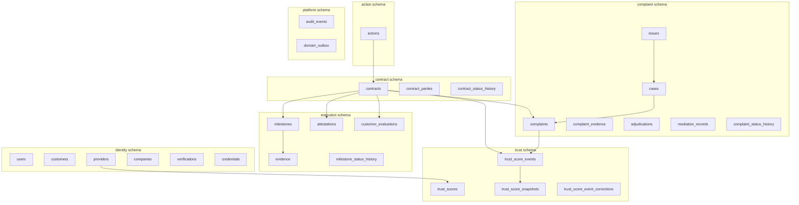
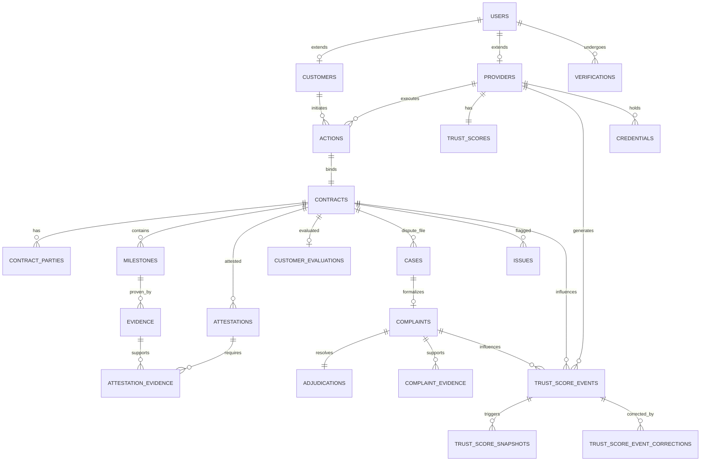

# APP13 Database Architecture v1

**Version:** 1.0  
**Status:** Draft — Pre-implementation  
**Last updated:** June 19, 2026  
**Depends on:** [Core Principles v1](../APP13-Core-Principles-v1.md) · [Entity Model v1](../APP13-Entity-Model-v1.md) · [State Machine v1](../APP13-State-Machine-v1.md) · [Trust Engine v1.1](../APP13-Trust-Engine-v1.1.md) · [Contract Engine v1](../APP13-Contract-Engine-v1.md) · [Action Taxonomy v1](../APP13-Action-Taxonomy-v1.md) · [ADR-001](./adr/ADR-001-Action-Only.md) · [ADR-002](./adr/ADR-002-Complaint-Origin.md) · [ADR-003](./adr/ADR-003-Trust-Authority.md)

---

## Document purpose

This document defines the **logical database architecture** for APP13 MVP — domains, schemas, tables, keys, constraints, indexes, and migration strategy.

**No SQL is included.** Implementation migrations follow this spec in a separate deliverable.

**Constitutional chain preserved in storage:**

```
Action → Contract → Execution → Trust → Complaint
```

---

## 1. Architecture principles

| Principle | Source | Database implication |
|-----------|--------|----------------------|
| Actions are the only contractable unit | ADR-001 | No `services`, `listings`, `gigs`, `skus` tables |
| Every Complaint originates from a Contract | ADR-002 | `complaints.contract_id NOT NULL` |
| Trust is event-generated, not manual | ADR-003 | Append-only trust events; projection table |
| Immutable audit record | Law 24 | Status history + audit_events; no hard deletes on contractual data |
| Engine ownership | Architecture | Schema boundaries map to engine write authority |
| MVP modular monolith | Roadmap | Single PostgreSQL database; multiple schemas |
| UUID primary keys | Entity Model v1 | All PKs are UUID v4 |
| Enums in application layer | Entity Model v1 | Status columns as `TEXT` + check constraints at migration time (optional) |

---

## 2. Database domains

### 2.1 Domain map



### 2.2 Domain responsibilities

| Domain | PostgreSQL schema | Owner engine | Write authority |
|--------|-------------------|--------------|-----------------|
| **Identity** | `identity` | Identity Engine | Users, profiles, verification, credentials |
| **Action** | `action` | Action Engine | Action instances, TEKRR profile |
| **Contract** | `contract` | Contract Engine | Contracts, parties, contract status history |
| **Execution** | `execution` | Action Engine | Milestones, evidence, attestations, evaluations |
| **Complaint** | `complaint` | Complaint Engine | Cases, issues, complaints, adjudication |
| **Trust** | `trust` | Trust Engine (Scoring Service) | Scores, events, snapshots, corrections |
| **Platform** | `platform` | Platform / all engines | Audit, outbox |

### 2.3 Explicitly excluded tables (constitutional)

| Forbidden table | Reason |
|-----------------|--------|
| `services` | ADR-001 — not a tradable unit |
| `listings` | ADR-001 |
| `gigs` | ADR-001 |
| `skus` | ADR-001 / Law 1 |
| `product_catalog` | Marketplace semantics |
| `reviews` (standalone) | Law 15 — use `customer_evaluations` |
| `payments`, `escrow_accounts` | MVP Scope exclusion — readiness fields on `contracts` only |

---

## 3. Schemas

### 3.1 Single database, multi-schema (MVP)

| Schema | Purpose |
|--------|---------|
| `identity` | Actors, verification, credentials |
| `action` | Action instances |
| `contract` | Binding and lifecycle |
| `execution` | Milestones, evidence, attestations |
| `complaint` | Dispute resolution |
| `trust` | Event-sourced trust |
| `platform` | Cross-cutting infrastructure |

**Rationale:** Enforces engine boundaries in a modular monolith; enables future schema-level permissions or extraction without table renames.

### 3.2 Cross-schema references

- Foreign keys **allowed across schemas** within the same database (PostgreSQL supports this).
- Each FK documents **owner schema** of the referenced table.
- Cross-schema writes in one transaction for lifecycle transitions (e.g., contract activation + milestone materialization).

### 3.3 Reference data (non-schema)

Action taxonomy codes (`A.2.1`, `B.2.1`, …) and contract templates (`CT-B.2.1@v1`) are **deployment artifacts** (JSON/YAML packs), not mutable runtime tables in MVP.

Optional future table: `platform.category_schemas` — deferred unless admin template editing is required in MVP.

---

## 4. Naming conventions

| Element | Convention | Example |
|---------|------------|---------|
| Schema | lowercase engine name | `contract` |
| Table | plural snake_case | `contract_parties` |
| Primary key | `id` UUID | `id` |
| Foreign key column | `{entity}_id` | `contract_id` |
| FK constraint | `fk_{table}_{ref_table}` | `fk_complaints_contracts` |
| Unique constraint | `uq_{table}_{columns}` | `uq_contracts_action_id` |
| Check constraint | `ck_{table}_{rule}` | `ck_complaints_contract_required` |
| Index | `idx_{table}_{columns}` | `idx_complaints_contract_status` |
| Status columns | `status TEXT NOT NULL` | Application enum validation |
| Timestamps | `created_at`, `updated_at` TIMESTAMPTZ UTC | All mutable entities |
| Soft delete | `deleted_at TIMESTAMPTZ` | `users` only (MVP) |
| JSON | `JSONB` | TEKRR, snapshots, payloads |
| Human reference | `{entity}_number` or `case_number` | `contract_number`, `case_number` |
| Event type | dotted lowercase | `trust.contract.completed` |
| Append-only tables | no `updated_at` | `trust_score_events`, `*_status_history` |

### 4.1 Naming alignment note

| Entity Model v1 | Architecture v1.0 (legacy) | **This document** |
|-----------------|---------------------------|-------------------|
| `users` | `actors` | `identity.users` |
| `customers` | `customer_profiles` | `identity.customers` |
| `providers` | `provider_profiles` | `identity.providers` |
| `actions` | `engagements` | `action.actions` |
| `trust_scores` | `trust_profiles` | `trust.trust_scores` |
| `trust_score_events` | `score_events` | `trust.trust_score_events` |

Entity Model v1 names are authoritative for MVP implementation.

---

## 5. Table inventory

### 5.1 Identity domain (`identity` schema)

| Table | Purpose | MVP |
|-------|---------|:---:|
| `users` | Root authentication identity | ✓ |
| `customers` | Customer profile extension | ✓ |
| `providers` | Provider profile extension | ✓ |
| `companies` | Organization stub | ✓ |
| `verifications` | Tier verification history | ✓ |
| `verification_documents` | KYC / credential documents | ✓ |
| `credentials` | Provider trade credentials | ✓ |

### 5.2 Action domain (`action` schema)

| Table | Purpose | MVP |
|-------|---------|:---:|
| `actions` | Classified work instance + TEKRR profile | ✓ |

### 5.3 Contract domain (`contract` schema)

| Table | Purpose | MVP |
|-------|---------|:---:|
| `contracts` | Legal binding of Action | ✓ |
| `contract_parties` | Party acceptance audit (Law 9) | ✓ |
| `contract_status_history` | Append-only status transitions (Law 24) | ✓ |

### 5.4 Execution domain (`execution` schema)

| Table | Purpose | MVP |
|-------|---------|:---:|
| `milestones` | Execution checkpoints | ✓ |
| `evidence` | Milestone-bound proof artifacts | ✓ |
| `attestations` | Per-dimension fulfillment (Law 13) | ✓ |
| `attestation_evidence` | Junction: attestation ↔ evidence | ✓ |
| `customer_evaluations` | Structured post-completion eval | ✓ |
| `milestone_status_history` | Milestone transition audit | ✓ |

### 5.5 Complaint domain (`complaint` schema)

| Table | Purpose | MVP |
|-------|---------|:---:|
| `cases` | Dispute file container (SLA) | ✓ |
| `issues` | Pre-formal execution flags | ✓ |
| `complaints` | Formal disputes (ADR-002) | ✓ |
| `complaint_evidence` | Party + auto-attached dispute evidence | ✓ |
| `adjudications` | Adjudication record (1:1 complaint) | ✓ |
| `mediation_records` | Mediation proposals | ✓ |
| `complaint_status_history` | Append-only complaint transitions | ✓ |

### 5.6 Trust domain (`trust` schema)

| Table | Purpose | MVP |
|-------|---------|:---:|
| `trust_scores` | Computed projection (ADR-003) | ✓ |
| `trust_score_events` | Append-only trust inputs | ✓ |
| `trust_score_snapshots` | Point-in-time on recompute | ✓ |
| `trust_score_event_corrections` | Appeal corrections (append) | ✓ |

### 5.7 Platform domain (`platform` schema)

| Table | Purpose | MVP |
|-------|---------|:---:|
| `audit_events` | Cross-engine audit log | ✓ |
| `domain_outbox` | Transactional outbox | ✓ |

**Total MVP tables: 28**

---

## 6. Primary keys

| Rule | Detail |
|------|--------|
| **PK-1** | Every table has `id UUID PRIMARY KEY` |
| **PK-2** | UUID v4 generated application-side or via `gen_random_uuid()` |
| **PK-3** | No composite primary keys on entity tables (use unique constraints instead) |
| **PK-4** | Junction tables (`attestation_evidence`) use surrogate `id` UUID |
| **PK-5** | Human-readable numbers (`contract_number`, `case_number`) are **unique**, not PK |

---

## 7. Foreign keys

### 7.1 Core relationship FKs

| Child table | Column | Parent table | On delete |
|-------------|--------|--------------|-----------|
| `identity.customers` | `user_id` | `identity.users` | RESTRICT |
| `identity.providers` | `user_id` | `identity.users` | RESTRICT |
| `identity.customers` | `company_id` | `identity.companies` | SET NULL |
| `identity.verifications` | `user_id` | `identity.users` | RESTRICT |
| `identity.verification_documents` | `verification_id` | `identity.verifications` | RESTRICT |
| `identity.credentials` | `provider_id` | `identity.providers` | RESTRICT |
| `identity.credentials` | `verification_id` | `identity.verifications` | RESTRICT |
| `action.actions` | `customer_id` | `identity.customers` | RESTRICT |
| `action.actions` | `provider_id` | `identity.providers` | SET NULL |
| `action.actions` | `company_id` | `identity.companies` | SET NULL |
| `contract.contracts` | `action_id` | `action.actions` | RESTRICT |
| `contract.contract_parties` | `contract_id` | `contract.contracts` | RESTRICT |
| `contract.contract_parties` | `user_id` | `identity.users` | RESTRICT |
| `contract.contract_status_history` | `contract_id` | `contract.contracts` | RESTRICT |
| `execution.milestones` | `contract_id` | `contract.contracts` | RESTRICT |
| `execution.evidence` | `contract_id` | `contract.contracts` | RESTRICT |
| `execution.evidence` | `milestone_id` | `execution.milestones` | RESTRICT |
| `execution.evidence` | `submitted_by_user_id` | `identity.users` | RESTRICT |
| `execution.attestations` | `contract_id` | `contract.contracts` | RESTRICT |
| `execution.attestations` | `attested_by_user_id` | `identity.users` | RESTRICT |
| `execution.attestations` | `frozen_by_complaint_id` | `complaint.complaints` | SET NULL |
| `execution.attestation_evidence` | `attestation_id` | `execution.attestations` | RESTRICT |
| `execution.attestation_evidence` | `evidence_id` | `execution.evidence` | RESTRICT |
| `execution.customer_evaluations` | `contract_id` | `contract.contracts` | RESTRICT |
| `execution.customer_evaluations` | `submitted_by_user_id` | `identity.users` | RESTRICT |
| `complaint.cases` | `contract_id` | `contract.contracts` | RESTRICT |
| `complaint.issues` | `contract_id` | `contract.contracts` | RESTRICT |
| `complaint.issues` | `case_id` | `complaint.cases` | SET NULL |
| `complaint.issues` | `filed_by_user_id` | `identity.users` | RESTRICT |
| `complaint.complaints` | `contract_id` | `contract.contracts` | RESTRICT |
| `complaint.complaints` | `case_id` | `complaint.cases` | RESTRICT |
| `complaint.complaints` | `filed_by_user_id` | `identity.users` | RESTRICT |
| `complaint.complaint_evidence` | `complaint_id` | `complaint.complaints` | RESTRICT |
| `complaint.adjudications` | `complaint_id` | `complaint.complaints` | RESTRICT |
| `complaint.mediation_records` | `complaint_id` | `complaint.complaints` | RESTRICT |
| `complaint.complaint_status_history` | `complaint_id` | `complaint.complaints` | RESTRICT |
| `trust.trust_scores` | `provider_id` | `identity.providers` | RESTRICT |
| `trust.trust_score_events` | `provider_id` | `identity.providers` | RESTRICT |
| `trust.trust_score_snapshots` | `provider_id` | `identity.providers` | RESTRICT |
| `trust.trust_score_snapshots` | `triggering_event_id` | `trust.trust_score_events` | SET NULL |
| `trust.trust_score_event_corrections` | `original_event_id` | `trust.trust_score_events` | RESTRICT |
| `trust.trust_score_event_corrections` | `admin_user_id` | `identity.users` | RESTRICT |

### 7.2 On delete policy (constitutional)

| Data class | Policy | Reason |
|------------|--------|--------|
| Contractual records (contracts, milestones, evidence, complaints) | **RESTRICT** | Law 24 — no cascade delete |
| Trust events | **RESTRICT** | ADR-003 — append-only |
| Status history | **RESTRICT** | Law 24 |
| Optional affiliations (`company_id`) | SET NULL | Soft unlink |
| Users | Soft delete via `deleted_at` | Law 17 — history retained |

---

## 8. Constraints

### 8.1 Uniqueness constraints

| Table | Constraint | Rule |
|-------|------------|------|
| `identity.users` | `uq_users_email` | email unique (lowercase) |
| `identity.customers` | `uq_customers_user_id` | one customer per user (MVP) |
| `identity.providers` | `uq_providers_user_id` | one provider per user (MVP) |
| `identity.providers` | `uq_providers_slug` | slug unique when not null (Phase 2) |
| `contract.contracts` | `uq_contracts_action_id` | 1:1 Action–Contract MVP |
| `contract.contracts` | `uq_contracts_contract_number` | human reference |
| `contract.contract_parties` | `uq_contract_parties_contract_user_role` | one row per party role |
| `execution.attestations` | `uq_attestations_contract_dimension` | one attestation per dimension |
| `execution.customer_evaluations` | `uq_customer_evaluations_contract_id` | one eval per contract |
| `complaint.cases` | `uq_cases_case_number` | platform-wide case number |
| `complaint.adjudications` | `uq_adjudications_complaint_id` | one adjudication per complaint |
| `trust.trust_scores` | `uq_trust_scores_provider_id` | one score per provider |

### 8.2 Check / business constraints

| ID | Table | Constraint |
|----|-------|------------|
| **CK-1** | `complaint.complaints` | `contract_id IS NOT NULL` | ADR-002 |
| **CK-2** | `execution.evidence` | `contract_id` matches milestone's contract | Application + trigger optional |
| **CK-3** | `execution.attestations` | ≥1 row in `attestation_evidence` when rating ≠ PEN | Law 13 |
| **CK-4** | `action.actions` | `action_code` ∈ taxonomy registry | Application |
| **CK-5** | `contract.contracts` | `tekrr_snapshot` immutable after `activated_at` set | Application |
| **CK-6** | `trust.trust_scores` | no direct API UPDATE on score columns except recompute job | ADR-003 |
| **CK-7** | `complaint.complaints` | `jsonb_array_length(tekrr_dimensions) >= 1` | Law 20 |
| **CK-8** | `identity.users` | MVP: not both customer and provider on same user | Application (MVP) |

### 8.3 Partial unique indexes (active records)

| Index | Rule |
|-------|------|
| `uq_complaints_active_dimension` | UNIQUE `(contract_id, dimension)` WHERE status NOT IN (`dismissed`, `closed`) — one active complaint per dimension (EL-6) |
| `uq_issues_active_dimension` | UNIQUE `(contract_id, tekrr_dimension)` WHERE status NOT IN (terminal issue states) |
| `uq_cases_active_contract_dimension` | UNIQUE `(contract_id, primary_dimension)` WHERE status NOT IN (`closed`, `withdrawn`) |

---

## 9. Indexes

### 9.1 Identity

| Table | Index | Purpose |
|-------|-------|---------|
| `users` | `idx_users_email` UNIQUE | Login |
| `users` | `idx_users_status` | Admin queues |
| `customers` | `idx_customers_user_id` UNIQUE | Profile lookup |
| `providers` | `idx_providers_user_id` UNIQUE | Profile lookup |
| `providers` | `idx_providers_status` | Admin |
| `verifications` | `idx_verifications_user_id_status` | Tier lookup |
| `verifications` | `idx_verifications_expires_at` | Expiry job |
| `credentials` | `idx_credentials_provider_id_status` | Contract gate |

### 9.2 Action & Contract

| Table | Index | Purpose |
|-------|-------|---------|
| `actions` | `idx_actions_customer_id` | Customer dashboard |
| `actions` | `idx_actions_provider_id` | Provider dashboard |
| `actions` | `idx_actions_status` | Queues |
| `actions` | `idx_actions_action_code` | Taxonomy analytics |
| `contracts` | `idx_contracts_action_id` UNIQUE | 1:1 lookup |
| `contracts` | `idx_contracts_status` | Admin / eligibility |
| `contracts` | `idx_contracts_provider_via_action` | Via join — or denormalize `provider_id` on contract (optional) |
| `contract_parties` | `idx_contract_parties_contract_id` | Acceptance check |
| `contract_status_history` | `idx_contract_status_history_contract_created` | Audit trail |

### 9.3 Execution

| Table | Index | Purpose |
|-------|-------|---------|
| `milestones` | `idx_milestones_contract_id_sequence` | Ordered list |
| `milestones` | `idx_milestones_contract_status` | Blocking check |
| `milestones` | `idx_milestones_frozen_by_complaint` | Freeze lookup |
| `evidence` | `idx_evidence_milestone_id` | Milestone package |
| `evidence` | `idx_evidence_contract_id` | Contract evidence bundle |
| `evidence` | `idx_evidence_content_hash` | Duplicate detection |
| `attestations` | `idx_attestations_contract_id` | Completion gate |
| `customer_evaluations` | `idx_customer_evaluations_contract_id` UNIQUE | One eval |

### 9.4 Complaint

| Table | Index | Purpose |
|-------|-------|---------|
| `cases` | `idx_cases_contract_id` | Contract disputes |
| `cases` | `idx_cases_status` | SLA queues |
| `complaints` | `idx_complaints_contract_id` | ADR-002 |
| `complaints` | `idx_complaints_status_filed_at` | Triage inbox |
| `complaints` | `idx_complaints_filed_by` | Frivolous pattern |
| `complaint_status_history` | `idx_complaint_status_history_complaint_created` | Audit |

### 9.5 Trust

| Table | Index | Purpose |
|-------|-------|---------|
| `trust_scores` | `idx_trust_scores_provider_id` UNIQUE | Profile |
| `trust_score_events` | `idx_trust_score_events_provider_occurred` | Recompute scan |
| `trust_score_events` | `idx_trust_score_events_source` | `(source_entity_type, source_entity_id)` explainability |
| `trust_score_events` | `idx_trust_score_events_event_type` | Analytics |
| `trust_score_snapshots` | `idx_trust_score_snapshots_provider_computed` | History / appeals |

### 9.6 Platform

| Table | Index | Purpose |
|-------|-------|---------|
| `audit_events` | `idx_audit_events_entity` | `(entity_type, entity_id)` |
| `audit_events` | `idx_audit_events_created_at` | Time-range queries |
| `domain_outbox` | `idx_domain_outbox_unpublished` | `WHERE published_at IS NULL` |

---

## 10. Event tables

Event-sourced and append-only tables — **INSERT only** in application layer.

### 10.1 Trust events (`trust.trust_score_events`)

| Column | Type | Notes |
|--------|------|-------|
| `id` | UUID | PK |
| `provider_id` | UUID | FK → providers |
| `event_type` | TEXT | Canonical `trust.*` namespace |
| `source_entity_type` | TEXT | `contract`, `complaint`, `evidence`, etc. |
| `source_entity_id` | UUID | FK target |
| `contract_id` | UUID | Nullable; denormalized for queries |
| `payload` | JSONB | Schema-validated per event_type |
| `score_version` | TEXT | `trust_score_v1` |
| `occurred_at` | TIMESTAMPTZ | Business time |
| `created_at` | TIMESTAMPTZ | Ingestion time |

**Rules (ADR-003):** No UPDATE/DELETE. Corrections via `trust_score_event_corrections`.

### 10.2 Trust snapshots (`trust.trust_score_snapshots`)

Append on every successful recompute — full component breakdown + `triggering_event_id`.

### 10.3 Trust corrections (`trust.trust_score_event_corrections`)

Links to `original_event_id`; stores `correction_reason`, `corrected_payload`, `admin_user_id`.

### 10.4 Domain outbox (`platform.domain_outbox`)

| Column | Purpose |
|--------|---------|
| `event_type` | Domain event name (e.g. `contract.completed`) |
| `payload` | JSONB |
| `engine_source` | Emitting engine |
| `published_at` | NULL until dispatched |
| `created_at` | Enqueue time |

**Flow:** Contract Engine writes contract row + outbox row in same transaction → async dispatcher → Trust Engine ingests.

### 10.5 Status history tables

| Table | Parent |
|-------|--------|
| `contract.contract_status_history` | contracts |
| `execution.milestone_status_history` | milestones |
| `complaint.complaint_status_history` | complaints |

Columns: `from_status`, `to_status`, `actor_user_id`, `reason`, `created_at`.

---

## 11. Audit tables

### 11.1 `platform.audit_events`

Cross-engine append-only audit log (Law 24).

| Column | Type | Notes |
|--------|------|-------|
| `id` | UUID | PK |
| `actor_user_id` | UUID | Nullable (system events) |
| `action` | TEXT | e.g. `contract.accepted` |
| `entity_type` | TEXT | |
| `entity_id` | UUID | |
| `engine` | TEXT | `identity`, `contract`, etc. |
| `metadata` | JSONB | |
| `ip_address` | TEXT | Optional |
| `created_at` | TIMESTAMPTZ | |

**Distinct from:** `trust_score_events` (scoring inputs only) and `*_status_history` (lifecycle transitions).

---

## 12. Trust tables (detail)

### 12.1 `trust.trust_scores` (projection)

| Column | Notes |
|--------|-------|
| `provider_id` | FK unique |
| `score` | 0–1000 composite |
| `execution_score` | Trust Engine v1.1 P1-7 |
| `execution_score_version` | `execution_score_v1` |
| `score_version` | `trust_score_v1` |
| `verification_component` | 0–1000 |
| `execution_component` | 0–1000 |
| `time_component` | 0–1000 |
| `complaints_component` | 0–1000 |
| `evaluation_component` | 0–1000 |
| `dimension_scores` | JSONB |
| `confidence_band` | low / medium / high |
| `record_state` | `uninitialized`, `provisional`, `active`, `dispute_hold`, `frozen`, `archived` |
| `public_summary` | JSONB — includes `pending_disputes_count`, `dispute_hold_active` |
| Denormalized counters | `contract_count`, `completed_contract_count`, `complaint_upheld_count` |
| `computed_at` | Last recompute |

**Write path:** Trust Engine recompute job only (ADR-003).

### 12.2 Trust table relationships

```
providers 1──1 trust_scores
providers 1──N trust_score_events
providers 1──N trust_score_snapshots
trust_score_events 1──N trust_score_event_corrections
trust_score_events 0..1──N trust_score_snapshots (triggering)
```

---

## 13. Contract tables (detail)

### 13.1 `contract.contracts`

Key columns beyond Entity Model v1:

| Column | Notes |
|--------|-------|
| `action_id` | UNIQUE — ADR-001 1:1 |
| `status` | State Machine v1 enum |
| `tekrr_snapshot` | JSONB immutable post-active |
| `verification_snapshot` | JSONB at activation |
| `commercial_terms` | JSONB declarative |
| `document_hash`, `pdf_storage_key` | Deliverables |
| `payment_ready`, `escrow_ready` | BOOLEAN default false — Phase 4 hooks |
| `payment_schedule_ref`, `escrow_policy_ref` | JSONB nullable |
| `complaint_window_ends_at` | Set on completed |
| `cancellation_fault_party` | enum |
| `template_id`, `template_version`, `jurisdiction_pack` | Law 8 |

### 13.2 `contract.contract_parties`

Replaces denormalized `customer_accepted_at` / `provider_accepted_at` on contract row (both may remain as denormalized cache; **parties table is authoritative** for Law 9 audit).

| Column | Notes |
|--------|-------|
| `party_role` | `customer`, `provider` |
| `acceptance_required` | boolean |
| `accepted_at`, `declined_at` | |
| `acceptance_ip`, `acceptance_user_agent` | |
| `verification_tier_at_accept` | Snapshot |

### 13.3 Contract readiness fields (no payment tables)

```json
{
  "payment_ready": false,
  "escrow_ready": false,
  "commercial_terms": {
    "price_description": "string",
    "payment_arrangement_note": "string",
    "cancellation_policy": "moderate"
  }
}
```

---

## 14. Complaint tables (detail)

### 14.1 `complaint.cases`

Operational dispute container (State Machine v1).

| Column | Notes |
|--------|-------|
| `case_number` | UNIQUE human reference |
| `contract_id` | FK NOT NULL |
| `issue_id` | FK nullable |
| `status` | `open`, `informal`, `formal`, `pending_closure`, `closed`, `withdrawn` |
| `primary_dimension` | TEKRR code |
| `sla_due_at` | |
| `opened_at`, `closed_at` | |

### 14.2 `complaint.complaints`

| Column | Notes |
|--------|-------|
| `contract_id` | **NOT NULL** — ADR-002 |
| `case_id` | FK |
| `tekrr_dimensions` | JSONB array |
| `complaint_types` | JSONB array |
| `status` | Complaint Lifecycle v1 granular states |
| `outcome`, `severity`, `fault_party` | Set on resolution |
| `window_valid` | EL gate audit |
| `assigned_admin_user_id` | |

**Removed from complaints vs Entity Model v1:** `case_number` moves to `cases` table.

### 14.3 `complaint.adjudications`

Separate from complaint row per Entity Review — stores `findings`, `severity`, `outcome`, per-dimension results JSONB.

### 14.4 `complaint.complaint_evidence`

| Column | Notes |
|--------|-------|
| `evidence_source` | `party`, `auto_attached`, `admin` |
| `reference_entity_type`, `reference_entity_id` | Link to execution evidence or documents |
| `storage_key` | Party uploads |

---

## 15. Evidence tables (detail)

### 15.1 `execution.evidence`

| Column | Notes |
|--------|-------|
| `contract_id` | FK — denormalized for query (must match milestone) |
| `milestone_id` | FK |
| `evidence_type` | EV-TS … EV-NOTE |
| `content_hash` | UNIQUE per contract optional — duplicate rejection |
| `storage_key` | Object storage |
| `metadata` | JSONB checklist / test results |
| `submitted_by_user_id` | FK |
| `submitted_at` | |

**Law 11:** No row without both FKs.

### 15.2 `execution.attestation_evidence`

Normalizes Law 13 many-to-many (replaces UUID[] on attestation for relational integrity):

| Column | Notes |
|--------|-------|
| `attestation_id` | FK |
| `evidence_id` | FK |
| `milestone_id` | FK optional trace |

### 15.3 `execution.attestations`

| Column | Notes |
|--------|-------|
| `contract_id` | FK |
| `tekrr_dimension` | T/E/K/R/S |
| `fulfillment_rating` | FUL/SUF/PAR/UNF/PEN |
| `attested_by_user_id` | FK |
| `attested_at` | |
| `frozen_by_complaint_id` | FK nullable |
| `source` | `mutual`, `auto_policy`, `complaint`, `admin` |

---

## 16. Relationship diagram



---

## 17. Migration strategy

### 17.1 Approach

| Aspect | Decision |
|--------|----------|
| Tool | Framework migration runner (e.g. Flyway / Alembic / Rails) — TBD at implementation |
| Style | Forward-only migrations; no destructive drops on contractual tables |
| Idempotency | Migrations versioned sequentially `V001` … `V00N` |
| Environments | `local` → `staging` → `production` |
| Rollback | Forward-fix migrations preferred over DOWN scripts for contractual data |

### 17.2 Phased migration plan

| Phase | Migration scope | Dependency |
|-------|-----------------|------------|
| **M1 — Foundation** | Create schemas; `identity.*` (users, customers, providers, companies) | None |
| **M2 — Verification** | `verifications`, `verification_documents`, `credentials` | M1 |
| **M3 — Action** | `action.actions` | M1 |
| **M4 — Contract** | `contracts`, `contract_parties`, `contract_status_history` | M3 |
| **M5 — Execution** | `milestones`, `evidence`, `attestations`, `attestation_evidence`, `customer_evaluations`, `milestone_status_history` | M4 |
| **M6 — Trust** | `trust_scores`, `trust_score_events`, `trust_score_snapshots`, `trust_score_event_corrections` | M1 (providers) |
| **M7 — Complaint** | `cases`, `issues`, `complaints`, `complaint_evidence`, `adjudications`, `mediation_records`, `complaint_status_history` | M4, M5 |
| **M8 — Platform** | `audit_events`, `domain_outbox` | Any |
| **M9 — Indexes** | Performance indexes, partial uniques | After tables |
| **M10 — Seed** | Reference enums, admin user (non-prod) | M1 |

### 17.3 Migration rules

| Rule | Detail |
|------|--------|
| **MG-1** | Never DROP contractual tables in MVP migrations |
| **MG-2** | ADD COLUMN with defaults for projection fields (`trust_scores.execution_score`) |
| **MG-3** | Backfill scripts separate from DDL migrations |
| **MG-4** | Status history populated from application on every transition — no retroactive backfill required at launch |
| **MG-5** | Trust events table partitioned by `occurred_at` month when row count > 10M (Phase 2) |
| **MG-6** | Schema changes require ADR or spec version bump |

### 17.4 Entity Model v1 reconciliation

This architecture **extends** Entity Model v1 with tables identified in Entity Review and Trust Engine v1.1:

| Addition | Reason |
|----------|--------|
| `contract_parties` | Law 9 acceptance audit |
| `attestations`, `attestation_evidence` | Law 13, Trust v1.1 |
| `customer_evaluations` | Trust 10% component |
| `verifications`, `credentials` | Verification 30% component |
| `cases`, `issues` | State Machine v1 |
| `complaint_evidence`, `adjudications`, `mediation_records` | Complaint Lifecycle |
| `*_status_history` | Law 24 |
| `trust_score_snapshots`, `trust_score_event_corrections` | Trust v1.1, ADR-003 |
| `domain_outbox` | Cross-engine events |

Entity Model v1 SQL draft in that document is **superseded** by this architecture for table inventory — SQL migrations are a separate next deliverable.

---

## 18. Constitutional compliance matrix

| Source | Database enforcement |
|--------|---------------------|
| **ADR-001** | No listing/service tables; `actions.action_code`; `contracts.action_id` UNIQUE |
| **ADR-002** | `complaints.contract_id NOT NULL`; no complaint without contract FK |
| **ADR-003** | Append-only `trust_score_events`; corrections table; no score override column |
| **Law 5** | Milestones/evidence FK to active contract — application gate |
| **Law 11** | Evidence requires `contract_id` + `milestone_id` |
| **Law 13** | `attestation_evidence` junction required |
| **Law 16** | Trust projection write restricted to Scoring Service |
| **Law 19–20** | Complaint dimensions JSONB + check |
| **Law 24** | History + audit tables; RESTRICT on delete |

---

## 19. Related documents

| Document | Relationship |
|----------|--------------|
| [Entity Model v1](../APP13-Entity-Model-v1.md) | Core ten entities — extended here |
| [Entity Review v1](../reviews/APP13-Entity-Review-v1.md) | Gap analysis driving additions |
| [03-database-entities.md](./03-database-entities.md) | Legacy extended model — naming differs |
| [Trust Engine v1.1](../APP13-Trust-Engine-v1.1.md) | Trust table requirements |
| [Contract Engine v1](../APP13-Contract-Engine-v1.md) | Contract + eligibility |
| [State Machine v1](../APP13-State-Machine-v1.md) | Status enums |

---

## 20. Next deliverables

1. **SQL migration pack M1–M10** (implementation — not in this doc)
2. **JSON Schema** for `trust_score_events.payload` (Trust Engine v1.1 Appendix A)
3. **Entity Model v1.1** — align entity doc to this table inventory
4. **ADR-004** (optional): Modular monolith ↔ schema boundary enforcement

---

*Database Architecture v1 complete. No SQL included. No existing files were modified.*
