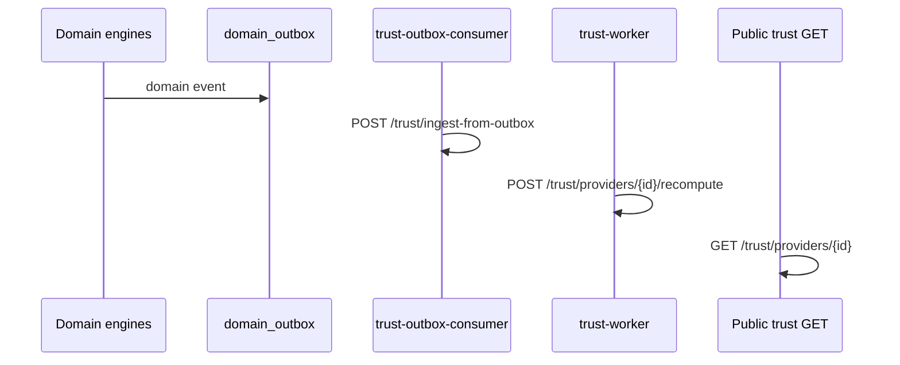

# APP13 OpenAPI Specification — Review v1.1

**Version:** 1.0  
**Status:** Verification complete  
**Last updated:** June 20, 2026  
**Subjects:** [`api/public-v1.yaml`](../../api/public-v1.yaml) · [`api/internal-v1.yaml`](../../api/internal-v1.yaml)  
**Baseline:** [API Architecture v1.1](./APP13-API-Architecture-v1.1.md) · [API Architecture Review v1.1](./APP13-API-v1.1-Review.md) · [API Review v1](./APP13-API-Review-v1.md) · [PostgreSQL Schema v1.1 Review](./APP13-PostgreSQL-v1.1-Review.md) · [Contract Engine v1](../APP13-Contract-Engine-v1.md) · [Trust Engine v1.1](../APP13-Trust-Engine-v1.1.md) · [Complaint Lifecycle v1](./06-complaint-lifecycle.md)

---

## Verdict

# PASS

OpenAPI v1.1 (`public-v1.yaml` + `internal-v1.yaml`) implements the MVP surface defined in API Architecture v1.1. All P0 endpoints, security controls, and constitutional lifecycle chains are represented. No blocking gaps for implementation, SDK generation, or contract testing.

**Caveat:** Several P1 documentation gaps remain (role annotations, enumerated error codes, a few response schema refinements). These do not block MVP implementation.

---

## Specification inventory

| File | OpenAPI | API version | Paths | Operations |
|------|---------|-------------|------:|-----------:|
| `api/public-v1.yaml` | 3.1.0 | 1.1.0 | **105** | **118** |
| `api/internal-v1.yaml` | 3.1.0 | 1.1.0 | **12** | **12** |

---

## Verification summary

| Criterion | Result | Notes |
|-----------|:------:|-------|
| 1. Missing endpoints | **PASS** | 100% of Architecture v1.1 MVP routes present; P1 `/notifications` intentionally omitted |
| 2. Security gaps | **PASS** | P0-S1–S5 reflected; forbidden routes absent; trust ingest hardened |
| 3. Authorization gaps | **PASS** | TEKRR dimension scoping, admin adjudication, assignment field present; role scopes deferred (P1) |
| 4. Contract lifecycle coverage | **PASS** | Generate → accept → activate → execute → complete + issue path |
| 5. Trust lifecycle coverage | **PASS** | Read-only public; outbox ingest + recompute internal; P0-T1 DTO split |
| 6. Complaint lifecycle coverage | **PASS** | File → triage → adjudicate → apply-outcome; EL-2 enums; P0-CM1 enforced |

---

## 1. Missing endpoints

### 1.1 Architecture v1.1 → OpenAPI mapping (public)

| Domain | Architecture v1.1 | OpenAPI | Status |
|--------|:-----------------:|:-------:|:------:|
| Auth (12 routes) | §3.1 | 12 paths | ✅ |
| Identity / profiles | §5.1 | `/me`, customers, providers, trust-summary | ✅ |
| Verification T1/T2 | §5.2 | T1 start/complete/webhook, credentials + docs | ✅ |
| Actions / TEKRR | §4.3, §13 | 12 action paths; dimension-scoped TEKRR | ✅ |
| Contracts | §6.3 | 12 contract paths + generate | ✅ |
| Execution | §11 | milestones, attestations, evaluation | ✅ |
| Evidence | §9.1 | upload-intent + confirm + list/download | ✅ |
| Trust (read-only) | §7.1 | summary, full, events, snapshots, appeals | ✅ |
| Cases | §10 | 6 case paths | ✅ |
| Issues | §10 | 7 issue paths | ✅ |
| Complaints | §8.1 | 12 complaint paths (adjudication GET-only) | ✅ |
| Operations | §14.1 | `GET /operations/{id}` | ✅ |
| Admin | §12 + v1 §10 | 21 admin paths | ✅ |

**Intentionally omitted (P1 — Architecture §20):**

| Route | Reason |
|-------|--------|
| `/notifications` | P1 catalog-only; deferred from MVP OpenAPI |

**Correctly absent (constitutional):**

| Forbidden pattern | Present in OpenAPI? |
|-------------------|:-------------------:|
| `/marketplace/*`, `/services`, `/listings` | ❌ No |
| `/payments/*` | ❌ No |
| `PUT/PATCH /trust/.../score` | ❌ No |
| Monolithic `PATCH /actions/{id}/tekrr` | ❌ No (removed P0-A1) |
| Public `POST /complaints/{id}/adjudication` | ❌ No (P0-CM1) |

### 1.2 Internal API (Architecture §2.3)

| Route | Allowed service | OpenAPI | Status |
|-------|-----------------|:-------:|:------:|
| `POST /contracts/{id}/materialize` | contract-worker | ✅ | ✅ |
| `POST /contracts/{id}/activate` | contract-engine | ✅ | ✅ |
| `POST /contracts/{id}/complete` | contract-engine | ✅ | ✅ |
| `POST /contracts/{id}/transitions/issue-path` | contract-engine | ✅ | ✅ |
| `POST /complaints/{id}/validate` | complaint-worker | ✅ | ✅ |
| `POST /complaints/{id}/apply-outcome` | complaint-engine | ✅ | ✅ |
| `POST /trust/providers/{id}/recompute` | trust-worker | ✅ | ✅ |
| `POST /trust/ingest-from-outbox` | trust-outbox-consumer | ✅ | ✅ |
| `POST /outbox/publish-batch` | outbox-publisher | ✅ | ✅ |
| `POST /audit/events` | allowlisted engines | ✅ | ✅ |
| `GET /health/engines` | ops-probe | ✅ | ✅ |
| `POST /trust/appeals/{id}/resolve` | admin-backend | ✅ | ✅ (v1 carry-over) |

**Removed from v1 (verified absent):** `POST /trust/events` open ingest.

### 1.3 P0 endpoint closure (API Review v1)

| ID | Requirement | OpenAPI artifact | Status |
|----|-------------|------------------|:------:|
| P0-E1 | Verification API | §Verification paths | ✅ |
| P0-E2 | Profile routes | `/me`, customers, providers | ✅ |
| P0-E3 | Contract completion | internal `/contracts/{id}/complete` | ✅ |
| P0-E4 | Token refresh | `POST /auth/token/refresh` | ✅ |

**No P0 missing endpoints.**

---

## 2. Security gaps

### 2.1 P0 security controls

| ID | Requirement | OpenAPI evidence | Status |
|----|-------------|------------------|:------:|
| **P0-S1** | DB revalidation on gated mutations | Transition POST descriptions; Problem schema supports `code` | ✅ |
| **P0-S2** | No open internal trust POST | `/trust/events` absent; ingest-from-outbox only | ✅ |
| **P0-S3** | Signed actor context | `X-Actor-Context-Token` parameter + `ActorContextTokenClaims` schema | ✅ |
| **P0-S4** | Upload tenancy binding | `UploadIntent` with server-generated `storage_key`; confirm requires `intent_id` + hash | ✅ |
| **P0-S5** | Required idempotency | `IdempotencyKey` parameter on **all 64 POST** operations (53 public + 11 internal) | ✅ |

### 2.2 Authentication schemes

| Scheme | Surface | Status |
|--------|---------|:------:|
| `bearerAuth` (JWT) | Public | ✅ |
| `sessionCookie` (`app13_session`) | Public | ✅ |
| `kycWebhookSignature` | T1 webhook | ✅ |
| `serviceToken` (JWT + mTLS described) | Internal | ✅ |

Unauthenticated routes correctly override global security with `security: []` (register, login, refresh, password reset, email confirm, KYC webhook).

### 2.3 Trust boundary (ADR-003 / CA-5)

| Check | Result |
|-------|:------:|
| No public trust score write routes | ✅ |
| No internal arbitrary event POST | ✅ |
| `x-allowed-service-ids` on internal trust routes | ✅ |
| Internal ingest batch idempotent | ✅ |

### 2.4 Non-blocking security notes (P1/P2)

| Item | Severity | Recommendation |
|------|----------|----------------|
| `400 IDEMPOTENCY_KEY_REQUIRED` not enumerated on POST responses | P1 | Add shared `IdempotencyRequired` response component |
| `409 IDEMPOTENCY_KEY_REUSE` not documented | P1 | Add to Problem examples |
| mTLS not expressible as OpenAPI security scheme | P2 | Document in companion implementation guide |
| Duplicate idempotency: header + body `idempotency_key` on transitions | P2 | Clarify header is authoritative |

**No P0 security gaps.**

---

## 3. Authorization gaps

### 3.1 P0 authorization artifacts

| ID | Requirement | OpenAPI evidence | Status |
|----|-------------|------------------|:------:|
| **P0-A1** | Dimension-scoped TEKRR | `PATCH/GET /actions/{id}/tekrr/dimensions/{dimension}`; no monolithic `/tekrr` | ✅ |
| **P0-A2** | Adjudicator assignment scope | `ComplaintResponse.assigned_admin_user_id`; admin assign endpoint | ✅ |
| **P0-A3** | CA-2 executable states | Milestone/attestation/evidence ops gated at implementation; contract status enum complete | ✅ |
| **P0-CM1** | Admin-only adjudication | Public `GET …/adjudication` only; `POST /admin/complaints/{id}/adjudicate` | ✅ |

### 3.2 Resource scope (IDOR)

| Resource | Scope mechanism in spec | Status |
|----------|-------------------------|:------:|
| Actions | Party/initiator implied; 404 on NotFound response | ✅ |
| Contracts | Party + assigned adjudicator | ✅ |
| Complaints / cases / issues | Party + assigned adjudicator field | ✅ |
| Trust full / events | Self / trust_ops documented in summaries | ✅ |
| Trust public summary | Any authenticated user | ✅ |

### 3.3 RBAC documentation

| Gap | Severity | Impact |
|-----|----------|--------|
| Admin routes lack per-operation role requirements (`verification_analyst`, `complaint_adjudicator`, etc.) | P1 | Implementers must cross-reference Permissions Matrix |
| TEKRR dimension PATCH lacks `tekrr.*.write` permission codes in operation metadata | P1 | Handler docs required |
| P0-S1 fail codes (`TIER_STALE`, `ROLES_STALE`, `ACCOUNT_SUSPENDED`) not in Problem `code` enum | P1 | Client SDK error handling incomplete |
| `403 TEKRR_DIMENSION_FORBIDDEN` not documented | P1 | Add to Forbidden response examples |

**No P0 authorization gaps.** RBAC enforcement remains implementation-side per architecture design.

---

## 4. Contract lifecycle coverage

### 4.1 State Machine v1 alignment

| Phase | Public API | Internal API | Status |
|-------|------------|--------------|:------:|
| Generate (`draft`) | `POST /actions/{id}/contract/generate` | — | ✅ |
| Propose / accept / decline / cancel | `POST /contracts/{id}/transitions` | — | ✅ |
| Per-party accept (CA-8) | `accept` + `party_role` + `document_hash_ack` | — | ✅ |
| Activate (`accepted` → `active`) | `202` async on accept | `POST …/activate`, `…/materialize` | ✅ |
| Execute milestones / attestations | Execution paths (CA-2 states) | — | ✅ |
| Complete (`active` → `completed`) | Poll `/operations/{id}` | `POST …/complete` (P0-E3) | ✅ |
| Issue path | `POST /issues` side effect | `POST …/transitions/issue-path` (P0-CE2) | ✅ |
| Post-completion eval | `POST /contracts/{id}/evaluation` | — | ✅ |

### 4.2 Contract Engine rules

| Rule | OpenAPI | Status |
|------|---------|:------:|
| CA-1 (1:1 action-contract) | generate returns `200` existing + `201` new | ✅ |
| CA-2 (execution gate) | Executable states in enum; milestone/attestation routes | ✅ |
| CA-5 (trust from domain events) | No direct trust writes; internal outbox path | ✅ |
| CA-7 (template immutability) | `template_id` read-only in `ContractResponse` | ✅ |
| CA-8 (all parties accept) | Transition schema + description | ✅ |
| CL-5 (hash at accept) | `document_hash_ack` required pattern `^sha256:` | ✅ |
| P0-CE1 generate gates | Description + `409`/`422` responses | ✅ |

### 4.3 Contract status enum (PostgreSQL aligned)

All 11 `contract.contract_status` values present in `ContractStatus` schema: `draft`, `proposed`, `accepted`, `active`, `completed`, `issue_raised`, `disputed`, `resolved`, `closed`, `void`, `cancelled`.

**Contract lifecycle: complete for MVP.**

---

## 5. Trust lifecycle coverage

### 5.1 Public read surfaces (Trust Engine v1.1 §3)

| Surface | Endpoint | Schema | Status |
|---------|----------|--------|:------:|
| Public summary | `GET /trust/providers/{id}` | `TrustPublicSummary` | ✅ |
| Full breakdown | `GET …/full` | `TrustPublicSummary` | ✅ |
| Event log | `GET …/events` | `TrustEventPublic` / `TrustEventAdmin` oneOf | ✅ |
| Snapshots | `GET …/snapshots`, `…/snapshots/{id}` | `TrustPublicSummary` | ✅ |
| Appeals | `POST/GET …/appeals` | `TrustAppealCreate` | ✅ |
| Provider alias | `GET /providers/{id}/trust-summary` | `TrustPublicSummary` | ✅ |

### 5.2 Internal trust pipeline (ADR-003)

| Step | OpenAPI route | Status |
|------|---------------|:------:|
| Event ingest | `POST /trust/ingest-from-outbox` | ✅ |
| Projection recompute | `POST /trust/providers/{id}/recompute` | ✅ |
| Appeal resolution | `POST /trust/appeals/{id}/resolve` (internal + admin public) | ✅ |
| Admin appeal queue | `GET /admin/trust/appeals/queue` | ✅ |

### 5.3 P0-T1 PII protection

| Field | `TrustEventPublic` | `TrustEventAdmin` | Status |
|-------|:------------------:|:-----------------:|:------:|
| `event_type`, `occurred_at`, `score_version` | ✅ | ✅ | ✅ |
| `contract_id`, `source_entity_*` | ✅ | ✅ | ✅ |
| `customer_id`, `contributing_customer_ids` | ❌ absent | ✅ present | ✅ |

### 5.4 Trust enums (PostgreSQL aligned)

| Enum | Values in spec | Status |
|------|----------------|:------:|
| `ConfidenceBand` | low, medium, high | ✅ |
| `TrustRecordState` | uninitialized, provisional, active, dispute_hold, frozen, archived | ✅ |

### 5.5 Non-blocking notes

| Item | Severity |
|------|----------|
| `TrustPublicSummary.public_summary` lacks explicit `dispute_hold_active`, `pending_disputes_count` properties | P1 |
| Event payload JSON Schema refs (Trust v1.1 Appendix A) not linked from OpenAPI | P2 |

**Trust lifecycle: complete for MVP.**

---

## 6. Complaint lifecycle coverage

### 6.1 Constitutional requirements

| Requirement | OpenAPI evidence | Status |
|-------------|------------------|:------:|
| ADR-002 — `contract_id` required | `ComplaintCreateRequest.required` | ✅ |
| CK-7 — ≥1 dimension | `dimensions.minItems: 1` | ✅ |
| CK-9 — no generic `resolved` | Granular `ComplaintStatus` enum | ✅ |
| EL-6 — one active per dimension | Internal validate + file description | ✅ |
| P0-CM1 — admin adjudication only | No public POST adjudicate | ✅ |
| P0-CM2 — EL-2 status map | `DismissedReasonCode.CONTRACT_NOT_ACTIVE`; contract status enum | ✅ |

### 6.2 Lifecycle flow

| Stage | Actor | OpenAPI | Status |
|-------|-------|---------|:------:|
| File | Party | `POST /complaints` | ✅ |
| Triage | Admin + worker | `POST /admin/…/triage` → internal `/validate` | ✅ |
| Evidence gathering | System | Status enum `evidence_gathering` | ✅ |
| Mediation | Party | `POST …/mediation/proposals`, accept | ✅ |
| Adjudication | Admin | `POST /admin/…/adjudicate` | ✅ |
| Outcome apply | Engine | internal `/apply-outcome` | ✅ |
| Party withdraw | Party | `POST …/transitions` (`withdraw`, `accept_mediation`) | ✅ |
| Read adjudication | Party / assigned adj | `GET …/adjudication` | ✅ |
| External escalation | Admin | `POST /admin/…/escalate-external` | ✅ |

### 6.3 Cross-engine effects

| Trigger | Contract effect | OpenAPI path | Status |
|---------|-----------------|--------------|:------:|
| Issue raised | → `issue_raised` | `POST /issues` | ✅ |
| Triage pass | → `disputed` | internal validate (documented) | ✅ |
| Outcome applied | → `resolved` / attestations | internal apply-outcome | ✅ |
| Issue path closure | → `closed` / `completed` | internal issue-path transition | ✅ |

### 6.4 Complaint enums (PostgreSQL aligned)

| Enum | Count | Match DB |
|------|------:|:--------:|
| `ComplaintStatus` | 13 | ✅ |
| `ComplaintType` | 6 (MVP) | ✅ |
| `ComplaintOutcome` | 6 | ✅ |
| `ComplaintSeverity` | 4 | ✅ |
| `DismissedReasonCode` | 7 | ✅ |

**Complaint lifecycle: complete for MVP.**

---

## 7. Cross-verification matrix

| Architecture v1.1 P0 item | OpenAPI closed? |
|---------------------------|:---------------:|
| P0-S1 DB revalidation | ✅ (descriptions + Problem) |
| P0-S2 trust ingest restricted | ✅ |
| P0-S3 signed actor context | ✅ |
| P0-S4 upload tenancy | ✅ |
| P0-S5 mandatory idempotency | ✅ |
| P0-E1–E4 endpoints | ✅ |
| P0-A1 TEKRR ACL | ✅ |
| P0-A2 assignment scope | ✅ |
| P0-A3 CA-2 states | ✅ |
| P0-CE1–CE3 contract | ✅ |
| P0-T1–T2 trust | ✅ |
| P0-CM1–CM2 complaint | ✅ |

**12/12 P0 categories reflected in OpenAPI.**

---

## 8. Documentation quality notes (non-blocking)

| Item | Location | Severity |
|------|----------|----------|
| `GET /admin/metrics/summary` returns `PaginationMeta` schema | public-v1.yaml | P2 |
| `confirmCredentialDocument` reuses `EvidenceCreateRequest` (requires `intent_id`) | credentials path | P2 |
| `generateContract` body is generic `TransitionRequest` | actions path | P2 |
| Global `security` requires both bearer + cookie (OR semantics implied) | components | P2 |
| Architecture doc path says `openapi/`; files at `api/` | repo layout | P2 |

None affect PASS for MVP implementation readiness.

---

## 9. Recommended next steps

| Priority | Action |
|----------|--------|
| 1 | Add `ProblemCode` enum with P0-S1 and gate failure codes |
| 2 | Annotate admin operations with required `PlatformRole` (OpenAPI `description` or extension) |
| 3 | Expand `TrustPublicSummary.public_summary` with `dispute_hold_active`, `pending_disputes_count` |
| 4 | Add shared `IdempotencyRequired` / `IdempotencyReuse` response components |
| 5 | Run Spectral / openapi-generator validation in CI |
| 6 | Generate TypeScript SDK and smoke-test UF-01–UF-12 |

---

## Related documents

| Document | Relationship |
|----------|--------------|
| [APP13-API-Architecture-v1.1.md](./APP13-API-Architecture-v1.1.md) | Source specification |
| [APP13-API-v1.1-Review.md](./APP13-API-v1.1-Review.md) | Architecture review (PASS) |
| [api/public-v1.yaml](../../api/public-v1.yaml) | Subject — public surface |
| [api/internal-v1.yaml](../../api/internal-v1.yaml) | Subject — internal surface |

---

*Review complete. No OpenAPI files were modified.*
