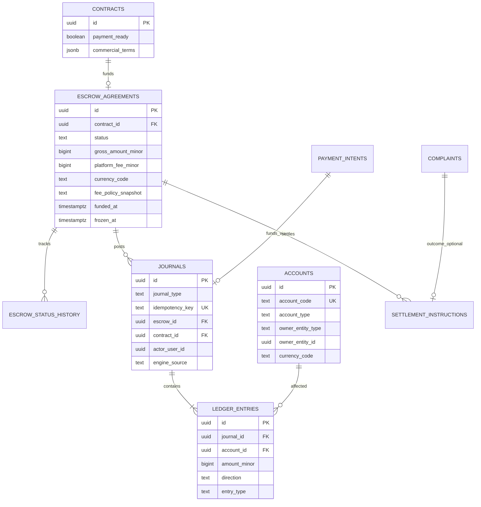
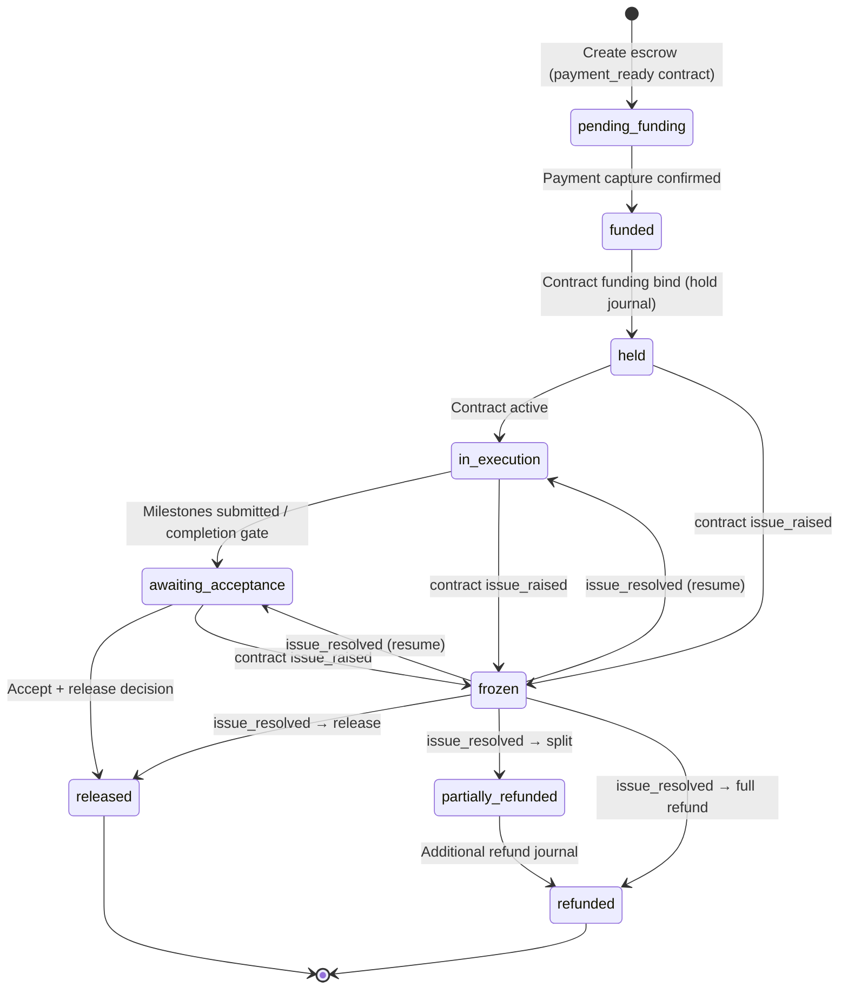
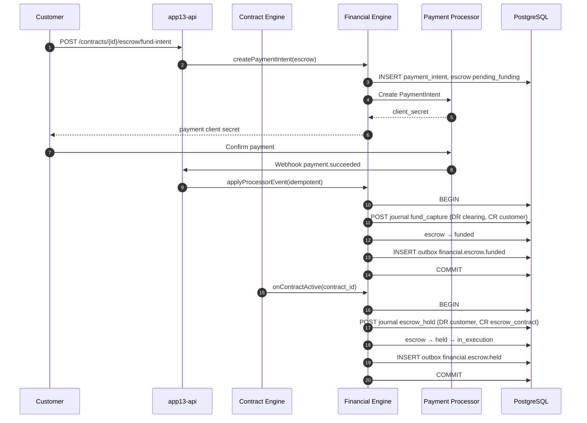
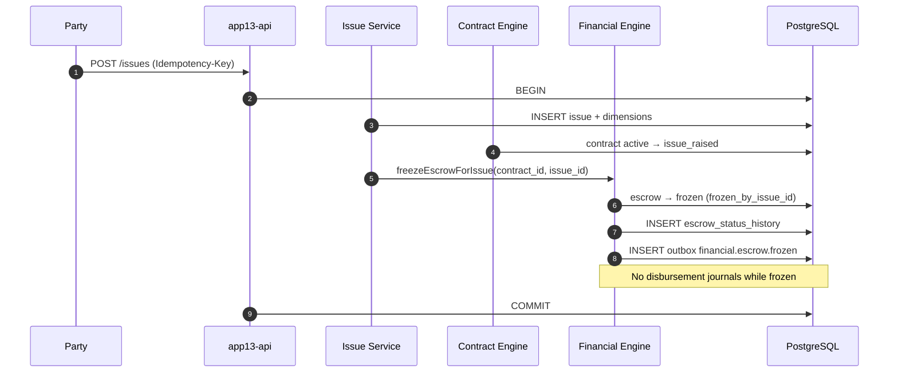
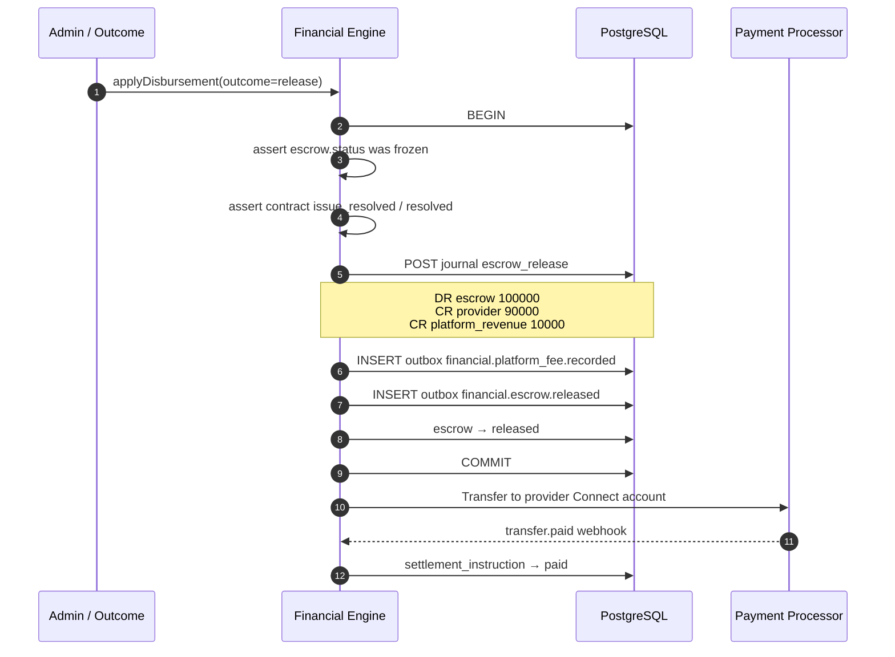
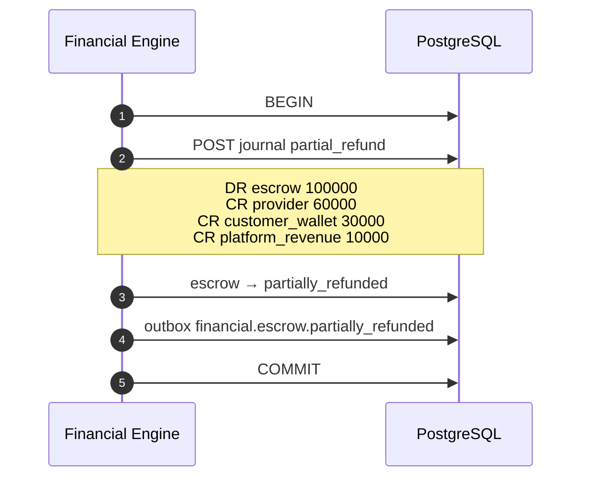
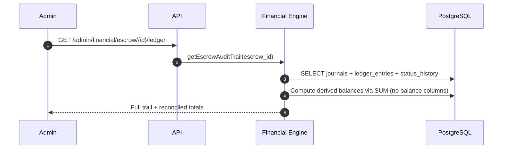

# APP13 Financial Kernel — B6.1 Domain Design

**Version:** 1.0  
**Status:** Design — no production code  
**Last updated:** June 19, 2026  
**Branch context:** `b6-financil-kernel`  
**Authority:** Subordinate to [Core Principles v1](../APP13-Core-Principles-v1.md) · [State Machine v1](../APP13-State-Machine-v1.md) · [Contract Engine v1](../APP13-Contract-Engine-v1.md) · [Database Architecture v1.1](./APP13-Database-Architecture-v1.1.md) · [Backend Architecture v1](./APP13-Backend-Architecture-v1.md)

---

## Document purpose

This document defines the **APP13 Financial Kernel** using a **ledger-first architecture**. It is the B6.1 design deliverable: domain model, escrow state machine, PostgreSQL schema proposal, events, sequence diagrams, and an implementation plan.

**Design-only.** No migrations or application code are included in this phase.

**Constitutional placement:**

```
Action → Contract → Execution → Financial (Escrow + Ledger) → Trust → Complaint
```

Financial movements are **downstream of contract binding** and **upstream of trust signals** (payment fulfillment, dispute rate). The Financial Engine does not adjudicate complaints or mutate contract TEKRR snapshots.

---

## Design principles

| ID | Principle | Implication |
|----|-----------|-------------|
| **FK-1** | **Ledger-first** | All monetary state is derived from append-only `ledger_entries`. |
| **FK-2** | **No balance columns** | No `balance`, `available_balance`, or `held_amount` columns on any table. Balances are computed via `SUM(debit − credit)` (or equivalent signed amount) at query time. |
| **FK-3** | **Double-entry journal** | Every financial movement posts ≥2 entries that net to zero per currency within a `journal_id`. |
| **FK-4** | **Idempotent posting** | Every journal carries a unique `idempotency_key`; replays are no-ops. |
| **FK-5** | **Contract-bound escrow** | One primary escrow agreement per funded contract (`contract_id NOT NULL`). |
| **FK-6** | **Issue path drives freeze** | Contract `issue_raised` automatically transitions escrow → `frozen` (no manual freeze API for parties). |
| **FK-7** | **Resolution drives disbursement** | Only authorized transitions after `issue_resolved` / complaint outcome may post release or refund journals. |
| **FK-8** | **Platform fee isolation** | Platform revenue is always separate ledger lines to `platform_revenue` accounts — never netted silently into provider payout. |
| **FK-9** | **Full auditability** | Every journal links to `actor_user_id`, `engine_source`, optional `contract_id`, and append-only status history. Law 24 alignment via `platform.audit_events` + outbox. |
| **FK-10** | **Processor reconciliation** | External payment processor state is mirrored in `payment_processor_events`; ledger is authoritative for platform economics. |

**Money representation:** Integer minor units (`amount_minor`) + ISO 4217 `currency_code` (per [Entity Model v1](../APP13-Entity-Model-v1.md) §1).

---

## 1. Domain model

### 1.1 Bounded context

| Context | Owner engine | Writes |
|---------|--------------|--------|
| Escrow lifecycle | Financial | `financial.escrow_agreements`, status history |
| Ledger / journal | Financial | `financial.ledger_entries`, `financial.journals` |
| Funding / capture | Financial (+ processor adapter) | `financial.payment_intents`, processor events |
| Payout / settlement | Financial | `financial.settlement_instructions` |
| Fee policy | Financial (read); Contract (declare) | `financial.fee_policy_refs` (immutable snapshot on escrow) |

**Read-only consumers:** Contract Engine (escrow status), Complaint Engine (outcome amounts), Trust Engine (fulfillment signals), Admin (reconciliation exports).

### 1.2 Core aggregates



### 1.3 Entity definitions

#### `EscrowAgreement`

The **escrow lifecycle aggregate root**. Status is explicit (not inferred from ledger alone), but **every status transition that moves money must produce a journal** except pure `frozen` (hold continuation — see §2).

| Field | Description |
|-------|-------------|
| `contract_id` | Bound contract (1:1 while active) |
| `status` | Escrow state machine (§2) |
| `gross_amount_minor` | Total customer funding obligation (from `commercial_terms` snapshot) |
| `platform_fee_minor` | Computed fee at funding time (immutable snapshot) |
| `currency_code` | ISO 4217 |
| `fee_policy_snapshot` | JSON: rate, cap, disclosure ref |
| `payment_intent_id` | Link to processor funding |
| `frozen_reason` | `issue_raised`, `disputed`, `admin_hold` |
| `frozen_by_issue_id` | FK → `complaint.issues` when auto-frozen |

**Derived values (never stored):**

```sql
-- Escrow held amount (example read model)
SELECT SUM(CASE WHEN direction = 'credit' THEN amount_minor ELSE -amount_minor END)
FROM financial.ledger_entries le
JOIN financial.accounts a ON a.id = le.account_id
WHERE a.account_type = 'escrow_contract'
  AND a.owner_entity_id = :escrow_id;
```

#### `Account`

Chart-of-accounts node. **No balance column.**

| `account_type` | Purpose |
|----------------|---------|
| `customer_wallet` | Customer funds before/al after escrow |
| `provider_wallet` | Provider earned balance (pre-payout) |
| `escrow_contract` | Contract-scoped hold bucket (`owner_entity_id` = escrow_id) |
| `platform_revenue` | Recognized platform fees |
| `processor_clearing` | Stripe/processor in-flight |
| `refund_payable` | Customer refund obligation |
| `suspense` | Reconciliation exceptions (should trend to zero) |

`account_code` is human-auditable: e.g. `escrow:contract:{contract_id}`, `platform:revenue:USD`.

#### `Journal`

Atomic double-entry transaction. All entries in one journal share `journal_id` and must balance:

```
SUM(credit amounts) = SUM(debit amounts)   -- per currency
```

| `journal_type` | Typical trigger |
|----------------|-----------------|
| `fund_capture` | Processor payment succeeded |
| `escrow_hold` | Contract funding bind |
| `escrow_release` | Acceptance / completion release |
| `platform_fee` | Fee recognition (may combine with release) |
| `escrow_refund` | Full refund |
| `escrow_partial_refund` | Split outcome |
| `escrow_chargeback` | Processor reversal |
| `payout_settlement` | Provider withdrawal to bank |
| `freeze_memo` | Audit-only marker (zero net) optional |

#### `LedgerEntry`

Append-only line item. **Never UPDATE or DELETE.**

| Field | Description |
|-------|-------------|
| `direction` | `debit` \| `credit` |
| `amount_minor` | Positive integer |
| `entry_type` | Semantic tag: `hold`, `release`, `fee`, `refund`, … |
| `account_id` | FK → accounts |
| `metadata` | JSON: milestone_id, attestation_id, complaint_id |

#### `PaymentIntent`

External funding session (Stripe PaymentIntent or equivalent).

| Field | Description |
|-------|-------------|
| `escrow_id` | Target escrow |
| `processor_ref` | External ID |
| `status` | `requires_payment_method`, `processing`, `succeeded`, `failed`, `cancelled` |
| `amount_minor` | Intended capture |

#### `SettlementInstruction`

Disbursement command after ledger release — provider payout rail.

Links `journal_id` (release) → processor transfer.

### 1.4 Domain services (application layer)

| Service | Responsibility |
|---------|----------------|
| `EscrowService` | Lifecycle transitions; validates preconditions |
| `LedgerService` | Post balanced journals; enforces FK-2/FK-3 |
| `FundingService` | Payment intent create/confirm; webhook ingest |
| `DisbursementService` | Release/refund/partial per outcome |
| `FeeService` | Compute platform fee from policy snapshot |
| `BalanceQueryService` | Read-only aggregations (no persistence) |

### 1.5 Cross-engine orchestration

| Trigger | Source | Financial reaction |
|---------|--------|-------------------|
| Contract → `active` + `payment_ready` | Contract Engine | Expect `funded` → post `escrow_hold` journal → `held` |
| Contract → `issue_raised` | Issue Service / Contract | Escrow → `frozen` (automatic) |
| Issue → `resolved_informally` / withdraw | Issue / Contract | Escrow unfreeze → prior operational state |
| Complaint adjudication outcome | Complaint Engine (internal) | Post release/refund journals per outcome |
| Contract → `completed` | Contract Engine | Escrow → `awaiting_acceptance` or trigger release if policy auto-release on M-ACCEPT |
| Milestone M-ACCEPT | Execution | Optional gate before `released` |

**Lock order (P0-C2 extension for B6):**

```
contract row → escrow_agreement row → journal insert → ledger entries → outbox
```

Same transaction as contract side-effect when issue raises (issue + contract transition + escrow freeze).

---

## 2. Escrow state machine

### 2.1 States

| State | Code | Description | Money movement |
|-------|------|-------------|----------------|
| Pending funding | `pending_funding` | Escrow agreement created; awaiting customer payment | None |
| Funded | `funded` | Processor capture confirmed; not yet contract-held | Capture journal |
| Held | `held` | Hold entries posted; contract bound | Hold journal |
| In execution | `in_execution` | Contract actively executing | None (funds remain held) |
| Awaiting acceptance | `awaiting_acceptance` | Work submitted; release pending acceptance | None |
| Released | `released` | Provider paid; platform fee recorded | Release + fee journals |
| Partially refunded | `partially_refunded` | Split outcome applied | Partial refund journal |
| Refunded | `refunded` | Full customer refund | Refund journal |
| Frozen | `frozen` | Issue/dispute hold — disbursement blocked | Status only (optional memo journal) |

### 2.2 State diagram



### 2.3 Transition table

| From | To | Trigger | Actor | Preconditions |
|------|-----|---------|-------|---------------|
| — | `pending_funding` | Create escrow on contract with `payment_ready=true` | System / Customer | Commercial terms declare price |
| `pending_funding` | `funded` | Processor webhook `payment.succeeded` | Financial | Amount ≥ gross obligation |
| `funded` | `held` | `POST /internal/v1/contracts/{id}/fund-bind` or activation hook | Financial | Contract ≥ `active`; post hold journal |
| `held` | `in_execution` | Contract execution start | System | Contract `active` |
| `in_execution` | `awaiting_acceptance` | Completion gate / all blocking milestones submitted | System | Per template policy |
| `awaiting_acceptance` | `released` | Release authorized | System / Admin | Acceptance satisfied; not `frozen` |
| `*` (operational) | `frozen` | Contract → `issue_raised` | **Automatic** | Issue created (B5 side effect) |
| `frozen` | `in_execution` / `awaiting_acceptance` | Issue resolved informally / withdrawn | Contract + Financial | No disbursement posted |
| `frozen` | `released` | Issue resolved → release decision | Financial | Outcome specifies provider amount |
| `frozen` | `partially_refunded` | Issue resolved → split | Financial | Outcome specifies split |
| `frozen` | `refunded` | Issue resolved → full refund | Financial | Outcome specifies full refund |
| `partially_refunded` | `refunded` | Supplemental refund journal | Financial | Remaining hold balance |

**Invariant EI-1:** Disbursement journals (`release`, `refund`, `partial_refund`) forbidden while `status = frozen`.

**Invariant EI-2:** `released` is terminal for hold balance — sum of hold account credits minus debits must be zero.

**Invariant EI-3:** Platform fee journal lines must exist in every `released` transition where `platform_fee_minor > 0`.

### 2.4 Mapping to contract status

| Contract status | Escrow operational states allowed |
|-----------------|-----------------------------------|
| `accepted` | `pending_funding`, `funded` |
| `active` | `held`, `in_execution`, `awaiting_acceptance`, `frozen` |
| `issue_raised` | **`frozen` only** (auto) |
| `disputed` | **`frozen` only** |
| `resolved` | `frozen` → disbursement decision |
| `completed` | `released`, `partially_refunded`, `refunded` |
| `cancelled` / `void` | `refunded` (policy-dependent) |

---

## 3. PostgreSQL schema proposal

New schema: **`financial`** (PostgreSQL 16+). Follows existing APP13 patterns: UUID PKs, TEXT status + CHECK constraints, append-only history, outbox integration.

### 3.1 Schema layout

```
financial.accounts
financial.journals
financial.ledger_entries
financial.escrow_agreements
financial.escrow_status_history
financial.payment_intents
financial.payment_processor_events
financial.settlement_instructions
financial.fee_policy_snapshots   -- immutable refs copied onto escrow
```

**Explicitly excluded:** `balance`, `available`, `held` columns anywhere.

### 3.2 Table specifications

#### `financial.accounts`

| Column | Type | Notes |
|--------|------|-------|
| `id` | UUID PK | |
| `account_code` | TEXT UNIQUE NOT NULL | Stable identifier |
| `account_type` | TEXT NOT NULL | CHECK enum |
| `owner_entity_type` | TEXT | `user`, `contract`, `escrow`, `platform` |
| `owner_entity_id` | UUID | Nullable for platform-global accounts |
| `currency_code` | CHAR(3) NOT NULL | |
| `created_at` | TIMESTAMPTZ | |

Indexes: `(account_type, owner_entity_id)`, `(account_code)`.

#### `financial.journals`

| Column | Type | Notes |
|--------|------|-------|
| `id` | UUID PK | |
| `journal_type` | TEXT NOT NULL | |
| `idempotency_key` | TEXT UNIQUE NOT NULL | P0-S5 |
| `escrow_id` | UUID FK → escrow_agreements | Nullable for non-escrow |
| `contract_id` | UUID FK → contract.contracts | Denormalized |
| `actor_user_id` | UUID FK → identity.users | Nullable for system |
| `engine_source` | TEXT NOT NULL | `financial` |
| `description` | TEXT | |
| `metadata` | JSONB DEFAULT `{}` | |
| `posted_at` | TIMESTAMPTZ NOT NULL DEFAULT now() | |
| `created_at` | TIMESTAMPTZ | |

#### `financial.ledger_entries`

| Column | Type | Notes |
|--------|------|-------|
| `id` | UUID PK | |
| `journal_id` | UUID FK NOT NULL | |
| `account_id` | UUID FK NOT NULL | |
| `direction` | TEXT NOT NULL | CHECK (`debit`, `credit`) |
| `amount_minor` | BIGINT NOT NULL | CHECK (`amount_minor > 0`) |
| `currency_code` | CHAR(3) NOT NULL | Must match account |
| `entry_type` | TEXT NOT NULL | Semantic |
| `sequence_no` | INT NOT NULL | Order within journal |
| `metadata` | JSONB DEFAULT `{}` | |
| `created_at` | TIMESTAMPTZ | |

**Triggers:**

- `trg_journal_balanced_on_commit` — DEFERRABLE; SUM debits = SUM credits per journal.
- `trg_ledger_entries_immutable` — reject UPDATE/DELETE.
- `trg_escrow_currency_consistency` — all entries in journal share currency.

#### `financial.escrow_agreements`

| Column | Type | Notes |
|--------|------|-------|
| `id` | UUID PK | |
| `contract_id` | UUID UNIQUE NOT NULL | One active escrow per contract |
| `status` | TEXT NOT NULL | CHECK (9 states) |
| `gross_amount_minor` | BIGINT NOT NULL | |
| `platform_fee_minor` | BIGINT NOT NULL DEFAULT 0 | Snapshot |
| `currency_code` | CHAR(3) NOT NULL | |
| `fee_policy_snapshot` | JSONB NOT NULL | |
| `payment_intent_id` | UUID FK | |
| `frozen_at` | TIMESTAMPTZ | |
| `frozen_reason` | TEXT | |
| `frozen_by_issue_id` | UUID FK → complaint.issues | |
| `funded_at` | TIMESTAMPTZ | |
| `released_at` | TIMESTAMPTZ | |
| `created_at` / `updated_at` | TIMESTAMPTZ | |

Indexes: `(status)`, `(contract_id)`, `(frozen_by_issue_id)`.

#### `financial.escrow_status_history`

Law 24 append-only — mirrors `contract.contract_status_history` pattern.

| Column | Type |
|--------|------|
| `id` | UUID PK |
| `escrow_id` | UUID FK |
| `from_status` | TEXT |
| `to_status` | TEXT NOT NULL |
| `actor_user_id` | UUID |
| `reason` | TEXT |
| `journal_id` | UUID FK nullable |
| `created_at` | TIMESTAMPTZ |

#### `financial.payment_intents`

| Column | Type |
|--------|------|
| `id` | UUID PK |
| `escrow_id` | UUID FK |
| `customer_user_id` | UUID FK |
| `processor` | TEXT | `stripe` |
| `processor_ref` | TEXT UNIQUE |
| `status` | TEXT |
| `amount_minor` | BIGINT |
| `currency_code` | CHAR(3) |
| `metadata` | JSONB |
| `created_at` / `updated_at` | TIMESTAMPTZ |

#### `financial.payment_processor_events`

Webhook audit log (append-only).

| Column | Type |
|--------|------|
| `id` | UUID PK |
| `processor` | TEXT |
| `event_type` | TEXT |
| `processor_ref` | TEXT |
| `payload` | JSONB |
| `processed_at` | TIMESTAMPTZ |
| `journal_id` | UUID FK nullable |
| `idempotency_key` | TEXT UNIQUE |

#### `financial.settlement_instructions`

| Column | Type |
|--------|------|
| `id` | UUID PK |
| `escrow_id` | UUID FK |
| `journal_id` | UUID FK |
| `beneficiary_user_id` | UUID FK |
| `amount_minor` | BIGINT |
| `currency_code` | CHAR(3) |
| `processor_transfer_ref` | TEXT |
| `status` | TEXT | `pending`, `submitted`, `paid`, `failed` |
| `created_at` | TIMESTAMPTZ |

### 3.3 Migration placement

| Migration | Content |
|-----------|---------|
| `011_financial_schema.sql` | CREATE SCHEMA `financial`; enums-as-CHECK; core tables |
| `012_financial_constraints.sql` | FKs, unique, journal balance trigger |
| `013_financial_indexes.sql` | Query paths for reconciliation |
| `014_financial_escrow_issue_trigger.sql` | Optional DB guard: reject disbursement journals when escrow frozen |

**Contract table changes (minimal):**

- Retain existing `payment_ready`, `escrow_ready`, `commercial_terms`, `payment_schedule_ref`.
- Set `escrow_ready = true` when template + jurisdiction allow (Phase 4).
- **Do not add** `escrow_balance` or similar.

### 3.4 Read models (non-authoritative)

Optional **projection tables** for dashboards may cache aggregates but must label `as_of_journal_id` and be rebuildable from ledger. They are **not** source of truth and must not participate in write gates.

---

## 4. Event definitions

Events publish via `platform.domain_outbox` with `engine_source = 'financial'`.

### 4.1 Escrow lifecycle events

| Event type | Payload (required keys) | When |
|------------|-------------------------|------|
| `financial.escrow.created` | `escrow_id`, `contract_id`, `gross_amount_minor`, `currency_code` | Escrow agreement inserted |
| `financial.escrow.funded` | `escrow_id`, `contract_id`, `payment_intent_id`, `journal_id` | Capture journal posted |
| `financial.escrow.held` | `escrow_id`, `contract_id`, `journal_id` | Hold journal posted |
| `financial.escrow.in_execution` | `escrow_id`, `contract_id` | Status transition |
| `financial.escrow.awaiting_acceptance` | `escrow_id`, `contract_id` | Status transition |
| `financial.escrow.frozen` | `escrow_id`, `contract_id`, `issue_id`, `frozen_reason` | Contract `issue_raised` |
| `financial.escrow.unfrozen` | `escrow_id`, `contract_id`, `prior_status` | Issue resolved informally |
| `financial.escrow.released` | `escrow_id`, `contract_id`, `journal_id`, `provider_amount_minor`, `platform_fee_minor` | Release journal posted |
| `financial.escrow.partially_refunded` | `escrow_id`, `contract_id`, `journal_id`, `refund_amount_minor`, `release_amount_minor` | Split journal posted |
| `financial.escrow.refunded` | `escrow_id`, `contract_id`, `journal_id`, `refund_amount_minor` | Full refund journal posted |

### 4.2 Ledger events

| Event type | Payload | When |
|------------|---------|------|
| `financial.journal.posted` | `journal_id`, `journal_type`, `contract_id`, `escrow_id`, `entry_count` | After balanced post |
| `financial.platform_fee.recorded` | `journal_id`, `contract_id`, `amount_minor`, `currency_code` | Fee credit line posted |
| `financial.payout.initiated` | `settlement_instruction_id`, `provider_user_id`, `amount_minor` | Payout rail submitted |
| `financial.payout.completed` | `settlement_instruction_id`, `processor_transfer_ref` | Payout confirmed |

### 4.3 Downstream consumers

| Consumer | Events subscribed | Action |
|----------|-------------------|--------|
| Trust Engine | `financial.escrow.released`, `financial.escrow.refunded` | Payment fulfillment / dispute signals |
| Admin reporting | All `financial.*` | Reconciliation export |
| Contract Engine (read) | `financial.escrow.held` | Gate execution if unfunded (template policy) |

**Trust mapping (Phase 4+):** `financial.escrow.released` → `trust.payment.received` (future vocabulary).

### 4.4 Idempotency

| Operation | Idempotency key pattern |
|-----------|-------------------------|
| Fund capture | `fund-capture-{processor_ref}` |
| Escrow hold | `escrow-hold-{contract_id}` |
| Release | `escrow-release-{contract_id}-{outcome_id}` |
| Refund | `escrow-refund-{contract_id}-{outcome_id}` |
| Freeze | `escrow-freeze-{issue_id}` |

---

## 5. Sequence diagrams

### 5.1 Contract funding → hold



**Hold journal (example $1,000.00 USD, fee 10% recorded at release):**

| Account | Direction | Amount |
|---------|-----------|--------|
| `customer_wallet:{user}` | debit | 100,000 |
| `escrow_contract:{escrow}` | credit | 100,000 |

### 5.2 Issue raised → automatic freeze



### 5.3 Issue resolved → release with platform fee



**Release journal ($1,000 gross, $100 platform fee):**

| Account | Direction | Amount | entry_type |
|---------|-----------|--------|------------|
| `escrow_contract:{escrow}` | debit | 100,000 | release |
| `provider_wallet:{provider}` | credit | 90,000 | release |
| `platform_revenue:USD` | credit | 10,000 | fee |

### 5.4 Issue resolved → partial refund



### 5.5 Audit / reconciliation query



---

## 6. B6 implementation plan

### 6.1 Scope note

Roadmap v1 Phase 4 describes **Payments and Escrow** at platform maturity. This B6 slice implements the **Financial Kernel** as an engine module inside the modular monolith, building on B4 (contract) and B5 (execution + issue path).

**Out of scope for B6.1 design:** Production Stripe keys, money-transmitter legal sign-off, tax reporting (1099), multi-currency FX.

### 6.2 Phase breakdown

| Slice | Deliverable | Depends on |
|-------|-------------|------------|
| **B6.1** | This design doc | B5 complete |
| **B6.2** | Migrations `011`–`014`; domain types; `LedgerService` + balance queries | B6.1 |
| **B6.3** | Escrow lifecycle service + status history; unit tests for state machine | B6.2 |
| **B6.4** | Funding adapter (Stripe sandbox); webhooks; `fund_capture` journal | B6.3 |
| **B6.5** | Contract activation hook → hold journal; internal fund-bind route | B6.4, B4 |
| **B6.6** | Issue auto-freeze (extend B5 issue transaction); unfrozen on withdraw | B6.5, B5 |
| **B6.7** | Disbursement API (internal): release / refund / partial; platform fee lines | B6.6 |
| **B6.8** | Integration tests (Postgres); reconciliation export; `verify:b6` script | B6.7 |
| **B6.9** | Public API routes (`/v1/contracts/{id}/escrow`, admin financial read) | B6.8, OpenAPI update |

### 6.3 Module layout

```
src/financial/
  domain/
    escrow.ts          # state machine, invariants EI-1..3
    ledger.ts          # journal balancing rules
    fee.ts             # fee computation from snapshot
  application/
    escrow-service.ts
    ledger-service.ts
    funding-service.ts
    disbursement-service.ts
  infrastructure/
    financial-repository.ts
    stripe-adapter.ts  # port/adapter
  module.ts
```

**Dependency rules:** `financial/` may read `contract` and `complaint` repositories; must not import `trust/projection`. Contract Engine calls Financial via internal orchestration hooks only.

### 6.4 Exit criteria (EC-B6.x)

| ID | Criterion | Verification |
|----|-----------|--------------|
| EC-B6.1 | No balance columns in `financial` schema | Schema lint / migration review |
| EC-B6.2 | Hold journal on contract funding; derived hold = gross | Integration test |
| EC-B6.3 | `issue_raised` auto-freezes escrow in same TX as issue | Integration test |
| EC-B6.4 | Disbursement blocked while `frozen` | Unit + DB trigger test |
| EC-B6.5 | Release posts separate platform fee ledger lines | Journal assertion |
| EC-B6.6 | Full audit trail: status history + journals + outbox | Integration test |
| EC-B6.7 | Idempotent webhook + idempotent release | Replay test |
| EC-B6.8 | B4/B5 regression green; `verify:b6` script PASS | CI gate |

### 6.5 Testing strategy

| Layer | Focus |
|-------|-------|
| Unit | State machine transitions, journal balancing, fee math |
| Integration | Postgres triggers, issue+freeze atomicity, hold/release |
| Reconciliation | SUM(ledger) matches processor sandbox dashboard (manual EC) |

### 6.6 Open decisions (resolve in B6.2)

| # | Decision | Options |
|---|----------|---------|
| OD-1 | Auto-release on M-ACCEPT vs manual admin release | Template policy flag `escrow_auto_release` |
| OD-2 | Funding before vs after contract `active` | Recommend: capture in `accepted`, hold on `active` |
| OD-3 | Provider wallet vs direct Connect transfer on release | MVP: wallet + async payout |
| OD-4 | Partial freeze by dimension | Phase 4+; B6 freezes entire escrow |

---

## Appendix A — Forbidden patterns

| ID | Pattern | Reason |
|----|---------|--------|
| FF-1 | `UPDATE ledger_entries` | Breaks audit trail |
| FF-2 | `balance` column on any table | Violates FK-2 |
| FF-3 | Net fee into provider line only | Violates FK-8 |
| FF-4 | Release while `frozen` | Violates EI-1 |
| FF-5 | Contract Engine posting journals directly | Engine boundary |
| FF-6 | Trust Engine writing ledger | ADR-003 separation |

---

## Appendix B — Related documents

| Document | Relevance |
|----------|-----------|
| [Roadmap v1 Phase 4](../APP13-Roadmap-v1.md) | Product context for payments/escrow |
| [Contract Engine v1 §18](../APP13-Contract-Engine-v1.md) | Escrow readiness hooks |
| [State Machine v1](../APP13-State-Machine-v1.md) | Issue path contract states |
| [Complaint Lifecycle v1](./06-complaint-lifecycle.md) | Adjudication outcomes → disbursement |
| [API Architecture v1.1](./APP13-API-Architecture-v1.1.md) | P0-CE2 issue side effects |

---

**End of B6.1 design — ready for B6.2 migration and domain implementation.**
