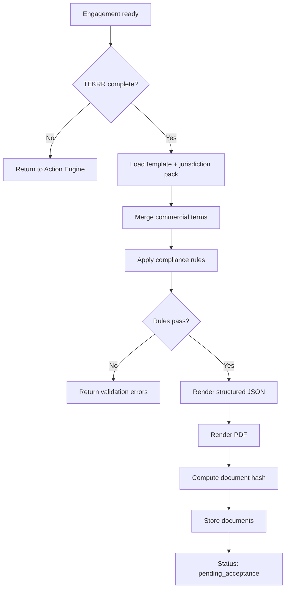

# Contract Engine — Architecture v1

**Engine ID:** `contract`  
**Version:** 1.0  
**Owner domain:** Engagements, templates, contracts, acceptance, amendments

---

## 1. Purpose

The Contract Engine is APP13's **legal-structural core**. It orchestrates engagements between parties, validates that TEKRR decomposition is complete, generates binding contract documents from templates and rules, manages multi-party acceptance, and governs contract status through its full lifecycle.

**Invariant:** The platform recognizes no professional execution until a contract reaches `active` status.

---

## 2. Responsibilities

| In scope | Out of scope |
|----------|--------------|
| Engagement initiation and provider invitation | TEKRR field validation logic (delegates to Action) |
| Template and clause library management | Identity verification processing |
| Contract document generation (PDF + JSON) | Execution evidence storage |
| Party acceptance workflow | Complaint adjudication |
| Amendment chain management | Trust score computation |
| Contract status state machine | Payment collection (Billing context) |
| Verification snapshot at activation | |
| Jurisdiction template packs | |

---

## 3. Internal components

```
┌─────────────────────────────────────────────────┐
│                 Contract Engine                  │
├─────────────────────────────────────────────────┤
│  Engagement Manager  │  Template Registry       │
│  ──────────────────  │  ──────────────────      │
│  • create engagement │  • category templates    │
│  • invite parties    │  • clause library        │
│  • party roles       │  • jurisdiction packs    │
├──────────────────────┼──────────────────────────┤
│  Generation Pipeline │  Acceptance Orchestrator │
│  ───────────────────  │  ──────────────────────  │
│  • TEKRR → clauses   │  • party sign-off        │
│  • compliance checks │  • tier gating (Identity)│
│  • PDF + JSON output │  • activation trigger    │
├──────────────────────┴──────────────────────────┤
│  Amendment Manager │ Status Machine │ Archival   │
└─────────────────────────────────────────────────┘
```

---

## 4. Core entities (engine view)

| Entity | Description |
|--------|-------------|
| **Engagement** | Pre-contract workspace linking initiator, category, invited provider, TEKRR profile ref |
| **Contract** | Generated legal artifact with parties, TEKRR snapshot, commercial terms, status |
| **ContractParty** | Actor + role (customer, provider, company_cosigner, etc.) + acceptance record |
| **Template** | Versioned TEKRR question ref + clause assembly rules |
| **Amendment** | Delta record requiring re-acceptance |
| **ContractDocument** | Rendered PDF hash + structured JSON + storage ref |

---

## 5. Generation pipeline



### Compliance rules (examples)

| Rule | Source |
|------|--------|
| Provider tier ≥ category minimum | Identity Engine |
| Customer tier ≥ T1 | Identity Engine |
| Risk level ≥ 4 → insurance clause injected | Template + TEKRR |
| Required credentials present in TEKRR | Action Engine profile |
| All mandatory TEKRR fields populated | Action Engine |

---

## 6. Party model

### 6.1 MVP parties

| Role | Required for activation | Acceptance |
|------|------------------------|------------|
| `customer` | Yes | Digital acceptance + T1 |
| `provider` | Yes | Digital acceptance + category min tier |

### 6.2 Phase 2 parties

| Role | Description |
|------|-------------|
| `company_cosigner` | Company-mediated contract approver |
| `company_sponsor` | Optional vouching party |
| `insurance_attestor` | Coverage confirmation party |
| `government_witness` | Regulatory acknowledgment |

---

## 7. Commercial terms (party-supplied)

Contract Engine **stores but does not set**:

| Field | Description |
|-------|-------------|
| total_price | Amount in contract currency |
| payment_schedule | Milestone or on-completion terms (declarative MVP) |
| payment_method_note | Free text / external reference |
| cancellation_policy | Selected from template options |

---

## 8. Amendment workflow

1. Either party requests amendment with TEKRR delta and/or commercial delta
2. Action Engine validates and produces amended TEKRR profile version
3. Contract Engine generates amendment document (linked to parent contract)
4. All affected parties re-accept
5. On full acceptance: emit `contract.amended`; Action Engine updates obligation graph

**Amendment statuses:** `draft` · `pending_acceptance` · `active` · `rejected`

---

## 9. External APIs (engine-to-engine)

### 9.1 Calls to other engines

| Target | Operation | When |
|--------|-----------|------|
| Action | `validateTekrrComplete` | Pre-generation |
| Action | `getTekrrSnapshot` | Generation + activation |
| Action | `materializeObligations` | On activation |
| Action | `applyTekrrAmendmentDelta` | On amendment |
| Identity | `checkTierRequirement` | Pre-acceptance per party |
| Identity | `getVerificationSnapshot` | On activation |

### 9.2 Called by Complaint Engine

| Operation | Description |
|-----------|-------------|
| `getContract(contract_id)` | Full contract + parties |
| `validateComplaintWindow(contract_id)` | Filing eligibility |
| `finalizeCompletion(contract_id)` | Post-complaint closure |

### 9.3 Events emitted

See [Business Architecture](../01-business-architecture.md) §5.3.

---

## 10. Document integrity

| Mechanism | Description |
|-----------|-------------|
| Content hash | SHA-256 of canonical JSON representation |
| PDF hash | SHA-256 of rendered PDF |
| Version binding | Contract references exact template + TEKRR snapshot versions |
| Audit trail | Immutable log: generated, viewed, accepted, amended |
| Phase 3 option | External timestamp anchoring |

---

## 11. MVP scope

- 2-party contracts only
- 3–5 category templates, single jurisdiction pack
- Email-based provider invitation (no discovery)
- Basic amendments (TEKRR + commercial delta)
- PDF + JSON output
- Contract lifecycle fee trigger on activation

---

## 12. Invariants

- INV-C1: Contract cannot reach `active` without all required party acceptances.
- INV-C2: Contract cannot reach `active` without TEKRR snapshot and verification snapshots stored.
- INV-C3: Generated document hash must match stored artifact on every retrieval.
- INV-C4: Voided or expired pending contracts cannot be activated.
- INV-C5: Contract Engine never mutates TEKRR profile directly.
