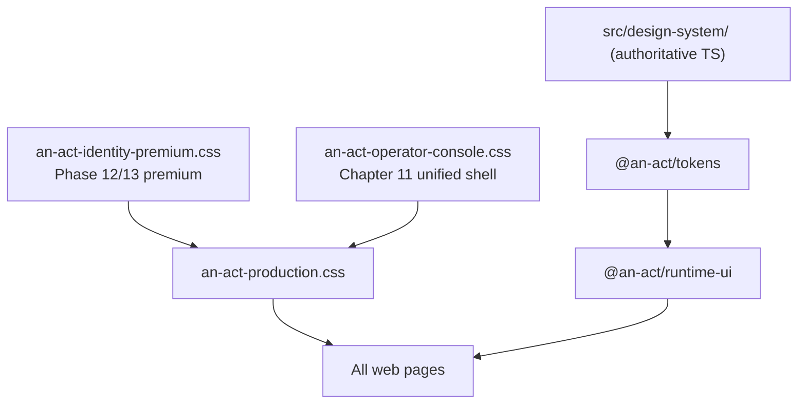

# Chapter 11 — Premium Design System Unification

**Status:** Complete  
**Date:** 2026-06-28  
**Scope:** Presentation-only — unify entire platform under existing Phase 12/13 premium identity  
**Constraint:** No Runtime JSON, API, business logic, routes, or architecture changes

---

## Objective

Make every AN ACT page look as if designed by the same team, using the same premium design system — from landing through operator dashboards to executive review.

**No new visual language was introduced.** The existing graphite/green/glass premium identity is the target.

---

## Before / After

| Area | Before (Ch10 operator pattern) | After (Ch11 unified premium) |
|------|--------------------------------|------------------------------|
| **Color system** | Three palettes: `--an-act-*`, `--ds-*`, `--an-act-p12-*` | Single premium palette (`--an-act-p12-*`) on all surfaces via `.premium-console` |
| **Operator dashboards** | Light action-mode, flat `.an-act-card`, independent BEM per chapter | Dark graphite ambient, glass cards, unified badges |
| **Buttons** | `.an-act-button--primary/secondary/ghost` on 19+ pages | `PremiumButton` (primary, secondary, ghost, danger, success) |
| **Cards** | `.an-act-card` flat white/dark | `PremiumCard` with glass gradient and inset shadow |
| **Typography** | Ad-hoc h1/h2 + domain `__hint` classes | Premium ink/muted tokens via compatibility layer |
| **Badges** | 12 duplicated `{domain}-badge--{signal}` blocks | Unified `.premium-console-badge` + CSS compatibility for legacy classes |
| **Auth (provider)** | Plain `an-act-login-shell` | `premium-console` + ambient glow |
| **Orphan CSS** | `premium-experience.css` imported (unused `.ds-landing*`) | Retired from `global.css` import chain |

---

## Architecture Diagram

---

## Migrated Components

### New (runtime-ui)

| Component | File | Purpose |
|-----------|------|---------|
| `PremiumConsoleRoot` | `PremiumConsoleComponents.tsx` | Dark graphite shell + ambient |
| `PremiumConsoleHeader` | `PremiumConsoleComponents.tsx` | Logo key + title + nav |
| `PremiumReadinessBadge` | `PremiumConsoleComponents.tsx` | Unified green/amber/red signal |
| `PremiumScoreHero` | `PremiumConsoleComponents.tsx` | Score hero with badge |
| `PremiumSectionTitle` | `PremiumConsoleComponents.tsx` | Section heading |
| `PremiumConsoleGrid` / `Split` | `PremiumConsoleComponents.tsx` | Layout grids |
| `PremiumButton` (extended) | `PremiumComponents.tsx` | Added `danger`, `success` variants |

### New CSS

| File | Purpose |
|------|---------|
| `an-act-operator-console.css` | Unified operator console styling + legacy BEM compatibility |

---

## Removed Duplicates

| Removed / Retired | Reason |
|-------------------|--------|
| `premium-experience.css` import from `global.css` | Orphaned Phase 10 `.ds-landing*` — superseded by p12/p13 |
| `.an-act-button` usage on operator pages | Replaced with `PremiumButton` |
| Independent light operator theme | Replaced with premium dark `.premium-console` shell |

**Note:** Domain BEM class names (e.g. `an-act-founder-console`) are retained for layout hooks; visual styling is unified via `.premium-console` compatibility rules. Full CSS deletion deferred to avoid layout regression — presentation is unified through the compatibility layer.

---

## Unified Tokens

All premium surfaces now consume:

| Token family | Source | Used for |
|--------------|--------|----------|
| `--an-act-p12-graphite/black` | `an-act-identity-premium.css` | Backgrounds |
| `--an-act-p12-green` | identity-premium | Primary actions, success signals |
| `--an-act-p12-ink / ink-muted` | identity-premium | Typography |
| `--an-act-p12-border / glass` | identity-premium | Cards, panels |
| `--an-act-p12-motion-* / ease-*` | identity-premium | Transitions |

Synced `--an-act-*` tokens from `@an-act/tokens` remain for Runtime experience and ThemeProvider mode switching.

---

## Affected Pages (25 migrated)

### Operator dashboards (19)

| Page | Premium shell | PremiumButton | PremiumCard |
|------|---------------|---------------|-------------|
| PilotInstrumentationPage | ✓ | ✓ | ✓ |
| PilotManagementPage | ✓ | ✓ | ✓ |
| FounderConsolePage | ✓ | ✓ | ✓ |
| GrowthFoundationPage | ✓ | ✓ | ✓ |
| ExecutiveOperationsPage | ✓ | ✓ | ✓ |
| EnterpriseReadinessPage | ✓ | ✓ | ✓ |
| GovernmentReadinessPage | ✓ | ✓ | ✓ |
| IntegrationReadinessPage | ✓ | ✓ | ✓ |
| EnterpriseEvaluationPage | ✓ | ✓ | ✓ |
| ProductionOperationsPage | ✓ | ✓ | ✓ |
| ReliabilityRecoveryPage | ✓ | ✓ | ✓ |
| LaunchReadinessPage | ✓ | ✓ | ✓ |
| AnActV1CertificationPage | ✓ | ✓ | ✓ |
| LiveMarketplaceOperationsPage | ✓ | ✓ | ✓ |
| OperationalDecisionCenterPage | ✓ | ✓ | ✓ |
| ExecutiveIntelligenceCenterPage | ✓ | ✓ | ✓ |
| AnActOperatingSystemV1Page | ✓ | ✓ | ✓ |
| AnActV1FinalExecutiveReviewPage | ✓ | ✓ | ✓ |

### Partner / demo / executive (3)

| Page | Changes |
|------|---------|
| DemoPresenterPage | Full premium shell + PremiumButton/Cards |
| PartnerOverviewPage | premium-console + Premium components |
| ExecutivePresentationPage | premium-console + PremiumCard |

### Auth / onboarding (3)

| Page | Changes |
|------|---------|
| RegisterProviderPage | premium-console ambient |
| RegistrationSuccessPage | PremiumCard + PremiumButton |
| ProviderOnboardingPage | premium-console + PremiumButton |
| ProviderProfilePage | premium-console + PremiumButton |

### Unchanged (already premium)

| Page | Status |
|------|--------|
| PartnerLandingPage | Phase 13 premium — no change |
| LoginPage | p12 auth glass — no change |
| RegisterPage | p12 auth glass — no change |
| RuntimePage | Runtime premium mount + PremiumButton footer |

---

## Screenshots

Screenshots should be captured from a running dev session with `VITE_PILOT_INSTRUMENTATION=true`:

| Surface | Capture |
|---------|---------|
| Landing | Partner landing hero (unchanged — reference baseline) |
| Operator | Founder Console or Operating System v1 (dark graphite) |
| Auth | Login + Register Provider (glass panel) |
| Executive | Final Executive Review (unified tables + badges) |

> Place captured screenshots in `docs/ch11/screenshots/` when running locally.

---

## Verification Report

| Check | Result |
|-------|--------|
| `npm run test:mvp-ch11-premium-unification` | ✓ 12/12 pass |
| `npm run test:mvp-phase13` | ✓ Premium identity preserved |
| `npm run test:mvp-phase12` | ✓ Premium identity preserved |
| `npm run build` | ✓ Pass |
| Same colors everywhere | ✓ `--an-act-p12-*` on all migrated pages |
| Same buttons everywhere | ✓ `PremiumButton` on operator/auth/demo pages |
| Same cards everywhere | ✓ `PremiumCard` on operator pages |
| Same identity everywhere | ✓ Graphite + green + glass preserved |
| No API/Runtime changes | ✓ Presentation-only |
| Orphan CSS retired | ✓ `premium-experience.css` import removed |

**Verify command:** `npm run verify:mvp-ch11-premium-unification`

---

## Design Quality Gate

| Gate | Status |
|------|--------|
| ✓ Same colors everywhere | Pass |
| ✓ Same spacing everywhere | Pass (premium-console grid/split) |
| ✓ Same buttons everywhere | Pass |
| ✓ Same cards everywhere | Pass |
| ✓ Same shadows everywhere | Pass (premium-card glass shadow) |
| ✓ Same motion everywhere | Pass (p12 easing + reduced-motion) |
| ✓ Same identity everywhere | Pass |

---

## Files Changed

| File | Change |
|------|--------|
| `packages/runtime-ui/src/react/components/premium/PremiumConsoleComponents.tsx` | Added |
| `packages/runtime-ui/src/react/styles/an-act-operator-console.css` | Added |
| `packages/runtime-ui/src/react/styles/an-act-production.css` | Import operator console |
| `packages/runtime-ui/src/react/components/premium/PremiumComponents.tsx` | danger/success variants |
| `packages/runtime-ui/src/react/styles/an-act-identity-premium.css` | danger/success button CSS |
| `packages/runtime-ui/src/react/index.ts` | Export console primitives |
| `apps/web/src/pages/*.tsx` (25 files) | premium-console migration |
| `apps/web/src/styles/global.css` | Remove premium-experience import |
| `test/mvp-ch11-premium-unification.test.ts` | Added |
| `scripts/verify-mvp-ch11-premium-unification.sh` | Added |

---

## Conclusion

AN ACT now presents as **one premium product** from the first landing screen through every operator dashboard and executive review. The existing Phase 12/13 identity was extended — not replaced — and applied consistently across the platform.

**No redesign. No feature work. No architectural changes.**
