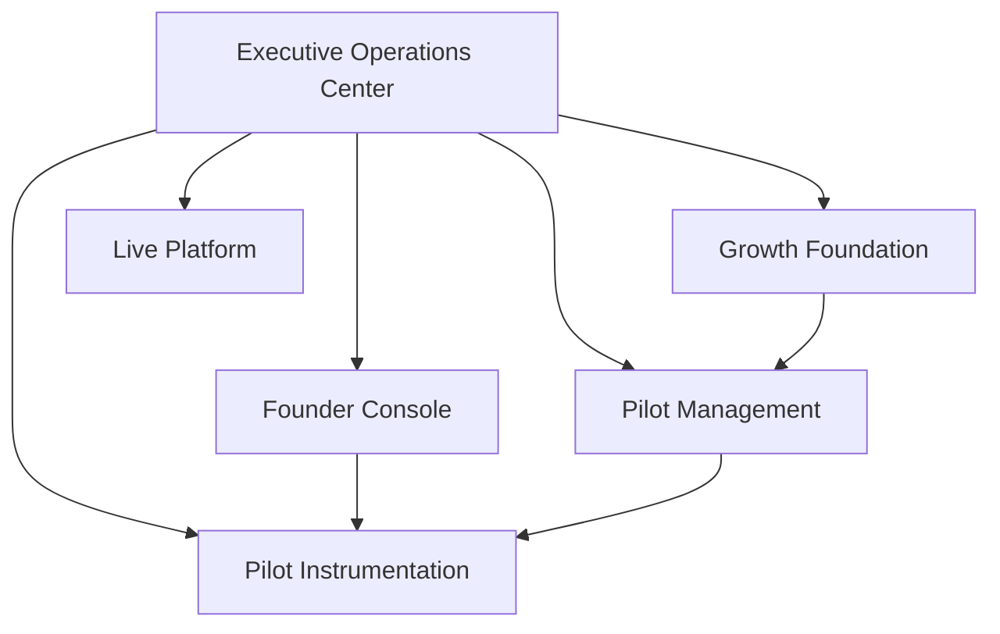

# Chapter 7 — Completion Report

**Pilot Operations & Growth Foundation**

**Status:** Complete  
**Date:** 2026-06-28

---

## Mission

Transition from building the product to operating the product — operational excellence, founder visibility, pilot execution, and marketplace activation readiness without feature expansion.

---

## Sprint Deliverables

| Sprint | RC | Score | Focus |
|--------|-----|-------|-------|
| 1 | Founder Operations RC | 91 | Daily overview, health, recommendations, action center |
| 2 | Pilot Management RC | 90 | Cohorts, sessions, feedback, follow-up board |
| 3 | Growth Foundation RC | 90 | Early access, invitations, waitlist, referrals, activation |
| 4 | Executive Operations Center RC | 91 | Unified leadership dashboard |

**Chapter 7 overall: 91/100**

---

## Operator Architecture

All layers are client-side, privacy-safe, and use existing pilot instrumentation as the primary data source where applicable.



---

## Verification

```bash
npm run verify:mvp-ch7-sprint4
```

Full Chapter 7 regression chain passes with zero production regressions.

---

## Readiness for Next Phase

AN ACT is ready for:

- Daily executive operational reviews via Executive Operations Center
- Controlled pilot cohort execution via Pilot Management
- Early access planning via Growth Foundation
- Continued pilot validation with instrumentation export

Not ready for (by design):

- Public-scale launch
- Automated marketing
- Server-side operator analytics (future infrastructure)

---

## Final Recommendation

**Chapter 7 approved.** Proceed with controlled early access execution using the operator stack as the operational backbone.
