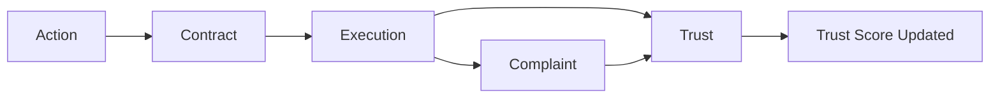

# APP13 — Action → Contract → Execution → Trust → Complaint

**Version:** 1.0  
**Status:** Specification  
**Scope:** Cross-engine chain for all MVP contract templates

---

## 1. Chain overview

Every professional action on APP13 follows one accountable chain:



| Stage | Engine | Entity | Output |
|-------|--------|--------|--------|
| **Action** | Action Engine | Action | TEKRR profile complete |
| **Contract** | Contract Engine | Contract | Proposed → Accepted → Active |
| **Execution** | Action Engine | Milestones + Evidence | Completed |
| **Trust** | Identity Engine | Trust Score | Component signals applied |
| **Complaint** | Complaint Engine | Complaint | Resolved → Closed (if triggered) |

---

## 2. Stage 1 — Action

| Step | Event | Gate |
|------|-------|------|
| User selects action type from taxonomy | `action.type_selected` | — |
| TEKRR profile completed | `action.tekrr_complete` | All template inputs valid |
| Provider linked | `action.provider_linked` | Provider invited/accepted |
| Action ready for contract | `action.ready` | VR-001 through VR-008 pass |

**Template loaded:** `CT-{action_code}@v1`

---

## 3. Stage 2 — Contract

| Step | State transition | Event |
|------|------------------|-------|
| Generate from template | → Proposed | `contract.proposed` |
| Customer accepts | — | `contract.party_accepted` |
| Provider accepts | → Accepted | `contract.party_accepted` |
| Activate | → Active | `contract.activated` |
| Milestones materialized | — | `milestones.created` |

**Snapshots stored at Active:** TEKRR snapshot, verification snapshot, document hash.

---

## 4. Stage 3 — Execution

| Step | Milestone | Evidence | Event |
|------|-----------|----------|-------|
| Provider confirms access/start | M-ACCESS / M-SCOPE / M-WIP | EV-TS | `milestone.started` |
| Work performed | M-WIP / M-DELIVER | EV-PHOTO, EV-DOC, etc. | `milestone.evidence_submitted` |
| Verification | M-VERIFY | EV-TEST, EV-CHECK, EV-CRED | `milestone.verified` |
| Customer accepts | M-ACCEPT | EV-SIGN | `milestone.accepted` |
| All complete | M-COMPLETE | EV-TS | `contract.completed` |

**Issue path during execution:**

| Step | State | Event |
|------|-------|-------|
| Party flags problem | Issue Raised | `contract.issue_raised` |
| Complaint filed | Disputed | `complaint.filed` |
| Milestone/dimension frozen | — | `execution.frozen` |

---

## 5. Stage 4 — Trust

On `contract.completed` (and after complaint `closed`):

| Trust component | Weight | Signal source |
|-----------------|--------|---------------|
| Verification | 30% | Snapshot at activation (baseline) |
| Execution Success | 30% | Milestone completion ratio + attestation outcome |
| Time Commitment | 20% | On-time vs late milestones |
| Complaints | 10% | Complaint resolution outcome (if any) |
| Customer Evaluation | 10% | Post-completion EVAL-{domain}-v1 form |

**Events emitted to Identity Engine:**

```
trust.execution.milestone_completed
trust.execution.milestone_failed
trust.time.on_time
trust.time.late
trust.evaluation.received
trust.complaint.resolved  (from Complaint Engine)
```

**Recomputation trigger:** `contract.completed`, `complaint.closed`, `evaluation.submitted`

---

## 6. Stage 5 — Complaint

Only if triggered (Issue Raised → Disputed):

| Step | Complaint state | Contract state |
|------|-----------------|----------------|
| File | filed | Disputed |
| Triage pass | evidence_gathering | Disputed |
| Mediation | mediation | Disputed |
| Adjudicate | resolved_* | Resolved |
| Apply outcome | closed | Closed |

**Trust impact on close:**

| Outcome | Complaints component | Execution component |
|---------|---------------------|---------------------|
| upheld_provider_fault | Penalty by severity | Dimension unfulfilled |
| dismissed | No penalty | Original attestation restored |
| shared_fault | Partial penalty | Partially fulfilled |

**MVP SLA:** 15 business days median.

---

## 7. Per-template chain summary

| Action | Template | Milestones | Primary trust signals | Top complaint triggers |
|--------|----------|------------|----------------------|------------------------|
| A.2.1 Surface Repair | CT-A.2.1@v1 | 5 | Time (deadline), Execution (verify) | EFFORT, RISK |
| A.4.1 Routine Maintenance | CT-A.4.1@v1 | 5 | Execution (checklist) | EFFORT, TIME |
| A.4.2 Cleaning | CT-A.4.2@v1 | 5 | Execution (areas) | EFFORT, RISK |
| B.1.2 Plumbing | CT-B.1.2@v1 | 6 | Verification (T2), Execution (test) | RISK, KNOWLEDGE |
| B.2.1 Electrical | CT-B.2.1@v1 | 6 | Verification, Time (strict) | RISK, KNOWLEDGE |
| B.3.3 Troubleshooting | CT-B.3.3@v1 | 6 | Time (SLA), Execution (resolution) | TIME, EFFORT |
| C.1.1 Strategy Consulting | CT-C.1.1@v1 | 5 | Execution (deliverables) | EFFORT, TIME |
| C.1.2 Operations Advisory | CT-C.1.2@v1 | 5 | Execution (plan) | EFFORT |
| D.1.1 Personal Care | CT-D.1.1@v1 | 3+recurring | Verification (T2), Time (sessions) | RISK, TIME |
| D.3.1 Household Aid | CT-D.3.1@v1 | 3+recurring | Execution (tasks) | EFFORT, RISK |
| E.1.1 Graphic Design | CT-E.1.1@v1 | 5 | Execution (files), Time | EFFORT, IP/S |
| E.3.1 Software Dev | CT-E.3.1@v1 | 6 | Execution (tests), Time (phases) | EFFORT, RISK |
| F.1.2 Event Coordination | CT-F.1.2@v1 | 7 | Time (pre-event, day-of) | TIME, EFFORT |
| G.1.1 Tutoring | CT-G.1.1@v1 | 3+recurring | Time (sessions), Execution (logs) | TIME, KNOWLEDGE |
| H.1.1 Property Assessment | CT-H.1.1@v1 | 6 | Verification (T2), Execution (report) | KNOWLEDGE, EFFORT |

---

## 8. Entity relationships in chain

```mermaid
erDiagram
    USER ||--o{ ACTION : initiates_or_executes
    ORGANIZATION ||--o{ USER : optional_context
    ACTION ||--|| CONTRACT : generates
    CONTRACT ||--o{ CONTRACT_MILESTONE : contains
    CONTRACT_MILESTONE ||--o{ EVIDENCE : proven_by
    CONTRACT ||--o| COMPLAINT : may_trigger
    USER ||--|| TRUST_SCORE : has_provider_profile
    CONTRACT ||--o{ TRUST_EVENT : emits
    COMPLAINT ||--o{ TRUST_EVENT : emits
    TRUST_EVENT --> TRUST_SCORE : recomputes
```

---

## 9. MVP exclusions in chain

| Excluded | Chain impact |
|----------|--------------|
| Payments | commercial_terms note only; no payment gate |
| Escrow | no hold/release in execution |
| Regulators | no external attestation step |
| Insurance | risk declared; no coverage verification milestone |
| Institutional | no org overlay on contract generation |

---

## 10. Document index

| Document | Path |
|----------|------|
| Contract Engine master | [CONTRACT-ENGINE-v1.md](./CONTRACT-ENGINE-v1.md) |
| Template index | [templates/README.md](./templates/README.md) |
| Universal schema | [templates/00-universal-schema.md](./templates/00-universal-schema.md) |
| Domain templates | [templates/domain-*.md](./templates/) |

---

*End of chain specification.*
