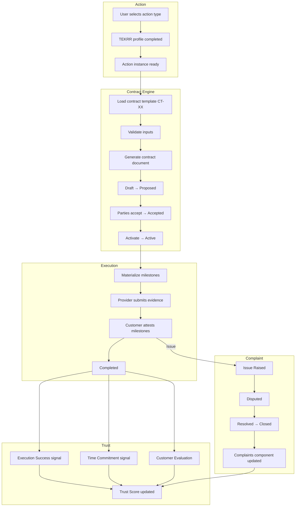
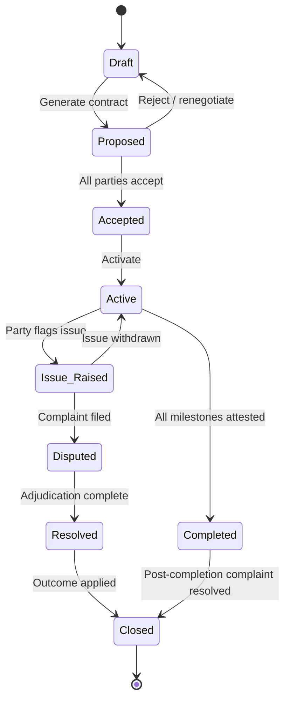

# APP13 Contract Engine v1

**Version:** 1.0  
**Status:** Specification — Pre-implementation  
**Last updated:** June 19, 2026  
**Depends on:** [Action Taxonomy v1](../APP13-Action-Taxonomy-v1.md) · [Approval Addendum v1.1](../architecture/APPROVAL-ADDENDUM-v1.1.md)

---

## Document purpose

This specification defines **Contract Engine v1** — the system that transforms classified Actions into binding Contracts, orchestrates Execution through Milestones and Evidence, feeds Trust Score computation, and connects to the Complaint Engine when issues arise.

**Core chain:**

```
Action → Contract → Execution → Trust → Complaint
```

**No application code or UI is included.**

---

## Related documents

| Document | Contents |
|----------|----------|
| [Universal Template Schema](./templates/00-universal-schema.md) | Standard 8-section format for every action |
| [MVP Contract Templates — Index](./templates/README.md) | All 15 MVP action templates |
| Domain template packs | A–H domain files under `./templates/` |

---

## 1. Engine role in the platform

APP13 is a **Professional Operating System**. The Contract Engine is not a marketplace checkout. It is the **binding layer** that converts a decomposed Action (TEKRR profile) into an auditable Contract with trackable Execution.

| Engine | Role in chain |
|--------|---------------|
| **Action Engine** | Classifies work, builds TEKRR profile, owns Action instance |
| **Contract Engine** | Selects template, validates inputs, generates contract, manages lifecycle |
| **Execution (Action Engine)** | Materializes milestones, collects evidence, records attestations |
| **Identity Engine** | Computes Trust Score from contract outcomes |
| **Complaint Engine** | Handles Issue Raised → Disputed → Resolved → Closed |

---

## 2. End-to-end flow



---

## 3. Contract Engine components

```
┌──────────────────────────────────────────────────────────────┐
│                    Contract Engine v1                         │
├──────────────────────────────────────────────────────────────┤
│  Template Registry          │  Input Validator               │
│  • CT-{action_code}@v1      │  • TEKRR completeness          │
│  • clause libraries         │  • tier gates                  │
│  • milestone patterns       │  • cross-field rules           │
├─────────────────────────────┼────────────────────────────────┤
│  Generation Pipeline        │  Lifecycle Manager             │
│  • TEKRR → clauses          │  • state machine               │
│  • PDF + JSON output        │  • acceptance orchestration    │
│  • document hash            │  • issue path routing          │
├─────────────────────────────┴────────────────────────────────┤
│  Milestone Factory │ Evidence Rules │ Trust Event Emitter     │
└──────────────────────────────────────────────────────────────┘
```

---

## 4. Template registry

Every MVP action type has exactly one contract template:

| Template ID | Action Code | Action Name |
|-------------|-------------|-------------|
| `CT-A.2.1@v1` | A.2.1 | Surface Repair |
| `CT-A.4.1@v1` | A.4.1 | Routine Maintenance |
| `CT-A.4.2@v1` | A.4.2 | Cleaning & Sanitization |
| `CT-B.1.2@v1` | B.1.2 | Plumbing Service |
| `CT-B.2.1@v1` | B.2.1 | Electrical Installation |
| `CT-B.3.3@v1` | B.3.3 | Technical Troubleshooting |
| `CT-C.1.1@v1` | C.1.1 | Strategy Consulting |
| `CT-C.1.2@v1` | C.1.2 | Operations Advisory |
| `CT-D.1.1@v1` | D.1.1 | Personal Care Assistance |
| `CT-D.3.1@v1` | D.3.1 | Household Management Aid |
| `CT-E.1.1@v1` | E.1.1 | Graphic Design |
| `CT-E.3.1@v1` | E.3.1 | Custom Software Development |
| `CT-F.1.2@v1` | F.1.2 | Event Coordination |
| `CT-G.1.1@v1` | G.1.1 | One-to-One Tutoring |
| `CT-H.1.1@v1` | H.1.1 | Property Condition Assessment |

Full per-action specifications: [templates/README.md](./templates/README.md)

---

## 5. Universal template schema (8 sections)

Every contract template defines these sections identically in structure:

| # | Section | Purpose |
|---|---------|---------|
| 1 | **Contract Template** | Identity, clauses, TEKRR emphasis, tier/risk defaults |
| 2 | **Inputs** | Required party inputs and TEKRR fields |
| 3 | **Outputs** | Artifacts produced by contract and execution |
| 4 | **Evidence Requirements** | Required evidence per milestone |
| 5 | **Milestones** | Ordered checkpoint sequence |
| 6 | **Acceptance Rules** | Who accepts, gates, completion criteria |
| 7 | **Trust Score Impact** | Which trust components receive signals |
| 8 | **Complaint Triggers** | Conditions that open issue/complaint path |

Schema detail: [templates/00-universal-schema.md](./templates/00-universal-schema.md)

---

## 6. Contract lifecycle (approved)

### 6.1 Primary path

| State | Contract Engine behavior |
|-------|-------------------------|
| **Draft** | Action TEKRR editable; template not yet generated |
| **Proposed** | Contract generated; parties review document |
| **Accepted** | All parties digitally accepted; snapshots stored |
| **Active** | Milestones materialized; execution permitted |
| **Completed** | All milestones attested; trust events emitted |

### 6.2 Issue path

| State | Contract Engine behavior |
|-------|-------------------------|
| **Issue Raised** | One or more milestones flagged; partial evidence freeze |
| **Disputed** | Complaint Engine case linked; affected dimensions frozen |
| **Resolved** | Adjudication outcome applied to execution record |
| **Closed** | Terminal; trust and complaint components updated |



---

## 7. Generation pipeline

| Step | Action | Output |
|------|--------|--------|
| 1 | Resolve action type → template ID | Template loaded |
| 2 | Validate inputs against template schema | Pass / error list |
| 3 | Identity tier gate check | Pass / block |
| 4 | Merge TEKRR snapshot + clause library | Structured contract JSON |
| 5 | Apply jurisdiction pack (MVP: single pack) | Clauses appended |
| 6 | Render PDF + compute hash | Contract document |
| 7 | Create contract record | Status → Proposed |
| 8 | Emit `contract.proposed` | Notification |

**Activation (Accepted → Active):**

| Step | Action |
|------|--------|
| 1 | Store TEKRR snapshot + verification snapshot |
| 2 | Materialize milestones from template pattern |
| 3 | Status → Active |
| 4 | Emit `contract.activated` |
| 5 | Execution window opens |

---

## 8. Milestone factory

On activation, Contract Engine instantiates milestones from template **Section 5**:

| Property | Source |
|----------|--------|
| `milestone_code` | Template (e.g., M-ACCESS) |
| `sequence_order` | Template |
| `responsible_party` | Template default |
| `due_at` | Computed from TEKRR Time fields |
| `required_evidence` | Template Section 4 |
| `status` | `pending` |

---

## 9. Trust Score integration

Approved weights (Contract Engine emits events; Identity Engine computes):

| Component | Weight | Contract Engine emits |
|-----------|--------|----------------------|
| Verification | 30% | Snapshot at activation (not per-contract delta) |
| Execution Success | 30% | `milestone.completed` ratio on contract close |
| Time Commitment | 20% | `milestone.on_time` / `milestone.late` per milestone |
| Complaints | 10% | Delegated to Complaint Engine on resolution |
| Customer Evaluation | 10% | `evaluation.submitted` post-completion |

**Per-template trust impact** defined in each template Section 7.

---

## 10. Complaint integration

Contract Engine does not adjudicate. It:

1. Transitions `Active → Issue Raised` when party flags milestone/dimension
2. Transitions `Issue Raised → Disputed` when Complaint Engine accepts filing
3. Transitions `Disputed → Resolved → Closed` on Complaint Engine callback
4. Applies milestone/dimension freeze during dispute

**Per-template complaint triggers** defined in each template Section 8.

**MVP SLA:** 15 business days median resolution.

---

## 11. Clause library (shared)

All templates draw from versioned clause modules:

| Clause module | Applies when |
|---------------|--------------|
| `CL-CORE-001` | All contracts — parties, definitions, TEKRR binding |
| `CL-CORE-002` | All contracts — acceptance and amendment rules |
| `CL-CORE-003` | All contracts — dispute and complaint reference |
| `CL-TIME-001` | All — schedule and deadline obligations |
| `CL-EFFORT-001` | Physical/technical — scope and deliverables |
| `CL-KNOW-001` | Credential-required actions — standard of care |
| `CL-RISK-001` | Risk level ≥ 3 — liability allocation |
| `CL-RISK-002` | Risk level ≥ 4 — hazard declaration binding |
| `CL-RESP-001` | All — acceptance criteria and sign-off |
| `CL-RESP-002` | Warranty period declared — warranty terms |
| `CL-IP-001` | Creative/domain E — intellectual property allocation |
| `CL-DATA-001` | Digital/domain B.3, E.3 — data handling declaration |
| `CL-CARE-001` | Domain D — duty of care and vulnerability acknowledgment |

Payment and escrow clauses **excluded** from MVP.

---

## 12. Input validation rules (cross-template)

| Rule ID | Rule |
|---------|------|
| VR-001 | Customer verification ≥ T1 before Proposed → Accepted |
| VR-002 | Provider verification ≥ template `min_provider_tier` |
| VR-003 | All template-required TEKRR fields populated |
| VR-004 | Risk level ≥ 4 → hazard declarations non-empty |
| VR-005 | Knowledge credentials declared match provider verified credentials |
| VR-006 | Scheduled start < completion deadline |
| VR-007 | At least one deliverable defined in Effort (where applicable) |
| VR-008 | Acceptance criteria defined in Responsibility |

---

## 13. Outputs (engine-level)

Every contract generation produces:

| Output | Format | Storage |
|--------|--------|---------|
| Contract record | Structured entity | Database |
| Contract JSON | Canonical machine-readable | Object storage |
| Contract PDF | Human-readable | Object storage |
| Document hash | SHA-256 | Contract record |
| Milestone set | Entity collection | Database |
| Verification snapshot | JSON | Contract record |
| TEKRR snapshot | JSON | Contract record |

---

## 14. MVP exclusions

| Excluded | Notes |
|----------|-------|
| Payments / escrow | Commercial terms declarative only |
| Regulator clauses | No government mandate injection |
| Insurance riders | Risk declared; no coverage API |
| Institutional overlays | No company policy packs |
| Multi-action contracts | One action per contract |
| Amendment engine | Phase 1.1 — MVP supports cancel + recreate |

---

## 15. Template index by domain

| Domain | File | Templates |
|--------|------|-----------|
| A Physical | [domain-A-physical.md](./templates/domain-A-physical.md) | A.2.1, A.4.1, A.4.2 |
| B Technical | [domain-B-technical.md](./templates/domain-B-technical.md) | B.1.2, B.2.1, B.3.3 |
| C Advisory | [domain-C-advisory.md](./templates/domain-C-advisory.md) | C.1.1, C.1.2 |
| D Care | [domain-D-care.md](./templates/domain-D-care.md) | D.1.1, D.3.1 |
| E Creative | [domain-E-creative.md](./templates/domain-E-creative.md) | E.1.1, E.3.1 |
| F Operational | [domain-F-operational.md](./templates/domain-F-operational.md) | F.1.2 |
| G Knowledge | [domain-G-knowledge.md](./templates/domain-G-knowledge.md) | G.1.1 |
| H Inspection | [domain-H-inspection.md](./templates/domain-H-inspection.md) | H.1.1 |

---

*End of Contract Engine v1 master specification.*
