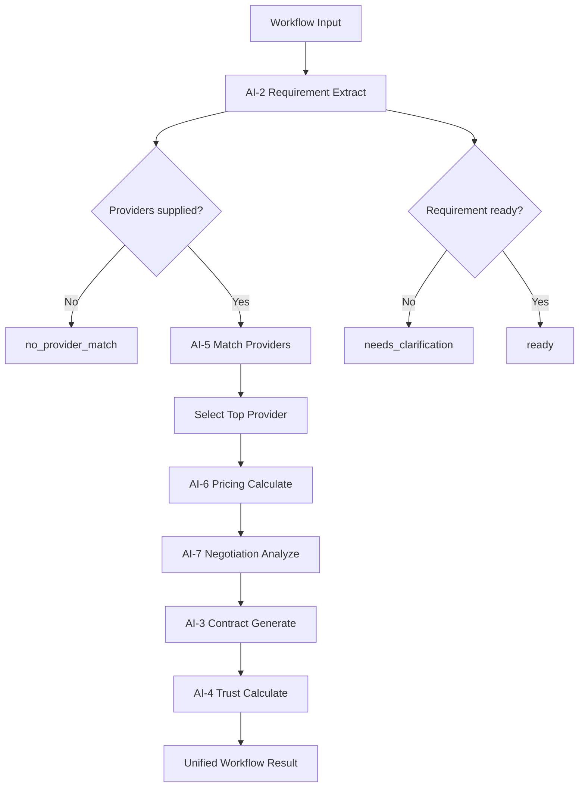

# AI-Orchestrator — Workflow Intelligence Implementation Notes

**Phase:** AI-Orchestrator (Workflow Intelligence — unified AI pipeline coordination)  
**Status:** Implemented — no external AI providers  
**Date:** 2026-06-19

---

## Summary

The AI-Orchestrator coordinates existing intelligence engines through a single read-only workflow endpoint. It performs **no database writes** and exposes `POST /ai/workflow/analyze` for authenticated clients.

**Non-binding:** Workflow output is advisory only. Contract creation and provider selection remain human-driven.

---

## Architecture

```
Client
  │
  ▼
POST /ai/workflow/analyze
  │
  ▼
WorkflowIntelligenceService
  │
  ├── AI-2 RequirementIntelligenceService.extract()
  ├── AI-5 MatchingIntelligenceService.rank()
  ├── AI-6 PricingIntelligenceService.calculate()
  ├── AI-7 NegotiationIntelligenceService.analyze()
  ├── AI-3 ContractIntelligenceService.generate()
  └── AI-4 TrustIntelligenceService.calculate()
```

### Module layout

```
src/orchestrator/intelligence/
  types.ts                         Input/output contracts
  workflow-intelligence-service.ts Pipeline orchestration
  index.ts                         Public exports
```

---

## Orchestration flow



### Step sequence

| Step | Engine | Purpose |
|------|--------|---------|
| 1 | AI-2 | Extract actions, deliverables, milestones, readiness |
| 2 | AI-5 | Rank provider candidates; select top match |
| 3 | AI-6 | Compute fair price range for selected provider |
| 4 | AI-7 | Analyze customer budget vs recommended/provider price |
| 5 | AI-3 | Generate scope, milestones, escrow plan, draft contract |
| 6 | AI-4 | Compute trust score, tier, and live frame color |

---

## Engine dependencies

| Orchestrator input | Consumed by |
|--------------------|-------------|
| `requirement_text`, `profession` | AI-2, AI-3 |
| `providers[]` | AI-5, AI-6, AI-4 |
| `customer_budget`, `customer_days` | AI-5, AI-7, AI-6 |
| AI-2 action codes | AI-5, AI-6 |
| Top provider trust/offer/days | AI-6, AI-7, AI-4 |
| AI-6 recommended price | AI-3, AI-7 |

The orchestrator adapts provider candidates to engine inputs. It does **not** duplicate engine business rules.

---

## Workflow status rules

| Condition | Status |
|-----------|--------|
| `providers.length === 0` | `no_provider_match` |
| AI-2 `contract_readiness` is `needs_clarification` or `unknown` | `needs_clarification` |
| Otherwise | `ready` |

When `no_provider_match`, downstream engine sections are returned as `null`.

---

## API

### `POST /ai/workflow/analyze`

**Auth:** Required (`authRequired: true`)

**Request body**

```json
{
  "profession": "software_developer",
  "requirement_text": "Build a React TypeScript software application website with backend API integration, admin dashboard, mobile app delivery in 3 weeks by month end sprint deadline.",
  "customer_budget": 15000,
  "customer_days": 14,
  "providers": [
    {
      "provider_id": "550e8400-e29b-41d4-a716-446655440001",
      "action_codes": ["E.3.1", "B.3.3"],
      "skills": ["frontend", "backend"],
      "trust_score": 92,
      "rating": 4.8,
      "price_offer": 12000,
      "estimated_days": 14,
      "latitude": 24.7,
      "longitude": 46.68
    }
  ]
}
```

**Response (excerpt)**

```json
{
  "workflow_status": "ready",
  "requirement": { "...": "AI-2 result" },
  "matching": {
    "ranked_matches": ["..."],
    "selected_provider_id": "550e8400-e29b-41d4-a716-446655440001"
  },
  "pricing": { "...": "AI-6 result" },
  "negotiation": { "...": "AI-7 result" },
  "contract": { "...": "AI-3 result" },
  "trust": { "...": "AI-4 result" },
  "summary": {
    "provider_id": "550e8400-e29b-41d4-a716-446655440001",
    "recommended_price": 13500,
    "trust_score": 92,
    "negotiation_state": "negotiable"
  }
}
```

---

## Examples

### Ready workflow

- Requirement includes stack and delivery signals → AI-2 `ready`
- Software developer provider outranks mismatched candidate
- Pricing, negotiation, contract, and trust sections populated

### Needs clarification

- Requirement missing stack/deadline signals → AI-2 `needs_clarification`
- Workflow still ranks providers and runs downstream engines
- `workflow_status = needs_clarification`

### No provider match

- Empty `providers` array
- Only AI-2 requirement output populated
- `workflow_status = no_provider_match`

---

## Boundaries

| Constraint | Compliance |
|------------|------------|
| Read-only | No database writes |
| Deterministic | Same input → same output |
| No LLM | Reuses AI-2 through AI-7 services only |
| No rule duplication | Engine libraries unchanged |
| Prior AI modules unchanged | AI-1 through AI-7 behavior untouched |

---

## Testing

```bash
npm run test:workflow
npm run verify:workflow
npm run build
npm run lint:imports
```

Test files:

- `test/ai-workflow-intelligence.test.ts` — ready, clarification, no match, determinism
- `test/ai-workflow-integration.test.ts` — HTTP + 401

---

## Out of scope (by design)

- Contract persistence
- Provider auto-assignment
- External AI orchestration
- AI-1 direct invocation (AI-3 resolves AI-1 internally when needed)
