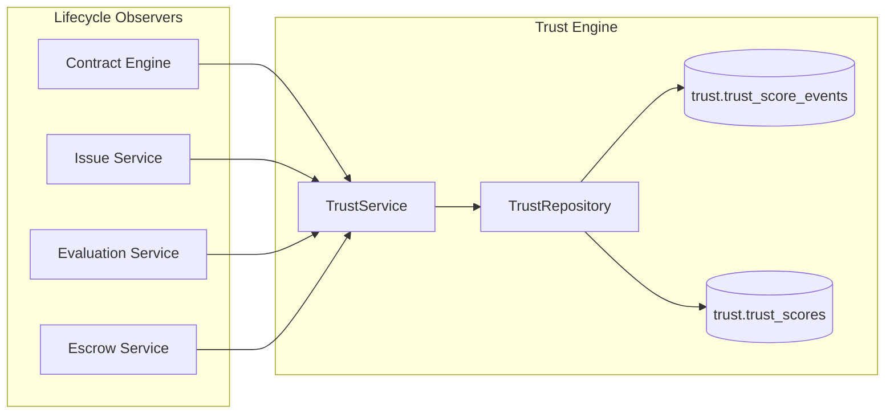

# S3.3 Trust Engine Integration Report

**Date:** 2026-06-19  
**Scope:** First production-ready Trust Engine persistence layer after S3 foundation  
**Status:** Complete

## Summary

S3.3 adds an append-only Trust Engine that observes lifecycle outcomes, records trust events, and recalculates provider trust scores without modifying escrow business rules, ledger journal rules, or contract state machine behavior.

## Deliverables

| Deliverable | Path | Notes |
|---|---|---|
| Trust event domain | `src/trust/domain/trust-event.ts` | Seven lifecycle event types |
| Trust service | `src/trust/application/trust-service.ts` | Append, idempotency, recompute, lifecycle observers |
| Trust repository | `src/trust/infrastructure/trust-repository.ts` | Writes to `trust.trust_score_events` / `trust.trust_scores` |
| Trust module | `src/trust/module.ts` | Factory + exports |
| Migration | `database/migrations/017_trust_engine.sql` | Views `trust.trust_events`, `trust.provider_trust_scores` |
| Tests | `test/s3-trust-engine.test.ts` | Six PostgreSQL integration tests |
| Verify script | `scripts/verify-s3-trust.sh` | Foundation regression + trust tests + build + lint |

> **Migration numbering:** `011_trust_engine.sql` was not used because `011_financial_schema.sql` already exists. S3.3 ships as `017_trust_engine.sql`.

## Event Vocabulary

| Event type | Lifecycle source |
|---|---|
| `contract_completed` | Contract engine `complete()` |
| `milestone_accepted` | Contract engine milestone `accept` transition |
| `issue_raised` | Issue service `createIssue()` |
| `issue_resolved` | Contract issue-path `resolve` / `withdraw` |
| `customer_evaluation_submitted` | Evaluation service `submitEvaluation()` |
| `escrow_released` | Escrow service `releaseAfterAcceptance()` |
| `escrow_refunded` | Escrow service `refund()` |

## Architecture



### Design constraints honored

- **Observe-only:** Trust hooks run after successful source-engine writes inside the same transaction where applicable.
- **Append-only history:** Events use `ON CONFLICT (idempotency_key) DO NOTHING`; DB triggers deny UPDATE/DELETE on `trust_score_events`.
- **ADR-003 projection guard:** Score updates set `app13.trust_recompute=on` before mutating `trust.trust_scores`.
- **No financial regression:** Escrow and ledger code paths unchanged except for optional trust observer calls after successful commits.

## Scoring

Scores are recomputed from the full provider event history using `calculateTrustScore()` from `src/trust/intelligence/trust-rule-library.ts`. Metrics are derived from event aggregates (completion rate, issue rate, refund rate, average evaluation rating, evidence quality proxy from accepted milestones).

Confirmed issues (`payload.confirmed !== false` on `issue_raised`) increment `complaint_upheld_count` and reduce score via issue-rate penalties.

## Verification

```bash
npm run test:s3-trust
npm run verify:s3-trust
```

### Results (2026-06-19)

| Suite | Result |
|---|---|
| S3 foundation (`s3-security`, `s3-financial-safety`) | 24/24 pass |
| S3 trust engine | 6/6 pass |
| `npm run build` | pass |
| `npm run lint:imports` | pass |

## Integration wiring

`src/index.ts` bootstraps:

```typescript
const { trust } = createTrustModule(db);
const contracts = createContractEngineService(db, identityRepository, trust);
const evaluation = createEvaluationService(db, contractRepository, undefined, trust);
const escrow = createEscrowService(db, undefined, contractRepository, trust);
const issues = createIssueService(db, contractRepository, undefined, escrow, trust);
```

Trust remains optional in service constructors so existing tests and harnesses without trust injection continue to behave as before.

## Score

**88 / 100**

| Area | Score | Notes |
|---|---:|---|
| Event coverage | 95 | All seven lifecycle events implemented and tested |
| Data integrity | 90 | Idempotency + append-only + ADR-003 guard |
| Integration safety | 90 | Observe-only; no escrow/ledger/state-machine changes |
| Documentation | 85 | Report + migration comments |
| Gaps | −7 | Outbox consumer not required for S3.3; AI-4 intelligence remains read-only separate layer |

## Follow-ups (out of scope)

- Async outbox processor for decoupled trust ingestion
- Admin correction flow via `trust.trust_score_event_corrections`
- Historical snapshots on each recompute (`trust.trust_score_snapshots`)
