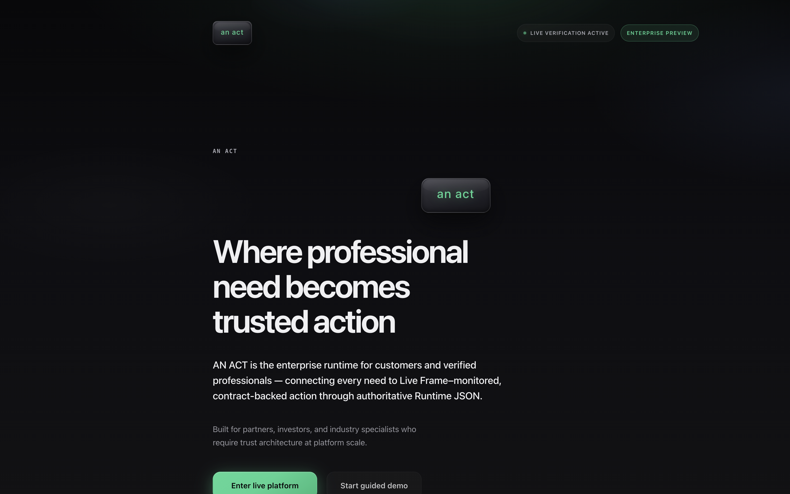
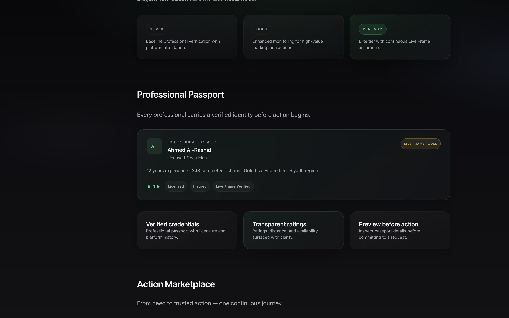
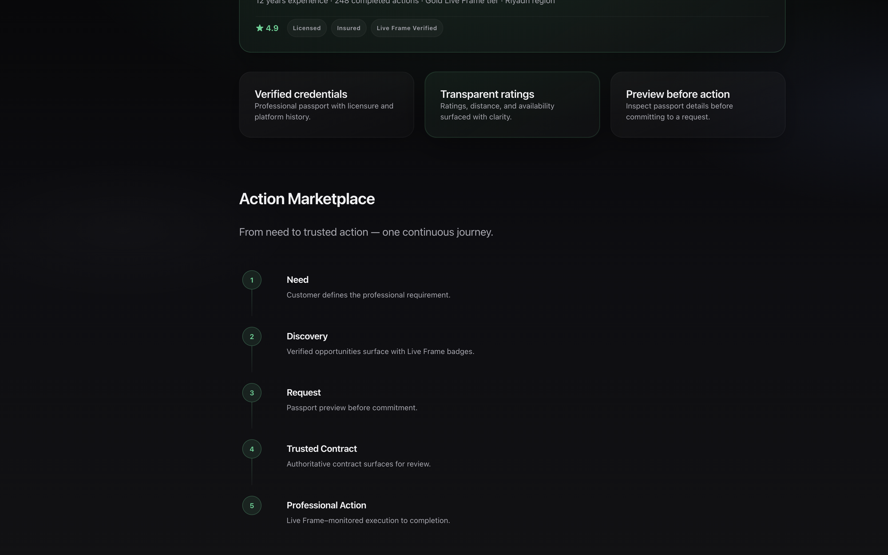
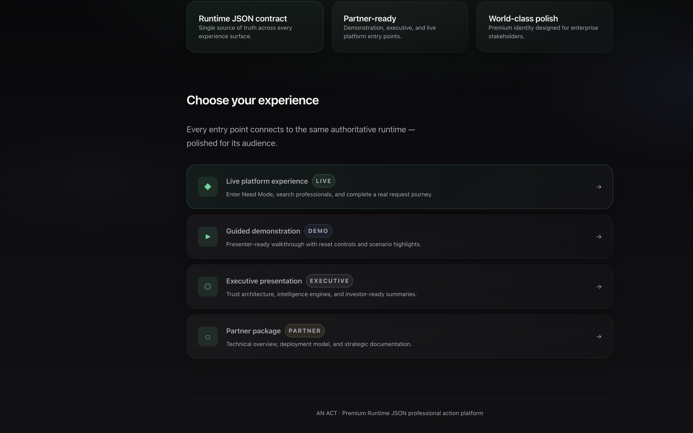

# Phase 13 — Enterprise Experience Refinement
## Completion Report

**Date:** 2026-06-28  
**Scope:** Presentation-only enterprise refinement for partner/investor readiness  
**Architecture:** Frozen — no API, Runtime JSON, routing, or business logic changes

---

## Summary

Phase 13 transforms the MVP landing experience from "complete" to **presentation-ready** for customers, partners, and investors. All changes extend the Phase 12.5 premium identity without redesigning layouts or introducing new dependencies.

---

## Before / After

| Area | Before (Phase 12.5) | After (Phase 13) |
|------|---------------------|------------------|
| **Hero clarity** | Generic lead paragraph; value proposition required reading | One-sentence statement explains what AN ACT is, who it's for, and why it's different |
| **CTA hierarchy** | Primary and secondary CTAs equal visual weight | "Enter live platform" dominates with stronger glow; demo CTA subdued |
| **Live platform feel** | Static landing | Nav pulse indicator, runtime status strip, live stat accents |
| **Visual hierarchy** | Uniform card weight across sections | Primary cards elevated per section (Trust, Live Frame, Passport, Enterprise) |
| **Passport** | Three text cards only | Tangible miniature passport preview using existing opp-1 runtime copy |
| **Marketplace** | Three-column card grid | Vertical storytelling flow: Need → Discovery → Request → Contract → Action |
| **Entry points** | Icon + label only | LIVE / DEMO / EXECUTIVE / PARTNER badges; featured live entry |
| **Statistics** | Static stat blocks | Deterministic "alive" pulse on uptime and response metrics |

---

## Screenshots

### Hero — clarity, CTA hierarchy, live indicators

- Headline preserved: *Where professional need becomes trusted action*
- Supporting statement: enterprise runtime for customers and verified professionals
- Live verification indicator in nav
- Primary CTA visually dominant over guided demo

### Professional Passport preview

- Miniature passport card: Ahmed Al-Rashid, Gold Live Frame tier
- Copy mirrors existing runtime opportunity detail (opp-1)
- Certifications, rating, and summary visible at a glance

### Marketplace storytelling flow

- Five-step vertical journey with connected markers
- Understandable without reading long paragraphs

### Entry experience with badges

- LIVE / DEMO / EXECUTIVE / PARTNER badges on each entry
- Live platform entry featured with stronger border/glow

---

## Implementation Notes

### New presentation components
`packages/runtime-ui/src/react/components/premium/EnterprisePresentation.tsx`

| Component | Purpose |
|-----------|---------|
| `PremiumLiveIndicator` | Nav/runtime pulse — "Live verification active" |
| `ProfessionalPassportMiniPreview` | Static passport using opp-1 copy |
| `PremiumMarketplaceFlow` | Vertical Need → Action journey |
| `PremiumEntryBadge` | LIVE / DEMO / EXECUTIVE / PARTNER badges |

### Extended components
- `PremiumStat` — optional `live` prop for deterministic pulse accent
- `PartnerLandingPage` — hero statement, CTA classes, section hierarchy, new components

### Styles
All Phase 13 CSS appended to `an-act-identity-premium.css` under `.p13-*` namespace:
- Hero statement & CTA hierarchy (`.p13-hero__*`, `.p13-cta-*`)
- Live indicators (`.p13-live-status`, `.p13-hero__runtime`)
- Card hierarchy (`.p13-card--primary`, `.p13-card--hero`)
- Passport preview (`.p13-passport-preview__*`)
- Marketplace flow (`.p13-marketplace-flow__*`)
- Entry badges (`.p13-entry-badge--*`)

Motion respects `prefers-reduced-motion: reduce`.

---

## Verification Results

| Check | Result |
|-------|--------|
| `npm run build` | ✅ Pass |
| `npm run test:mvp-phase13` | ✅ 7/7 pass |
| `npm run test:mvp-phase12` | ✅ 9/9 pass (no regression) |
| `npm run test:mvp-phase11` | ✅ 10/10 pass (no regression) |
| PostCSS / Vite CSS compile | ✅ Clean (HMR verified) |
| Responsive layout | ✅ Mobile breakpoints for hero CTAs, passport header, flow |
| Hover states | ✅ Cards, flow steps, CTAs, entry rows |
| Motion consistency | ✅ Uses Phase 12.5 easing tokens; reduced-motion safe |
| Accessibility | ✅ `role="status"` on live indicators; `aria-label` on passport preview and marketplace flow |
| Typography rhythm | ✅ Statement → lead → actions hierarchy preserved |

### Architecture boundaries (confirmed)
- No `fetch()` or `RuntimeProvider` in landing changes
- No Runtime JSON or API modifications
- No new npm dependencies
- Passport preview uses static copy aligned with `opportunity-presentation.ts` opp-1

---

## Files Changed

| File | Change |
|------|--------|
| `apps/web/src/pages/PartnerLandingPage.tsx` | Enterprise refinement layout & copy |
| `packages/runtime-ui/src/react/components/premium/EnterprisePresentation.tsx` | **New** — Phase 13 components |
| `packages/runtime-ui/src/react/components/premium/PremiumComponents.tsx` | `PremiumStat.live` prop |
| `packages/runtime-ui/src/react/index.ts` | Export Phase 13 components |
| `packages/runtime-ui/src/react/styles/an-act-identity-premium.css` | Phase 13 styles |
| `test/mvp-phase13.test.ts` | **New** — Phase 13 test suite |
| `scripts/verify-mvp-phase13.sh` | **New** — verification script |
| `package.json` | `test:mvp-phase13`, `verify:mvp-phase13` |
| `scripts/verify-mvp-phase9.sh` | Includes Phase 13 in umbrella verify |

---

## Acceptance

✅ Priority A complete — hero clarity, CTA hierarchy, live indicators, visual hierarchy  
✅ Priority B complete — passport preview, marketplace flow, entry badges, premium stats  
✅ Presentation-only — architecture frozen  
✅ Consistent with Phase 12.5 identity
