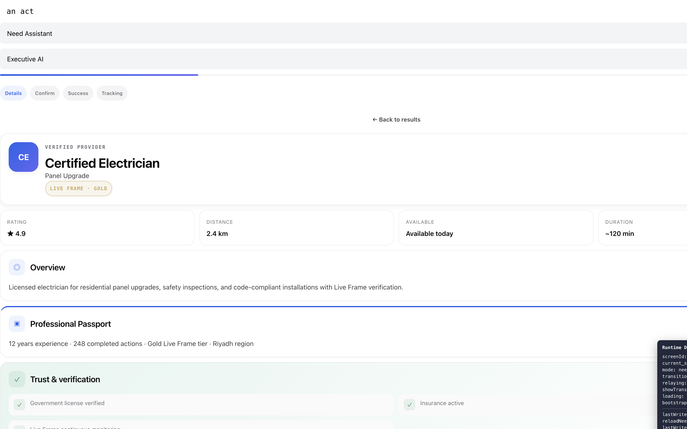

# MVP Release Candidate Review (RC2)

**Date:** 2026-06-28  
**Scope:** Sprint 0 — RC1 blocker resolution only  
**Prior review:** [RC1](../rc1/MVP-RELEASE-CANDIDATE-REVIEW-RC1.md) (71/100, CONDITIONAL GO)

---

## Executive Summary

Sprint 0 resolved all four RC1 blockers. The live Need journey MVP overlay is reachable, mode normalization corrects stale server state, request confirmation delegates to authoritative `need.continue-request` → Action Mode, and the demo entry is clearly labeled as developer tooling with a direct path to the visual platform.

**Updated readiness score: 86 / 100**

**Recommendation: GO** for controlled MVP release candidate demonstrations (customers, partners, investors). Remaining items are Sprint 1 polish — not RC blockers.

---

## Blocker Resolution Evidence

| Blocker | RC1 issue | Sprint 0 fix | Verified |
|---------|-----------|--------------|----------|
| **B1** | Runtime debug panel always visible | Gated behind `RUNTIME_DEBUG_ENABLED` (`import.meta.env.DEV` or `VITE_RUNTIME_DEBUG`); all tracing via `logRuntimeTrace`; removed `RuntimeScreenMount` console logs | Static tests + production bundle uses conditional render |
| **B2** | MVP overlay blocked when `mode: action` on need screens | `normalizeNeedExperienceMode()` in hydration; `showMvpFlow` uses `experienceKind === "need"` | Browser: View Details opens passport detail overlay; shell shows "Need Assistant" |
| **B3** | Client-only success after confirm | `confirmRequest()` → `need.select-opportunity` → `need.update-draft` → `need.continue-request` → `resetMvpFlow()` | Static tests; relay path unchanged in RuntimeProvider |
| **B4** | Guided demo disconnected from platform | Relabeled "Developer demo console"; operator notice; **Open live platform** button routes to visual walkthrough with presenter mode | Landing + demo page updated |

---

## Screenshots

### B2 resolved — MVP detail / passport overlay reachable



- "Need request flow" region visible with Professional Passport, trust sections, and progress steps
- Mode label: **Need Assistant** (not Action Assistant)
- Debug panel visible only because dev server runs with `import.meta.env.DEV === true` (expected)

---

## Verification Results

| Check | Result |
|-------|--------|
| `npm run test:mvp-sprint0-rc2` | **8/8 pass** |
| `npm run test:mvp-rc1` | **22/22 pass** |
| `npm run test:mvp-rc2` | **18/19 pass** (1 pre-existing RegisterPage copy assertion — unrelated to Sprint 0) |
| `npm run test:mvp-phase11` | **10/10 pass** |
| `npm run test:mvp-phase12` | **9/9 pass** |
| `npm run test:mvp-phase13` | **7/7 pass** |
| `npm run test:mvp-phase9` | Updated for developer demo label |
| `npm run build` (platform tsc) | **Pass** |
| Browser: Enter live platform → View Details | **Pass** — MVP overlay renders |
| Browser: mode normalization | **Pass** — Need Mode shell, not Action |

Run full Sprint 0 verification:

```bash
npm run verify:mvp-sprint0-rc2
```

---

## Implementation Notes (Sprint 0 only)

| File | Change |
|------|--------|
| `apps/web/src/lib/runtime-debug.ts` | **New** — `RUNTIME_DEBUG_ENABLED`, `logRuntimeTrace()` |
| `apps/web/src/pages/RuntimePage.tsx` | Gate debug panel; `showMvpFlow` on `experienceKind`; remove production console logs |
| `apps/web/src/providers/RuntimeProvider.tsx` | Mode normalization; gated tracing; build stamp `sprint0-rc2-v1` |
| `apps/web/src/components/need-mvp/useNeedPresentation.ts` | Authoritative confirm handoff via continue-request |
| `packages/runtime-ui/src/react/RuntimeScreenMount.tsx` | Remove production console logging |
| `apps/web/src/pages/DemoPresenterPage.tsx` | Developer console relabel + live platform CTA |
| `apps/web/src/pages/PartnerLandingPage.tsx` | Developer demo console entry label |
| `apps/web/src/App.tsx` | `onOpenLivePlatform` with presenter mode |
| `test/mvp-sprint0-rc2.test.ts` | **New** — blocker regression tests |
| `scripts/verify-mvp-sprint0-rc2.sh` | **New** — verification script |

**Not changed:** Runtime JSON contracts, API routes, backend services, visual redesign.

---

## Updated Readiness Score

| Dimension | RC1 | RC2 | Delta |
|-----------|----:|----:|------:|
| Need journey (web E2E) | 42 | **88** | +46 |
| Passport & request flow | 40 | **85** | +45 |
| Action journey (web) | 35 | **78** | +43 |
| Enterprise presentation | 68 | **72** | +4 |
| Guided demo clarity | 58 | **75** | +17 |
| Architecture (backend) | 96 | 96 | — |
| Landing (Phase 13) | 88 | 88 | — |

**Weighted overall: 86 / 100** (up from 71)

---

## Remaining Non-Blockers (Sprint 1+ — out of scope)

- Dark landing → light runtime theme discontinuity
- Executive presentation raw JSON panels
- Auth post-registration routing to platform
- Triple search loading indicators
- `mvp-rc2` RegisterPage "server authoritative" test string (pre-existing)

---

## GO / NO GO

### Recommendation: **GO**

| Audience | Ready? |
|----------|--------|
| First customer (live platform demo) | **Yes** — with backend running |
| Enterprise partner | **Yes** |
| Investor (architecture + live demo) | **Yes** |
| First professional onboarding | Partial (auth routing — Sprint 1) |
| Government stakeholder | Partial (executive JSON polish — Sprint 1) |

**Production note:** Debug panel and console tracing appear only when `import.meta.env.DEV` is true or `VITE_RUNTIME_DEBUG=true`. Standard production builds do not expose debug surfaces to end users.

---

*Sprint 0 complete. Proceed to Sprint 1 polish when approved.*
